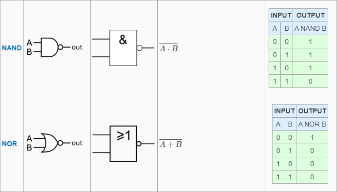

# Wire decl

### **link**：[Wire decl - HDLBits](https://hdlbits.01xz.net/wiki/Wire_decl)

### **intro**：

实现以下电路。创建两条中间线（命名您想要的任何名称）以将 AND 和 OR 门连接在一起。                                                                                                                                                                                                                                                                                                                                                                                                                                                                                                         

### **code**：                                                        

```
`default_nettype none
module top_module(
    input a,
    input b,
    input c,
    input d,
    output out,
    output out_n   ); 
	wire t1,t2,t3;
    assign t1=a&b;
    assign t2=c&d;
    assign t3=t1|t2;
    assign out=t3;
    assign out_n=~t3;
endmodule

```

### notes:

**逻辑门图解**

- **与门 AND  &**  
- **或门 OR  |**
- **非门 NOT  ~**


- **与非门 NAND  **

- **或非门 NOR**

  

- **异或门 XOR   ^**

- **同或门 XNOR  ~^**

  


### reference：

[Logic gate | Wikitronics | Fandom](https://electronics.fandom.com/wiki/Logic_gate)
