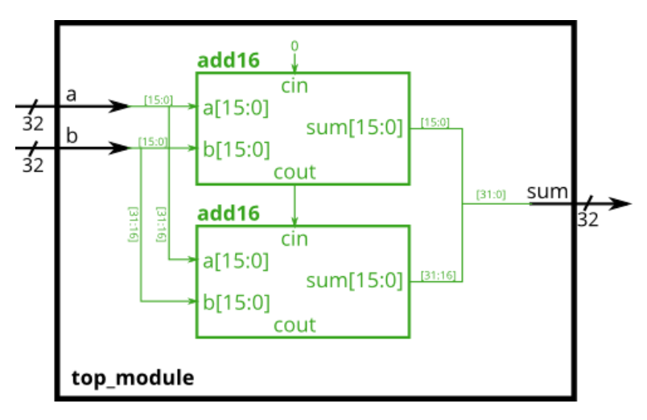

# Module add

### **link**：[Module add - HDLBits](https://hdlbits.01xz.net/wiki/Module_add)

### **intro**：

您将获得一个执行 16 位加法的模块。实例化其中两个以创建 32 位加法器。一个 add16 模块在收到第一个加法器的 carry 后计算加法结果的低 16 位，而第二个 add16 模块计算结果的高 16 位。

                                                                                                                                                                                                                                                                                                                                                                           

### **code**：

```
module top_module(
    input [31:0] a,
    input [31:0] b,
    output [31:0] sum
);
    //module add16 ( input[15:0] a, input[15:0] b, input cin, output[15:0] sum, output cout );
    wire t;
    add16 add16_l(a[15:0],b[15:0],1'b0,sum[15:0],t);
    add16 add16_h(a[31:16],b[31:16],t,sum[31:16],);

endmodule

```

### notes:


### reference：

