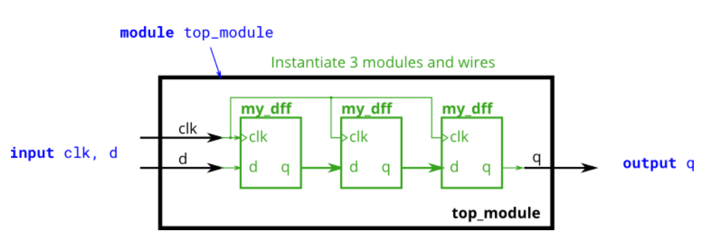

# Module shift

### **link**：[Module shift - HDLBits](https://hdlbits.01xz.net/wiki/Module_shift)

### **intro**：

您将获得一个具有两个 inputs 和一个 output 的模块（实现 D flip-flop）。实例化其中的三个，然后将它们链接在一起，形成一个长度为 3 的移位寄存器。 

                                                                                                                                                                                                                                                                                                                                                                           

### **code**：

```
module top_module ( input clk, input d, output q );
	wire q1,q2;
    //module my_dff ( input clk, input d, output q );
    my_dff my_dff_ins1(clk,d,q1);
    my_dff my_dff_ins2(clk,q1,q2);
    my_dff my_dff_ins3(clk,q2,q);
    //wire a,b;
    //my_dff dff1(
    //    .clk(clk),
    //    .d(d),
    //    .q(a)
    //);
    //my_dff dff2(
    //    .clk(clk),
    //    .d(a),
    //    .q(b)
    //);
    //my_dff dff3(
    //    .clk(clk),
    //    .d(b),
    //    .q(q)
    //);
endmodule

```

### notes:

### reference：

