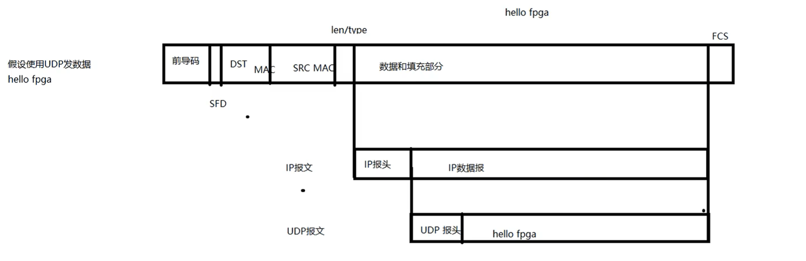
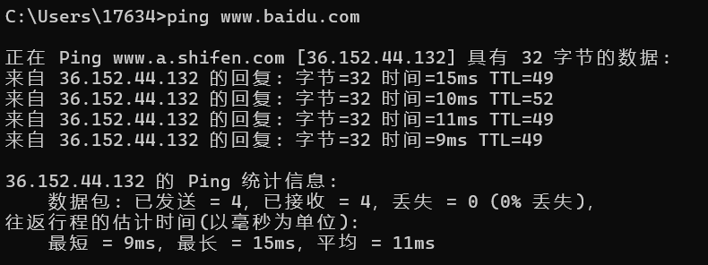
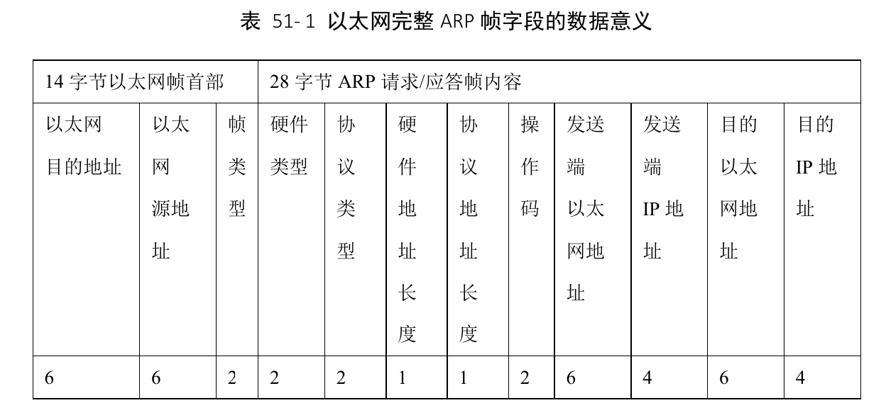
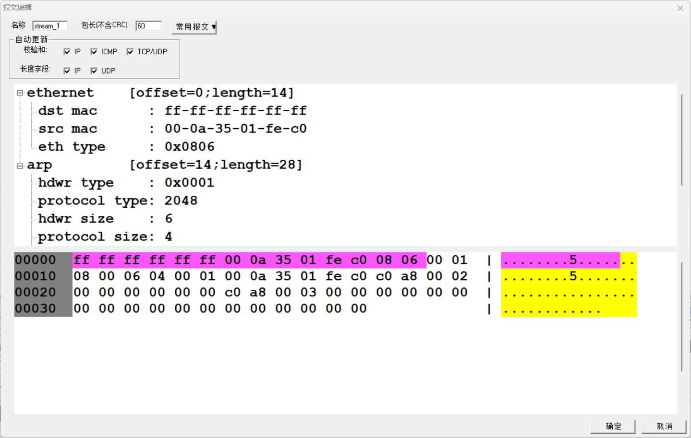
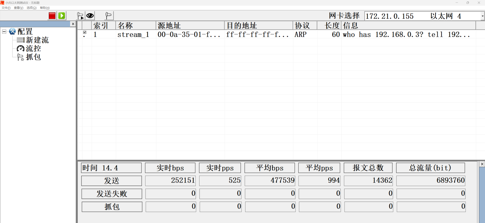
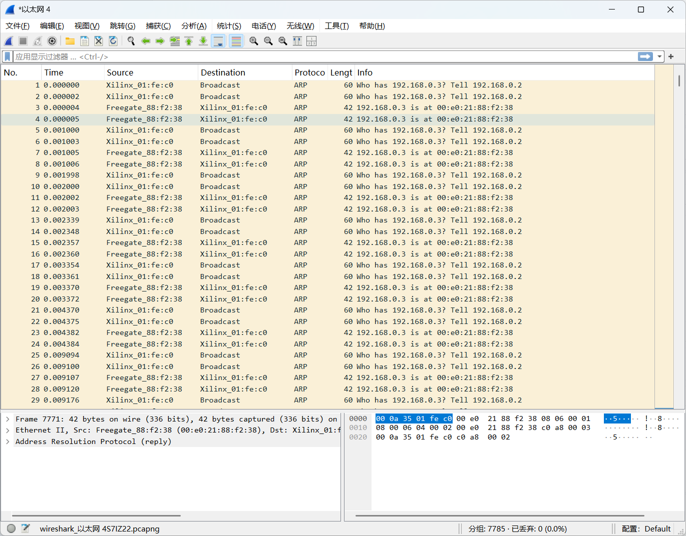
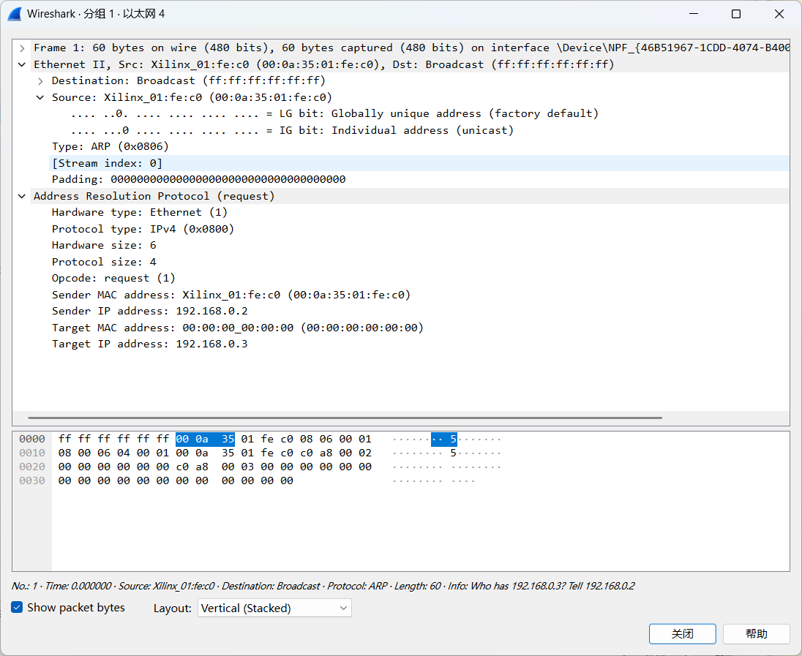
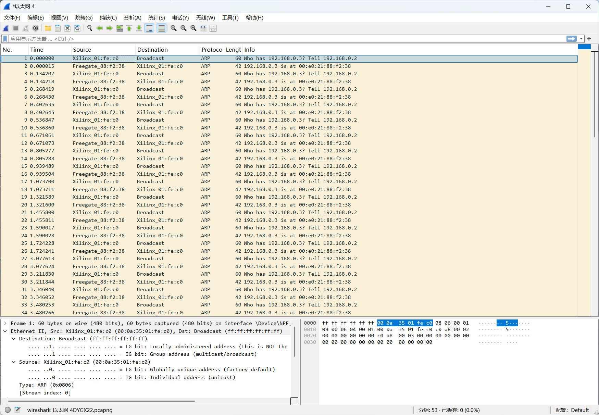

## 1. ARP 帧的应用场景和存在目的

上一章节,我们介绍了整个以太网传输中**最底层的 MAC 帧格式**,也提到,MAC 帧并不是直接对用户的数据帧,一段用户信息要想通过以太网传输还需要经过各种传输层协议的层层打包才能最终送入 MAC 帧的数据字段进行传输。无论是传输用户数据还是一些网络通信辅助相关的信息,都需要将数据编码为**指定协议后再打包进 MAC 层传输**。

在网络通讯时,源主机的应用程序知道目的主机的 IP 地址和端口号,却不知道目的主机的硬件(MAC)地址,而数据包首先是被网卡接收到再去处理上层协议的,如果接收到的数据包的硬件地址与本机不符,则直接丢弃。因此在通讯前必须获得目的主机的硬件地址。ARP 协议就起到这个作用。

ping 百度的域名可以得到百度的ip地址

通过该ip地址也可访问百度

注意：当第二次执行 `ping` 时，由于 **ARP 缓存**的存在，可能不再需要发送 ARP 请求。需要清除arp缓存才能在抓包软件中抓到。

查看arp 缓存目录

以太网arp帧数据格式

在小兵以太网测试仪中建立arp报文

选择开始发包，同时开启抓包软件

可以看到PC机模拟发布ARP报文后紧接着就有了ARP报文的回复

编写程序

程序下载进去实验结果如下

