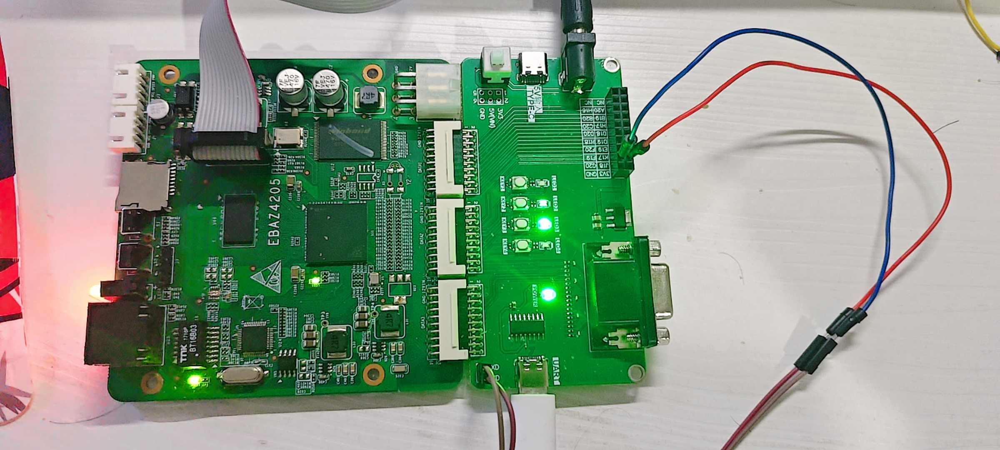

# fifo求和实验

FIFO 作为一种常用的数据缓冲结构，在诸多数字系统中广泛应用，能够有效协调不同时钟域或速率的数据传输。通过本次实验，旨在深入探究如何在 FPGA 平台上巧妙搭建 FIFO 模块，并在此基础上实现对存储于其中的数据进行精准求和，这不仅有助于加深对 FPGA 内部逻辑资源运用的理解，更能为后续复杂数字系统设计积累宝贵经验。

## 1.实验目标

**实验目标：**使用Python生成一个*.txt文件，文件中包含模拟求和的数据，PC机通过串口RS232将数据传给FPGA，使用双fifo实现三行数据的FIFO求和，通过串口RS232将求和后的数据回传给PC机，并通过串口助手打印出求和数据。

**实验要求：**.txt文件包含2500个数据，为0-49的50次循环，模拟50x50数组。

**在实验过程中要求掌握以下要点：**

1. FIFO 原理与设计
   - **FIFO 工作原理**：深入理解 FIFO 的工作机制，包括读写指针的移动、满空标志的产生、数据的存储和读取顺序等，确保 FIFO 能正确地缓存和输出数据，为求和操作提供准确的数据序列。
   - **FIFO 参数配置**：根据实验需求合理配置 FIFO 的深度和宽度。深度决定了 FIFO 能够存储的数据量，宽度则决定了每个数据的位宽，需要综合考虑输入数据的特点和求和运算的要求来确定这些参数，以避免数据溢出或浪费资源。
   - **FIFO 控制逻辑**：设计可靠的 FIFO 控制逻辑，包括正确的读写使能信号、满空状态判断以及可能的错误处理机制等，保证 FIFO 在不同的输入输出速率和数据流量下都能稳定工作。
2. 求和算法实现
   - **求和算法选择**：根据数据特点和精度要求选择合适的求和算法，如简单的加法累加法、并行进位加法器等。对于大数据量的求和，还可以考虑采用流水线结构或分治法等优化策略，以提高求和效率和速度。
   - **数据位宽与溢出处理**：明确输入数据和求和结果的数据位宽，确保在求和过程中不会发生数据溢出。如果可能出现溢出情况，要设计相应的溢出检测和处理逻辑，例如截断、饱和处理或给出溢出标志等。
   - **精度与舍入问题**：如果涉及到小数运算或定点数运算，要注意精度的保持和舍入方式的选择，以确保求和结果的准确性符合实验要求。

## 2.理论知识

### **2.1 FIFO简介**

FIFO（ First In First Out ，即先入先出），FPGA 使用的FIFO一般指的是对数据的存储具有先进先出特性的一个缓存器。与 ROM 或 RAM 的按地址读写方式不同， FIFO 的读写遵循“先进先出”的原则，即数据按顺序写入 FIFO ，先被写入的数据同样在读取的时候先被读出，使用起来简单方便，由此带来的缺点就是不能像RAM和ROM那样可以由地址线决定读取或写入某个指定的地址，所以 FIFO 存储器没有地址线。FIFO 有一个写端口和一个读端口外部无需使用者控制地址，使用方便。

FIFO 存储器主要是作为**缓存**，应用在同步时钟系统和异步时钟系统中，在很多的设计中都会使用，后面实例中如：多比特数据做跨时钟域的转换、前后带宽不同步等都用到了FIFO。FIFO 根据读写时钟是否相同，分为 SCFIFO （同步 FIFO ）和 DCFIFO （异步 FIFO）， SCFIFO 的读写为同一时钟，应用在同步时钟系统中； DCFIFO 的读写时钟不同，应用在异步时钟系统中。

**同步FIFO:**指读时钟和写时钟为同一个时钟，在时钟沿来临时同时发生读写操作。

**异步FIFO:**指读写时钟不一致，读写时钟是互相独立的。

### **2.2 FIFO 工作原理**

下面来介绍FIFO求和的具体方法，要实现SUM求和，FIFO IP核必不可少，需要用它用来做求和数据缓存。FIFO是存储器的一种，满足先进先出原则。要完成3行数据的SUM求和，需要调用2个FIFO IP核，当数据开始输入时，将数据的第0行数据存储到fifo1中，将第1行数据存储到fifo2中，当数据的第2行的第0个数据输入的同时，读取写入fifo1中的的第0个数据和写入fifo2中的第0个数据，将三个数据求和，求和结果实时输出，在完成求和的同时 ，将读取的fifo2中的第0个数据写入fifo1中，fifo1读出的数据弃之不用，将输入的第2行的数据写入fifo2中，当第2行的最后一个数据输入，完成前三行的最后一个求和运算后，第0行的数据已读取完成，第1行的数据重新写入fifo1，第2行的数据写入fifo2，当第3行数据开始传入时，开始进行第1 行、第2行和第3行的数据求和运算，如此循环，直到最后一个数据输入，完成求和运算。具体流程图如下：


**使用FIFO的优势：**

- **数据缓存与暂存**：在很多数字系统中，数据是连续或批量输入的，但求和运算可能无法在数据输入的同时立即完成。FIFO 可以作为一个数据缓冲区，将输入的数据先存储起来，等待合适的时机进行求和运算。这样可以避免数据丢失，确保所有需要求和的数据都能被正确处理。
- **速率匹配**：在不同模块或设备之间，数据的产生速率和处理速率往往不同。例如，数据可能从一个高速接口快速输入，但求和模块的处理速度相对较慢。FIFO 可以在两者之间起到缓冲作用，平衡数据的输入和输出速率，使求和模块能够按照自己的节奏从 FIFO 中读取数据进行求和，保证系统的稳定性和数据处理的准确性。
- **顺序处理保证**：FIFO 遵循先入先出的原则，能够保证数据按照输入的顺序进行存储和输出。在求和运算中，这一点非常重要，特别是当需要对具有特定顺序的数据进行求和时，例如对一系列按时间顺序排列的采样数据求和，FIFO 可以确保数据按照正确的顺序被取出进行求和，从而得到正确的结果。

## 3.硬件资源

**EBAZ4205 开发板**：

- 核心芯片：搭载了 Xilinx Zynq - 7000 系列的 XC7Z010 - CLG400C 芯片，该芯片集成了 ARM Cortex - A9 双核处理器与 Artix - 7 FPGA 架构，为系统提供了强大的处理能力。
- 存储资源：板载有一定容量的 DDR3 内存，为系统运行提供了充足的数据存储空间，无论是存储图像数据、程序代码，还是在运行过程中的临时数据缓存，DDR3 内存都能胜任，确保实验过程中数据的快速读写，保障 VGA 图像显示的流畅性。

## 4.实战演练

### 4.1 FIFO IP核的使用

xilinx 的 FIFO generator core 支持 Native interface FIFOs, AXI Memory Mapped interface FIFOs 和 AXI4-Stream interface FIFOs。

AXI Memory Mapped 和 AXI4-Stream interface FIFOs 是由 Native interface FIFO 衍生出来的。

#### 4.1.1 FIFO 的用处

Native interface FIFOs 可用于数据宽度转换、跨时钟域处理。

数据宽度转换：例如从8位宽的数据变换到 16 位宽的数据，即输入 8 位宽数据，输出补成 16 位宽。

跨时钟域处理：例如数据采集时钟为 20 MHz，而数据处理时钟为 100 MHz，则可通过 FIFO 将数据从 20 MHz 转换到 100 MHz。

#### 4.1.2 FIFO 各端口含义

- **输入端口**

  | 端口名 | 功能描述 |
  | ------ | -------- |
  | wr_clk | 写时钟   |
  | rd_clk | 读时钟   |
  | din    | 输入数据 |
  | wr_en  | 写使能   |
  | rd_en  | 读使能   |

- **输出端口**

  | 端口名        | 功能描述     |
  | ------------- | ------------ |
  | dout          | 输出数据     |
  | full          | 满标记       |
  | wr_ack        | 写应答       |
  | empty         | 空标记       |
  | valid         | 输出有效标记 |
  | rd_data_count | 读计数       |
  | wr_data_count | 写计数       |
  | almost_full   | 快满标记     |
  | overflow      | 写溢出标记   |
  | almost_empty  | 快空标记     |
  | underflow     | 读溢出标记   |

#### 4.1.3 FIFO 的配置

打开Vivado 的 IP Catalog 窗口，搜索fifo ，在Memories & Storage Elements(内存和存储元件相关 IP 核)目录中找到FIFO generator core


③在 FIFO Generator 配置页面的接口类型中有以下三种：

- Native（原生）：
  - **说明**：这是一种较为基础、直接的接口形式。它通常具有简单的读写控制信号，如写使能（write - enable）、读使能（read - enable）、时钟（clock）、复位（reset）等。其信号定义和功能实现较为直观，适用于对接口复杂度要求不高，且与特定复杂总线标准耦合度低的设计场景。
  - **应用场景**：在一些简单的 FPGA 内部模块间的数据缓存与传输，或者是对成本和资源消耗敏感的小型设计中，原生接口的 FIFO 可以方便地实现数据的先进先出缓存功能。
- AXI Memory Mapped（AXI 存储器映射）：
  - **说明**：基于 AXI（Advanced eXtensible Interface）总线标准的存储器映射接口。它遵循 AXI 协议规范，具有地址（address）、数据（data）、控制（control）等信号。通过这种接口，FIFO 可以像存储器一样被系统中的主设备（如处理器）访问，支持突发传输（burst transfer）等功能，可实现高效的数据读写操作。
  - **应用场景**：常用于系统中有处理器参与，需要对 FIFO 进行直接访问和控制的场景，例如在嵌入式系统中，处理器需要通过 FIFO 与其他外设或 FPGA 内部模块进行数据交互。
- AXI Stream（AXI 流）：
  - **说明**：也是基于 AXI 总线标准，但侧重于数据流的传输。它没有地址通道，数据以连续流的形式进行传输，具有 valid（有效）、ready（准备好）等握手信号，用于协调数据发送方和接收方之间的传输节奏，以确保数据的可靠传输。
  - **应用场景**：在视频处理、高速数据采集等对数据实时性要求较高的场景中应用广泛，例如视频数据从采集模块通过 AXI Stream 接口的 FIFO 传输到编码模块。

④ 具体选哪种资源看情况，下表列出对比


接着是第二个选项卡


⑤中First FIFO Fall Through，如手册中的下图所示，只要写入一个数据 D1 后，在rd_en为低电平的时候，dout就会变成D1且valid一直拉高。


接着是第三选项卡


然后是第四个选项卡


在本工程中只使用到FIFO最基本的工程，最终模块端口图如下


### 4.2 程序设计

#### 4.2.1 总体模块设计

FIFO求和实验工程的整体框图如下


由整体框图可知，本实验过程本实验过程包括4个模块，各模块简介如下表所示

| 模块名称 | 功能描述         |
| -------- | ---------------- |
| fifo_sum | 顶层模块         |
| uart_rx  | 串口数据接收模块 |
| uart_tx  | 串口数据发送模块 |
| fifo_sum | 数据求和模块     |

系统上电后，使用PC机通过串口助手发送待求和数据给FPGA，FPGA通过串口接收模块接收待求和数据，数据拼接完成后传入数据求和模块，经过求和运算后的数据结果通过串口数据发送模块回传给PC机，使用串口助手查看求和结果。

串口发送和接收模块在"串口回环工程中已经实现"，这里不再描述，本文只描述顶层模块和数据求和模块。

#### 4.2.2 FIFO数据求和模块设计

数据求和模块的作用是，接收串口数据接收模块传来的待求和数据，计算出求和结果并输出给串口数据发送模块。

- **模块框图**

  

- **模块端口功能描述**

  输入时钟为系统时钟sys_clk，频率50MHz，输入复位信号sys_rst_n，低电平有效，输入数据i_data和数据标志信号i_flag由串口数据接收模块传入，传入数据按照时序写入2个FIFO中，完成求和运算后，将求和后数据o_data和标志信号o_flag传出。

  数据求和模块内部还例化了两个FIFO，目的是缓存待求和数据。

- **波形图绘制**

  

  1. **第一部分：**行计数器cnt_row、列计数器cnt_col信号波形的设计与实现

     本实验是要实现3行数据的求和，那么需要对参与求和运算的每行数据个数进行计数，同样也需要对参与求和运算的各行进行计数，所以我们需要声明两个计数器行计数器cnt_row、列计数器cnt_col。

     变量cnt_row是行计数器，计数每行数据的个数，我们可以以输入数据标志信号i_flag为约束条件进行计数。cnt_row计数器初值为0，i_flag信号每拉高一次，计数器加1，当cnt_row计数器计到最大值(一行数据个数减1，本实验一行数据50个，计数器计数最大值为50-1=49)，行计数器归0，开始下一行计数；

     cnt_col是列计数器，对输入数据进行列计数(计数行个数)，计数器初值为0，行计数器计数到最大值且i_flag信号有效时，列计数器加1，列计数器计到最大值(行个数减1，本实验数据共有50行，计数器计数最大值为50-1=49)，列计数器归0。

  2. **第二部分：**FIFO缓存相关信号波形的设计与实现

     因为串口每次只输入单字节数据，要想实现多行数据求和，必须要使用FIFO对输入数据进行缓存，本实验要实现3行数据的求和，需要使用两个FIFO进行数据缓存。那么FIFO的相关信号的波形就需要设计一下了。

     我们在模块中实例化两个FIFO，分别为fifo_data_inst1和fifo_data_inst2，接下来对两个FIFO的相关信号进行详细说明。

     两个FIFO的输入输出信号端口相同，输入端口有4路，输出端口1路，共5路信号。

     fifo_data_inst1中，输入时钟信号与串口接收模块的工作时钟相同为系统时钟信号sys_clk；数据写使能信号为wr_en1、写入数据为wr_data1，当串口接收模块传入第0行数据时，即cnt_col=0且i_flag=1时，wr_en1信号赋值为高电平，相同条件下， i_data赋值 给wr_data1，将第0行的数据暂存到fifo_data_inst1中；当第1行数据输入，wr_en1信号赋值为低电平，wr_data1无数据输入，因为第1行的数据要暂存到fifo_data_inst2中；自第2行数据开始传入到倒数第二行数据传输完成，wr_en1信号由rd_out_flag信号赋值， 当rd_en和wr_en2信号均为高电平时，rd_out_flag信号赋值高电平，其他时刻均为低电平。当rd_out_flag有效时，将fifo_data_inst2的读出数据rd_data2赋值给wr_data1。

     fifo_data_inst2中，输入时钟信号与串口接收模块的工作时钟相同为系统时钟信号sys_clk；wr_en2为数据写使能信号，wr_data2为写入数据，自第1行数据开始输入到倒数第二行数据输入完成，wr_en2写使能信号由 pi_flag信号赋值，时序上滞后pi_flag信号1个时钟周期，wr_en2赋值为高电平，fifo_data_inst2写使能有效，其他时刻写使能无效，写使能信号wr_en2有效时，将传入的数据i_data赋值给wr_data2。

     rd_en是两FIFO共用的读使能信号，自第2行数据开始传入到最后一行数据传输完成， i_flag信号赋值给读使能rd_en，时序上rd_en滞后i_flag信号1个时钟周期，其他时刻rd_en信号始终保持低电平；rd_data1数据输出受控于rd_en读使能信号，读使能有效，rd_data1数据输出，否者保持之前状态，时序上rd_data1滞后于rd_en读使能信号1个时钟周期。rd_data2数据输出同样受控于rd_en读使能信号，读使能有效，rd_data2数据输出，否者保持之前状态，时序上rd_data2滞后于rd_en读使能信号1个时钟周期。

  3. **第三部分：**数据输出相关信号波形的设计与实现

     两FIFO共用的读使能信号rd_en有效时，从FIFO中分别读取两个待相加数据，两数据与此时输入的数据pi_data做求和运算，这里我们需要声明一个新的标志信号做这三个数据求和运算的标志信号。

     以读使能信号rd_en滞后一个时钟信号生成求和运算标志信号sum_flag。当sum_flag信号为高电平时，将读出两FIFO的数据rd_data1、rd_data2与此时输入的pi_data做求和运算得出求和结果o_data并输出；同时要输出与o_data信号匹配的数据标志信号o _flag，利用sum_flag信号滞后一个时钟周期生成po_flag信号并输出，生成的o_flag与o_data信号同步。

- **代码编写**

  ```
  module fifo_sum_ctrl 
  (
      input   wire            sys_clk     ,
      input   wire            sys_rst_n   ,
      input   wire    [7:0]   i_data      ,
      input   wire            i_flag      ,  
      output  reg     [7:0]   o_data      ,
      output  reg             o_flag      
  );
  //parameter define
  parameter COL_CNT_MAT = 8'd49;
  parameter ROW_CNT_MAT = 8'd49;
  
  //reg define
  reg     [7:0]   col_cnt     ;
  reg     [7:0]   row_cnt     ;
  reg             wr_en1      ;
  reg     [7:0]   wr_data1    ;
  reg             wr_en2      ;
  reg     [7:0]   wr_data2    ;
  reg             rd_en       ;
  reg             rd_out_flag ;//wr_out_flag:写输出标志
  reg             sum_flag    ;//sum_flag:求和标志
  
  //wire define
  wire    [7:0]   rd_data1    ;//rd_data1:fifo_1中读出的数据
  wire    [7:0]   rd_data2    ;//rd_data2:fifo_2中读出的数据
  
  //instance define
  fifo_generator_0 fifo_ins_1 (
    .clk(sys_clk),      // input wire clk
    .din(wr_data1),      // input wire [7 : 0] din
    .wr_en(wr_en1),  // input wire wr_en
    .rd_en(rd_en),  // input wire rd_en
    .dout(rd_data1),    // output wire [7 : 0] dout
    .full( ),    // output wire full
    .empty( )  // output wire empty
  );
  
  fifo_generator_0 fifo_ins_2 (
    .clk(sys_clk),      // input wire clk
    .din(wr_data2),      // input wire [7 : 0] din
    .wr_en(wr_en2),  // input wire wr_en
    .rd_en(rd_en),  // input wire rd_en
    .dout(rd_data2),    // output wire [7 : 0] dout
    .full( ),    // output wire full
    .empty( )  // output wire empty
  );
  
  //************* main logic  ******************//
  
  //col_cnt:列计数器
  always @(posedge sys_clk) begin
      if(!sys_rst_n) begin
          col_cnt <= 8'h00;
      end
      else if(col_cnt >= COL_CNT_MAT && i_flag == 1'b1) begin
          col_cnt <= 8'd0;
      end
      else if(i_flag == 1'b1) begin
          col_cnt <= col_cnt + 1;
      end
      else begin
          col_cnt <= col_cnt;
      end
  end
  
  //row_cnt:行计数器
  always @(posedge sys_clk ) begin
      if (!sys_rst_n) begin
          row_cnt <= 8'h00;
      end
      else if(col_cnt == COL_CNT_MAT && row_cnt == ROW_CNT_MAT && i_flag == 1'b1) begin
          row_cnt <= 8'h00;
      end
      else if(col_cnt == COL_CNT_MAT && i_flag == 1'b1) begin
          row_cnt <= row_cnt + 1;
      end
      else begin
          row_cnt <= row_cnt;
      end
  end
  
  //wr_en1:写使能1
  always @(posedge sys_clk) begin
      if(!sys_rst_n) begin
          wr_en1 <= 1'b0;
      end
      else if(row_cnt == 8'd0 && i_flag == 1'b1 ) begin
          wr_en1 <= 1'b1;
      end
      else begin
          wr_en1 <= rd_out_flag;
      end
  end
  
  //wr_data1:写数据1
  always @(posedge sys_clk) begin
      if(!sys_rst_n) begin
          wr_data1 <= 8'h00;
      end
      else if(row_cnt == 8'd0 && i_flag == 1'b1) begin
          wr_data1 <= i_data;
      end
      else if(rd_out_flag == 1'b1) begin
          wr_data1 <= rd_data2;
      end
      else begin
          wr_data1 <= wr_data1;
      end
  end
  
  //wr_en2:写使能2
  always @(posedge sys_clk) begin
      if(!sys_rst_n) begin
          wr_en2 <= 1'b0;
      end
      else if(row_cnt >= 8'd1 && (row_cnt <= COL_CNT_MAT - 1'd1) && i_flag == 1'b1) begin
          wr_en2 <= 1'b1;
      end
      else begin
          wr_en2 <= 1'b0;
      end
  end
  
  //wr_data2:写数据2
  always @(posedge sys_clk) begin
      if(!sys_rst_n) begin
          wr_data2 <= 8'h00;
      end
      else if(row_cnt >= 8'd1 && (row_cnt <= COL_CNT_MAT - 1'd1) && i_flag == 1'b1) begin
          wr_data2 <= i_data;
      end
      else begin
          wr_data2 <= wr_data2;
      end
  end
  
  //rd_en:读使能
  always @(posedge sys_clk) begin
      if(!sys_rst_n) begin
          rd_en <= 1'b0;
      end
      else if(row_cnt >=8'd2 && (row_cnt <= COL_CNT_MAT)  && i_flag == 1'b1) begin
          rd_en <= 1'b1;
      end
      else begin
          rd_en <= 1'b0;
      end
  end
  
  //rd_out_flag:读输出标志
  always @(posedge sys_clk) begin
      if(!sys_rst_n) begin
          rd_out_flag <= 1'b0;
      end
      else if(wr_en2 == 1'b1 && rd_en == 1'b1 ) begin
          rd_out_flag <= 1'b1;
      end
      else begin
          rd_out_flag <= 1'b0;
      end
  end
  
  //sum_flag:求和标志
  always @(posedge sys_clk) begin
      if(!sys_rst_n) begin
          sum_flag <= 1'b0;
      end
      else if(rd_en == 1'b1) begin
          sum_flag <= 1'b1;
      end
      else begin
          sum_flag <= 1'b0;
      end
  end
  
  //o_data:输出数据
  always @(posedge sys_clk) begin
      if(!sys_rst_n) begin
          o_data <= 8'h00;
      end
      else if(sum_flag == 1'b1) begin
          o_data <= rd_data1 + rd_data2 + i_data;
      end
      else begin
          o_data <= o_data;
      end
  end
  
  //o_flag:输出标志
  always @(posedge sys_clk) begin
      if(!sys_rst_n) begin
          o_flag <= 1'b0;
      end
      else begin
          o_flag <= sum_flag;
      end
  end
  endmodule
  ```

- **仿真结果**

  

  

#### 4.2.3 RTL视图


RTL视图展示信息与顶层模块框图一致，各信号连接正确。

## 5 实验结果

### 5.1 引脚约束

根据原理图，管脚的分配如下图所示。


开发板连线如下



### 5.2 结果验证

使用Python编写一个具有生成50×50个字节和验证经过fifo模块计算串口返回接收到的字节是否正确的脚本文件`fifo_sum_test_and_verify.p`，生成的测试数据储存在`fifo_data.txt`文件中。串口助手中返回的字节数据储存在`received_data.txt`中。

```
import sys
import random


def generate_data():
    # 生成 50x50 矩阵的 2500 个字节的数据
    data = [random.randint(0, 255) for _ in range(2500)]

    # 将数据转换为十六进制字符串，并用空格连接
    data_str = ' '.join([f'{byte:02x}' for byte in data])

    # 将数据写入文件
    with open('fifo_data.txt', 'w') as file:
        file.write(data_str)

    print("50x50 矩阵数据已成功写入 fifo_data.txt 文件。")


def verify_result():
    try:
        # 从 fifo_data.txt 文件中读取原始数据
        with open('fifo_data.txt', 'r') as data_file:
            data_str = data_file.read()
        data = [int(byte, 16) for byte in data_str.split()]

        # 从 received_data.txt 文件中读取接收到的数据
        with open('received_data.txt', 'r') as result_file:
            received_data_str = result_file.read()
        # 将接收到的十六进制字符串转换为字节列表
        received_data = [int(byte, 16) for byte in received_data_str.split()]

        # 检查接收到的数据长度是否为 48 * 50
        if len(received_data) != 48 * 50:
            print("接收到的数据长度不正确，应为 48 * 50 个字节。")
        else:
            # 将原始数据转换为 48 * 50 的矩阵
            matrix = [data[i * 50:(i + 1) * 50] for i in range(50)]

            # 计算每相邻三行数据对应列的和，得到 48 * 50 的矩阵
            correct_result = []
            for i in range(48):
                row_sum = []
                for j in range(50):
                    # 计算每相邻三行对应列元素的和，并取 8 位结果
                    sum_value = (matrix[i][j] + matrix[i + 1][j] + matrix[i + 2][j]) & 0xFF
                    row_sum.append(sum_value)
                correct_result.extend(row_sum)

            # 检查接收到的结果是否与计算得到的正确结果一致
            if received_data == correct_result:
                print("结果验证通过，接收到的数据正确。")
            else:
                print("结果验证失败，接收到的数据与计算结果不一致。")

    except FileNotFoundError as e:
        if 'fifo_data.txt' in str(e):
            print("未找到原始数据文件 'fifo_data.txt'，请确保文件存在。")
        elif 'received_data.txt' in str(e):
            print("未找到接收到的数据文件 'received_data.txt'，请确保文件存在。")


if __name__ == "__main__":
    if len(sys.argv) != 2:
        print("用法: python script.py [generate|verify]")
        sys.exit(1)

    command = sys.argv[1]
    if command == "generate":
        generate_data()
    elif command == "verify":
        verify_result()
    else:
        print("无效的命令。请使用 'generate' 或 'verify'。")
        sys.exit(1)
```

如下图，在命令行运行该脚本，指定参数为生成数据还是结果验证。


首先生成测试数据，结果如下


接着打开串口助手，连接开发板，设置十六进制发送和显示，将生成的测试数据发送给开发板，结果如下，可以发现开发板正确的返回了48*50个字节的数据，将其保存在文件`received_data.txt`中


最后运行python脚本，指定测试参数，结果验证通过，实验圆满成功。


 