# HDMI显示器驱动设计与验证

之前，我通过努力，顺利完成了 VGA 驱动设计，还有基于 ROM 的 VGA 图像显示任务，能把静态图像准确地显示在屏幕上了。紧接着，在上一个工程的基础上，经过研究和一些修改，让显示的图片有了弹跳特效，就像以前电脑屏保里图片碰到屏幕边框会反弹一样。

虽然VGA显示具有成本低、结构简单、应用灵活等优点，但缺点是VGA使用的模拟信号极易受到外界干扰源的影响，产生信号畸变，而且VGA接口体积较大，不利于便携设备的使用。为了解决VGA接口的弊端，DVI、HDMI接口应运而生。接下来开始学习用 FPGA 实现 HDMI 驱动。众所周知，HDMI 是现在主流的高清多媒体接口，它能传输更复杂、更清晰的图像和视频数据，在各种高清显示设备上用得很多。

## 1.实验目标

实验目标：编写HDMI驱动，使用FPGA开发板驱动HDMI显示器显示十色等宽彩条， HDMI显示模式为640*480@60。

在实验过程中要求掌握以下要点：

1. 深入了解 HDMI 标准规范，熟悉其传输的信号种类，包括视频、音频以及控制信号等，尤其要重点掌握本次实验涉及的 640*480@60 显示模式下各信号的时序要求，这是实现稳定显示的基础。
2. 研究 HDMI 数据传输格式，明确如何将十色等宽彩条对应的像素数据按照协议要求进行打包、传输，确保显示器能正确解析。

## 2.理论知识

### 2.1 HDMI简介

VGA接口体积较大，不利于便携设备的集成；且传输的模拟信号易受外界干扰，产生信号畸变。为了解决VGA接口的诸多问题，视频接口开始了一次革新。

VGA接口之后，首先推出的的是DVI接口，DVI是基于TMDS(Transition Minimized Differential Signaling，最小化传输差分信号)技术来传输数字信号。TMDS运用先进的编码算法把8bit数据(R、G、B中的每路基色信号)通过最小转换编码为10bit数据(包含 行场同步信息、时钟信息、数据DE、纠错等)，经过直流均衡后，采用差分信号传输数据，它和LVDS、TTL相比有较好的电磁兼容性能，可以用低成本的专用电缆实现长距离、高质量的数字信号传输。数字视频接口（DVI）是一种国际开放的接口标准，在PC、DVD、高清晰电视（HDTV）、高清晰投影仪等设备上有广泛的应用。

DVI接口分为3大类：DVI-Analog（DVI-A）接口（12+5）只传输模拟信号，实质就是 VGA模拟传输接口规格；DVI-Digital（DVI-D）接口（18+1和24+1）是纯数字的接口，只能传输数字信号，不兼容模拟信号；DVI- Integrated（DVI-I）接口（18+5和24+5）是兼容数字和模拟接口的。

DVI 接口虽然是一种全数字化的传输技术，但是在开发之初，其最初目标就是要实现高清晰、无损压缩的数字信号传输。由于没有考虑到 IT 产品和 AV 产品融合的趋势，DVI 标准过分偏重于对计算机显示设备的支持而忽略了对数字平板电视等 AV 设备的支持。DVI 接口虽然成功的实现了无损高清传输这一目标，但是过于专一的定位也在相当程度上造成了整体性能的落后，暴露出诸多问题。

DVI接口设计之初考虑的对象是 PC，对于平板电视的兼容能力一般；只支持计算机领域的 RGB 数字信号，而对数字化的色差信号无法支持；只支持 8bit 的 RGB 信号传输，不能让广色域的显示终端发挥出最佳性能；出于兼容性考虑，预留了不少引脚以支持模拟设备，造成接口体积较大；只能传输图像信号，对于数字音频信号的支持完全没有考虑。

由于以上种种缺陷，DVI 接口已经不能更好的满足整个行业的发展需要。也正是基于这些原因，促使了 HDMI 标准的诞生。

HDMI 全称“High Definition Multimedia Interface 高清多媒体接口”。2002 年 4 月，来自电子电器行业的 7 家公司——日立、松下、飞利浦、Silicon Image、索尼、汤姆逊、东芝共同组建了 HDMI 高清多媒体接口接口组织HDMI Founders（HDMI 论坛），开始着手制定一种符合高清时代标准的全新数字化视频/音频接口技术。经过半年多时间的准备工作，HDMI founders 在 2002 年12 月 9 日正式发布了 HDMI 1.0 版标准，标志着 HDMI 技术正式进入历史舞台。

HDMI 标准的制定，并没有抛弃 DVI 标准中相对成熟且较易实现的部分技术标准，整个传输原理依然是基于TMDS 编码技术。针对DVI的诸多问题，HDMI做了大幅改进。HDMI接口体积更小，各种设备都能轻松安装可用于机顶盒 、DVD播放机 、个人计算机 、电视、游戏主机、综合扩大机、数字音响与电视机 等设备；抗干扰能力更强，能实现最长 20 米的无增益传输；针对大尺寸数字平板电视分辨率进行优化，兼容性好；拥有强大的版权保护机制（HDCP），有效防止盗版现象；支持 24bit 色深处理，（RGB、YCbCr4-4-4、YCbCr4-2-2）；一根线缆实现数字音频、视频信号同步传输，有效降低使用成本和繁杂程度。

时代在发展，社会在进步，HDMI发展至今也推出了若干版本，性能更加出色，兼容性不断提高。HDMI 正在成为高清时代普及率最高、用途最广泛的数字接口。在现在任何一台平板电视上，HDMI 接口都成了标准化的配置。

### 2.2 HDMI接口及引脚定义

HDMI接口因为接口体积下、抗干扰能力强、兼容性好等优点，已逐步取代VGA和DVI接口，特别是在一些便携设备上，HDMI 接口都成了标准化的配置。HDMI接口如下图所示

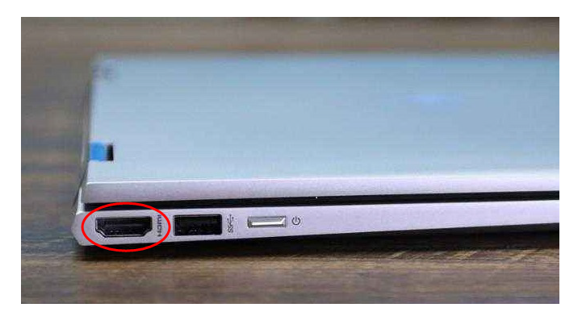

HDMI规格书中规定了HDMI的4种接口类型，但其中HDMI B Type接口类型未在市场中出现过，市面上流通最广的是HDMI A Type、HDMI C Type和HDMI D Type接口类型。

HDMI A Type接口，应用于HDMI1.0版本，总共有19pin，规格为4.45mm×13.9mm，为最常见的HDMI接头规格；HDMI C Type接口，俗称mini-HDMI，应用于HDMI1.3版本，总共有19pin，可以说是缩小版的HDMI A type，规格为2.42mm×10.42mm，但脚位定义有所改变。主要是用在便携式设备上，例如DV、数字相机、便携式多媒体播放机等。由于大小所限，一些显卡会使用mini-HDMI，用家须使用转接头转成标准大小的Type A再连接显示器；HDMI D Type接口，应用于HDMI1.4版本，总共有19pin，规格为2.8mm×6.4mm，但脚位定义有所改变。新的Micro HDMI接口将比现在19针MINI HDMI版接口小50%左右，可为相机、手机等便携设备带来最高1080p的分辨率支持及最快5GB的传输速度。三种接口如图所示。

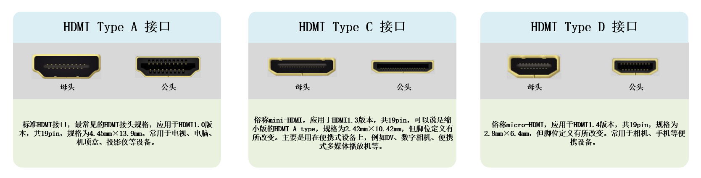

HDMI接口之间使用HDMI信号线连接，不同类型的HDMI接口之间也可以使用连接线进行转接。HDMI连接线如图 所示。

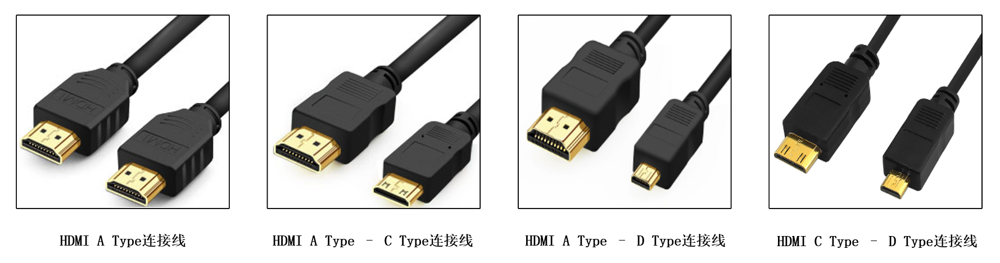

虽然已经见识过HDMI接口的外观，但对接口各引脚功能并没有进一步的认识，下面，我们以HDMI A Type接口为例，结合HDMI接口引脚图和各引脚定义表格，对HDMI接口各引脚做一下简单介绍，具体见图及表格。

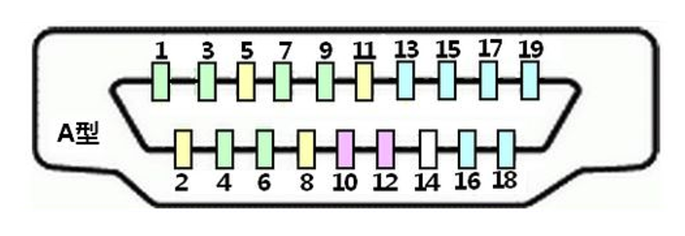

| 引脚 | 定义                          | 引脚 | 定义                         |
| ---- | ----------------------------- | ---- | ---------------------------- |
| 1    | 数据2+ (TMDS Data2+)          | 11   | 时钟屏蔽 (TMDS Clock Shield) |
| 2    | 数据2屏蔽 (TMDS Data2 Shield) | 12   | 时钟- (TMDS Clock–)          |
| 3    | 数据2- ( TMDS Data2-)         | 13   | CEC                          |
| 4    | 数据1+ (TMDS Data1+)          | 14   | 保留                         |
| 5    | 数据1屏蔽 (TMDS Data1 Shield) | 15   | DDC时钟线(SCL)               |
| 6    | 数据1- ( TMDS Data1-)         | 16   | DDC数据线(SDA)               |
| 7    | 数据0+ (TMDS Data0+)          | 17   | DDC/CEC地 (DDC/CEC GND)      |
| 8    | 数据0屏蔽 (TMDS Data0 Shield) | 18   | +5V电源 (Power)              |
| 9    | 数据0- ( TMDS Data0-)         | 19   | 热插拔检测 (Hot Plug Detect) |
| 10   | 时钟+ (TMDS Clock+)           |      |                              |

由图表可知，HDMI接口共有19个引脚，分上下两排，奇数在上，偶数在下，穿插排布。根据其功能，可以将引脚分为4类。

TMDS通道：引脚1-引脚12。负责发送音频、视频及各种辅助数据；遵循DVI 1.0规格的信号编码方式；视频像素带宽从25 MHz到340 MHz（Type A, HDMI 1.3）或至680MHz (Type B)。带宽低于25MHz的视频信号如NTSC 480i 将以倍频方式输出；每个像素的容许数据量从24位至48位。支持每秒120张画面1080p分辨率画面发送以及WQSXGA分辨率；支持RGB 、YCbCr 4:4:4（8-16 bits per component）、YCbCr 4:2:2（12 bits per component）、 YCbCr 4:2:0（HDMI 2.0）等多种像素编码方式；音频采样率支持32kHz、44.1kHz、 48kHz、 88.2kHz、96kHz、176.4kHz、192kHz、1536kHz（HDMI 2.0）；音频声道数量最大8声道。HDMI 2.0支持32声道。音频流规格为IEC61937兼容流，包括高流量无损信号如Dolby TrueHD、DTS -HD Master Audio。

DDC通道：引脚15、16、17。DDC全文为Display Data Channel，译为“显示数据通道”；发送端与接收端可利用DDC沟道得知彼此的发送与接收能力，但HDMI仅需单向获知接收端（显示器）的能力；DDC通道使用100kHz时钟频率的I²C信号，发送数据结构为VESA Enhanced EDID（V1.3）。

CEC通道：引脚13、17。CEC全文为Consumer Electronics Control，CEC通道为必须预留线路，但可以不必实现，作用是用来发送工业规格的AV Link协议信号，以便支持单一遥控器操作多台AV机器，为单芯线双向串列总线。

其他通道：引脚14位保留引脚，无连接；引脚18为+5V电源；引脚19位热插拔检测引脚。

注：另外两类型的HDMI接口与HDMI A Type接口的各引脚名称、功能相同，只是引脚线序不同。

### 2.3 HDMI显示原理

HDMI 系统架构由信源端和接收端组成。某个设备可能有一个或多个 HDMI 输入，一个或多个 HDMI 输出。这些设备上，每个 HDMI 输入都应该遵循 HDMI 接收端规则， 每个 HDMI输出都应该遵循 HDMI 信源端规则。

如图所示， HDMI 线缆和连接器提供四个差分线对，组成TMDS数据和时钟通道，这些通道用于传递视频，音频和辅助数据；另外， HDMI 提供一个 VESA DDC 通道，DDC是用于配置和在一个单独的信源端和一个单独的接收端交换状态；可选择的 CEC 在用户的各种不同的音视频产品中， 提供高水平的控制功能； 可选择的 HDMI 以太网和音频返回（HEAC），在连接的设备中提供以太网兼容的网络数据和一个和 TMDS 相对方向的音频回返通道；此外还有热插拔检测信号HDP，当显示器等HDMI接口的显示设备通过HDMI接口与HDMI信源端相连或断开连接时，HDMI信源端能够通过HPD引脚检测出这一事件，并做出响应。

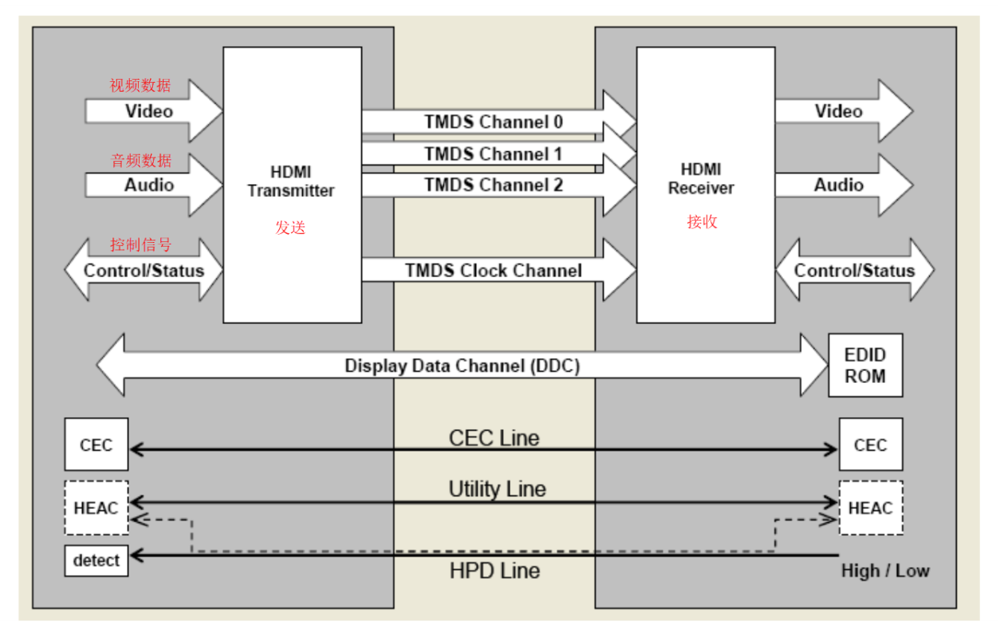

在前文中提到过，HDMI采用和DVI 相同的传输原理 — TMDS（Transition Minimized Differential signal），最小化传输差分信号。在此之前我们只是提及这一传输原理，并未做过系统性的讲解，下面我们就来详细说明一下TMDS的相关知识。下面详细说明一下TMDS的相关知识。

HDMI中的TMDS 传输系统分为两个部分：发送端和接收端。 TMDS 发送端收到HDMI 接口传来的表示 RGB 信号的24 位并行数据（TMDS 对每个像素的 RGB 三原色分别按 8bit 编码，即 R信号有 8 位，G 信号有 8 位，B 信号有 8 位），然后对这些数据和时钟信号进行编码和并/串转换，再将表示 3 个 RGB 信号的数据和时钟信号分别分配到独立的传输通道发送出去。接收端接收来自发送端的串行信号，对其进行解码和串/并转换，然后发送到显示器的控制端。与此同时也接收时钟信号，以实现同步。流程框图如图所示。

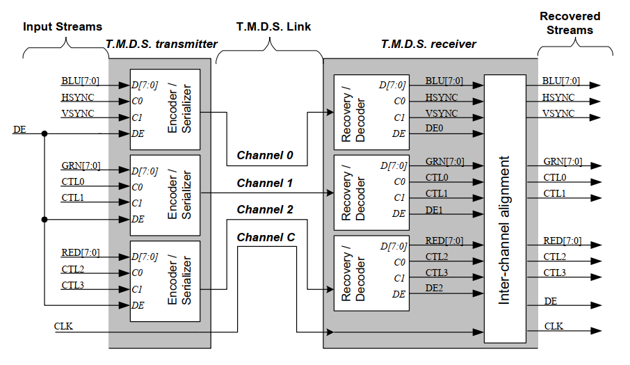

TMDS通道包括 3 个RGB 数据传输通道和 1 个时钟信号传输通道。每一通道都通过编码算法，将 8 位的视频、音频数据转换成最小化传输、直流平衡的 10 位数据，8 位数据经过编码和直流平衡得到 10 位最小化数据，看似增加了冗余位，对传输链路的带宽要求会更高，但事实上，通过这种算法得到的 10 位数据在更长的同轴电缆中传输的可靠性增强了。最小化传输差分信号是通过异或及异或非等逻辑算法将原始 8位数据转换成 10 位数据，前 8位数据由原始信号经逻辑运算后逻辑得到，第 9 位指示运算的方式，第 10 位用来对应直流平衡。

要实现TMDS通道传输，首先要将传入的8 位的并行数据进行编码、并/串转换，添加第9位编码位，如下图所示。

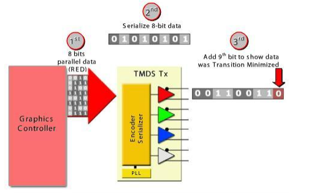

将 8 位并行数据发送到 TMDS 接收端；将接收到的8位数据并/串转换；随后进行最小化传输处理，加上第 9 位，即编码过程。

添加编码位的数据需要进行直流均衡处理。**直流平衡（DC-balanced）就是指在编码过程中保证信道中直流偏移为零，使信道中传输数据包含的1与0的个数相同。**方法是在添加编码位的 9 位数据的后面加上第 10 位数据，保证10位数据中1与0个数相同。这样，传输的数据趋于直流平衡，使信号对传输线的电磁干扰减少，提高信号传输的可靠性。

直流均衡处理后的10位数据需要进行单端转差分处理。TMDS差分传输技术是一种利用2个引脚间电压差来传送信号的技术。传输数据的数值（“0”或者“1”）由两脚间电压正负极性和大小决定。即采用 2 根线来传输信号，一根线上传输原来的信号，另一根线上传输与原来信号相反的信号。这样接收端就可以通过让一根线上的信号减去另一根线上的信号的方式来屏蔽电磁干扰，从而得到正确的信号。原理图如下图所示。

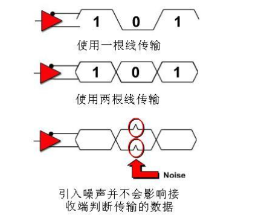

经过上述处理，我们得到了可以进行TMDS通道传输的差分信号，使用这种方法对24位图像数据（8 位R信号、8 位G 信号、8 位B 信号）和时钟信号进行处理，将4对差分信号通过HDMI接口发到接收设备；接收设备通过解码等一系列操作，实现图像后音频再现。

## 3.硬件资源

## 4.实战演练

### 4.2 Vivado 原语 (**Primitives**)

在 Vivado 设计工具中，**原语（Primitives）** 是指 FPGA 芯片中可直接调用的底层硬件单元或基本逻辑模块。这些原语是 Xilinx FPGA 架构的最小功能单元，直接映射到芯片的物理资源。使用原语可以绕过综合工具的自动推断，直接控制硬件实现方式，从而优化关键路径、时序或资源利用率。

#### 4.2.1 **Vivado 原语的核心概念**

1. **底层硬件映射**
   原语直接对应 FPGA 芯片中的物理资源，例如：

   - **逻辑单元**：LUT（查找表）、触发器（Flip-Flop）、进位链（CARRY4）。
   - **专用模块**：块 RAM（BRAM）、DSP Slice、时钟管理单元（MMCM/PLL）。
   - **I/O 单元**：输入 / 输出缓冲器（IBUF、OBUF）、差分缓冲器（IBUFDS、OBUFDS）。
   - **全局资源**：BUFG（全局时钟缓冲器）、BUFH（水平时钟缓冲器）。

2. **直接例化（Instantiation）**
   在 HDL 代码（Verilog/VHDL）中直接调用原语，例如：

   ```
   // 例化一个带有时钟使能和异步复位的D触发器（FDCE）
   FDCE #(
      .INIT(1'b0)    // 初始值
   ) fdce_inst (
      .Q(q),         // 输出
      .C(clk),       // 时钟
      .CE(ce),       // 时钟使能
      .CLR(clr),     // 异步复位
      .D(d)          // 输入
   );
   ```

3. **优化与控制**

   - **性能关键路径**：手动例化原语可避免综合工具推断出非理想结构。
   - **资源复用**：精确控制 DSP 或 BRAM 的使用方式。
   - **特殊功能**：实现差分信号、时钟树管理、片内终端等。

4. **常见的 Vivado 原语类型**

   | **类别**     | **示例原语**                           | **功能**                  |
   | ------------ | -------------------------------------- | ------------------------- |
   | **逻辑单元** | `LUT1`-`LUT6`, `MUXF7`, `MUXF8`        | 实现组合逻辑、多路选择器  |
   | **时序单元** | `FDCE`（异步复位）、`FDRE`（同步复位） | 触发器或寄存器            |
   | **算术单元** | `CARRY4`（超前进位链）                 | 加速加法器、计数器        |
   | **存储单元** | `RAMB36E1`, `FIFO36E1`                 | 块 RAM 或 FIFO            |
   | **DSP 单元** | `DSP48E1`, `DSP48E2`                   | 乘加运算、信号处理        |
   | **时钟管理** | `MMCME2_ADV`, `BUFG`                   | 生成和分配时钟信号        |
   | **I/O 单元** | `IBUF`, `OBUF`, `IOBUF`                | 输入 / 输出缓冲、电平转换 |
   | **高速接口** | `IDDR`, `ODDR`, `ISERDESE2`            | 支持 DDR、高速串行通信    |

5. **何时使用原语？**

   1. **优化关键路径**：当综合工具无法满足时序要求时，手动布局关键逻辑。
   2. **避免推断错误**：例如需要特定类型的 RAM（如双端口 RAM）或 DSP 配置。
   3. **实现特殊功能**：如差分时钟输入、片内终端电阻匹配。
   4. **资源复用**：强制共享 DSP 或 BRAM 资源。

6. **使用原语的注意事项**

   1. **设备依赖性**：不同 FPGA 型号的原语可能不同（如 UltraScale 与 7 系列）。
   2. **代码可移植性**：过度使用原语会降低代码跨平台兼容性。
   3. **文档参考**：必须查阅 Xilinx 的**Library Guide**（如 UG953）或**用户手册**，确认原语端口和参数。

7. **如何查找原语？**

   1. **Vivado Language Templates**
      在 Vivado 中按 `Ctrl+Shift+V`，搜索目标原语（如`RAMB36E1`）的 HDL 模板。
   2. **Xilinx 文档**
      - **UG953**: Vivado Design Suite 7 Series FPGA and Zynq-7000 Library Guide.
      - **UG579**: UltraScale Architecture Libraries Guide.

### 4.3 程序设计

注：本实验选用HDMI 640*480@60显示模式，时钟频率为25MHz；

#### 4.3.1  整体说明

HDMI彩条显示实验工程的整体框图如下

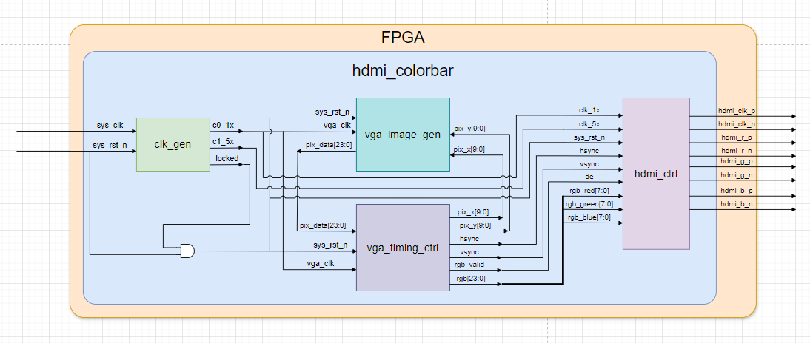

由上图可知，本实验工程包括5个模块，各模块简介，具体见表格

| 模块名称        | 功能描述                                 |
| --------------- | ---------------------------------------- |
| hdmi_colorbar   | 顶层模块                                 |
| clk_gen         | 时钟生成模块，生成25MHz和5×25MHz工作时钟 |
| vga_timing_ctrl | VGA时序控制模块，驱动VGA图像显示         |
| vga_image_gen   | 图像数据生成模块，生成VGA待显示图像      |
| hdmi_ctrl       | HDMI驱动控制模块，生成HDMI待显示图像     |

HDMI的彩条显示是基于VGA彩条显示的基础上的，是在VGA彩条显示工程的基础上修改的得到的。其中改动较大的有两部分：一是时钟生成模块的输出时钟频率和时钟个数做了改动；二是增加了HDMI驱动控制模块hdmi_ctrl。

#### 4.3.2 时钟生成模块

时钟生成模块依然使用调用IP核的生成方式，输出两路时钟信号。由上文可知，本次实验工程中，HDMI显示模式为640*480@60，时钟频率为25MHz，而板卡晶振传入时钟频率为50MHz。时钟生成模块的作用就是将50MHz晶振时钟分频为25MHz的HDMI工作时钟；除此之外，还要生成25MHz时钟的 5 倍频125MHz时钟用来给HDMI控制模块进行并行数据转串行数据。

- **模块框图**

  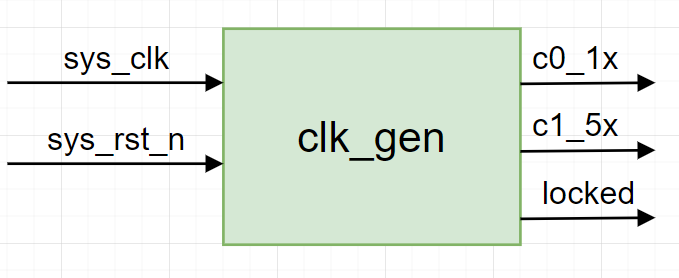

- **模块端口功能描述**

  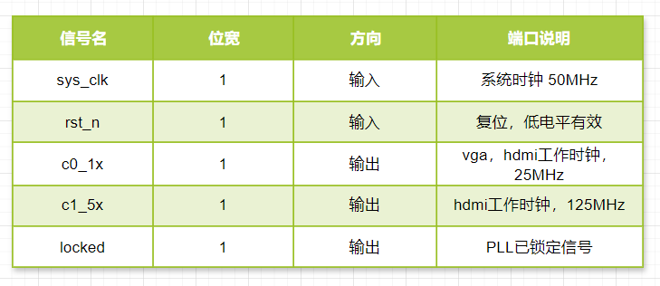

- **IP核设置**

  PLL IP核设置参考PLL工程，这里不再叙述。

**4.3.3 HDMI驱动控制模块**

HDMI驱动控制模块hdmi_ctrl是HDMI彩条显示的核心模块，功能是将VGA控制模块传入的行场同步信号、图像信息转换为HDMI能读取的差分信号，其内部实例化若干子模块，模块及模块简介如下所示。

- **模块框图**

  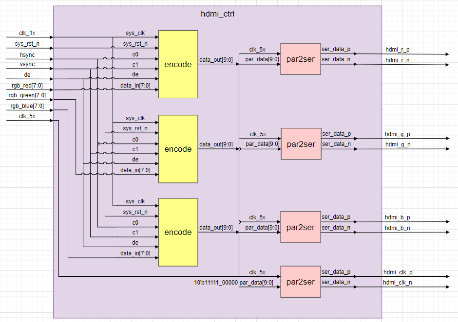

- **模块端口功能描述**

  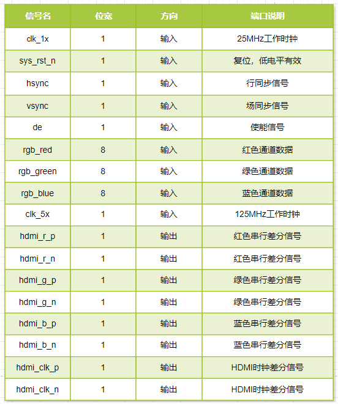

- **代码编写**

  HDMI驱动控制模块就是HDMI驱动控制部分的顶层模块，内部实例化**编码模块**和**并行转串行模块**，连接各自对应信号，代码编写较为简单，无需波形图绘制。HDMI驱动控制模块参考代码如下

  ```
  module hdmi_ctrl (
      input           clk_1x      ,
      input           clk_5x      , 
      input           sys_rst_n   ,
      input           hsync       ,
      input           vsync       ,
      input           de          ,
      input   [7:0]   rgb_red     ,
      input   [7:0]   rgb_green   ,
      input   [7:0]   rgb_blue    ,
  
      output          hdmi_clk_p  ,
      output          hdmi_clk_n  ,
      output          hdmi_r_p    ,
      output          hdmi_r_n    ,
      output          hdmi_g_p    ,
      output          hdmi_g_n    ,
      output          hdmi_b_p    ,
      output          hdmi_b_n    
  );
  //parameter define
  
  //wire define
  wire    [9:0]   data_out_r; //编码后的10bit红色信号
  wire    [9:0]   data_out_g; //编码后的10bit绿色信号
  wire    [9:0]   data_out_b; //编码后的10bit蓝色信号
  
  //reg define
  
  //instance define
  encode encode_inst1(
      .sys_clk(clk_1x),
      .sys_rst_n(sys_rst_n),
      .c0(hsync),
      .c1(vsync),
      .c2(de),
      .data_in(rgb_red),
      .data_out(data_out_r)
  );
  encode encode_inst2(
      .sys_clk(clk_1x),
      .sys_rst_n(sys_rst_n),
      .c0(hsync),
      .c1(vsync),
      .c2(de),
      .data_in(rgb_green),
      .data_out(data_out_g)
  );
  encode encode_inst3(
      .sys_clk(clk_1x),
      .sys_rst_n(sys_rst_n),
      .c0(hsync),
      .c1(vsync),
      .c2(de),
      .data_in(rgb_blue),
      .data_out(data_out_b)
  );
  par2ser par2ser_inst1(
      .clk_5x(clk_5x),
      .par_data(data_out_r),
      .ser_data_p(hdmi_r_p),
      .ser_data_n(hdmi_r_n)
  );
  par2ser par2ser_inst2(
      .clk_5x(clk_5x),
      .par_data(data_out_g),
      .ser_data_p(hdmi_g_p),
      .ser_data_n(hdmi_g_n)
  );
  par2ser par2ser_inst3(
      .clk_5x(clk_5x),    
      .par_data(data_out_b),
      .ser_data_p(hdmi_b_p),
      .ser_data_n(hdmi_b_n)
  );
  par2ser par2ser_inst4(
      .clk_5x(clk_5x),    
      .par_data(10'b11111_00000),
      .ser_data_p(hdmi_clk_p),
      .ser_data_n(hdmi_clk_n)
  );
  endmodule
  ```

#### 4.3.3 编码模块

上一小节介绍了HDMI驱动控制模块，实际就是HDMI驱动控制的顶层模块，功能是实现VGA图像信息到HDMI图像信息的转化。实现这一功能的转化，需要对输入的VGA图像信息进行**编码**、**并行串行转换**、**单端信号转差分信号**、**单沿采样转双沿采样**。

而编码模块就是为了完成VGA图像数据8b转10b的编码，关于8b转10b编码的理论知识在前面的理论小节已经做了详细介绍。

- **模块框图**

  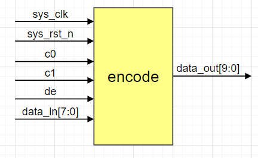

- **模块端口功能描述**

  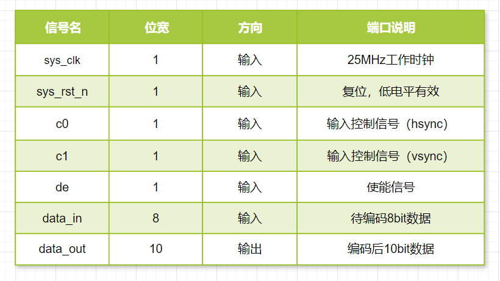

- **代码编写**

  代码参考赛灵思官方例程

  ```
  `timescale 1 ps / 1ps
  
  module encode (
    input            sys_clk,    // pixel clock input
    input            sys_rst_n,    // async. reset input (active high)
    input      [7:0] data_in,      // data inputs: expect registered
    input            c0,       // c0 input
    input            c1,       // c1 input
    input            de,       // de input
    output reg [9:0] data_out      // data outputs
  );
  
    ////////////////////////////////////////////////////////////
    // Counting number of 1s and 0s for each incoming pixel
    // component. Pipe line the result.
    // Register Data Input so it matches the pipe lined adder
    // output
    ////////////////////////////////////////////////////////////
    reg [3:0] n1d; //number of 1s in data_in
    reg [7:0] data_in_q;
  
    always @ (posedge sys_clk) begin
      n1d <=#1 data_in[0] + data_in[1] + data_in[2] + data_in[3] + data_in[4] + data_in[5] + data_in[6] + data_in[7];
  
      data_in_q <=#1 data_in;
    end
  
    ///////////////////////////////////////////////////////
    // Stage 1: 8 bit -> 9 bit
    // Refer to DVI 1.0 Specification, page 29, Figure 3-5
    ///////////////////////////////////////////////////////
    wire decision1;
  
    assign decision1 = (n1d > 4'h4) | ((n1d == 4'h4) & (data_in_q[0] == 1'b0));
  /*
    reg [8:0] q_m;
    always @ (posedge sys_clk) begin
      q_m[0] <=#1 data_in_q[0];
      q_m[1] <=#1 (decision1) ? (q_m[0] ^~ data_in_q[1]) : (q_m[0] ^ data_in_q[1]);
      q_m[2] <=#1 (decision1) ? (q_m[1] ^~ data_in_q[2]) : (q_m[1] ^ data_in_q[2]);
      q_m[3] <=#1 (decision1) ? (q_m[2] ^~ data_in_q[3]) : (q_m[2] ^ data_in_q[3]);
      q_m[4] <=#1 (decision1) ? (q_m[3] ^~ data_in_q[4]) : (q_m[3] ^ data_in_q[4]);
      q_m[5] <=#1 (decision1) ? (q_m[4] ^~ data_in_q[5]) : (q_m[4] ^ data_in_q[5]);
      q_m[6] <=#1 (decision1) ? (q_m[5] ^~ data_in_q[6]) : (q_m[5] ^ data_in_q[6]);
      q_m[7] <=#1 (decision1) ? (q_m[6] ^~ data_in_q[7]) : (q_m[6] ^ data_in_q[7]);
      q_m[8] <=#1 (decision1) ? 1'b0 : 1'b1;
    end
  */
    wire [8:0] q_m;
    assign q_m[0] = data_in_q[0];
    assign q_m[1] = (decision1) ? (q_m[0] ^~ data_in_q[1]) : (q_m[0] ^ data_in_q[1]);
    assign q_m[2] = (decision1) ? (q_m[1] ^~ data_in_q[2]) : (q_m[1] ^ data_in_q[2]);
    assign q_m[3] = (decision1) ? (q_m[2] ^~ data_in_q[3]) : (q_m[2] ^ data_in_q[3]);
    assign q_m[4] = (decision1) ? (q_m[3] ^~ data_in_q[4]) : (q_m[3] ^ data_in_q[4]);
    assign q_m[5] = (decision1) ? (q_m[4] ^~ data_in_q[5]) : (q_m[4] ^ data_in_q[5]);
    assign q_m[6] = (decision1) ? (q_m[5] ^~ data_in_q[6]) : (q_m[5] ^ data_in_q[6]);
    assign q_m[7] = (decision1) ? (q_m[6] ^~ data_in_q[7]) : (q_m[6] ^ data_in_q[7]);
    assign q_m[8] = (decision1) ? 1'b0 : 1'b1;
  
    /////////////////////////////////////////////////////////
    // Stage 2: 9 bit -> 10 bit
    // Refer to DVI 1.0 Specification, page 29, Figure 3-5
    /////////////////////////////////////////////////////////
    reg [3:0] n1q_m, n0q_m; // number of 1s and 0s for q_m
    always @ (posedge sys_clk) begin
      n1q_m  <=#1 q_m[0] + q_m[1] + q_m[2] + q_m[3] + q_m[4] + q_m[5] + q_m[6] + q_m[7];
      n0q_m  <=#1 4'h8 - (q_m[0] + q_m[1] + q_m[2] + q_m[3] + q_m[4] + q_m[5] + q_m[6] + q_m[7]);
    end
  
    parameter CTRLTOKEN0 = 10'b1101010100;
    parameter CTRLTOKEN1 = 10'b0010101011;
    parameter CTRLTOKEN2 = 10'b0101010100;
    parameter CTRLTOKEN3 = 10'b1010101011;
  
    reg [4:0] cnt; //disparity counter, MSB is the sign bit
    wire decision2, decision3;
  
    assign decision2 = (cnt == 5'h0) | (n1q_m == n0q_m);
    /////////////////////////////////////////////////////////////////////////
    // [(cnt > 0) and (N1q_m > N0q_m)] or [(cnt < 0) and (N0q_m > N1q_m)]
    /////////////////////////////////////////////////////////////////////////
    assign decision3 = (~cnt[4] & (n1q_m > n0q_m)) | (cnt[4] & (n0q_m > n1q_m));
  
    ////////////////////////////////////
    // pipe line alignment
    ////////////////////////////////////
    reg       de_q, de_reg;
    reg       c0_q, c1_q;
    reg       c0_reg, c1_reg;
    reg [8:0] q_m_reg;
  
    always @ (posedge sys_clk) begin
      de_q    <=#1 de;
      de_reg  <=#1 de_q;
      
      c0_q    <=#1 c0;
      c0_reg  <=#1 c0_q;
      c1_q    <=#1 c1;
      c1_reg  <=#1 c1_q;
  
      q_m_reg <=#1 q_m;
    end
  
    ///////////////////////////////
    // 10-bit out
    // disparity counter
    ///////////////////////////////
    always @ (posedge sys_clk or posedge sys_rst_n) begin
      if(!sys_rst_n) begin
        data_out <= 10'h0;
        cnt <= 5'h0;
      end else begin
        if (de_reg) begin
          if(decision2) begin
            data_out[9]   <=#1 ~q_m_reg[8]; 
            data_out[8]   <=#1 q_m_reg[8]; 
            data_out[7:0] <=#1 (q_m_reg[8]) ? q_m_reg[7:0] : ~q_m_reg[7:0];
  
            cnt <=#1 (~q_m_reg[8]) ? (cnt + n0q_m - n1q_m) : (cnt + n1q_m - n0q_m);
          end else begin
            if(decision3) begin
              data_out[9]   <=#1 1'b1;
              data_out[8]   <=#1 q_m_reg[8];
              data_out[7:0] <=#1 ~q_m_reg[7:0];
  
              cnt <=#1 cnt + {q_m_reg[8], 1'b0} + (n0q_m - n1q_m);
            end else begin
              data_out[9]   <=#1 1'b0;
              data_out[8]   <=#1 q_m_reg[8];
              data_out[7:0] <=#1 q_m_reg[7:0];
  
              cnt <=#1 cnt - {~q_m_reg[8], 1'b0} + (n1q_m - n0q_m);
            end
          end
        end else begin
          case ({c1_reg, c0_reg})
            2'b00:   data_out <=#1 CTRLTOKEN0;
            2'b01:   data_out <=#1 CTRLTOKEN1;
            2'b10:   data_out <=#1 CTRLTOKEN2;
            default: data_out <=#1 CTRLTOKEN3;
          endcase
  
          cnt <=#1 5'h0;
        end
      end
    end
    
  endmodule
  
  ```

  

#### 4.3.4 并行转串行模块

使用编码模块可解决图像数据的编码问题，而并行转串行模块(par_to_ser.v)的主要功能就是实现并行串行转换、单端信号转差分信号、单沿采样转双沿采样。

在实现此模块的过程中使用到了**Vivado 原语**(**Primitives**)，这一部分可参考上面介绍的理论知识。根据本实验工程的硬件资源，参考ug471手册

本模块使用到了 **ODDR 双数据速率**原语和 **OBUFDS  单端转差分信号**原语。

ODDR  是 XILINX  提供的双数据速率原语，双数据速率原语ODDR  可以用于在逻辑资源中实现 DDR 寄存器，可以把单沿传输的数据转换为双沿传输的数据。

OBUFDS 是 XILINX提供的将单端信号转换为差分信号原语。

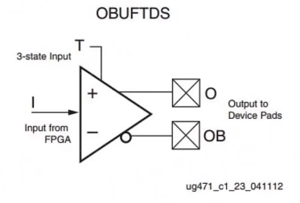

原语的例化模板可在Vivado工具栏中找到，如下图所示


- **模块框图**

  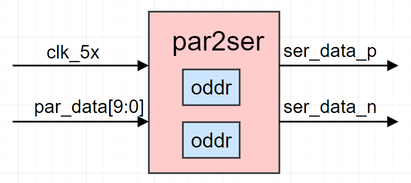

- **模块端口功能描述**

  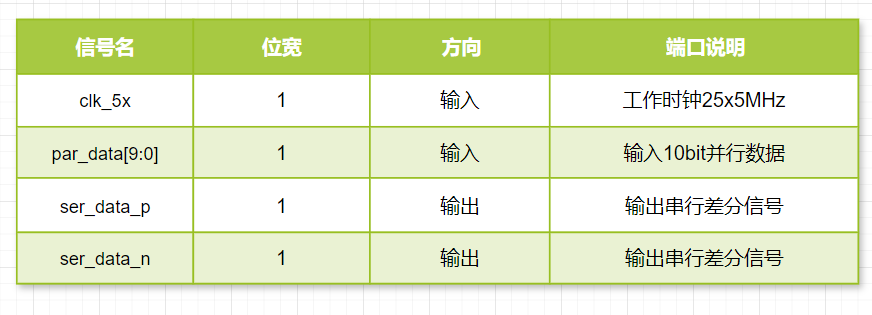

- 波形图绘制

  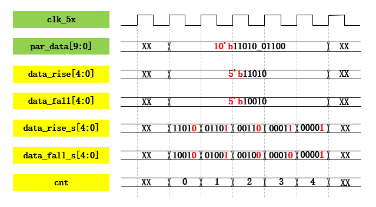

  第一步：将输入的10bit并行数据par_data拆分为两个位宽5bit的数据信号。拆分规则：将会在时钟上升沿输出的par_data[8]、par_data[6]、par_data[4]、par_data[2]、par_data[0]赋值给变量data_rise[4:0]；将会在时钟下降沿输出的pa r_data[9]、par_data[7]、par_data[5]、par_data[3]、par_data[1]赋值给变量data_fall[4:0]。

  第二步：声明计数器cnt，以clk_5x为计数时钟进行循环计数，计数范围0-4，每个时钟周期自加1。当cnt计数值为最大值4时，将拆分得到的变量data_rise、data_fall分别赋值给data_rise_s、data_fall_s；

  第三步：将data_rise_s[0]、data_fall_s[0]分别写入ODDR 双数据速率原语的D1、D2接口；同时，每个时钟周期将data_rise_s、data_fall_s右移一位。

  经过上述三步操作后，位宽10bit的并行数据par_data转换为两路串行数据传入ODDR 双数据速率原语的D1、D2接口，经过原语处理后，输出以clk_5x为同步时钟的串行双沿采样信号Q。

  同时例化 OBUFDS  单端转差分信号原语，将单端串行信号Q写入OBUFDS  单端转差分信号原语的I接口，输出串行双沿采样差分信号对。

- 代码编写

  ```
  module par2ser (
      input               clk_5x    ,
      input   [9:0]       par_data  ,
  
      output              ser_data_p,
      output              ser_data_n
  );
  //parameter define
  
  //wire define
  wire [4:0]  data_rise = {par_data[8],par_data[6],par_data[4],par_data[2],par_data[0]};
  wire [4:0]  data_fall = {par_data[9],par_data[7],par_data[5],par_data[3],par_data[1]};
  wire        Q;
  //reg define
  reg [4:0] data_rise_s = 0;
  reg [4:0] data_fall_s = 0;
  reg [2:0] cnt         = 0;
  
  //instance define
  
  always @(posedge clk_5x ) begin
      cnt <= (cnt[2] == 1'b1) ? 3'd0 : cnt + 1'b1;
      data_rise_s <= (cnt[2] == 1'b1) ? data_rise : {1'b0,data_rise_s[4:1]};
      data_fall_s <= (cnt[2] == 1'b1) ? data_fall : {1'b0,data_fall_s[4:1]};
  end
  
  ODDR #(
        .DDR_CLK_EDGE("SAME_EDGE"), // "OPPOSITE_EDGE" or "SAME_EDGE" 
        .INIT(1'b0),    // Initial value of Q: 1'b0 or 1'b1
        .SRTYPE("SYNC") // Set/Reset type: "SYNC" or "ASYNC" 
     ) ODDR_inst (
        .Q(Q),   // 1-bit DDR output
        .C(clk_5x),   // 1-bit clock input
        .CE(1'b1), // 1-bit clock enable input
        .D1(data_rise_s[0]), // 1-bit data input (positive edge)
        .D2(data_fall_s[0]), // 1-bit data input (negative edge)
        .R(1'b0),   // 1-bit reset
        .S(1'b0)    // 1-bit set
     );
  
  OBUFDS #(
        .IOSTANDARD("TMDS_33"), // Specify the output I/O standard
        .SLEW("SLOW")           // Specify the output slew rate
     ) OBUFDS_inst (
        .O(ser_data_p),     // Diff_p output (connect directly to top-level port)
        .OB(ser_data_n),   // Diff_n output (connect directly to top-level port)
        .I(Q)      // Buffer input
     );
  
     
  endmodule
  ```

#### 4.3.5 顶层模块

hdmi_colorbar顶层模块主要是对各个子功能模块的实例化，以及对应信号的连接。

- 代码编写

  ```
  module hdmi_colorbar (
      input           sys_clk     ,
      input           sys_rst_n   ,
      
      output          ddc_scl     ,
      output          ddc_sda     ,
      output          hdmi_clk_p  ,
      output          hdmi_clk_n  ,
      output          hdmi_r_p    ,
      output          hdmi_r_n    ,
      output          hdmi_g_p    ,
      output          hdmi_g_n    ,
      output          hdmi_b_p    ,
      output          hdmi_b_n    
  );
      
  
  //wire define
  wire        clk_1x  ;
  wire        clk_5x  ;
  wire        locked  ;
  wire        rst_n   ;
  wire [9:0]  pix_x   ;
  wire [9:0]  pix_y   ;
  wire [23:0] pix_data;
  wire        hsync   ;
  wire        vsync   ;
  wire        de      ;
  wire [23:0] rgb     ;
  
  
  assign rst_n = sys_rst_n & locked;
  assign ddc_scl = 1'b1;
  assign ddc_sda = 1'b1;
  
  //instance define
  clk_gen  clk_gen_inst (
      .sys_clk(sys_clk),
      .sys_rst_n(sys_rst_n),
      .c0_1x(clk_1x),
      .c1_5x(clk_5x),
      .locked(locked)
    );
  vga_image_gen  vga_image_gen_inst (
      .vga_clk(clk_1x),
      .rst_n(rst_n),
      .pix_x(pix_x),
      .pix_y(pix_y),
      .pix_data(pix_data)
    );
  
  vga_timing_ctrl  vga_timing_ctrl_inst (
      .vga_clk(clk_1x),
      .rst_n(rst_n),
      .pix_data(pix_data),
      .hsync(hsync),
      .vsync(vsync),
      .pix_x(pix_x),
      .pix_y(pix_y),
      .rgb(rgb),
      .de(de)
    );
  
  hdmi_ctrl  hdmi_ctrl_inst (
      .clk_1x(clk_1x),
      .clk_5x(clk_5x),
      .sys_rst_n(rst_n),
      .hsync(hsync),
      .vsync(vsync),
      .de(de),
      .rgb_red(rgb[23:16]),
      .rgb_green(rgb[15:8]),
      .rgb_blue(rgb[7:0]),
      .hdmi_clk_p(hdmi_clk_p),
      .hdmi_clk_n(hdmi_clk_n),
      .hdmi_r_p(hdmi_r_p),
      .hdmi_r_n(hdmi_r_n),
      .hdmi_g_p(hdmi_g_p),
      .hdmi_g_n(hdmi_g_n),
      .hdmi_b_p(hdmi_b_p),
      .hdmi_b_n(hdmi_b_n)
    );
  endmodule
  ```

- **仿真结果**

  - 顶层模块波形

    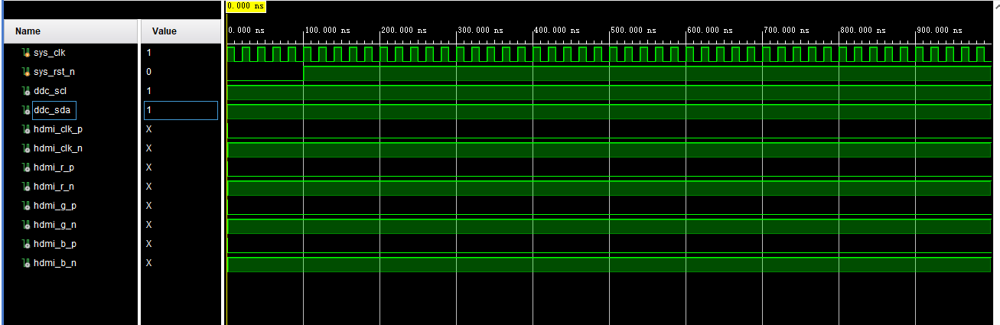

    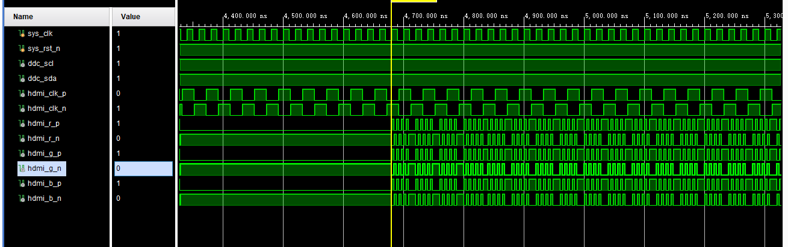

  - 编码模块

    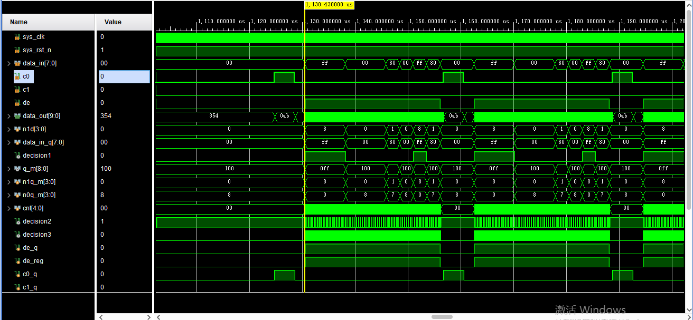

  - 并行转串行模块

    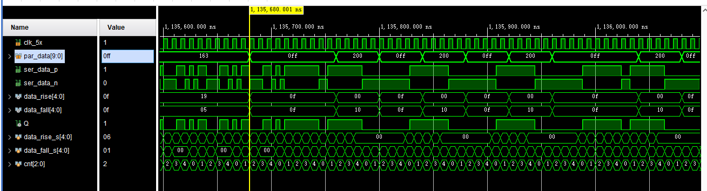

  - 
