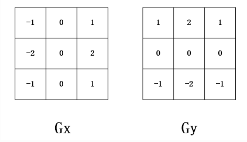
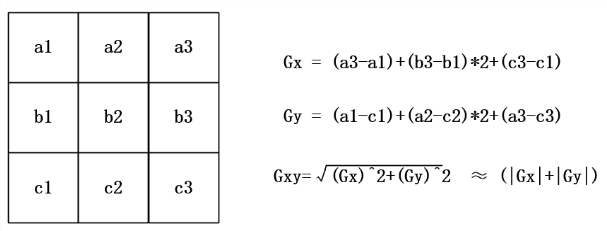

# Sobel 边缘检测

## 1. 理论知识

### 1.1 边缘检测

​	边缘检测，针对的是灰度图像，顾名思义，检测图像的边缘，是针对图像像素点的一种计算，目的是标识数字图像中灰度变化明显的点，图像的边缘检测，在保留了图像的重要结构信息的同时，剔除了可以认为不相关的信息，大幅度减少了数据量，便于图像的传输和处理。

​	边缘检测的方法大致可以分为两类：基于查找的一类，通过寻找图像一阶导数中最大值和最小值来检测边界，包括Sobel算法、Roberts Cross算法等；基于零穿越的一类，通过寻找图像二阶导数零穿越来寻找边界，包括Canny算法，Laplacian算法等。

### 1.2 Sobel算法简介

​	Sobel 边缘检测通常带有方向性,可以只检测竖直边缘、垂直边缘、或都检测。Sobel 算子继承了高斯滤波算法的观念,认为邻域的像素对当前像素产生的影响不是等价的,所以距离不同的像素按距离远近被赋予不同的权值。这样一来,邻域不同点位对需计算点位的影响力不同。

​	Soble算法的核心就是Sobel算子，该算子包含两组3x3的矩阵，具体见图

​	对于图像而言，取3行3列的图像数据，将图像数据与对应位置的算子的值相乘再相加，得到x方向的Gx，和y方向的Gy，将得到的Gx和Gy，平方后相加，再取算术平方根，得到Gxy，近似值为Gx和Gy绝对值之和，将计算得到的Gxy与我们设定的阈值相比较，Gxy如果大于阈值，表示该点为边界点，此点显示黑点，否则 显示白点。

Gxy计算公式如下图

### 1.3 Sobel算法实现

将Sobel算法在图像边缘检查中的实现分为4步

- 第一步：通过Gx、Gy的计算公式结合FIFO求取Gx、Gy的值；
- 第二步：求得Gx、Gy的绝对值；
- 第三步：将Gx、Gy带入Gxy计算公式，求得Gxy的值；
- 第四步：第4步，将求得的Gxy与设定的阈值相比较，当Gxy大于等于阈值，赋值rgb为黑色，否则， rgb赋值为白色。

​	要注意的是，图片正在经过Sobel算法之后，输出的图片相比于输入时的图片会少2行2列数据，这是因为在求取Gx、Gy时，要使用FIFO求和算法，该算法只有在第2行或第2列数据输入时才开始执行，第0、1行或第0、1列不会进行求和运算，更无数据输出，所以会缺失的2行2列。