# OV5640

## 1. 理论知识

### 1.1 OV5640摄像头介绍

​	OV5640 是由豪威科技生产的一款 1/4 英寸单芯片CMOS图像传感器，其感光阵列达到2592\*1944 (即 500W 像素)，最高支持 2592x1944@15fps（QSXGA）或 640*480@90fps的图像输出。

**模块引脚描述**

​	所使用的OV5640模块提供了一个18PIN的插针接口，如下图

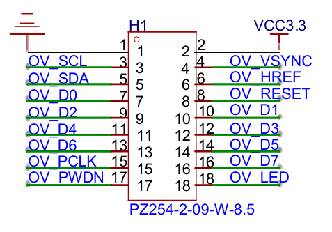

模块各引脚的功能描述如下表所示

| 引脚名称 | 引脚类型 | 引脚功能描述              |
| -------- | -------- | ------------------------- |
| RESET    | 输入     | 系统复位引脚，低电平有效  |
| PWDN     | 输入     | 掉电/省电模式，高电平有效 |
| HREF     | 输出     | 行同步信号                |
| VSYNC    | 输出     | 场同步信号                |
| PCLK     | 输出     | 像素时钟                  |
| SCL      | 输入     | SCCB 总线的时钟线         |
| SDA      | I/O      | SCCB 总线的数据线         |
| LED      | 输入     | LED补光灯引脚             |
| D0...D9  | 输出     | 像素数据端口              |

注意:OV5640 芯片 DVP 接口本身拥有 10 位的数据线,可以输出 10 位的 RAW 数据,但是在大多数情况下,使用高 8 位数据即可,因此模组在设计时,仅使用了 OV5640 芯片的D9~D2 高 8 位,映射到模组上的 OV_D7~OV_D0。

### 1.2 OV5640工作原理

​	OV5640 是一个典型的 CMOS 图像传感器,作为一个图像传感器,其主要作用就是将现实中的各种光线转换为数字系统能够识别的数字信号,光线中三元色各个颜色的强度本身是模拟信号,所以图像传感器的最基本的原理就是进行模数转换,将光线这个模拟量转换为数字信号。

​	自然界中的光,实际上是三种基本单色光的组合,这三种基本单色光为红(RED)、绿(GREEN)、蓝(BLUE),我们称之为三原色。通过将这三种基本颜色按照不同的比例混合,就可以得到其他的任意颜色。例如纯黄色是由红色和绿色按照一比一的比例混合得到的,蓝色量为 0。

​	所以图像传感器里面的模数转换,实质就是对一束光线的三原色的强度进行转换,将三原色中每一种颜色的强度转化为数字信号。再用颜色加数字的方式来表示该束光线的真实颜色。

​	表示颜色的方法最常用的RGB888格式，就是使用 3 个 8 位的数据表示一种颜色,其中高八位表示红色分量,中八位表示绿色分量,低八位表示蓝色分量。如下表所示。

|        | 红       | 绿       | 蓝       | 黄       | 品红     | 青       | 白       | 黑       |
| ------ | -------- | -------- | -------- | -------- | -------- | -------- | -------- | -------- |
| RGB888 | 0xff0000 | 0x00ff00 | 0x0000ff | 0xffff00 | 0x00ffff | 0xff00ff | 0xffffff | 0x000000 |

​	接下来，我们就需要考虑如何才能对一束自然光中的三原色的强度分别进行模数转换呢?如下图所示，通过加入滤光片,就能让对应颜色的光线通过滤光片到达感光元件。

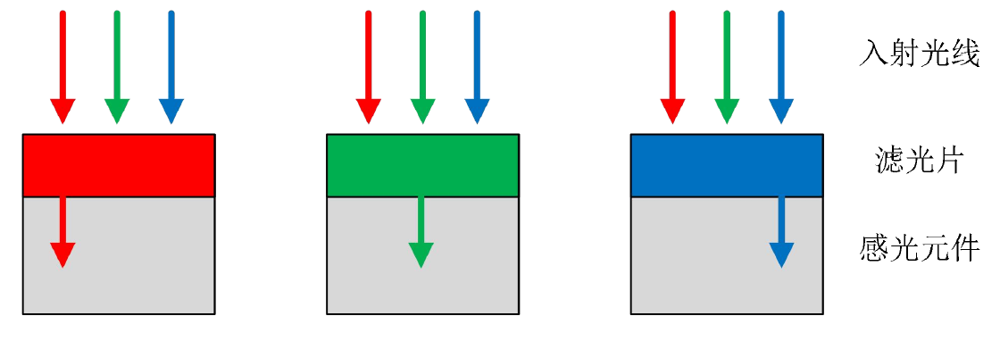

​	由于一个感光元件只能对一种颜色的光进行感应，所以说对于某一束光线，至少使用3个像素才能把该束光的三种颜色分量全提取出来，实际上 3 个像素间摆放位置又存在物理限制。为了解决这些问题，诞生了著名的拜尔(以下简称 Bayer)矩阵。Bayer 矩阵定义,感光像素矩阵中,奇数行间隔放置绿色和红色感应像素,偶数行间隔放置绿色和蓝色感应像素,奇数列间隔放置绿色和蓝色感应像素,偶数列间隔放置红色和绿色感应像素,其输出数据格式如下图所示。

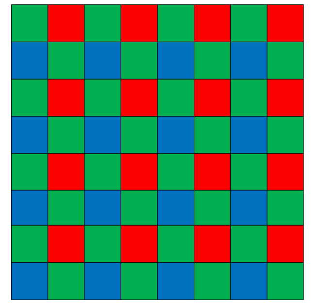

​	根据这种分布规律,在 Bayer 矩阵中,以相邻的四个像素作为一组,在该组中,有两个感应绿色分量的像素呈对角分布,另外两个像素则分别对应感应红色分量和感应蓝色分量。通过这样一种方式,我们可以发现,任取一个像素,其与相邻的 3 个像素组成的矩阵中,总符合这样的规律。不同的只是三种颜色的像素所在的位置的差异。下图为图像传感器手册中给出的像素物理分布图。

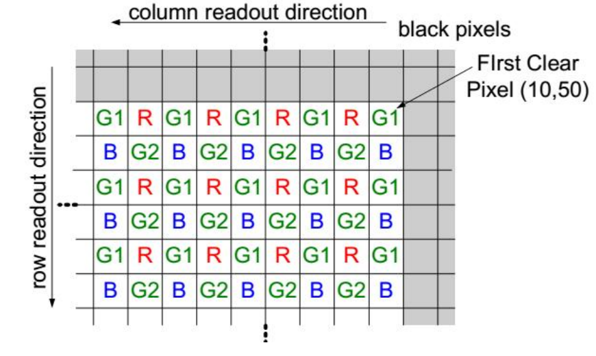

​	而且通过对上述 8*8 的矩阵进行分析发现,在整个矩阵中,像素的位置关系有且只有下
面四种情况:

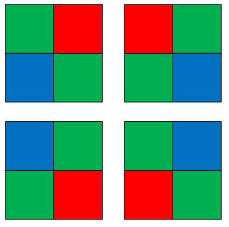

​	所以,在实际颜色提取时,需要通过数据转换,将相邻四个像素的数据通过插值算法合并为一个 RGB 像素颜色,此种转换算法名为 RAW2RGB,这里取左上角四个像素点的数据为例,具体颜色转换算法如下所示:

​	保留相邻四个像素中的红色和蓝色分量,而对两个绿色分量求平均,得到新的绿色分量,此三种颜色分量组成一个新的 RGB 格式的像素

​	按照这样的思路,整个图像传感器中的每一个像素都可以以不同的角色参与 4 次运算,并最终得到 4 个 RGB 颜色值,所以理论来说,还是可以认为一个图像传感器有多少个物理像素,就能得到多少个 RGB 格式的像素值,虽然每个物理像素都只能感应一种颜色。但是进过插值运算后,其能输出 RGB 的数据格式的像素数量还是等于其物理像素个数的。

**模块功能框图**

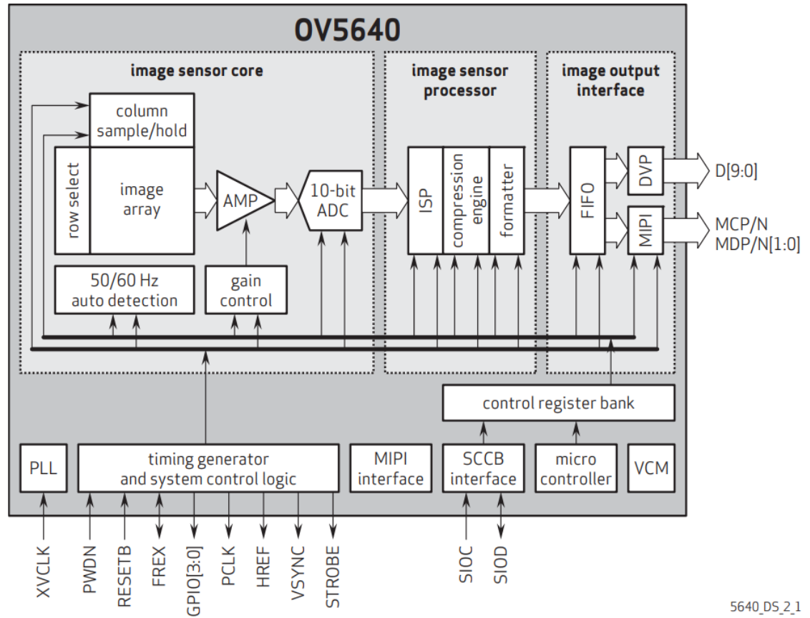

​	由上图可知,时序发生器(timing generator)控制着感光阵列(image array) 、放大器(AMP) 、AD 转换以及输出外部时序信号(VSYNC、HREF 和 PCLK) ,外部时钟 XVCLK 经过 PLL 锁相环后输出的时钟作为系统的控制时钟;该感光阵列共有 2592\*1944 个物理像素,在感光阵列外围,有一个 row select 功能模块来选择当前输出哪一行的像素,和一个 column sample/hold 电路来依次采样每行像素中的每一个像素的感光元件感应结果(模拟信号)并输出到信号放大器(AMP),经过信号放大器之后进入 10 位 AD 转换器;AD 转换器将模拟信号转化成数字信号,并且经过 ISP 进行相关图像处理,最终输出所配置格式的 10 位视频数据流。增益放大器控制以及 ISP 等都可以通过寄存器(registers)来配置,配置寄存器的接口就是SCCB 接口,该接口协议兼容 IIC 协议。

### 1.3 OV5640 数字信号处理流程

​	影像处理器(ISP) -> 压缩引擎(Compression Engine) -> 格式化处理器(Formatter)

### 1.4 OV5640数字接口

1. 工作时钟

   ​	OV5640 的时钟从 XCLK 引脚输入,该时钟默认固定频率为 24MHz。要想 OV5640能够开始工作,提供该 XCLK 时钟必不可少。

2. 数据流接口

   对于图像传感器来说,常见的数据流接口包括 DVP 接口、LVDS 接口、CSI(MIPI)接口。

   - DVP 接口:

     DVP 接口是最为经典的图像数据流接口,其本质是一个包含控制信号和数据信号的并行数据端口,使用单端 TTL 电平进行通信。 DVP 接口包括时钟信号(PCLK)、行有效信号(HREF)、场同步信号(VSYNC)、8 位或更多位的数据信号。

     VSYNC 信号每个高脉冲标志着新一帧图像的开始,在 HREF 为高电平期间,每个 PCLK,8 位 DATA 数据线输出一个数据。下图为 OV7670 输出标准 VGA 分辨率(640*480)图像时候的时序图。

     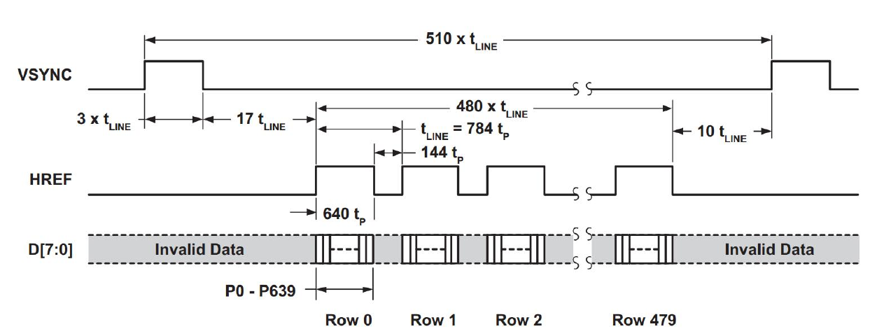

     上图,tp 为每一个像素所占用的时钟周期个数,如果输出的是原始的 RAW 格式,则 tp= 1*PCLK,如果输出的是 RGB 或者 YUV 格式,则 tp=2*PCLK。也就是说,如果输出的是 RGB或者 YUV 格式,则每行(Row)有 640*2 个字节的数据输出。

   - LVDS 接口:

     随着图像传感器的像素密度越来越高,其输出数据量也大幅增加,由于传统的 DVP 接口采用的是单端 TTL 并行接口,这种接口模式 IO 翻转速率上限受限,当数据量超过一定的值之后,DVP 接口就无法再满足全部数据的传输。为此,能够显著提升数据传输速率的低压差分串行传输接口(LVDS)就应用到了图像传感器的数据流接口上。LVDS 接口采用差分电平传输,每个信号都使用两根信号线传输数据,接收端通过这两根信号线之间的电压差来确定接收到的数据是 0 还是 1, 采用差分传输方式能够显著提升信号线的抗干扰能力,所以 LVDS的传输速率相对较高。图像传感器使用 LVDS 接口传输图像信息,不仅能满足高带宽的通信需求,还能提高信号传输的抗干扰能力。

   - CSI 接口:

     CSI 接口属于 MIPI 接口的一种,全称为摄像机串行接口(Camera Serial Interface),CSI接口物理层使用 LVDS 接口传输,但是在数据内容层发生了变化。 CSI 接口不仅能够传输数据流内容,还能传输控制数据,目前 CSI 接口在多媒体数字终端(手机、平板电脑)等设备中应用非常广泛。

     无论是 DVP 接口,还是 LVDS 接口、CSI 接口,其最终的目的都是将数据输出给应用处理器。具体使用什么接口需要看应用处理器的连接能力。这其中,DVP 接口对应用处理器的IO 能力要求较低,只需要能支持 TTL 电平即可。而 LVDS 接口则需要 IO 口能够提供相应的LVDS 电平以及数据传输能力。CSI 接口,不仅需要应用处理器能够接受 LVDS 电平,还需要能够解码 CSI 协议。现代的各种多媒体处理器大多自带 CSI 功能接口硬件,因此能够直接连接 CSI 接口的图像传感器。而 FPGA 一般支持 DVP 接口和 LVDS 接口,对于 CSI 接口,要支持的话需要有对应的 CSI 协议 IP。所以除非是必须要使用 CSI 接口,否则目前的 FPGA 在连接摄像头时,大多还算使用 DVP 接口和 LVDS 接口。

3.  控制接口

   ​	SCCB(Serial Camera Control Bus,串行摄像头控制总线)是由 OV(OmniVision 的简称)公司定义和发展的三线式串行总线,该总线控制着摄像头大部分的功能,包括图像数据格式、分辨率以及图像处理参数等。OV 公司为了减少传感器引脚的封装,现在 SCCB 总线大多采用两线式接口总线。所谓串行摄像头控制总线,虽然看名字貌似是摄像头的一个专属总线,但是实质上,其就是 I2C 总线的一个小变种而已。 

   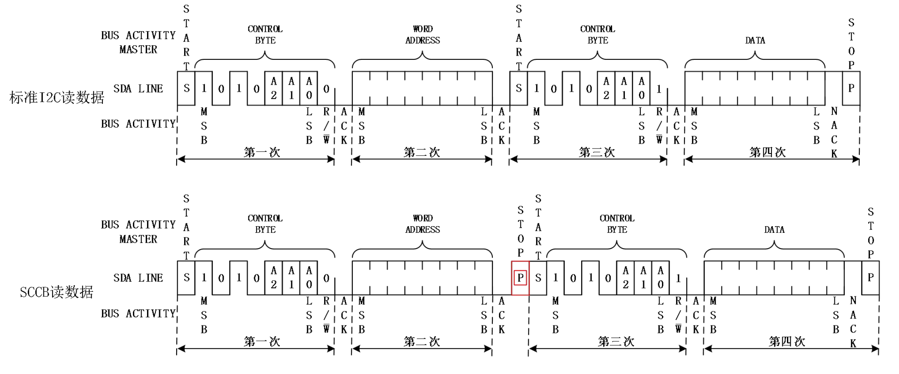

   ​	图中上方为标准 I2C 协议读取一个地址中数据的时序图,下方为 SCCB 协议读取一个地址中数据的时序图,两者的差异以红色线条的形式标记出来。可以看到:对于 I2C 协议,其在执行读的过程中,当第二次传输(word address)传输完成之后,直接产生了新的起始位并开始再一次传输控制字节;对于 SCCB 协议,其在执行读的过程中,当第二次传输(word address)传输完成之后,是先产生了一个停止位,然后再产生新的起始位并开始再一次传输控制字节的。两者仅有此差别。

4.  复位控制

   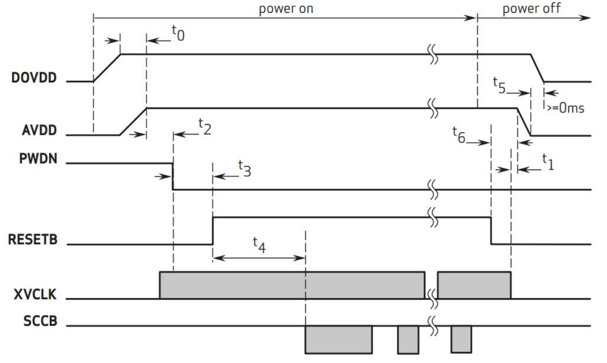

   手册描述：

   - PWDN 信号为掉电控制信号,当该引脚为高电平时整个图像传感器的模拟和数字部分都处于掉电不工作状态,为低电平时整个器件才可以开始工作;
   -  如果不希望控制 PWDN 信号,则该信号可以直接接到低电平;
   -  如果需要控制 PWDN 信号,则需要在上电至少 5ms 之后再拉低 PWDN。
   -  RESET 信号为复位信号,低电平复位。
   -  RESET 引脚必须在上电稳定后保持 t3(1ms)时间后才能变为高电平让整个系统开始工作。
   -  SCCB 接口工作需要在复位信号拉高 t4(20ms)时间之后才能开始工作
   -  XCLK 信号必须在 SCCB 接口正常工作之前 1ms 就就绪,换句话说,如果 XCLK 没有正常提供,OV5640 的 SCCB 接口也将无法正常的读写寄存器。

### 1.5 OV5640 应用指南

1. 输出图像尺寸

   ​	OV5640 最终输出的图像是经历了开窗、平移、尺寸压缩之后的得到的。下图为 OV5640 输出图像的示意图。

   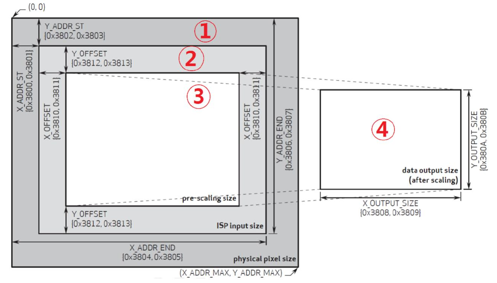

   ​	OV5640 使用 0x3800 ~ 0x3814 寄存器来设置图像窗口,上图显示了寄存器与窗口尺寸定义的关系。物理像素尺寸是整个图像传感器拥有的总的像素矩阵尺寸。ISP 输入尺寸是从像素矩阵中截取的需要读取的像素矩阵部分,一般来讲,ISP 输入尺寸越大,能够达到的最大帧率也就越低。数据输出尺寸是最终从 OV5640 输出的图像尺寸,其大小是在 ISP 输入尺寸的基础上再次经过平移(pre scaling size)和缩放(after scaling)得到的。

2.  ISP 输入窗口设置( ISP input size)

   ​	ISP 输入窗口设置,简称开窗,该设置允许用户设置整个传感器区域( physical pixel
   size )的感兴趣部分,也就是在传感器里面开窗( X_ADDR_ST、Y_ADDR_ST、X_ADDR_END 和 Y_ADDR_END),开窗范围从 0*0~2591*1943 都可以设置,该窗口所设置的范围,将输入 ISP 进行处理。在左侧最大的一圈(标记为 1 )是整个图像传感器的物理像素矩阵,大小为2592*1944;而次外围(标记为 2 )则是通过开窗的方式,从整个物理像素矩阵中截取出的一块图像像素,整个截取的图像范围是可以通过(0x3800~0x3807 寄存器设置的)。下表为0x3800~0x3807 寄存器的功能介绍。

   | 寄存器地址 | 名称      | 默认值 | 功能描述                            |
   | ---------- | --------- | ------ | ----------------------------------- |
   | 0x3800     | TIMING HS | 0x00   | bit[3:0]: X 方向开始位置地址高 4 位 |
   | 0x3801     | TIMING HS | 0x00   | bit[7:0]: X 方向开始位置地址低 8 位 |
   | 0x3802     | TIMING VS | 0x00   | bit[2:0]: Y 方向开始位置地址高 3 位 |
   | 0x3803     | TIMING VS | 0x00   | bit[7:0]: Y 方向开始位置地址低 8 位 |
   | 0x3804     | TIMING HW | 0x0A   | bit[3:0]: X 方向结束位置地址高 4 位 |
   | 0x3805     | TIMING HW | 0x3F   | bit[7:0]: X 方向结束位置地址低 8 位 |
   | 0x3806     | TIMING VH | 0x07   | bit[2:0]: Y 方向结束位置地址高 3 位 |
   | 0x3807     | TIMING HH | 0x9F   | bit[7:0]: Y 方向结束位置地址低 8 位 |

3. 预缩放窗口设置( pre-scaling size)

   ​	该设置允许用户在 ISP 输入窗口的基础上,再次设置将要用于缩放的窗口大小。该设置通过在 ISP 输入窗口内将矩阵的起始位置较 ISP 输入窗口的起始位置进行 (X_OFFSET)
   和 Y(Y_OFFSET)方向的平移。这两个偏移量是通过 0X3810~0X3813 等 4 个寄存器进行设置。至于平移的目的,一种可能就是在镜头机械位置等已经固定的情况下,针对特定应用调整采集到的图像输出的中心位置。注意,该设置仅仅调整的是有效输出区间的左上角的起始位置,没有定义区间的结束位置。

   下表为 0X3810~0X3813 寄存器的功能说明。

   | 寄存器地址 | 名称           | 默认值 | 功能描述                                                     |
   | ---------- | -------------- | ------ | ------------------------------------------------------------ |
   | 0x3810     | TIMING HOFFSET | 0x00   | bit[3:0]: 预缩放窗口 X 方向起始位置相较于 ISP 输入窗口 X 方向的偏移量的高 4 位 |
   | 0x3811     | TIMING HOFFSET | 0x10   | bit[7:0]: 预缩放窗口 X 方向起始位置相较于 ISP 输入窗口 X 方向的偏移量的低 8 位 |
   | 0x3812     | TIMING VOFFSET | 0x00   | bit[2:0]: 预缩放窗口 Y 方向起始位置相较于 ISP 输入窗口 Y 方向的偏移量的高 3 位 |
   | 0x3813     | TIMING VOFFSET | 0x04   | bit[7:0]: 预缩放窗口 Y 方向起始位置相较于 ISP 输入窗口 Y 方向的偏移量的低 8 位 |

   注意,这里的偏移量的大小值是基于 ISP 输入窗口的起始地址的增量,例如,假设 ISP 输入窗口的 X 方向起始位置为 0x0F1、而 X 方向的偏移量值为 0x005,那么最终输出图像的
   X 方向的起始地址就是 0x0F6。Y 方向也是相同的计算方法。

4. 输出大小窗口设置( data output size)

   ​	该窗口是以预缩放窗口为原始大小,经过内部 DSP 进行缩放处理后,输出给外部的图像窗口大小。它控制最终的图像输出尺寸( X_OUTPUT_SIZE/Y_OUTPUT_SIZE)。例如当希望将 OV5640 的图像通过 800*480 的显示屏显示时,就应该设置图像的输出大小窗口尺寸为800*480。输出窗口尺寸大小是通过 0X3808~0X380B 等 4 个寄存器进行设置。

   下表为 0X3808~0X380B 寄存器的功能说明

   | 寄存器地址 | 名称         | 默认值 | 功能描述                                   |
   | ---------- | ------------ | ------ | ------------------------------------------ |
   | 0x3808     | TIMING DVPHO | 0x00   | bit[3:0]: 输出图像 X 方向尺寸大小的高 4 位 |
   | 0x3809     | TIMING DVPHO | 0x10   | bit[7:0]: 输出图像 X 方向尺寸大小的低 8 位 |
   | 0x380A     | TIMING DVPVO | 0x00   | bit[2:0]: 输出图像 Y 方向尺寸大小的高 3 位 |
   | 0x380B     | TIMING DVPVO | 0x04   | bit[7:0]: 输出图像 Y 方向尺寸大小的低 8 位 |

   注意:当输出大小窗口与预缩放窗口比例不一致时,图像将进行缩放处理(会变形),仅当两者比例一致时,输出比例才是 1:1(正常)。

5. OV5640 输出图像时序

   ​	在图像显示领域,会将一些特定的分辨率命一个名词,下表为常见的分辨率定义和其对应的实际像素矩阵大小:

   | 定义  | 分辨率    | 定义  | 分辨率   |
   | ----- | --------- | ----- | -------- |
   | QSXGA | 2592*1944 | XGA   | 1024*768 |
   | QXGA  | 2048*1536 | SVGA  | 800*600  |
   | UXGA  | 1600*1200 | VGA   | 640*480  |
   | SXGA  | 1280*1024 | QVGA  | 320*240  |
   | WXGA+ | 1440*900  | QQVGA | 160*120  |
   | WXGA  | 1280*800  |       |          |

   **行时序**

   ​	下图为 OV5640 在 DVP 接口模式下输出一行图像数据的时序图:

   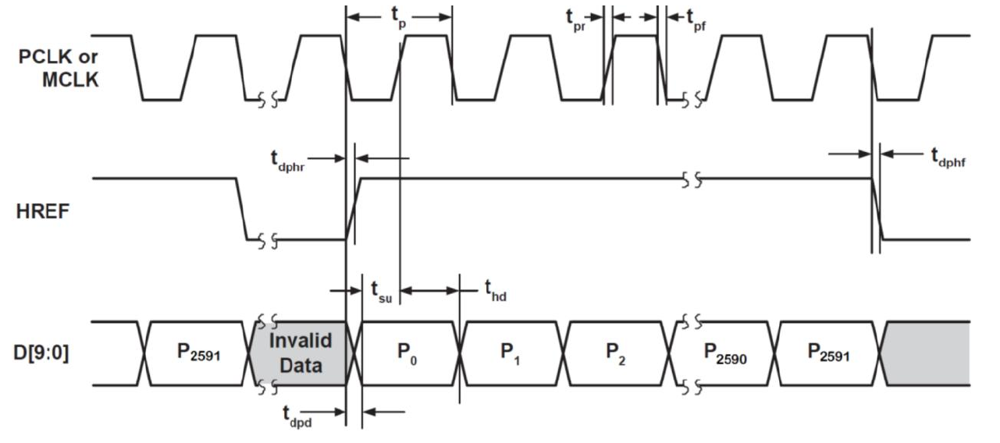

   ****

   下图为 OV5640 在 DVP 接口模式下输出一帧图像(QSXGA)数据的时序图:

   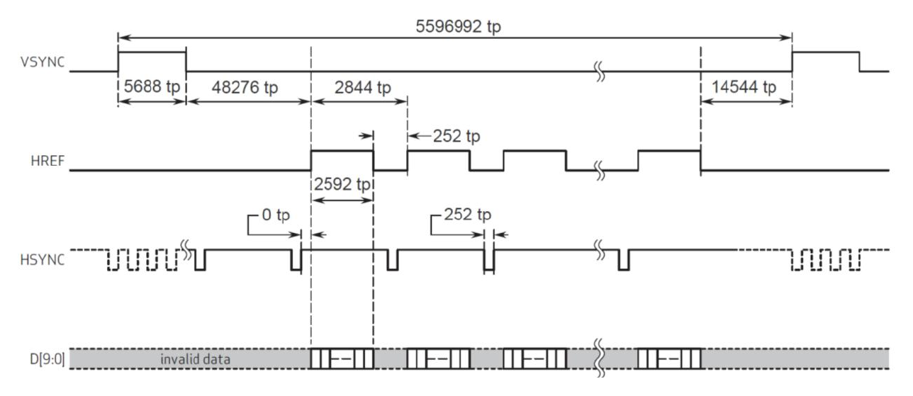

   **总结**

   1. 所有信号(HREF、VSYNC、DATA)都是在 PCLK 的下降沿变化,应用处理器应该在 PCLK的上升沿取用数据。

   2. VSYNC 作为帧同步信号,默认是高电平有效,也就是说,每当新一帧图像开始输出之前,VSYNC 都会呈现一段时间的高电平。而在正常输出图像数据期间,VSYNC 信号保持低电平。在 VSYNC 变为低电平后的第一个 HREF 高电平期间输出的数据就是新一帧图像的第一行数据。

   3. HREF 作为行数据有效信号,在其为高电平时,DATA 数据线上每个时钟周期输出一个新的数据。

      

6. OV5640 输出图像格式

   ​	对于 OV5640 的图像输出数据格式,在不同的应用领域有所不同。在嵌入式系统如单片机、ARM 处理器系统中,一般常用 2 种输出方式: RGB565 和 JPEG。在图像处理系统中,一般常用 RGB565 模式和 YUV422 格式。而在图像采集系统中,为了充分保留图像传感器采集到的原始图像信息,会采用 RAW 格式输出。

   ​	当输出 RGB565、YUV422、RAW 格式数据的时候,时序完全就是上面两幅图介绍的关系。而当输出数据是 JPEG 数据的时候,同样也是这种方式输出(所以数据读取方法一模一样),不过 PCLK 数目大大减少了,输出的数据是压缩后的 JPEG 数据,输出的 JPEG 数据以: 0XFF,0XD8 开头,以 0XFF,0XD9 结尾,且在 0XFF,0XD8 之前,或者 0XFF,0XD9 之后,会有不定数量的其他数据存在(一般是 0),这些数据我们直接忽略即可,将得到的0XFF,0XD8~0XFF,0XD9 之间的数据,保存为.jpg/.jpeg 文件,就可以直接在电脑上打开看到图像了。

### 1.6 OV5640 典型工作模式配置

1. 基本初始化配置

   ​	基本初始化配置表以 800*480@30FPS 的 RGB565 输出模式为例。

2. 修改信号极性

   ​	为得到正确的图像,OV5640 传感器的视频信号极性与基带芯片或 ISP 必须设置成一致。例如,默认状态下, OV5640 的 VSYNC 是低电平有效,即 VSYNC 信号在输出图像时为低电平。而我们常见的图像捕获系统中,往往以 VSYNC 信号为高电平代表图像数据有效,此时就需要设置 SYNC 信号的极性为高电平有效。OV5640 可以通过设置地址为 0x4740 号寄存器的值来设置信号的极性,具体设置方法如下表所示:

   | 信号名称 | 寄存器中数据位 | 功能描述                                                     |
   | -------- | -------------- | ------------------------------------------------------------ |
   | VSYNC    | 0x4740.bit0    | 1 – Vsync 为高时输出数据有效<br />0 – Vsync 为低时输出数据有效 |
   | HREF     | 0x4740.bit1    | 0 – Href 为高时输出数据有效<br/>1 – Href 为低时输出数据有效  |
   | PCLK     | 0x4740.bit5    | 1 – 数据在下降沿输出<br/>0 – 数据在上升沿输出                |

3. 修改帧率

   ​	OV5640 的图像输出帧率可以通过修改地址为 **0x3035、0x3036、0x3037** 的寄存器的值来修改,该寄存器实际上是设置了 OV5640 片上 PLL 的各种分频和倍频系数,例如在典型配置模式下,当输入时钟 XCLK 的信号频率为 24MHz 时, 设置 0x3035 寄存器的值为 0x21 可设置输出帧率为 30fps,设为 0x41 可设置输出帧率为 15fps、设为 0x81 可设置输出帧率为 7.5fps。

4. 图像镜像翻转

   ​	因为 OV5640 是一款 BSI 图像传感器, 成像光线是从芯片背面射入的,所以原始生成的图像看起来是左右相反的,故此需要对图像做镜像处理使其显示正常。设置镜像和翻转功能是通过设置寄存器 **0x3820** 和 **0x3821** 的值实现的。上电时,0x3820 的值默认为 0x40,0x3821的值默认为 0x00。0x3820 寄存器的 bit2 和 bit1 分别设置 ISP 和传感器的翻转,0x3821 寄存器的 bit2 和 bit1 分别设置 ISP 和传感器的镜像。

5. 调整图像尺寸

   ​	前面提到,设置输出图像尺寸可以通过设置 ISP 在传感器上的开窗,预缩放偏移和输出图像大小窗口。最常用的是设置输出图像大小窗口设置,地址为 0x3808 和 0x3809 的寄存器设置输出图像的高度,地址为 0x380a 和 0x380b 的寄存器设置输出图像的宽度。例如,需要设置输出图像大小为 800*480 分辨率,则设置输出图像高度寄存器的值为 0x0320(800d),设置输出图像宽度寄存器的值为 0x01e0(480d)。即设置:

   ```
   0x3808 = 0x03; // DVPHO 800
   0x3809 = 0x20; // DVPHO
   0x380a = 0x01; // DVPVO 480
   0x380b = 0xe0; // DVPVO
   ```

6. 调整图像输出模式

   ​	OV5640 输出图像制式支持多种制式,如 RGB、YUV、RAW。而 RGB 制式又包括 RGB888、RGB565、RGB555、RGB444 模式等,YUV 制式包括 YUV444、YUV422、YUV420 模式等,而每个模式下,又根据输出像素的各个字节代表的不同意义,又分为多种模式,例如对于 RGB565 模式,连续的两个字节代表一个像素的颜色值,在代表一个像素点的 2 个字节数据中,哪几位代表红色分量,哪几位代表绿色分量,哪几位代表蓝色分量,也是通过寄存器可以设置的。具体模式设置是通过 0x4300 这个寄存器设置的。

   ​	0x4300 寄存器共 8 位,其中 bit[7:4]设置图像输出模式,bit[3:0]设置每个模式下输出像素内容的顺序。下表为 bit[7:4]的值和对应的输出模式的关系。

   表:调整图像输出格式寄存器

   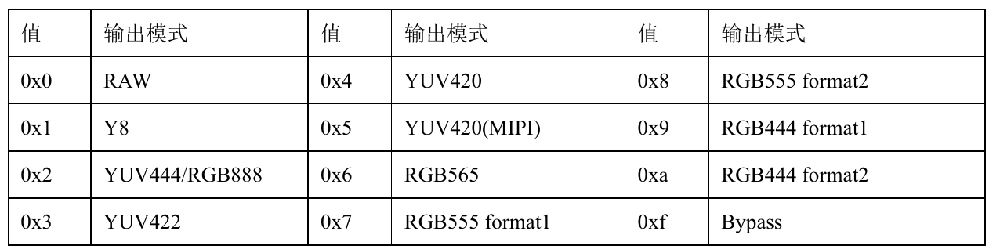

   ​	当设置了图像输出模式后,可以通过设置该寄存器的 bit[3:0]来设置输出图像的顺序。例如,对于 RGB565 模式(bit[7:4]=0x6),设置 bit[3:0]为不同的值则可以实现不同的输出序列,如下表所示:

   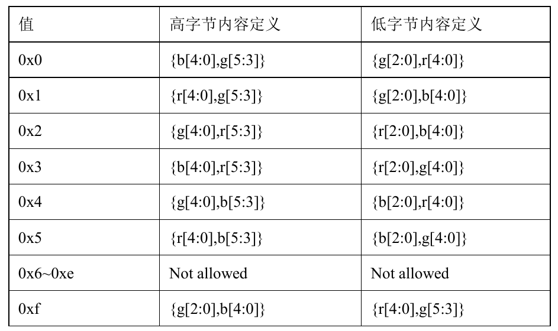

   ​	一般是使用 RGB 或 BGR 序列,即设置寄存器的 bit[3:0]的值为 0x0 或 0x1。

   ​	下表为 YUV422 模式(bit[7:4]=0x3)时 bit[3:0]的值与对应的输出序列的关系:

   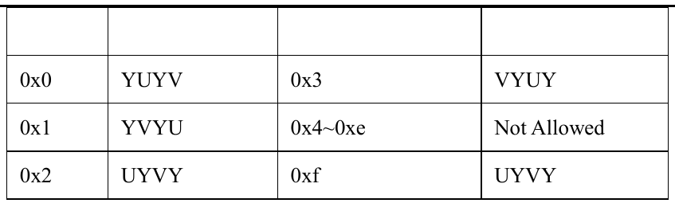

7. 彩条测试模式

   ​	通过设置地址为 0x503d 寄存器中相应位的值,可以设置 OV5640 输出的图像内容是传感器采集到的图像还是测试信号发生器模块产生的测试信号。

   ​	0x503d 寄存器的最高位 bit7 为测试信号发生器的开关控制位,设置为 1 即可开启测试信号发生器。 bit[1:0]为测试信号类型选择寄存器不同的值可以选择不同的测试模式,如彩条(Color Bar)、棋盘格(Color square)。


## 2. 程序设计

### 2.1 整体说明

​	OV5640 在正常工作之前必须通过配置寄存器进行初始化,而配置寄存器的 SCCB 协议和 I2C 协议在写操作时几乎一样,所以我们需要一个 I2C 驱动模块。为了使 OV5640 在期望的模式下运行并且提高图像显示效果,需要配置较多的寄存器,这么多寄存器的地址与参数需要单独放在一个模块,因此还需要一个寄存配置信息的 I2C 配置模块。

ov5640 整体框图如下

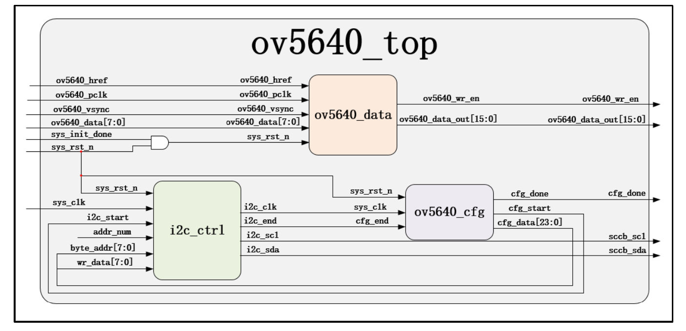

表：OV5640 各模块功能介绍

| 模块名称    | 功能描述              |
| :---------- | --------------------- |
| ov5640_top  | OV5640 顶层模块       |
| i2c_ctrl    | i2c 驱动模块          |
| ov5640_cfg  | OV5640 寄存器配置模块 |
| ov5640_data | OV5640 图像采集模块   |

​	由上述图表可知,第一部分的 OV5640 相关模块包含 4 个子模块,首先是 ov5640_top模块,这一模块作为 ov5640 部分的顶层模块,内部实例化 3 个子功能模块,连接各子模块对应信号,外部对摄像头进行相关配置并接收摄像头采集的数据信息;ov5640_cfg 模块,是寄存器配置模块,内部包含对 ov5640 摄像头的配置信息;i2c_ctrl 模块,i2c 协议与SCCB 协 议 几 乎 无 差 别 , 使 用 i2c 协 议 代 替 SCCB 接 口 协 议 向 ov5640 摄 像 头 写 入ov5640_cfg 模块内部包含的寄存器配置信息;ov5640_data 模块,是 ov5640 摄像头的图像采集模块,将摄像头传入的图像数据处理后写入 DDR3 SDRAM。

### 2.2 图像采集模块

**模块框图**

​	图像采集模块的主要功能是接收并拼接 OV5640 摄像头传入的图像数据，具体见下图和表

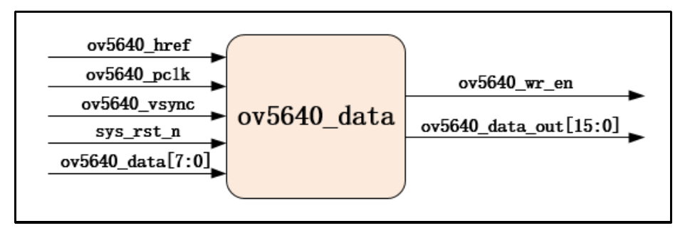

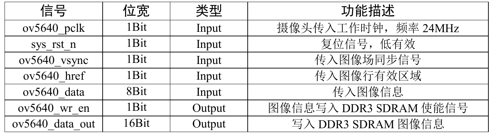

**第一部分:输入信号说明**

​	模块输入信号有 5 路,输入时钟信号为 ov5640_pclk,由 ov5640 摄像头自带晶振产生并 传 入 , 频率24MHz , 作为模块工作时钟; 复位信号sys_rst_n , 低电平有效;ov5640_vsync 为摄像头采集图像的场淘宝信号,可类比与 VGA 场同步信号,只在同步阶段为高电平,其他时刻保持低电平;ov5640_href 为行有效图像使能信号,信号只有采集图像行有效显示区域为高电平,其他时刻为低电平;最后的 ov5640_data 为摄像头采集到的图像数据,读者要注意的是,ov5640_data 位宽为 8bit,采集的图像数据分两次传入模块,先传入图像数据高字节,下个时钟周期传入低字节。

**第二部分：帧有效信号**

​	系统上电后,摄像头刚采集的前几帧图像数据不太稳定,根据手册要求要先舍弃前 10 帧图像,之后的图像才能用于显示。为了舍弃前 10 帧图像,我们需要声明几个变量。首先要舍弃前 10 帧图像,需要一个计数器来计数,声明计数器 cnt_pic 对输入图像帧数进行计数;接下来就要考虑以什么为标志进行计数,这时我们想到每帧图像的传入,帧同步信号必不可少,那么声明帧同步信号寄存信号 ov5640_vsync_dly,此信号延后帧同步信号一个时钟周期,利用两信号产生帧同步信号下降沿 pic_flag,作为帧计数器cnt_pic 的计数标志信号,该信号每拉高一次计数器自加 1;声明帧有效信号 pic_valid,当计数器计数到第 10 帧,pic_flag 为高电平,将帧有效信号拉高并始终保持高电平。

**第三部分:图像数据拼接相关信号**

​	前面说到,像素点图像信息并不是在一个时钟周期传入,而是在第一个时钟周期传入高 8 位,下一个时钟周期传入低 8 位,所以要正确显示图像就需要对传入图像数据进行拼接。实现数据拼接就需要声明若干变量。

​	我们的想法是需要先声明一个寄存器对图像数据的高字节进行数据缓存,待低字节数据传入时,将图像数据进行拼接。首先声明寄存器 pic_data_reg 对高字节数据进行缓存;声明标志信号 data_flag 控制数据缓存与拼接,在 ov7725_href 信号有效时,标志着输入图像数据有,data_flag 不断取反,当其为低电平时对高字节数据进行缓存,当其为高电平时对数据进行拼接。将拼接后的数据赋值给 data_out_reg。

**第四部分:数据输出信号波形图**

​	拼接后的数据做一下缓存输出写入做回数据缓存的 DDR3 SDRAM,有数据同时传出的还有同步的使能信号。

### 2.3 寄存器配置模块

​	要想 OV5640 摄像头正常工作,需要先对摄像头进行寄存器配置,即向摄像头寄存器
写入对应指令。

**模块框图**  

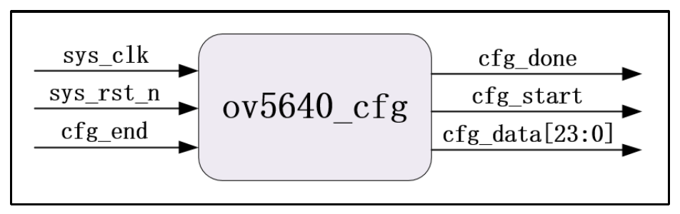

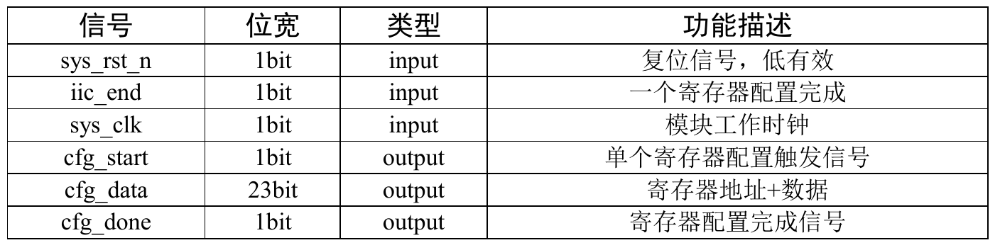

**模块功能**

- 保存通过I²C接口向OV5640摄像头写入的251个预定义的寄存器配置值，并依次输出
- 控制配置流程：等待上电稳定 → 逐个寄存器配置 → 完成标志

### 2.4 I2C总线控制模块

​	I2C 总线控制模块的主要功能是按照 I2C 协议对 OV5640 配置寄存器执行数据读写操作。

**模块框图**  

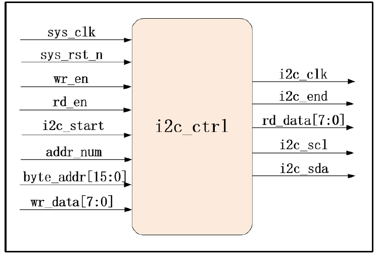

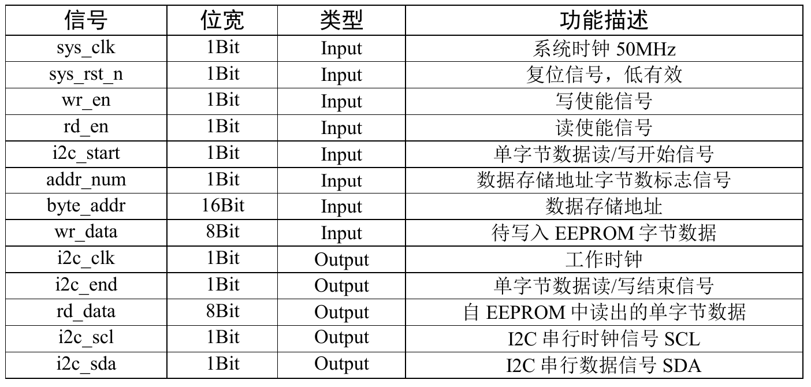

​	由图表可知,I2C 驱动模块包括 13 路输入输出信号,其中输入信号 8 路、输出信号 5 路。输入信号中,sys_clk、sys_rst_n 是必不可少的系统时钟和复位信号;wr_en、rd_en 为读写使能信号,由数据收发模块生成并传入,高电平有效;i2c_start 信号为单字节数据读/写开始信号;与 i2c_start 信号同时传入的还有数据存储地址 byte_addr 和待写入字节数据wr_data;当写使能 wr_en 和 i2c_start 信号同时有效,模块执行单字节数据写操作,按照数据存储地址 byte_addr,向从机对应地址写入数据 wr_data;当读使能信号 rd_en 和i2c_start 信号同时有效,模块执行单字节数据读操作,按照数据存储地址 byte_addr 读取从机对应地址中的数据;前文中我们提到, I2C 设备存储地址有单字节和 2 字节两种,为了应对这一情况,我们向模块输入 addr_num 信号,当信号为低电平时,表示 I2C 设备存储地址为单字节,在进行数据读写操作时只写入数据存储地址 byte_addr 的低 8 位;当信号为高电平时,表示 I2C 设备存储地址为 2 字节,在进行数据读写操作时要写入数据存储地址 byte_addr 的全部 16 位。

​	输出信号中,i2c_clk 是本模块的工作时钟,由系统时钟 sys_clk 分频而来,它的时钟频率为串行时钟 i2c_scl 频率的 4 倍,时钟信号 i2c_clk 要传入数据收发模块作为模块的工作时钟 ; 输出给数据收发模块的单字节数据读 / 写结束信号i2c_end,高电平有效,表示一次单字节数据读/写操作完成;rd_data 信号表示自从机读出的单字节单字节数据,输出至数据收发模块;i2c_scl、i2c_sda 分别是串行时钟信号和串行数据信号,由模块产生传入从机对应引脚。

 I2C 读/写操作状态转移图如下。

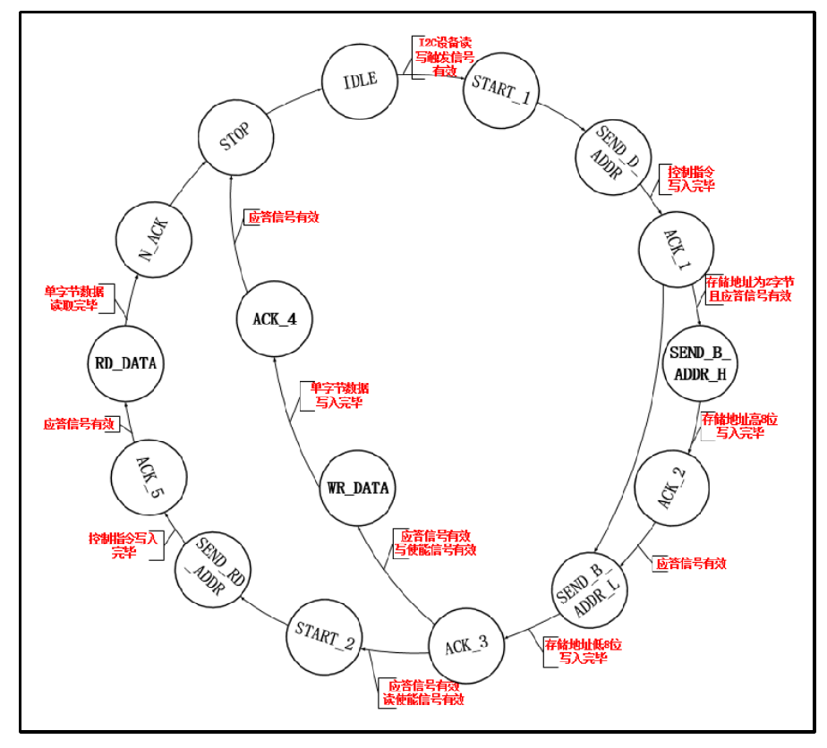

### 2.5 顶层模块

​	在顶层模块内部实例化个子功能模块,外部进行工程输入输出信号的连接，只需连接对应端口即可。


之前，我通过努力，顺利完成了 VGA 驱动设计，还有基于 ROM 的 VGA 图像显示任务，能把静态图像准确地显示在屏幕上了。紧接着，在上一个工程的基础上，经过研究和一些修改，让显示的图片有了弹跳特效，就像以前电脑屏保里图片碰到屏幕边框会反弹一样。

虽然VGA显示具有成本低、结构简单、应用灵活等优点，但缺点是VGA使用的模拟信号极易受到外界干扰源的影响，产生信号畸变，而且VGA接口体积较大，不利于便携设备的使用。为了解决VGA接口的弊端，DVI、HDMI接口应运而生。接下来开始学习用 FPGA 实现 HDMI 驱动。众所周知，HDMI 是现在主流的高清多媒体接口，它能传输更复杂、更清晰的图像和视频数据，在各种高清显示设备上用得很多。

## 1.实验目标

实验目标：编写HDMI驱动，使用FPGA开发板驱动HDMI显示器显示十色等宽彩条， HDMI显示模式为640*480@60。

在实验过程中要求掌握以下要点：

1. 深入了解 HDMI 标准规范，熟悉其传输的信号种类，包括视频、音频以及控制信号等，尤其要重点掌握本次实验涉及的 640*480@60 显示模式下各信号的时序要求，这是实现稳定显示的基础。
2. 研究 HDMI 数据传输格式，明确如何将十色等宽彩条对应的像素数据按照协议要求进行打包、传输，确保显示器能正确解析。

## 2.理论知识

### 2.1 HDMI简介

VGA接口体积较大，不利于便携设备的集成；且传输的模拟信号易受外界干扰，产生信号畸变。为了解决VGA接口的诸多问题，视频接口开始了一次革新。

VGA接口之后，首先推出的的是DVI接口，DVI是基于TMDS(Transition Minimized Differential Signaling，最小化传输差分信号)技术来传输数字信号。TMDS运用先进的编码算法把8bit数据(R、G、B中的每路基色信号)通过最小转换编码为10bit数据(包含 行场同步信息、时钟信息、数据DE、纠错等)，经过直流均衡后，采用差分信号传输数据，它和LVDS、TTL相比有较好的电磁兼容性能，可以用低成本的专用电缆实现长距离、高质量的数字信号传输。数字视频接口（DVI）是一种国际开放的接口标准，在PC、DVD、高清晰电视（HDTV）、高清晰投影仪等设备上有广泛的应用。

DVI接口分为3大类：DVI-Analog（DVI-A）接口（12+5）只传输模拟信号，实质就是 VGA模拟传输接口规格；DVI-Digital（DVI-D）接口（18+1和24+1）是纯数字的接口，只能传输数字信号，不兼容模拟信号；DVI- Integrated（DVI-I）接口（18+5和24+5）是兼容数字和模拟接口的。

DVI 接口虽然是一种全数字化的传输技术，但是在开发之初，其最初目标就是要实现高清晰、无损压缩的数字信号传输。由于没有考虑到 IT 产品和 AV 产品融合的趋势，DVI 标准过分偏重于对计算机显示设备的支持而忽略了对数字平板电视等 AV 设备的支持。DVI 接口虽然成功的实现了无损高清传输这一目标，但是过于专一的定位也在相当程度上造成了整体性能的落后，暴露出诸多问题。

DVI接口设计之初考虑的对象是 PC，对于平板电视的兼容能力一般；只支持计算机领域的 RGB 数字信号，而对数字化的色差信号无法支持；只支持 8bit 的 RGB 信号传输，不能让广色域的显示终端发挥出最佳性能；出于兼容性考虑，预留了不少引脚以支持模拟设备，造成接口体积较大；只能传输图像信号，对于数字音频信号的支持完全没有考虑。

由于以上种种缺陷，DVI 接口已经不能更好的满足整个行业的发展需要。也正是基于这些原因，促使了 HDMI 标准的诞生。

HDMI 全称“High Definition Multimedia Interface 高清多媒体接口”。2002 年 4 月，来自电子电器行业的 7 家公司——日立、松下、飞利浦、Silicon Image、索尼、汤姆逊、东芝共同组建了 HDMI 高清多媒体接口接口组织HDMI Founders（HDMI 论坛），开始着手制定一种符合高清时代标准的全新数字化视频/音频接口技术。经过半年多时间的准备工作，HDMI founders 在 2002 年12 月 9 日正式发布了 HDMI 1.0 版标准，标志着 HDMI 技术正式进入历史舞台。

HDMI 标准的制定，并没有抛弃 DVI 标准中相对成熟且较易实现的部分技术标准，整个传输原理依然是基于TMDS 编码技术。针对DVI的诸多问题，HDMI做了大幅改进。HDMI接口体积更小，各种设备都能轻松安装可用于机顶盒 、DVD播放机 、个人计算机 、电视、游戏主机、综合扩大机、数字音响与电视机 等设备；抗干扰能力更强，能实现最长 20 米的无增益传输；针对大尺寸数字平板电视分辨率进行优化，兼容性好；拥有强大的版权保护机制（HDCP），有效防止盗版现象；支持 24bit 色深处理，（RGB、YCbCr4-4-4、YCbCr4-2-2）；一根线缆实现数字音频、视频信号同步传输，有效降低使用成本和繁杂程度。

时代在发展，社会在进步，HDMI发展至今也推出了若干版本，性能更加出色，兼容性不断提高。HDMI 正在成为高清时代普及率最高、用途最广泛的数字接口。在现在任何一台平板电视上，HDMI 接口都成了标准化的配置。

### 2.2 HDMI接口及引脚定义

HDMI接口因为接口体积下、抗干扰能力强、兼容性好等优点，已逐步取代VGA和DVI接口，特别是在一些便携设备上，HDMI 接口都成了标准化的配置。HDMI接口如下图所示


HDMI规格书中规定了HDMI的4种接口类型，但其中HDMI B Type接口类型未在市场中出现过，市面上流通最广的是HDMI A Type、HDMI C Type和HDMI D Type接口类型。

HDMI A Type接口，应用于HDMI1.0版本，总共有19pin，规格为4.45mm×13.9mm，为最常见的HDMI接头规格；HDMI C Type接口，俗称mini-HDMI，应用于HDMI1.3版本，总共有19pin，可以说是缩小版的HDMI A type，规格为2.42mm×10.42mm，但脚位定义有所改变。主要是用在便携式设备上，例如DV、数字相机、便携式多媒体播放机等。由于大小所限，一些显卡会使用mini-HDMI，用家须使用转接头转成标准大小的Type A再连接显示器；HDMI D Type接口，应用于HDMI1.4版本，总共有19pin，规格为2.8mm×6.4mm，但脚位定义有所改变。新的Micro HDMI接口将比现在19针MINI HDMI版接口小50%左右，可为相机、手机等便携设备带来最高1080p的分辨率支持及最快5GB的传输速度。三种接口如图所示。


HDMI接口之间使用HDMI信号线连接，不同类型的HDMI接口之间也可以使用连接线进行转接。HDMI连接线如图 所示。


虽然已经见识过HDMI接口的外观，但对接口各引脚功能并没有进一步的认识，下面，我们以HDMI A Type接口为例，结合HDMI接口引脚图和各引脚定义表格，对HDMI接口各引脚做一下简单介绍，具体见图及表格。


| 引脚 | 定义                          | 引脚 | 定义                         |
| ---- | ----------------------------- | ---- | ---------------------------- |
| 1    | 数据2+ (TMDS Data2+)          | 11   | 时钟屏蔽 (TMDS Clock Shield) |
| 2    | 数据2屏蔽 (TMDS Data2 Shield) | 12   | 时钟- (TMDS Clock–)          |
| 3    | 数据2- ( TMDS Data2-)         | 13   | CEC                          |
| 4    | 数据1+ (TMDS Data1+)          | 14   | 保留                         |
| 5    | 数据1屏蔽 (TMDS Data1 Shield) | 15   | DDC时钟线(SCL)               |
| 6    | 数据1- ( TMDS Data1-)         | 16   | DDC数据线(SDA)               |
| 7    | 数据0+ (TMDS Data0+)          | 17   | DDC/CEC地 (DDC/CEC GND)      |
| 8    | 数据0屏蔽 (TMDS Data0 Shield) | 18   | +5V电源 (Power)              |
| 9    | 数据0- ( TMDS Data0-)         | 19   | 热插拔检测 (Hot Plug Detect) |
| 10   | 时钟+ (TMDS Clock+)           |      |                              |

由图表可知，HDMI接口共有19个引脚，分上下两排，奇数在上，偶数在下，穿插排布。根据其功能，可以将引脚分为4类。

TMDS通道：引脚1-引脚12。负责发送音频、视频及各种辅助数据；遵循DVI 1.0规格的信号编码方式；视频像素带宽从25 MHz到340 MHz（Type A, HDMI 1.3）或至680MHz (Type B)。带宽低于25MHz的视频信号如NTSC 480i 将以倍频方式输出；每个像素的容许数据量从24位至48位。支持每秒120张画面1080p分辨率画面发送以及WQSXGA分辨率；支持RGB 、YCbCr 4:4:4（8-16 bits per component）、YCbCr 4:2:2（12 bits per component）、 YCbCr 4:2:0（HDMI 2.0）等多种像素编码方式；音频采样率支持32kHz、44.1kHz、 48kHz、 88.2kHz、96kHz、176.4kHz、192kHz、1536kHz（HDMI 2.0）；音频声道数量最大8声道。HDMI 2.0支持32声道。音频流规格为IEC61937兼容流，包括高流量无损信号如Dolby TrueHD、DTS -HD Master Audio。

DDC通道：引脚15、16、17。DDC全文为Display Data Channel，译为“显示数据通道”；发送端与接收端可利用DDC沟道得知彼此的发送与接收能力，但HDMI仅需单向获知接收端（显示器）的能力；DDC通道使用100kHz时钟频率的I²C信号，发送数据结构为VESA Enhanced EDID（V1.3）。

CEC通道：引脚13、17。CEC全文为Consumer Electronics Control，CEC通道为必须预留线路，但可以不必实现，作用是用来发送工业规格的AV Link协议信号，以便支持单一遥控器操作多台AV机器，为单芯线双向串列总线。

其他通道：引脚14位保留引脚，无连接；引脚18为+5V电源；引脚19位热插拔检测引脚。

注：另外两类型的HDMI接口与HDMI A Type接口的各引脚名称、功能相同，只是引脚线序不同。

### 2.3 HDMI显示原理

HDMI 系统架构由信源端和接收端组成。某个设备可能有一个或多个 HDMI 输入，一个或多个 HDMI 输出。这些设备上，每个 HDMI 输入都应该遵循 HDMI 接收端规则， 每个 HDMI输出都应该遵循 HDMI 信源端规则。

如图所示， HDMI 线缆和连接器提供四个差分线对，组成TMDS数据和时钟通道，这些通道用于传递视频，音频和辅助数据；另外， HDMI 提供一个 VESA DDC 通道，DDC是用于配置和在一个单独的信源端和一个单独的接收端交换状态；可选择的 CEC 在用户的各种不同的音视频产品中， 提供高水平的控制功能； 可选择的 HDMI 以太网和音频返回（HEAC），在连接的设备中提供以太网兼容的网络数据和一个和 TMDS 相对方向的音频回返通道；此外还有热插拔检测信号HDP，当显示器等HDMI接口的显示设备通过HDMI接口与HDMI信源端相连或断开连接时，HDMI信源端能够通过HPD引脚检测出这一事件，并做出响应。


在前文中提到过，HDMI采用和DVI 相同的传输原理 — TMDS（Transition Minimized Differential signal），最小化传输差分信号。在此之前我们只是提及这一传输原理，并未做过系统性的讲解，下面我们就来详细说明一下TMDS的相关知识。下面详细说明一下TMDS的相关知识。

HDMI中的TMDS 传输系统分为两个部分：发送端和接收端。 TMDS 发送端收到HDMI 接口传来的表示 RGB 信号的24 位并行数据（TMDS 对每个像素的 RGB 三原色分别按 8bit 编码，即 R信号有 8 位，G 信号有 8 位，B 信号有 8 位），然后对这些数据和时钟信号进行编码和并/串转换，再将表示 3 个 RGB 信号的数据和时钟信号分别分配到独立的传输通道发送出去。接收端接收来自发送端的串行信号，对其进行解码和串/并转换，然后发送到显示器的控制端。与此同时也接收时钟信号，以实现同步。流程框图如图所示。


TMDS通道包括 3 个RGB 数据传输通道和 1 个时钟信号传输通道。每一通道都通过编码算法，将 8 位的视频、音频数据转换成最小化传输、直流平衡的 10 位数据，8 位数据经过编码和直流平衡得到 10 位最小化数据，看似增加了冗余位，对传输链路的带宽要求会更高，但事实上，通过这种算法得到的 10 位数据在更长的同轴电缆中传输的可靠性增强了。最小化传输差分信号是通过异或及异或非等逻辑算法将原始 8位数据转换成 10 位数据，前 8位数据由原始信号经逻辑运算后逻辑得到，第 9 位指示运算的方式，第 10 位用来对应直流平衡。

要实现TMDS通道传输，首先要将传入的8 位的并行数据进行编码、并/串转换，添加第9位编码位，如下图所示。


将 8 位并行数据发送到 TMDS 接收端；将接收到的8位数据并/串转换；随后进行最小化传输处理，加上第 9 位，即编码过程。

添加编码位的数据需要进行直流均衡处理。**直流平衡（DC-balanced）就是指在编码过程中保证信道中直流偏移为零，使信道中传输数据包含的1与0的个数相同。**方法是在添加编码位的 9 位数据的后面加上第 10 位数据，保证10位数据中1与0个数相同。这样，传输的数据趋于直流平衡，使信号对传输线的电磁干扰减少，提高信号传输的可靠性。

直流均衡处理后的10位数据需要进行单端转差分处理。TMDS差分传输技术是一种利用2个引脚间电压差来传送信号的技术。传输数据的数值（“0”或者“1”）由两脚间电压正负极性和大小决定。即采用 2 根线来传输信号，一根线上传输原来的信号，另一根线上传输与原来信号相反的信号。这样接收端就可以通过让一根线上的信号减去另一根线上的信号的方式来屏蔽电磁干扰，从而得到正确的信号。原理图如下图所示。


经过上述处理，我们得到了可以进行TMDS通道传输的差分信号，使用这种方法对24位图像数据（8 位R信号、8 位G 信号、8 位B 信号）和时钟信号进行处理，将4对差分信号通过HDMI接口发到接收设备；接收设备通过解码等一系列操作，实现图像后音频再现。

## 3.硬件资源

本实验采用正点原子达芬奇A735T开发板，主控芯片为Xilinx Artix7系列XC7A35T，封装FGG484，速率等级：-2。晶振为50MHz有源晶振。

达芬奇 FPGA 开发板的资源图如下


显示屏采用一块7寸大小的显示屏，带有HDMI显示接口，使用Type-c接口供电，分辨率最高支持1024*600，刷新率为60Hz。

## 4.实战演练

### 4.1 HDMI与TMDS

HDMI 1.0 版本于 2002 年发布， 最高数据传输速度为 5Gbps；2013年发布的HDMI 2.0标准的理论带宽可达18Gbps； 而2017 年发布的 HDMI 2.1 标准的理论带宽可达 48Gbps。

**HDMI向下兼容DVI**（Digital Visual Interface，数字视频接口），**DVI只能传输视频信号**。

HDMI和DVI接口协议在物理层均使用**TMDS标准**传输音视频数据

**在设计HDMI显示的时候，步骤如下：
1、先设计一个需要分辨率的VGA时序
2、编码
3、并串转化
4、差分输出**

#### 4.1.1 TMDS 编码

在TMDS传输标准中，不论是视频信号、控制信号还是辅助信号，都是以10bit的数据传输，所以需要对这三个信号进行编码，分别采用不同的编码方式。这里只介绍视频编码格式。

1. 编码规则

   TMDS是最小化差分传输的简称，实际上就是一种编码规则，主要是适用于HDMI接口、DVI接口的视频图像编码。**TMDS编码规则是将8比特的像素数据转换成10比特数据，这10比特数据的前8比特是由原始8位像素数据通过异或运算或者同或运算得到，如果前8比特采用同或运算得到，那么第9比特为0，如果前8比特数据是由原始8比特像素数据通过异或运算得到，那么第9比特为1。**

   **第10比特是直流平衡位，当转换后的10比特数据中0比较多，那么比特10位为1。如果转化后的数据中1比较多，那么比特10位为0，达到直流平衡的作用。**

2. TMDS编码过程

   编码规则原理讲解会涉及到一些信号、参数，如下表所示。首先D是需要进行编码的8比特原始像素数据，蓝色通道对应的是蓝色通道的8比特数据，在另外两个颜色通道中，对应的就是另外两个颜色通道的8比特数据。而C0、C1是两个控制信号，在蓝色通道中C0、C1是行、场同步信号。DE是像素有效使能信号。

   | 信号名 | 含义                                  |
   | ------ | ------------------------------------- |
   | D      | D：输入视频像素信号                   |
   | C1 C0  | C1，C0：控制信号                      |
   | DE     | DE：使能信号                          |
   | cnt    | cnt寄存上次编码过程中0的个数减1的个数 |
   | N1{X}  | 输入视频像素信号中1的个数             |
   | N0{X}  | 输入视频像素信号中0的个数             |
   | q_out  | 编码输出信号                          |

   cnt用来存储上一次编码过程中1的个数比0的个数多多少，在编码时会对每个8比特像素数据都进行编码，但在这8比特数据当中，可能第一个8比特数据全是1，第二个8比特数据当中4个1，4个0等等。为了让整个数据流能够达到直流平衡，即0和1的个数差不多，并且减少上冲和下冲。cnt就是用来寄存上一次编码当中1的个数比0的个数多多少。如果在上一次编码的10比特数据当中，如果0的个数太多了，那么在当前编码中将0的个数给它取反，适当增加1的个数。

   N1{X}、N0{X}是指待编码的视频像素数据中1的个数、0的个数，q_out就是最终TMDS编码后的10比特数据，给其他模块进行使用，下面看一下整个 TMDS 的编码过程。

   

   更详细的编码过程可以参考**DVI-1.0手册**。

### 4.2 Vivado 原语 (**Primitives**)

在 Vivado 设计工具中，**原语（Primitives）** 是指 FPGA 芯片中可直接调用的底层硬件单元或基本逻辑模块。这些原语是 Xilinx FPGA 架构的最小功能单元，直接映射到芯片的物理资源。使用原语可以绕过综合工具的自动推断，直接控制硬件实现方式，从而优化关键路径、时序或资源利用率。

#### 4.2.1 **Vivado 原语的核心概念**

1. **底层硬件映射**
   原语直接对应 FPGA 芯片中的物理资源，例如：

   - **逻辑单元**：LUT（查找表）、触发器（Flip-Flop）、进位链（CARRY4）。
   - **专用模块**：块 RAM（BRAM）、DSP Slice、时钟管理单元（MMCM/PLL）。
   - **I/O 单元**：输入 / 输出缓冲器（IBUF、OBUF）、差分缓冲器（IBUFDS、OBUFDS）。
   - **全局资源**：BUFG（全局时钟缓冲器）、BUFH（水平时钟缓冲器）。

2. **直接例化（Instantiation）**
   在 HDL 代码（Verilog/VHDL）中直接调用原语，例如：

   ```
   // 例化一个带有时钟使能和异步复位的D触发器（FDCE）
   FDCE #(
      .INIT(1'b0)    // 初始值
   ) fdce_inst (
      .Q(q),         // 输出
      .C(clk),       // 时钟
      .CE(ce),       // 时钟使能
      .CLR(clr),     // 异步复位
      .D(d)          // 输入
   );
   ```

3. **优化与控制**

   - **性能关键路径**：手动例化原语可避免综合工具推断出非理想结构。
   - **资源复用**：精确控制 DSP 或 BRAM 的使用方式。
   - **特殊功能**：实现差分信号、时钟树管理、片内终端等。

4. **常见的 Vivado 原语类型**

   | **类别**     | **示例原语**                           | **功能**                  |
   | ------------ | -------------------------------------- | ------------------------- |
   | **逻辑单元** | `LUT1`-`LUT6`, `MUXF7`, `MUXF8`        | 实现组合逻辑、多路选择器  |
   | **时序单元** | `FDCE`（异步复位）、`FDRE`（同步复位） | 触发器或寄存器            |
   | **算术单元** | `CARRY4`（超前进位链）                 | 加速加法器、计数器        |
   | **存储单元** | `RAMB36E1`, `FIFO36E1`                 | 块 RAM 或 FIFO            |
   | **DSP 单元** | `DSP48E1`, `DSP48E2`                   | 乘加运算、信号处理        |
   | **时钟管理** | `MMCME2_ADV`, `BUFG`                   | 生成和分配时钟信号        |
   | **I/O 单元** | `IBUF`, `OBUF`, `IOBUF`                | 输入 / 输出缓冲、电平转换 |
   | **高速接口** | `IDDR`, `ODDR`, `ISERDESE2`            | 支持 DDR、高速串行通信    |

5. **何时使用原语？**

   1. **优化关键路径**：当综合工具无法满足时序要求时，手动布局关键逻辑。
   2. **避免推断错误**：例如需要特定类型的 RAM（如双端口 RAM）或 DSP 配置。
   3. **实现特殊功能**：如差分时钟输入、片内终端电阻匹配。
   4. **资源复用**：强制共享 DSP 或 BRAM 资源。

6. **使用原语的注意事项**

   1. **设备依赖性**：不同 FPGA 型号的原语可能不同（如 UltraScale 与 7 系列）。
   2. **代码可移植性**：过度使用原语会降低代码跨平台兼容性。
   3. **文档参考**：必须查阅 Xilinx 的**Library Guide**（如 UG953）或**用户手册**，确认原语端口和参数。

7. **如何查找原语？**

   1. **Vivado Language Templates**
      在 Vivado 中按 `Ctrl+Shift+V`，搜索目标原语（如`RAMB36E1`）的 HDL 模板。
   2. **Xilinx 文档**
      - **UG953**: Vivado Design Suite 7 Series FPGA and Zynq-7000 Library Guide.
      - **UG579**: UltraScale Architecture Libraries Guide.

### 4.3 程序设计

注：本实验选用HDMI 640*480@60显示模式，时钟频率为25MHz；

#### 4.3.1  整体说明

HDMI彩条显示实验工程的整体框图如下


由上图可知，本实验工程包括5个模块，各模块简介，具体见表格

| 模块名称        | 功能描述                                 |
| --------------- | ---------------------------------------- |
| hdmi_colorbar   | 顶层模块                                 |
| clk_gen         | 时钟生成模块，生成25MHz和5×25MHz工作时钟 |
| vga_timing_ctrl | VGA时序控制模块，驱动VGA图像显示         |
| vga_image_gen   | 图像数据生成模块，生成VGA待显示图像      |
| hdmi_ctrl       | HDMI驱动控制模块，生成HDMI待显示图像     |

HDMI的彩条显示是基于VGA彩条显示的基础上的，是在VGA彩条显示工程的基础上修改的得到的。其中改动较大的有两部分：一是时钟生成模块的输出时钟频率和时钟个数做了改动；二是增加了HDMI驱动控制模块hdmi_ctrl。

#### 4.3.2 时钟生成模块

时钟生成模块依然使用调用IP核的生成方式，输出两路时钟信号。由上文可知，本次实验工程中，HDMI显示模式为640*480@60，时钟频率为25MHz，而板卡晶振传入时钟频率为50MHz。时钟生成模块的作用就是将50MHz晶振时钟分频为25MHz的HDMI工作时钟；除此之外，还要生成25MHz时钟的 5 倍频125MHz时钟用来给HDMI控制模块进行并行数据转串行数据。

- **模块框图**

  

- **模块端口功能描述**

  

- **IP核设置**

  PLL IP核设置参考PLL工程，这里不再叙述。

**4.3.3 HDMI驱动控制模块**

HDMI驱动控制模块hdmi_ctrl是HDMI彩条显示的核心模块，功能是将VGA控制模块传入的行场同步信号、图像信息转换为HDMI能读取的差分信号，其内部实例化若干子模块，模块及模块简介如下所示。

- **模块框图**

  

- **模块端口功能描述**

  

- **代码编写**

  HDMI驱动控制模块就是HDMI驱动控制部分的顶层模块，内部实例化**编码模块**和**并行转串行模块**，连接各自对应信号，代码编写较为简单，无需波形图绘制。HDMI驱动控制模块参考代码如下

  ```
  module hdmi_ctrl (
      input           clk_1x      ,
      input           clk_5x      , 
      input           sys_rst_n   ,
      input           hsync       ,
      input           vsync       ,
      input           de          ,
      input   [7:0]   rgb_red     ,
      input   [7:0]   rgb_green   ,
      input   [7:0]   rgb_blue    ,
  
      output          hdmi_clk_p  ,
      output          hdmi_clk_n  ,
      output          hdmi_r_p    ,
      output          hdmi_r_n    ,
      output          hdmi_g_p    ,
      output          hdmi_g_n    ,
      output          hdmi_b_p    ,
      output          hdmi_b_n    
  );
  //parameter define
  
  //wire define
  wire    [9:0]   data_out_r; //编码后的10bit红色信号
  wire    [9:0]   data_out_g; //编码后的10bit绿色信号
  wire    [9:0]   data_out_b; //编码后的10bit蓝色信号
  
  //reg define
  
  //instance define
  encode encode_inst1(
      .sys_clk(clk_1x),
      .sys_rst_n(sys_rst_n),
      .c0(hsync),
      .c1(vsync),
      .c2(de),
      .data_in(rgb_red),
      .data_out(data_out_r)
  );
  encode encode_inst2(
      .sys_clk(clk_1x),
      .sys_rst_n(sys_rst_n),
      .c0(hsync),
      .c1(vsync),
      .c2(de),
      .data_in(rgb_green),
      .data_out(data_out_g)
  );
  encode encode_inst3(
      .sys_clk(clk_1x),
      .sys_rst_n(sys_rst_n),
      .c0(hsync),
      .c1(vsync),
      .c2(de),
      .data_in(rgb_blue),
      .data_out(data_out_b)
  );
  par2ser par2ser_inst1(
      .clk_5x(clk_5x),
      .par_data(data_out_r),
      .ser_data_p(hdmi_r_p),
      .ser_data_n(hdmi_r_n)
  );
  par2ser par2ser_inst2(
      .clk_5x(clk_5x),
      .par_data(data_out_g),
      .ser_data_p(hdmi_g_p),
      .ser_data_n(hdmi_g_n)
  );
  par2ser par2ser_inst3(
      .clk_5x(clk_5x),    
      .par_data(data_out_b),
      .ser_data_p(hdmi_b_p),
      .ser_data_n(hdmi_b_n)
  );
  par2ser par2ser_inst4(
      .clk_5x(clk_5x),    
      .par_data(10'b11111_00000),
      .ser_data_p(hdmi_clk_p),
      .ser_data_n(hdmi_clk_n)
  );
  endmodule
  ```

#### 4.3.3 编码模块

上一小节介绍了HDMI驱动控制模块，实际就是HDMI驱动控制的顶层模块，功能是实现VGA图像信息到HDMI图像信息的转化。实现这一功能的转化，需要对输入的VGA图像信息进行**编码**、**并行串行转换**、**单端信号转差分信号**、**单沿采样转双沿采样**。

而编码模块就是为了完成VGA图像数据8b转10b的编码，关于8b转10b编码的理论知识在前面的理论小节已经做了详细介绍。

- **模块框图**

  

- **模块端口功能描述**

  

- **代码编写**

  代码参考赛灵思官方例程

  ```
  `timescale 1 ps / 1ps
  
  module encode (
    input            sys_clk,    // pixel clock input
    input            sys_rst_n,    // async. reset input (active high)
    input      [7:0] data_in,      // data inputs: expect registered
    input            c0,       // c0 input
    input            c1,       // c1 input
    input            de,       // de input
    output reg [9:0] data_out      // data outputs
  );
  
    ////////////////////////////////////////////////////////////
    // Counting number of 1s and 0s for each incoming pixel
    // component. Pipe line the result.
    // Register Data Input so it matches the pipe lined adder
    // output
    ////////////////////////////////////////////////////////////
    reg [3:0] n1d; //number of 1s in data_in
    reg [7:0] data_in_q;
  
    always @ (posedge sys_clk) begin
      n1d <=#1 data_in[0] + data_in[1] + data_in[2] + data_in[3] + data_in[4] + data_in[5] + data_in[6] + data_in[7];
  
      data_in_q <=#1 data_in;
    end
  
    ///////////////////////////////////////////////////////
    // Stage 1: 8 bit -> 9 bit
    // Refer to DVI 1.0 Specification, page 29, Figure 3-5
    ///////////////////////////////////////////////////////
    wire decision1;
  
    assign decision1 = (n1d > 4'h4) | ((n1d == 4'h4) & (data_in_q[0] == 1'b0));
  /*
    reg [8:0] q_m;
    always @ (posedge sys_clk) begin
      q_m[0] <=#1 data_in_q[0];
      q_m[1] <=#1 (decision1) ? (q_m[0] ^~ data_in_q[1]) : (q_m[0] ^ data_in_q[1]);
      q_m[2] <=#1 (decision1) ? (q_m[1] ^~ data_in_q[2]) : (q_m[1] ^ data_in_q[2]);
      q_m[3] <=#1 (decision1) ? (q_m[2] ^~ data_in_q[3]) : (q_m[2] ^ data_in_q[3]);
      q_m[4] <=#1 (decision1) ? (q_m[3] ^~ data_in_q[4]) : (q_m[3] ^ data_in_q[4]);
      q_m[5] <=#1 (decision1) ? (q_m[4] ^~ data_in_q[5]) : (q_m[4] ^ data_in_q[5]);
      q_m[6] <=#1 (decision1) ? (q_m[5] ^~ data_in_q[6]) : (q_m[5] ^ data_in_q[6]);
      q_m[7] <=#1 (decision1) ? (q_m[6] ^~ data_in_q[7]) : (q_m[6] ^ data_in_q[7]);
      q_m[8] <=#1 (decision1) ? 1'b0 : 1'b1;
    end
  */
    wire [8:0] q_m;
    assign q_m[0] = data_in_q[0];
    assign q_m[1] = (decision1) ? (q_m[0] ^~ data_in_q[1]) : (q_m[0] ^ data_in_q[1]);
    assign q_m[2] = (decision1) ? (q_m[1] ^~ data_in_q[2]) : (q_m[1] ^ data_in_q[2]);
    assign q_m[3] = (decision1) ? (q_m[2] ^~ data_in_q[3]) : (q_m[2] ^ data_in_q[3]);
    assign q_m[4] = (decision1) ? (q_m[3] ^~ data_in_q[4]) : (q_m[3] ^ data_in_q[4]);
    assign q_m[5] = (decision1) ? (q_m[4] ^~ data_in_q[5]) : (q_m[4] ^ data_in_q[5]);
    assign q_m[6] = (decision1) ? (q_m[5] ^~ data_in_q[6]) : (q_m[5] ^ data_in_q[6]);
    assign q_m[7] = (decision1) ? (q_m[6] ^~ data_in_q[7]) : (q_m[6] ^ data_in_q[7]);
    assign q_m[8] = (decision1) ? 1'b0 : 1'b1;
  
    /////////////////////////////////////////////////////////
    // Stage 2: 9 bit -> 10 bit
    // Refer to DVI 1.0 Specification, page 29, Figure 3-5
    /////////////////////////////////////////////////////////
    reg [3:0] n1q_m, n0q_m; // number of 1s and 0s for q_m
    always @ (posedge sys_clk) begin
      n1q_m  <=#1 q_m[0] + q_m[1] + q_m[2] + q_m[3] + q_m[4] + q_m[5] + q_m[6] + q_m[7];
      n0q_m  <=#1 4'h8 - (q_m[0] + q_m[1] + q_m[2] + q_m[3] + q_m[4] + q_m[5] + q_m[6] + q_m[7]);
    end
  
    parameter CTRLTOKEN0 = 10'b1101010100;
    parameter CTRLTOKEN1 = 10'b0010101011;
    parameter CTRLTOKEN2 = 10'b0101010100;
    parameter CTRLTOKEN3 = 10'b1010101011;
  
    reg [4:0] cnt; //disparity counter, MSB is the sign bit
    wire decision2, decision3;
  
    assign decision2 = (cnt == 5'h0) | (n1q_m == n0q_m);
    /////////////////////////////////////////////////////////////////////////
    // [(cnt > 0) and (N1q_m > N0q_m)] or [(cnt < 0) and (N0q_m > N1q_m)]
    /////////////////////////////////////////////////////////////////////////
    assign decision3 = (~cnt[4] & (n1q_m > n0q_m)) | (cnt[4] & (n0q_m > n1q_m));
  
    ////////////////////////////////////
    // pipe line alignment
    ////////////////////////////////////
    reg       de_q, de_reg;
    reg       c0_q, c1_q;
    reg       c0_reg, c1_reg;
    reg [8:0] q_m_reg;
  
    always @ (posedge sys_clk) begin
      de_q    <=#1 de;
      de_reg  <=#1 de_q;
      
      c0_q    <=#1 c0;
      c0_reg  <=#1 c0_q;
      c1_q    <=#1 c1;
      c1_reg  <=#1 c1_q;
  
      q_m_reg <=#1 q_m;
    end
  
    ///////////////////////////////
    // 10-bit out
    // disparity counter
    ///////////////////////////////
    always @ (posedge sys_clk or posedge sys_rst_n) begin
      if(!sys_rst_n) begin
        data_out <= 10'h0;
        cnt <= 5'h0;
      end else begin
        if (de_reg) begin
          if(decision2) begin
            data_out[9]   <=#1 ~q_m_reg[8]; 
            data_out[8]   <=#1 q_m_reg[8]; 
            data_out[7:0] <=#1 (q_m_reg[8]) ? q_m_reg[7:0] : ~q_m_reg[7:0];
  
            cnt <=#1 (~q_m_reg[8]) ? (cnt + n0q_m - n1q_m) : (cnt + n1q_m - n0q_m);
          end else begin
            if(decision3) begin
              data_out[9]   <=#1 1'b1;
              data_out[8]   <=#1 q_m_reg[8];
              data_out[7:0] <=#1 ~q_m_reg[7:0];
  
              cnt <=#1 cnt + {q_m_reg[8], 1'b0} + (n0q_m - n1q_m);
            end else begin
              data_out[9]   <=#1 1'b0;
              data_out[8]   <=#1 q_m_reg[8];
              data_out[7:0] <=#1 q_m_reg[7:0];
  
              cnt <=#1 cnt - {~q_m_reg[8], 1'b0} + (n1q_m - n0q_m);
            end
          end
        end else begin
          case ({c1_reg, c0_reg})
            2'b00:   data_out <=#1 CTRLTOKEN0;
            2'b01:   data_out <=#1 CTRLTOKEN1;
            2'b10:   data_out <=#1 CTRLTOKEN2;
            default: data_out <=#1 CTRLTOKEN3;
          endcase
  
          cnt <=#1 5'h0;
        end
      end
    end
    
  endmodule
  
  ```

  

#### 4.3.4 并行转串行模块

使用编码模块可解决图像数据的编码问题，而并行转串行模块(par_to_ser.v)的主要功能就是实现并行串行转换、单端信号转差分信号、单沿采样转双沿采样。

在实现此模块的过程中使用到了**Vivado 原语**(**Primitives**)，这一部分可参考上面介绍的理论知识。根据本实验工程的硬件资源，参考ug471手册

本模块使用到了 **ODDR 双数据速率**原语和 **OBUFDS  单端转差分信号**原语。

ODDR  是 XILINX  提供的双数据速率原语，双数据速率原语ODDR  可以用于在逻辑资源中实现 DDR 寄存器，可以把单沿传输的数据转换为双沿传输的数据。

OBUFDS 是 XILINX提供的将单端信号转换为差分信号原语。


原语的例化模板可在Vivado工具栏中找到，如下图所示


- **模块框图**

  

- **模块端口功能描述**

  

- 波形图绘制

  

  第一步：将输入的10bit并行数据par_data拆分为两个位宽5bit的数据信号。拆分规则：将会在时钟上升沿输出的par_data[8]、par_data[6]、par_data[4]、par_data[2]、par_data[0]赋值给变量data_rise[4:0]；将会在时钟下降沿输出的pa r_data[9]、par_data[7]、par_data[5]、par_data[3]、par_data[1]赋值给变量data_fall[4:0]。

  第二步：声明计数器cnt，以clk_5x为计数时钟进行循环计数，计数范围0-4，每个时钟周期自加1。当cnt计数值为最大值4时，将拆分得到的变量data_rise、data_fall分别赋值给data_rise_s、data_fall_s；

  第三步：将data_rise_s[0]、data_fall_s[0]分别写入ODDR 双数据速率原语的D1、D2接口；同时，每个时钟周期将data_rise_s、data_fall_s右移一位。

  经过上述三步操作后，位宽10bit的并行数据par_data转换为两路串行数据传入ODDR 双数据速率原语的D1、D2接口，经过原语处理后，输出以clk_5x为同步时钟的串行双沿采样信号Q。

  同时例化 OBUFDS  单端转差分信号原语，将单端串行信号Q写入OBUFDS  单端转差分信号原语的I接口，输出串行双沿采样差分信号对。

- 代码编写

  ```
  module par2ser (
      input               clk_5x    ,
      input   [9:0]       par_data  ,
  
      output              ser_data_p,
      output              ser_data_n
  );
  //parameter define
  
  //wire define
  wire [4:0]  data_rise = {par_data[8],par_data[6],par_data[4],par_data[2],par_data[0]};
  wire [4:0]  data_fall = {par_data[9],par_data[7],par_data[5],par_data[3],par_data[1]};
  wire        Q;
  //reg define
  reg [4:0] data_rise_s = 0;
  reg [4:0] data_fall_s = 0;
  reg [2:0] cnt         = 0;
  
  //instance define
  
  always @(posedge clk_5x ) begin
      cnt <= (cnt[2] == 1'b1) ? 3'd0 : cnt + 1'b1;
      data_rise_s <= (cnt[2] == 1'b1) ? data_rise : {1'b0,data_rise_s[4:1]};
      data_fall_s <= (cnt[2] == 1'b1) ? data_fall : {1'b0,data_fall_s[4:1]};
  end
  
  ODDR #(
        .DDR_CLK_EDGE("SAME_EDGE"), // "OPPOSITE_EDGE" or "SAME_EDGE" 
        .INIT(1'b0),    // Initial value of Q: 1'b0 or 1'b1
        .SRTYPE("SYNC") // Set/Reset type: "SYNC" or "ASYNC" 
     ) ODDR_inst (
        .Q(Q),   // 1-bit DDR output
        .C(clk_5x),   // 1-bit clock input
        .CE(1'b1), // 1-bit clock enable input
        .D1(data_rise_s[0]), // 1-bit data input (positive edge)
        .D2(data_fall_s[0]), // 1-bit data input (negative edge)
        .R(1'b0),   // 1-bit reset
        .S(1'b0)    // 1-bit set
     );
  
  OBUFDS #(
        .IOSTANDARD("TMDS_33"), // Specify the output I/O standard
        .SLEW("SLOW")           // Specify the output slew rate
     ) OBUFDS_inst (
        .O(ser_data_p),     // Diff_p output (connect directly to top-level port)
        .OB(ser_data_n),   // Diff_n output (connect directly to top-level port)
        .I(Q)      // Buffer input
     );
  
     
  endmodule
  ```

#### 4.3.5 顶层模块

hdmi_colorbar顶层模块主要是对各个子功能模块的实例化，以及对应信号的连接。

- 代码编写

  ```
  module hdmi_colorbar (
      input           sys_clk     ,
      input           sys_rst_n   ,
      
      output          ddc_scl     ,
      output          ddc_sda     ,
      output          hdmi_clk_p  ,
      output          hdmi_clk_n  ,
      output          hdmi_r_p    ,
      output          hdmi_r_n    ,
      output          hdmi_g_p    ,
      output          hdmi_g_n    ,
      output          hdmi_b_p    ,
      output          hdmi_b_n    
  );
      
  
  //wire define
  wire        clk_1x  ;
  wire        clk_5x  ;
  wire        locked  ;
  wire        rst_n   ;
  wire [9:0]  pix_x   ;
  wire [9:0]  pix_y   ;
  wire [23:0] pix_data;
  wire        hsync   ;
  wire        vsync   ;
  wire        de      ;
  wire [23:0] rgb     ;
  
  
  assign rst_n = sys_rst_n & locked;
  assign ddc_scl = 1'b1;
  assign ddc_sda = 1'b1;
  
  //instance define
  clk_gen  clk_gen_inst (
      .sys_clk(sys_clk),
      .sys_rst_n(sys_rst_n),
      .c0_1x(clk_1x),
      .c1_5x(clk_5x),
      .locked(locked)
    );
  vga_image_gen  vga_image_gen_inst (
      .vga_clk(clk_1x),
      .rst_n(rst_n),
      .pix_x(pix_x),
      .pix_y(pix_y),
      .pix_data(pix_data)
    );
  
  vga_timing_ctrl  vga_timing_ctrl_inst (
      .vga_clk(clk_1x),
      .rst_n(rst_n),
      .pix_data(pix_data),
      .hsync(hsync),
      .vsync(vsync),
      .pix_x(pix_x),
      .pix_y(pix_y),
      .rgb(rgb),
      .de(de)
    );
  
  hdmi_ctrl  hdmi_ctrl_inst (
      .clk_1x(clk_1x),
      .clk_5x(clk_5x),
      .sys_rst_n(rst_n),
      .hsync(hsync),
      .vsync(vsync),
      .de(de),
      .rgb_red(rgb[23:16]),
      .rgb_green(rgb[15:8]),
      .rgb_blue(rgb[7:0]),
      .hdmi_clk_p(hdmi_clk_p),
      .hdmi_clk_n(hdmi_clk_n),
      .hdmi_r_p(hdmi_r_p),
      .hdmi_r_n(hdmi_r_n),
      .hdmi_g_p(hdmi_g_p),
      .hdmi_g_n(hdmi_g_n),
      .hdmi_b_p(hdmi_b_p),
      .hdmi_b_n(hdmi_b_n)
    );
  endmodule
  ```

- **仿真结果**

  - 顶层模块波形

    

    

  - 编码模块

    

  - 并行转串行模块

    

#### 4.3.6 RTL视图


## 5. 实验结果

### 5.1 引脚约束


### 5.2 结果验证

将开发板连接到电源、下载器并将HDMI接口的一头连接到开发板，另一头连接到显示器，连接正确后打开开发板，将程序下载到开发板上。

程序下载完成后，显示器显示图像如下图所示


