# 以太网UDP数据传输

## 1. 理论知识

### 1.1 OSI 七层模型

​	为了实现网络通信的标准化,普及网络应用,国际标准化组织(ISO)将整个以太网通信结构制定了 OSI (Open System Interconnection)模型,译为开放式系统互联。

​	OSI 定义了网络互连的七层框架(物理层、数据链路层、网络层、传输层、会话层、表示层、应用层),即 OSI 开放互连系统参考模型。每个层功能不同,网络通信中各司其职,整个模型包括硬件和软件定义。 OSI 模型只是是理想分层,一般的网络系统只是涉及其中几层。OSI 参考模型如下图。

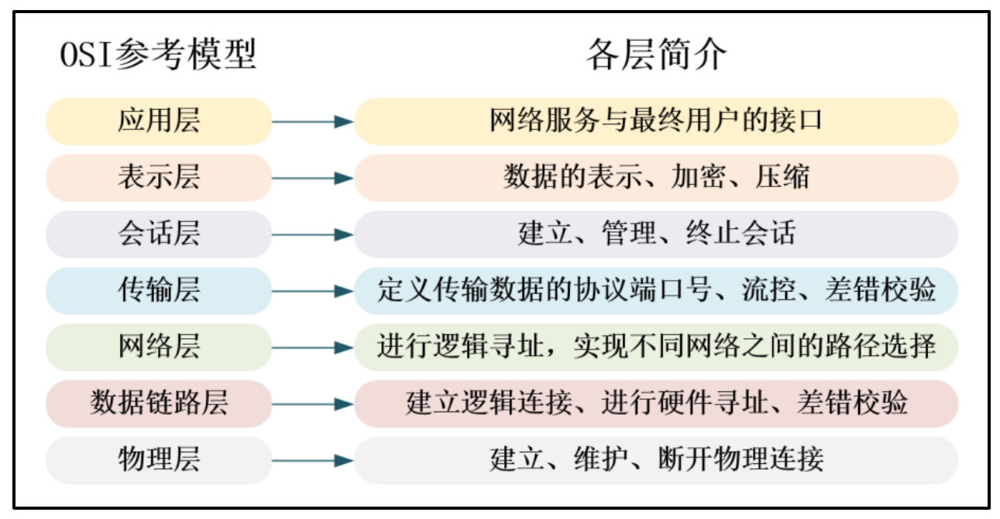

OSI 参考模型各层功能定义:

- 应用层:OSI 参考模型中最靠近用户的一层,为计算机用户提供应用接口和各种网络服务。主要协议:HTTP,HTTPS,FTP,POP3、SMTP、SNMP、DHCP、DNS。
- 表示层:表示层提供各种用于应用层数据的编码和转换功能,确保一个系统的应用层发送的数据能被另一个系统的应用层识别。如果必要,该层可提供一种标准表示形式,用于将计算机内部的多种数据格式转换成通信中采用的标准表示形式。同时,数据压缩和加密也是表示层可提供的转换功能之一。主要格式:JPEG、ASCll、DECOIC、加密格式。
- 会话层:会话层就是负责建立、管理和终止表示层实体之间的通信会话。该层的通信由不同设备中的应用程序之间的服务请求和响应组成。
- 传输层:传输层的作用是为上层协议提供端到端的可靠和透明的数据传输服务,包括处理差错控制和流量控制等问题。该层向高层屏蔽了下层数据通信的细节,使高层用户看到的只是在两个传输实体间的一条主机到主机的、可由用户控制和设定的、可靠的数据通路。主要协议 TCP、UDP。
- 网络层:网络层通过 IP 寻址来建立两个节点之间的连接,为源端的运输层送来的分组,选择合适的路由和交换节点,正确无误地按照地址传送给目的端的传输层,就是我们常说的 IP 层。主要协议:ICMP IGMP IP(IPV4 IPV6)。
- 数据链路层:实现比特到字节再到帧的组合,使用链路层地址 (以太网使用 MAC地址)来访问介质,并进行差错检测。数据链路层又分为 2 个子层:逻辑链路控制子层(LLC)和媒体访问控制子层(MAC)。 MAC 子层处理 CSMA/CD 算法、数据出错校验、成帧等;LLC 子层定义了一些字段使上次协议能共享数据链路层 。 在实际使用中 , LLC 子层并非必需的。主要协议 ARP 、 RARP 、IEEE802.3、PPP、CSMA/CD。
- 物理层:最终信号的传输是通过物理层实现的,通过物理介质传输比特流。规定了电平、速度和电缆针脚。常用设备:集线器、中继器、调制解调器、网线、双绞线、同轴电缆等。

### 1.2 TCP/IP 五层模型

​	在一定程度上参考了 OSI 模型后,产生了 TCP/IP 协议。TCP/IP(Transmission Control Protocol/Internet Protocol,传输控制协议/网际协议)是指能够在多个不同网络间实现信息传输的协议簇。TCP/IP 协议不仅仅指的是 TCP 和 IP 两个协议,而是指一个由 TP、SMTP、TCP、UDP、IP 等协议构成的协议簇, 只是因为在 TCP/IP 协议中 TCP 协议和 IP协议最具代表性,所以被称为 TCP/IP 协议。

​	在 TCP/IP 协议中,OSI 七层参考模型被简化为五层。在 TCP/IP 五层模型中,将提供服务类似的应用层、表示层、会话层合并为应用层一个层次,其他层次不变。TCP/IP 五层模型,具体见下图。

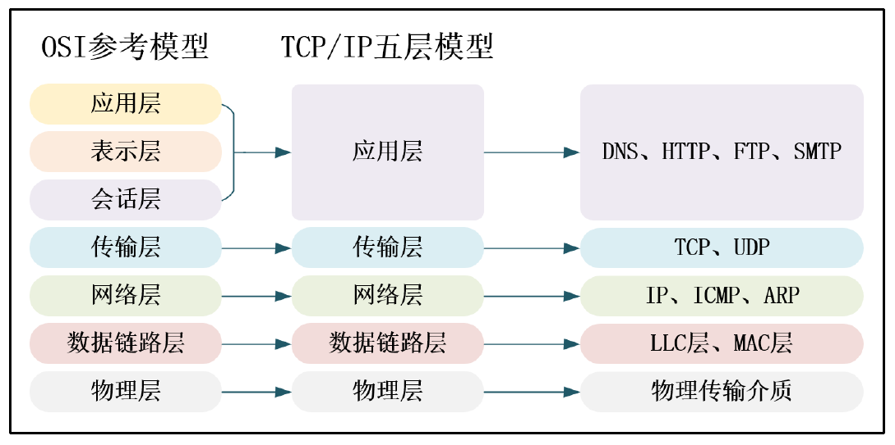

​	在 TCP/IP 五层参考模型中,数据链路层又被分为 LLC 层(逻辑链路层)和 MAC 层(媒体介质访问层)。目前,对于普通的接入网络终端的设备, LLC 层和 MAC 层是软、硬件的分界线。如 PC 的网卡主要负责实现参考模型中的 MAC 子层和物理层,在 PC 的软件系统中则有一套庞大程序实现了 LLC 层及以上的所有网络层次的协议。

### 1.3 以太网

​	以太网(Ethernet)是互联网技术的一种,由于它是在组网技术中占的比例最高,很多人直接把以太网理解为互联网。

​	**以太网是指遵守 IEEE 802.3 标准组成的局域网,由 IEEE 802.3 标准规定的主要是位于参考模型的物理层(PHY)和数据链路层中的介质访问控制子层(MAC)。在家庭、企业和校所组建的 PC 局域网形式一般也是以太网,其标志是使用水晶头网线来连接(当然还有它形式)。 IEEE 还有其它局域网标准,如 IEEE 802.11 是无线局域网,俗称 Wi-Fi。IEEE802.15 是个人域网,即蓝牙技术,其中的 802.15.4 标准则是 ZigBee 技术。**

### 1.4  以太网 MAC 层

1. 物理层

   在物理层,由 IEEE 802.3 标准规定了以太网使用的传输介质、传输速度、数据编码方式和冲突检测机制,物理层一般是通过一个 PHY 芯片实现其功能的。

   **传输介质:**

   传输介质包括同轴电缆、双绞线(水晶头网线是一种双绞线)、光纤。根据不同的传输速度和距离要求,基于这三类介质的信号线又衍生出很多不同的种类。最常用的是“五类线”、“超五类线”和“六类线”,五类网线通常用于传输百兆网速,超五类网线、六类网线除了能够传输百兆网速之外,还能够传输千兆网速。五类网线在使用千兆光纤时,只能达到百兆网速的传输速度,超五类、六类网线如果只开通了百兆的光纤,同样也只能产生百兆网速的传输效果。六类网线和五类网线、超五类网线比起来在串扰和回波损耗方面的性能得到了很大改善。五类网线外表皮的标识是 CAT5,超五类网线外表皮的标识是CAT5E,六类网线的标识则是 CAT6。

   **以太网MAC层接口:**

   FPGA通过以太网PHY芯片提供对以太网连接的支持，下图为PHY芯片与FPGA的连接关系。

   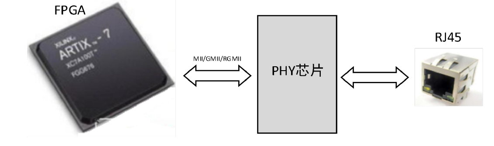

   从数据传输角度来看,控制器(FPGA)和 PHY 侧芯片实现以太网传输的数据链路两端,有 3 种主要的接口形式。这 3 种接口形式主要是 MII,GMII 和 RGMII。MII 主要应用在百兆网传输中,而 GMII 和 RGMII 则均可以运用于千兆网,RGMII 相较于 GMII,则可以有更高的数据位通信效率。

   MII (Media Independent Interface(介质无关接口)或称为媒体独立接口,它是 IEEE-802.3 定义的以太网行业标准,用以连接以太网 MAC 层和 PHY 芯片,后逐步扩展为:
   MII、RMII、SMII、GMII、RGMII 等。
   MII:百兆以太网接口,单边沿采样。
   RMII:百兆以太网接口,MII 的线路简化版,双边沿采样。
   GMII:千兆以太网接口,单边沿采样。
   RGMII:千兆以太网接口,GMII 的线路简化版,双边沿采样。
   MII 通信需要 13 根线,GMII 需要 20 根线,而 RGMII 只需 12 根通信,RGMII 在功能
   上实现千兆以太网,信号线却大大减少。

2. MII 接口

   MII接口应用于 100Mbs 和 10Mbps 以太网模式下，其接口信号连接关系如下

   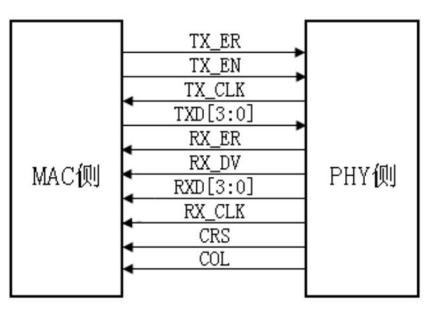

3. GMII 接口

   GMII 接口应用于 1000Mbps 以太网模式下，其接口信号连接关系如下

   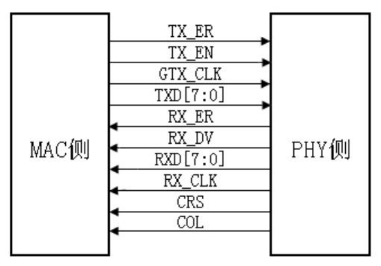

   - TX_ER：即 Transmit Error,发送数据错误提示信号,同步于 GTX_CLK,高电平有效,表示 TX_ER 有效期内传输的数据无效。
   - TX_EN ：即 Transmit Enable,发送使能信号,只有在 TX_EN 有效期内传的数据才有效。
   - GTX_CLK：发送参考时钟,**时钟频率为 125MHz**。需要注意的是,GTX_CLK 时 钟的方向是从 MAC 侧指向 PHY 侧的,此时钟是由 MAC 提供的,这里与 MII 接口有所差别的地方。
   - TXD：即 Transmit Data,数据发送信号,共 8 根信号线
   - RX_ER：即 Receive Error,接收数据错误提示信号,同步于 RX_CLK,高电平有效,表示 RX_ER 有效期内传输的数据无效。
   - RX_DV：即 Reveive Data Valid,接收数据有效信号,作用类似于发送通道的TX_EN。
   - RXD：即 ReceiveData,数据接收信号,共 8 根信号线。
   - RX_CLK：接收数据参考时钟,时钟频率为 125MHz。RX_CLK 是由 PHY 侧提供的。
   - CRS ：即 Carrier Sense,载波侦测信号,不需要同步于参考时钟,只要有数据传输,CRS 就有效。需要注意的是 CRS 只有 PHY 在半双工模式下有效。
   - COL：即 Collision Detectd,冲突检测信号,不需要同步于参考时钟。需要注意的是 COL 只有 PHY 在半双工模式下有效。

4. RGMII 接口

   ​	RGMII 即 ReducedGMII,是 GMII 的简化版本,将接口信号线数量从 24 根减少到 14 根,时钟频率仍旧为 125MHz,TX/RX 数据宽度从 8 位变为 4 位。RGMII 接口信号连接关系及各信号的介绍如下。

   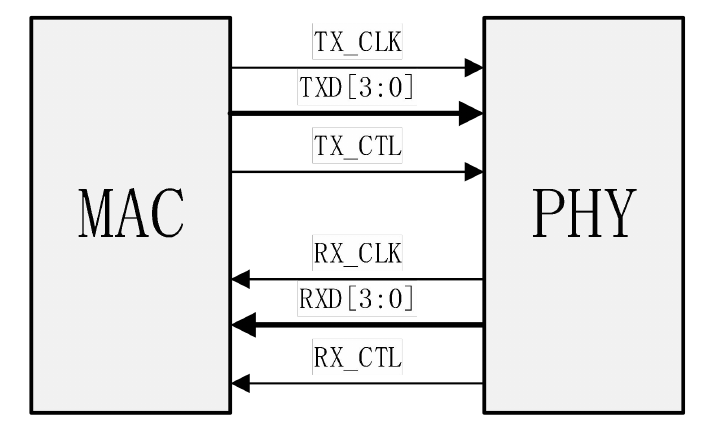

   - TX_CTL：该信号线上传送 GMII 接口中的 TX_EN 和 TX_ER 两种信息,在TX_CLK 的上升沿发送 TX_EN,下降沿发送 TX_ER。
   - TX_CLK：发送参考时钟,1000Mbps 速率下,时钟频率为 125MHz,TX_CLK时钟是由 MAC 提供的。
   - TXD ：在时钟 TX_CLK 的上升沿发送 GMII 接口中的 TXD[3:0],在时钟TX_CLK 的下降沿发送 GMII 接口中的 TXD[7:4]。
   - RX_CTL：该信号线上传送 GMII 接口中的 RX_DV 和 RX_ER 两种信息,在X_CLK 的上升沿传输 RX_DV,下降沿传输 RX_ER。
   - RXD：时钟 RX_CLK 的上升沿传输 GMII 接口中的 RXD[3:0],在时钟RX_CLK 的下降沿发送 GMII 接口中的 RXD[7:4]。
   - RX_CLK：接收数据参考时钟, 1000Mbps 速率下, 时钟频率为 125MHz。RX_CLK 由 PHY 侧提供的。
   - CRS ：即 Carrier Sense,载波侦测信号,不需要同步于参考时钟,只要有数据传输,CRS 就有效。需要注意的是 CRS 只有 PHY 在半双工模式下有效。
   - COL：即 Collision Detectd,冲突检测信号,不需要同步于参考时钟。需要注意的是 COL 只有 PHY 在半双工模式下有效。

   RGMII 接口为了保持 1000Mbps 的传输速率不变,RGMII 接口在时钟的上升沿和下降沿都采样数据。在参考时钟的上升沿发送 GMII 接口中的 TXD[3:0]/RXD[3:0],在参考时钟的下降沿发送 GMII 接口中的 TXD[7:4]/RXD[7:4]。RGMII 同时也兼容 100Mbps 和 10Mbps 两种速率,此时参考时钟速率分别为 25MHz 和 2.5MHz。TX_CTL 信号线上传送 TX_EN 和 TX_ER 两种信息,在 TX_CLK 的上升沿,下降沿发送 TX_ER;同样的,RX_CTL 信号线上也传送 RX_DV和 RX_ER 两种信息,在 RX_CLK 的上升沿传输 RX_DV,下降沿传输 RX_ER。

   接口对比

   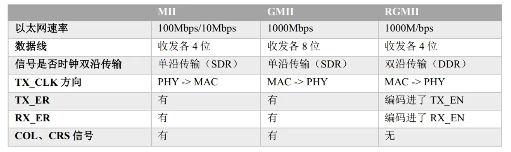

### 1.5 以太网(MAC)帧协议介绍

​	MAC 子层是属于数据链路层的下半部分,它主要负责与物理层进行数据交接,如是否可以发送数据,发送的数据是否正确,对数据流进行控制等。它自动对来自上层的数据包加上一些控制信号,交给物理层。接收方得到正常数据时,自动去除 MAC 控制信号,把该数据包交给上层。

​	IEEE 对以太网上传输的数据包格式也进行了统一规定,见下图。该数据包被称为MAC 数据包。

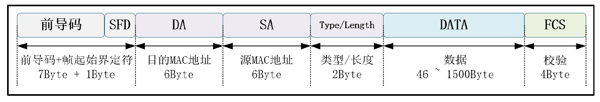

MAC 数据包由前导字段、帧起始定界符、目标地址、源地址、数据包类型、数据域、填充域、校验和域组成。

在物理层上看,一个完整的以太网帧有 7 个字段,事实上,前两个字段并不能算是真正意义上的以太网数据帧,它们是以太网在物理层上发送以太网数据时添加上去的。为了实现底层数据的正确阐述 , 物理层使用 7 个字节前同步码 ( 0 和 1 交替的 56 位(55-55-55-55-55-55-55))实现物理层帧输入/输出同步;使用 1 个字节的 SFD(帧首定界符,固定为 10101011)标识帧的开始。上图中剩下的 5 个字段是真正的以太网数据,其中包含了目的地址和源地址,它们都是 6 字节长度(通常每个网卡都有 1 个 6 个字节 MAC 地址,以在以太网中唯一地标识自己)。网卡接收数据时,通过将目的地址字段和自身的 MAC地址做比较,判断是否接收该数据包。通常,将这里的 6 字节目的地址按照下面的格式来书写,如:00-01-02-03-04-05。这 6 个字节在以太网中是按照从左到右(先发该字段的高字节后发字段的低字节)的顺序发送的,同时对每个字节来说,最先发送的是最低位 bit0,最后是最高位 bit7。

各字段的介绍如下：

- 前导字段(7Byte),也称报头,这是一段方波,用于使收发节点的时钟同步。内容为连续 7 个字节的 0x55。字段和帧起始定界符在 MAC 收到数据包后会自动过滤掉。
- 帧起始定界符(SFD,1Byte): 用于区分前导段与数据段的,内容为 0xD5。
- MAC 地址(6Byte):MAC 地址由 48 位数字组成,它是网卡的物理地址,在以太网传输的最底层,就是根据 MAC 地址来收发数据的。部分 MAC 地址用于广播和多播,在同一个网络里不能有两个相同的 MAC 地址。 PC 的网卡在出厂时已经设置好了 MAC 地址,但也可以通过一些软件来进行修改,在嵌入式的以太网控制器中可由程序进行配置。数据包中的 DA 是目标地址, SA 是源地址。
- 数据包类型(2Byte):本区域可以用来描述本 MAC 数据包是属于 TCP/IP 协议层的IP 包、 ARP 包还是 SNMP 包,也可以用来描述本 MAC 数据包数据段的长度。如果该值被设置大于 0x0600,不用于长度描述,而是用于类型描述功能,表示与以太网帧相关的 MAC 客户端协议的种类。
- 数据段(46 - 1500Byte):数据段是 MAC 包的核心内容,它包含的数据来自 MAC 的上层。其长度可以从 0~1500 字节间变化。
- 填充域:由于协议要求整个 MAC 数据包的长度至少为 64 字节(接收到的数据包如果少于 64 字节会被认为发生冲突,数据包被自动丢弃),当数据段的字节少于 46 字节时,在填充域会自动填上无效数据,以使数据包符合长度要求。
- 校验和域(4Byte):MAC 数据包的尾部是校验和域,它保存了 CRC 校验序列,用于检错。以上是标准的 MAC 数据包, IEEE 802.3 同时还规定了扩展的 MAC 数据包,它是在标准的 MAC 数据包的 SA 和数据包类型之间添加 4 个字节的 QTag 前缀字段,用于获取标志的 MAC 帧。前 2 个字节固定为 0x8100,用于识别 QTag前缀的存在;后两个字节内容分别为 3 个位的用户优先级、 1 个位的标准格式指示符(CFI)和一个 12 位的 VLAN 标识符。

### 1.6 以太网 ARP 协议

​	MAC 帧并不是直接对用户的数据帧,一段用户信息要想通过以太网传输还需要经过各种传输层协议的层层打包才能最终送入 MAC 帧的数据字段进行传输。无论是传输用户数据还是一些网络通信辅助相关的信息,都需要将数据编码为指定协议后再打包进 MAC 层传输。

​	在网络通讯时,源主机的应用程序知道目的主机的 IP 地址和端口号,却不知道目的主机的硬件(MAC)地址,而数据包首先是被网卡接收到再去处理上层协议的,如果接收到的数据包的硬件地址与本机不符,则直接丢弃。因此在通讯前必须**获得目的主机的硬件地址**。ARP 协议就起到这个作用。

1. ARP 帧工作原理

   ​	源主机发出 ARP 请求,询问“IP 地址是 192.168.0.1 的主机的硬件地址是多少”,并将这个请求广播到本地网段(以太网帧首部的硬件地址填 FF:FF:FF:FF:FF:FF 表示广播),目的主机接收到广播的 ARP 请求,发现其中的 IP 地址与本机相符,则发送一个 ARP 应答数据包给源主机,将自己的硬件地址填写在应答包中。然后源主机收到该应答报文,就能从报文中解析得知目的主机的硬件地址是多少,然后就能正确的发送数据了。

2. ARP 帧字段

   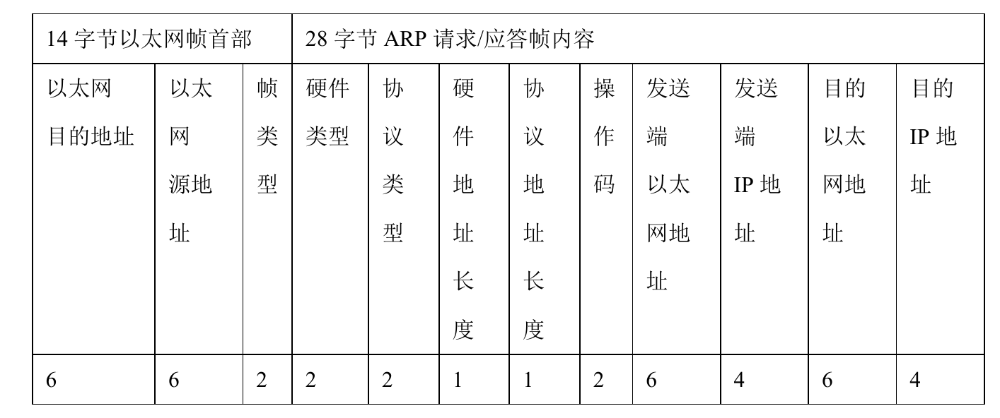

   注意到源 MAC 地址、目的 MAC 地址在以太网首部和 ARP 请求中各出现一次,这两个字段的内容值是不一样的。在发送 ARP 请求帧时,以太网首部中的目的 MAC 地址为广播地址,也就是 6 字节的 0xFF。而 ARP 数据报中,当发送请求报文时,由于目的 MAC 地址暂时无法知晓,所以将其值填充为 0。 ARP 返回报文中的值由于已经知晓,所以以太网首部和 ARP数据报中的值用实际值填充。

   硬件类型指链路层网络类型,1 为以太网,协议类型指要转换的地址类型,0x0800 为 IP地址。后面两个地址长度对于以太网地址和 IP 地址分别为 6 和 4(字节)。op 字段为 1 表示 ARP 请求,op 字段为 2 表示 ARP 应答。

### 1.7 IP协议

​	MAC 数据包位于 TCP/IP 协议的数据链路层,当 MAC 数据包经过数据链路层到达网络层时,前导码、帧起始界定符、目的 MAC 地址、源 MAC 地址、类型/长度以及校验字节均被去除,只有有效数据传入了网络层。

​	网络层互联主要负责主机间或与路由器、交换机间对分组数据的路由选择和传递。要实现这一功能,就需要相关协议。常用的网络层协议就是 IP 协议。传入网络层的数据包并不完全是需要传输的有效数据,他的前面还包含着 20 字节的IP 协议首部。

IP 数据包格式如下图

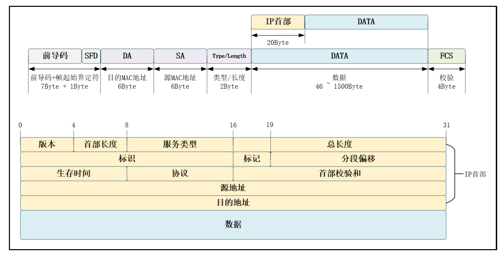

​	其中,和以太网帧具有帧头一样,IP 数据报也包含了一个 IP 报头部分,与 IP 协议相关的一些信息如 IP 地址,数据包长度等会被打包进 IP 报头中,然后再与需要传输的 IP 报文数据一起,作为 MAC 帧的数据和填充字段送往 MAC 层发送。

​	目前使用的 IP 协议有 Ipv4 和 Ipv6 两种,本章节介绍的是 Ipv4 版本。IP 协议网际协议第 4 版(Internet Protocol version 4,IPv4)是 TCP/IP 协议使用的数据报传输机制。数据报是一个可变长分组,有两部分组成:IP 首部和数据。首部长度可由 20~60 个字节组成,该部分包含有与路由选择和传输有关的重要信息。首部各字段意义按顺序如下:

- 版本(4bit):该字段定义 IP 协议版本,负责向处理机所运行的 IP 软件指明此 IP数据报是哪个版本,所有字段都要按照此版本的协议来解释。如果计算机使用其他版本,则丢弃数据包。
- 首部长度(4 bit):该字段定义数据报协议头长度,表示协议头部具有 32 位字长的数量。协议头最小值为 5,最大值为 15。
- 服务类型(8 bit):该字段定义上层协议对处理当前数据报所期望的服务质量,并对数据报按照重要性级别进行分配。前 3 位成为优先位,后面 4 位成为服务类型,最后 1 位没有定义。这些 8 位字段用于分配优先级、延迟、吞吐量以及可靠性。
- 总长度(16 bit):该字段定义整个 IP 数据报的字节长度,包括协议头部和数据。其最大值为 65535 字节。以太网协议对能够封装在一个帧中的数据有最小值和最大值的限制(46~1500 个字节)。
- 标识(16 bit):该字段包含一个整数,用于识别当前数据报。当数据报分段时,标识字段的值被复制到所有的分段之中。该字段由发送端分配帮助接收端集中数据报分段。
- 标记(3 bit):该字段由 3 位字段构成,其中最低位(MF)控制分段,存在下一个分段置为 1,否则置 0 代表该分段是最后一个分段。中间位(DF)指出数据报是否可进行分段,如果为 1 则机器不能将该数据报进行分段。第三位即最高位保留不使用,值为 0。
- 分段偏移(13 bit):该字段指出分段数据在源数据报中的相对位置,支持目标 IP适当重建源数据。
- 生存时间(8 bit):该字段是一种计数器,在丢弃数据报的每个点值依次减 1 直至减少为 0。这样确保数据报拥有有限的环路过程(即 TTL),限制了数据报的寿命。
- 协议(8 bit):该字段指出在 IP 处理过程完成之后,有哪种上层协议接收导入数据报。这个字段的值对接收方的网络层了解数据属于哪个协议很有帮助。
- 首部校验和(16 bit):该字段帮助确保 IP 协议头的完整性。由于某些协议头字段的改变,这就需要对每个点重新计算和检验。计算过程是先将校验和字段置为0,然后将整个头部每 16 位划分为一部分,将个部分相加,再将计算结果取反码,插入到校验和字段中。
- 源地址(32 bit):源主机 IP 地址,该字段在 IPv4 数据报从源主机到目的主机传输期间必须保持不变。
- 目的地址(32 bit):目标主机 IP 地址,该字段在 IPv4 数据报从源主机到目的主机传输期间同样必须保持不变。

## 2. 程序设计

GMII与RGMII发送接收实现逻辑

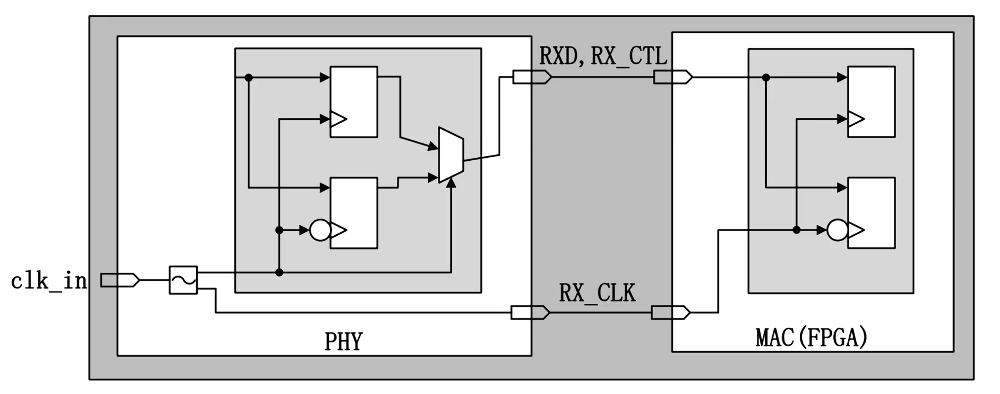
