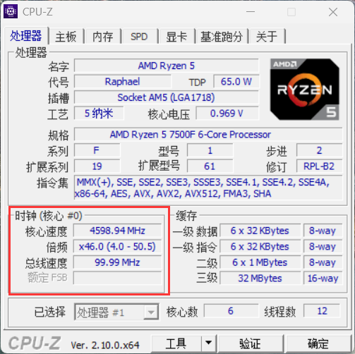
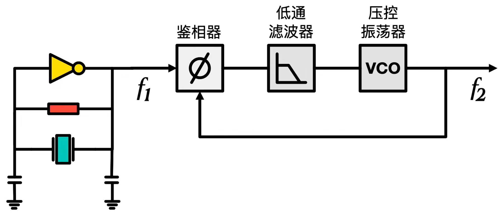
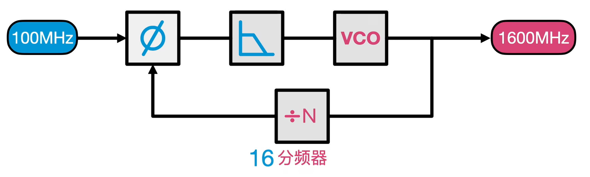

# FPGA实现串口通信

PLL（锁相环）是一种在数字电路中广泛应用的技术，尤其在 FPGA 开发中，它用于实现时钟的倍频、分频、相位偏移和可编程占空比等功能。

### 1.实验目标

本实验基于EBAZ 4205开发板，通过调用IP核，实现输出4个不同频率或相位的时钟信号，在vivado中进行仿真验证，最后生成比特流文件下载到开发板上使用示波器或逻辑分析仪观测信号频率。在实验过程中掌握以下要点：

- 学习 Xilinx MMCM/PLL IP 核的使用方法。
- 掌握 PLL 的时钟倍频、分频、相位偏移等功能的实现。
- 熟悉 Vivado 软件的 IP 核配置、仿真器使用以及下载验证流程。

### 2.实验环境

1. **ZYNQ 7010 开发板**：确保开发板各功能模块正常，已焊接50MHz的时钟源作为输入时钟。
2. **开发软件**：vivado 2019.2。
3. **测试设备**：示波器(没有示波器，只能使用逻辑分析仪观测信号频率)。

### 3.理论知识

##### 3.1 PLL介绍

锁相环（Phase-Locked Loop，PLL）是一种利用反馈控制原理实现控制信号频率及相位同步的技术。
PLL 的基本工作原理是利用外部输入的参考信号来控制环路内部振荡信号的频率和相位，实现输出信号频率对输入信号频率的自动跟踪。它通过检测输入参考信号与反馈信号之间的相位差，然后根据这个相位差来调整内部振荡器的频率和相位，使得反馈信号与输入参考信号在频率和相位上达到一致，即实现 “锁定” 状态。当环路锁定后，输出信号的频率和相位就与输入参考信号保持同步

- **为什么需要锁相环？**

  - 很多电子设备都需要一个稳定的 “节拍” 来工作，这个 “节拍” 就是时钟信号。就像乐队需要一个稳定的节拍器一样。锁相环可以把一个不太稳定或者不合适的时钟信号，变成一个稳定的、符合设备要求的时钟信号。比如电脑的 CPU、内存等组件都需要在稳定的时钟节拍下工作，锁相环就能保证它们不会因为时钟信号不稳定而出现错误或者性能下降。

  - 想象一下，在一个复杂的电子产品里，就像一个繁忙的工厂，有很多不同的 “车间”（电路模块），每个 “车间” 都需要按照自己特定的节奏（频率）来工作。但是这些节奏需要协调一致，不然就会乱套。锁相环就像是一个 “频率协调员”。例如，在手机里，信号接收部分、信号处理部分、屏幕显示部分等都有自己需要的工作频率。锁相环可以把一个基础的频率（比如从手机基站接收到的信号频率），变成各个部分需要的频率，让它们都能好好工作。

  - 拿电脑CPU来说，CPU的主频动辄几个GHz，频率的大小由晶振的大小决定，虽然CPU主频可以达到几个G赫兹，但是也没有真么高频率的晶振啊，那么谁来提供真么高频率的时钟呢？这就需要中间有这样一个玩意，能够把晶振的频率加倍再给CPU，这个玩意就是锁相环PLL。以我现在使用的CPU 锐龙7500F为例，打开CPU-Z，如下图可以看到，此时主频接近4600Mhz，是在100MHz的基础上经过锁相环46倍频得到。

    

##### **3.2 PLL工作原理**

最基础的PLL锁相环构成如下图所示



由三部分组成，分别是鉴相器，低通滤波器和压控振荡器，f1是输入频率，来自于外部晶振，f2为输出频率。

- **鉴相器（Phase Detector）**
  鉴相器的主要功能是比较输入信号（f1）和压控振荡器（VCO）输出信号（f2）的相位差。它会产生一个与相位差成正比的电压信号。这个电压信号将被送入下一级的低通滤波器。
- **低通滤波器（Low - Pass Filter）**
  低通滤波器的作用是对鉴相器输出的电压信号进行滤波。它会滤除信号中的高频成分，只允许低频成分通过。这样可以确保只有反映相位差的直流或低频信号被送到压控振荡器，从而避免高频噪声对压控振荡器的干扰。
-  **压控振荡器（Voltage - Controlled Oscillator, VCO）**
  压控振荡器根据输入的控制电压来改变其振荡频率。从低通滤波器送来的电压信号会控制 VCO 的振荡频率，使其输出信号（f2）的频率和相位逐渐与输入信号（f1）匹配。当环路锁定时，输入信号和 VCO 输出信号的频率和相位将保持一致。

##### **3.3 PLL倍频的原理**



- 在图中所示的 PLL 电路中，增加了一个分频器（÷N）。
- 输入信号频率为100MHz，VCO 输出信号频率为1600MHz，分频器的分频系数N=16。
- 工作过程如下：
  - 输入信号100MHz进入鉴相器。
  - VCO 输出信号1600MHz经过 16 分频器后，频率变为100MHz。
  - 这个100MHz的信号反馈到鉴相器，与输入的100MHz信号进行比较。
  - 鉴相器比较这两个信号的相位差，产生误差电压。误差电压经过低通滤波器滤波后，送到 VCO。
  - VCO 根据误差电压调整其振荡频率，直到反馈信号与输入信号相位锁定，此时 VCO 输出信号稳定在1600MHz。

### 4.实验任务


### 5.程序设计

##### 5.1 总体模块设计

从实验目标可知，我们需要通过串口来接收上位机发出的数据，所以我们需要一个**串口接收模块（uart_rx）** ，该模块用于将串口接收端口（**uart_rxd**）上的**串行数据解析成并行数据**， 并将解析完成的并行数据（**uart_rx_data**）作为模块的输出信号来供其它模块使用。
有了串口接收模块模块后，我们还需要一个能将数据发给上位机的**串口发送模块（uart_tx）**，该模块用于将 **uart_rx** 模块解析完成的并行数据数据（uart_rx_data） 转成串行数据，并通过串口发送端口（**uart_txd**）发回上位机， 所以我们需要将 **uart_rx_data** 数据传递给 **uart_tx** 模块， 即 **uart_tx** 模块需要一个用于接收 **uart_rx_data** 数据的输入端口，这里我们将该端口命名为 **uart_tx_data**，且位宽与 **uart_rx_data** 相等。

综上需要实现下面3个模块,分别是

- ##### UART接收模块

- ##### UART发送模块

- ##### 顶层模块

整体系统框图如图


##### 5.2 发送模块设计

- **模块接口框图**
  输入信号有系统**时钟信号**，**复位信号**，**发送使能信号**，和**待发送数据**。
  输出信号有**发送忙状态标志**和**串口发送端口**
  接口框图如下：
  

- **接口与功能描述**
  

- **波形图绘制**
  串口发送模块实际上实现的是一个并转串的功能，需要一个16位的系统时钟计数器(**baud_cnt**)和4位发送数据计数器(**tx_cnt**)，当串口发送模块接收到串口接收模块发送过来的高电平发送使能（**uart_tx_en**）时，拉高发送忙状态标志（**uart_tx_busy**）同时寄存待发送的数据（**tx_data_t**）。 在整个发送过程中发送忙状态标志保持高电平，**tx_cnt** 对串口数据进行计数，同时 **tx_data_t** 的各个数据位依次通过串口发送端 **uart_txd** 发送出去。当 **tx_cnt** 计数到 9 时，串口数据发送完成，开始发送停止位。在一个波特率周期的停止位发送完成后，串口发送过程结束， **uart_tx_busy** 信号拉低，表明串口发送模块进入空闲状态。

  

- **代码**

  ```
  module uart_tx(
      input clk,  //50MHz
      input rst_n,
      input uart_tx_en,
      input [7:0] uart_tx_data,
      output reg uart_tx_busy,
      output reg uart_tx_d
  );
  //参数定义
  parameter CLK_FREQ = 50_000_000;    
  parameter UART_BAUD =115200;
  localparam BAUD_CNT_MAX=CLK_FREQ/UART_BAUD;
  
  //寄存器定义
  reg [7:0] tx_data_t;//发送数据寄存器
  reg [3:0] tx_cnt;//发送数据计数器
  reg [15:0] baud_cnt;//波特率计数器
  
  always @(posedge clk)begin
      //如果复位信号有效，那么清除发送数据寄存器，拉低标志位
      if(rst_n==0)begin
          tx_data_t<=8'd10;
          uart_tx_busy<=1'b0;
      end
      //发送使能
      else if(uart_tx_en)begin
          tx_data_t<=uart_tx_data;
          uart_tx_busy<=1'b1;
      end
      //如果计数到停止位，那么拉低标志位，清空数据寄存器
      else if(tx_cnt==4'd9&&baud_cnt==BAUD_CNT_MAX-BAUD_CNT_MAX/16)begin
          tx_data_t<=8'd10;
          uart_tx_busy<=1'b0;
      end
      else begin
          tx_data_t<=tx_data_t;
          uart_tx_busy<=uart_tx_busy;
      end
  end
  
  //波特率计数器
  always @(posedge clk)begin
      if(rst_n==0)begin
          baud_cnt<=16'd0;
      end
      //当处于发送状态时，波特率计数器进行计数
      else if(uart_tx_busy)begin
          if(baud_cnt < BAUD_CNT_MAX - 1'b1)
              baud_cnt <= baud_cnt + 16'b1;
          else
              baud_cnt <=16'd0;
      end
      else
          baud_cnt <=16'd0;
  end
  
  //发送数据计数
  always @(posedge clk)begin
      if(rst_n==0)
          tx_cnt<=4'd0;
      else if(uart_tx_busy)begin
          if (baud_cnt==BAUD_CNT_MAX - 1'b1)
              tx_cnt<=tx_cnt+1'b1;
          else
              tx_cnt<=tx_cnt;
      end
      else
          tx_cnt<=4'd0;
  end
  
  //根据发送计数器对发送端口赋值
  always @(posedge clk)begin
      if(rst_n==0)
          uart_tx_d=1'b1;
      else if(uart_tx_busy)begin 
          case(tx_cnt)
              4'd0 : uart_tx_d <= 1'b0        ; //起始位
              4'd1 : uart_tx_d <= tx_data_t[0]; //数据位最低位
              4'd2 : uart_tx_d <= tx_data_t[1];
              4'd3 : uart_tx_d <= tx_data_t[2];
              4'd4 : uart_tx_d <= tx_data_t[3];
              4'd5 : uart_tx_d <= tx_data_t[4];
              4'd6 : uart_tx_d <= tx_data_t[5];
              4'd7 : uart_tx_d <= tx_data_t[6];
              4'd8 : uart_tx_d <= tx_data_t[7]; //数据位最高位
              4'd9 : uart_tx_d <= 1'b1        ; //停止位
              default : uart_tx_d <= 1'b1;
          endcase
      end
      else
          uart_tx_d=1'b1;
  end
  
  endmodule
  
  ```

- **仿真结果**

  

  

##### 5.3 接收模块设计

- **模块接口框图**

  输入信号有系统**时钟信号**，**复位信号**，和**待接收数据**。
  输出信号有**接收状态标志位**和**接收数据**
  接口框图如下：
  

- **接口与功能描述**
  

- **波形图绘制**
  串口接收模块实质上是实现一个串行数据转并行输出的功能，115200波特率下每个数据位的持续时间是434个系统时钟周期，我们需要一个至少9位的波特率计数器（**baud_cnt**）来计数，这里为了提高模块通用性，使用16位的波特率计数器，串口接收数据还需要一个4位接收数据计数器（**rx_cnt**）来对接收数据进行计数，需要一个8位的接收数据寄存器（**rx_data_t**）存储接收数据

- **代码**

  ```
  module uart_rx(
      input clk,  //50MHz
      input rst_n,
      input uart_rx_d,
      output reg uart_rx_done,
      output reg [7:0] uart_rx_data
  );
  //参数定义
  parameter CLK_FREQ = 50_000_000;    
  parameter UART_BAUD =115200;
  localparam BAUD_CNT_MAX=CLK_FREQ/UART_BAUD;
  
  //寄存器定义
  reg  uart_rx_d0;
  reg  uart_rx_d1;
  reg  uart_rx_d2;
  reg  rx_flag;   //接收数据标志位
  reg [7:0] rx_data_t;//接收数据寄存器
  reg [3:0] rx_cnt;//接收数据计数器
  reg [15:0] baud_cnt;//波特率计数器
  
  //线网定义
  wire start_en;
  
  //捕获接收端口下降沿(起始位)，得到一个时钟周期的脉冲信号
  assign start_en=uart_rx_d2&(~uart_rx_d1)&(~rx_flag);
  
  //针对异步信号的同步处理
  always @(posedge clk) begin
      if(rst_n==0)begin
          uart_rx_d0<=0;
          uart_rx_d1<=0;
          uart_rx_d2<=0;
      end
      else begin
          uart_rx_d0<=uart_rx_d;
          uart_rx_d1<=uart_rx_d0;
          uart_rx_d2<=uart_rx_d1;
      end
  end
  
  //接收标志位赋值
  always @(posedge clk) begin
      if(rst_n==0)
          rx_flag<=1'b0;
      else if(start_en)
          rx_flag<=1'b1;  //检测到起始信号，标志位置1
      else if (rx_cnt==4'd9 && baud_cnt==BAUD_CNT_MAX/2-1'b1)begin//接收结束，标志位置0 
          rx_flag<=1'b0;
      end
      else
          rx_flag<=rx_flag;
  end
  
  
  
  //波特率计数器
  always @(posedge clk)begin
      if(rst_n==0)begin
          baud_cnt<=16'd0;
      end
      //当处于接收状态时，波特率计数器进行计数
      else if(rx_flag)begin
          if(baud_cnt < BAUD_CNT_MAX - 1'b1)
              baud_cnt <= baud_cnt + 16'b1;
          else
              baud_cnt <=16'd0;
      end
      else
          baud_cnt <=16'd0;
  end
  
  //接收数据计数
  always @(posedge clk)begin
      if(rst_n==0)
          rx_cnt<=4'd0;
      else if(rx_flag)begin
          if (baud_cnt==BAUD_CNT_MAX - 1'b1)
              rx_cnt<=rx_cnt+1'b1;
          else
              rx_cnt<=rx_cnt;
      end
      else
          rx_cnt<=4'd0;
  end
  
  //根据发送计数器对接收数据寄存器进行赋值
  always @(posedge clk)begin
      if(rst_n==0)
          rx_data_t=8'd0;
      else if(rx_flag)begin //判断是否处于接收状态
          if(baud_cnt==BAUD_CNT_MAX/2 - 1'b1)begin//判断是否计数到中间
              case(rx_cnt)
                  4'd1 : rx_data_t[0] <= uart_rx_d2;   //寄存数据的最低位
                  4'd2 : rx_data_t[1] <= uart_rx_d2;
                  4'd3 : rx_data_t[2] <= uart_rx_d2;
                  4'd4 : rx_data_t[3] <= uart_rx_d2;
                  4'd5 : rx_data_t[4] <= uart_rx_d2;
                  4'd6 : rx_data_t[5] <= uart_rx_d2;
                  4'd7 : rx_data_t[6] <= uart_rx_d2;
                  4'd8 : rx_data_t[7] <= uart_rx_d2;   //寄存数据的高低位
                 default : ;
              endcase
          end
          else
              rx_data_t<=rx_data_t;
      end
      else
          rx_data_t=8'd0;
  end
  
  //给接收完成信号和接收到的数据赋值
  always @(posedge clk) begin
      if(rst_n==0) begin
          uart_rx_done <= 1'b0;
          uart_rx_data <= 8'b0;
      end
      //当接收数据计数器计数到停止位，且baud_cnt计数到停止位的中间时
      else if(rx_cnt == 4'd9 && baud_cnt == BAUD_CNT_MAX/2 - 1'b1) begin
          uart_rx_done <= 1'b1     ;  //拉高接收完成信号
          uart_rx_data <= rx_data_t;  //并对UART接收到的数据进行赋值
      end    
      else begin
          uart_rx_done <= 1'b0;
          uart_rx_data <= uart_rx_data;
      end
  end
  
  endmodule
  
  ```

- **仿真结果**
  

##### **5.3 顶层模块设计**

在顶层模块中对发送模块和接收模块进行例化。

- 代码编写

  ```
  module uart_loopback(
      input            sys_clk  ,   //外部50MHz时钟
      input            sys_rst_n,   //系外部复位信号，低有效
      
      //UART端口    
      input            uart_rx_d ,   //UART接收端口
      output           uart_tx_d     //UART发送端口
      );
  //参数定义
  parameter CLK_FREQ = 50000000;    //定义系统时钟频率
  parameter UART_BPS = 115200  ;    //定义串口波特率
  
  //线网定义
  wire         uart_rx_done;    //UART接收完成信号
  wire  [7:0]  uart_rx_data;    //UART接收数据
  
  //串口接收模块
  uart_rx #(
      .CLK_FREQ  (CLK_FREQ),
      .UART_BPS  (UART_BPS)
      )    
      u_uart_rx(
      .clk           (sys_clk     ),
      .rst_n         (sys_rst_n   ),
      .uart_rx_d     (uart_rx_d    ),
      .uart_rx_done  (uart_rx_done),
      .uart_rx_data  (uart_rx_data)
      );
  
  //串口发送模块
  uart_tx #(
      .CLK_FREQ  (CLK_FREQ),
      .UART_BPS  (UART_BPS)
      )    
      u_uart_tx(
      .clk          (sys_clk     ),
      .rst_n        (sys_rst_n   ),
      .uart_tx_en   (uart_rx_done),
      .uart_tx_data (uart_rx_data),
      .uart_tx_d    (uart_tx_d    ),
      .uart_tx_busy (            )
      );
  
  endmodule
  ```

- **仿真结果**
  


### 6.实验结果


