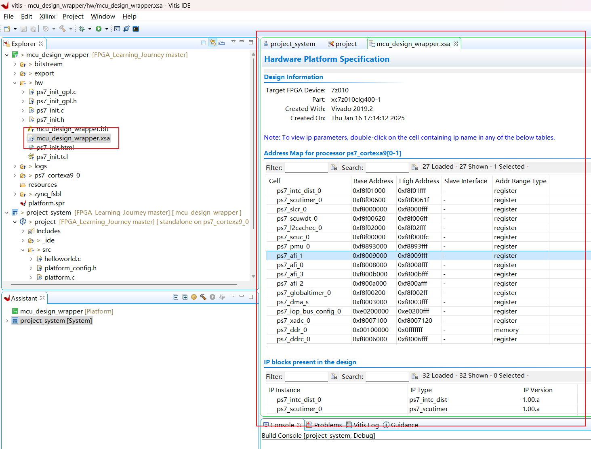
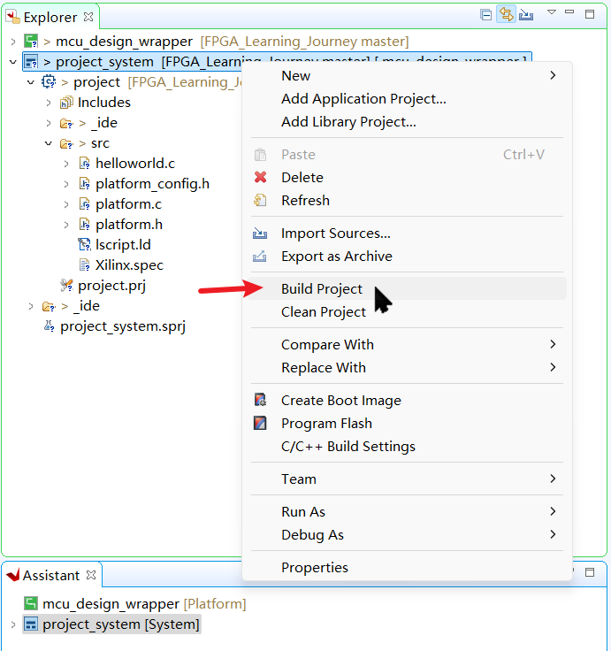
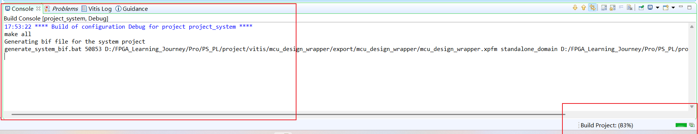
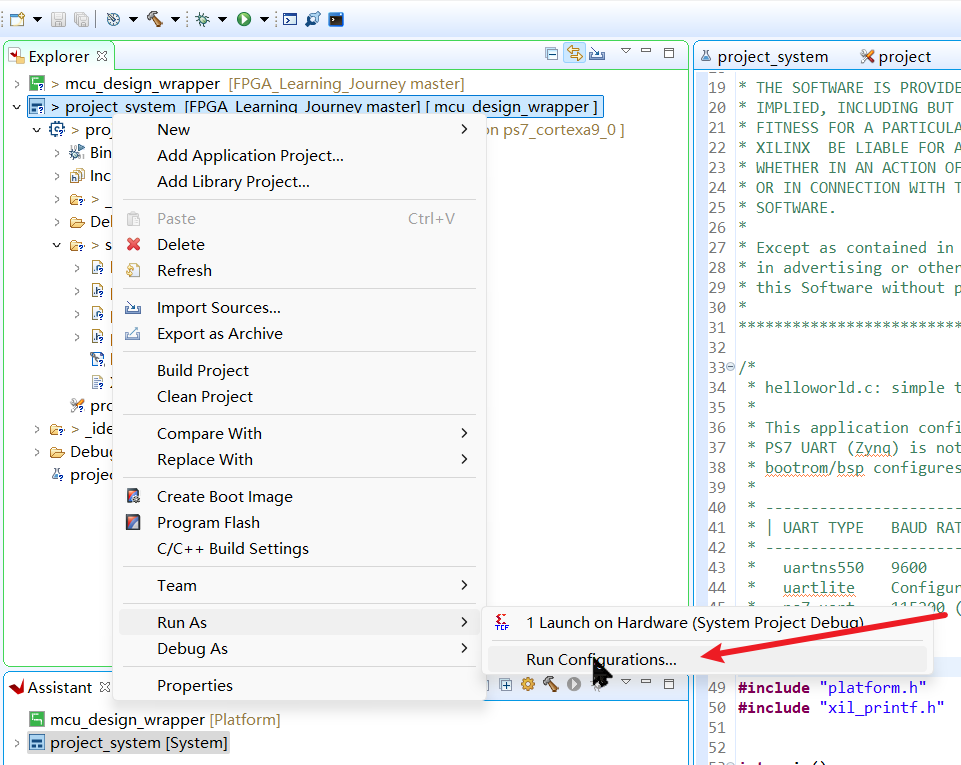
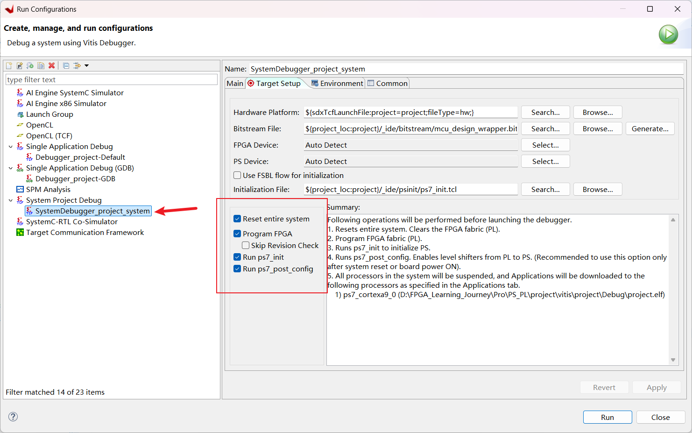
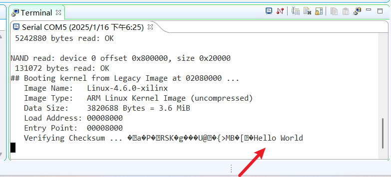

# ZYNQ PL & PL端的交互

## 一 、  PS 端调试入门

#### 1.学习目标

- 深入理解 ZYNQ PS（Processing System）的主要组件的功能和工作原理。
- 理解与 ZYNQ PS 端配套的软件开发环境（如 SDK 或者 Vitis）的基本架构和功能，熟悉软件开发环境（SDK 或 Vitis）中提供的调试工具。
- 能够成功构建一个 PS 端最小系统，理解并能够在 Vivado 中完成 PS 端的引脚分配，生成正确的比特流文件，将其下载到开发板上，使 PS 端最小系统能够成功启动。

#### 硬件资源

开发板 **J7 排针**为MIO引脚引出的排针，**丝印 RXD**对应MIO引脚 **PS_MIO25_501**，**丝印 TXD**对应MIO引脚 **PS_MIO24_501**。DDR芯片型号为**MT41K128M16JT-125**，单片16位。晶振33.33MHz。

#### 2.最小系统组成

在 ZYNQ（赛灵思可扩展处理平台）的 PS（Processing System，处理系统）端搭建最小系统通常包括以下几个关键部分：

- **处理器核心（CPU）**：ZYNQ 中的 PS 端通常包含 ARM Cortex - A 系列处理器（如 Cortex - A9 等）。

- **存储器接口**
  DDR 内存接口：DDR（Double Data Rate）内存用于存储程序代码和运行时的数据。
  Flash 接口：用于存储启动代码（如引导加载程序，Bootloader）和其他非易失性数据。

- **时钟和复位模块**
  时钟源：为 PS 端的各个模块提供稳定的时钟信号。
  复位电路：用于在系统启动或出现异常情况时将各个模块复位到初始状态。

- **中断控制器**：负责处理各种中断请求。

- **调试接口**：如 JTAG（Joint Test Action Group）接口。它允许开发人员通过外部调试工具（如调试器）对 ZYNQ 系统进行调试。

- **常用外设接口（部分）**
  UART 接口：用于和外部设备进行简单的串行通信。
  **GPIO **接口****：General - Purpose Input/Output（通用输入 / 输出）接口，可以灵活地配置为输入或输出模式，用于连接各种外部设备。

#### 3.在Vivado中创建最小系统

1. 在vivado中创建工程
2. 在左侧**流程向导**的 **IP 集成器**中选择**创建设计块**
3. 在新建的**设计块**中的**示意图（diagram）**添加**ZYNQ Processing System** 
4. 双击添加的IP即可进入**ZYNQ IP 核**的详情设置页面，配置IP核
   - UART：管脚编号、波特率
   - DDR：DDR型号
   - PS端时钟频率
5. IP配置完成后，点击验证
6. 验证成功后，回到源文件，选中设计源右键**Generate Output Products...（生成输出产品...）**，此功能旨在将用户的硬件设计（通常是使用硬件描述语言如 Verilog 或 VHDL 编写的设计）转换为不同形式的可使用文件或数据。一般称之为**生成底层**，向下生成了一层.v文件，搭建和配置底层硬件。
7. 底层生成成功后，同样选中设计源后右键**Create HDL Wrapper...（创建 HDL 封装器...）**，HDL 封装器是一个将一个或多个 HDL 模块（如 Verilog 或 VHDL 模块）封装在一起的顶层文件，它为这些模块提供了一个统一的接口，使得它们可以作为一个整体进行操作和使用。它可以将一个复杂的设计中的多个模块整合，方便后续的综合、实现和仿真等流程。称之为**生成顶层**，向上生成了一层.v文件。
8. 顶层生成成功后，再点击流程向导栏的**生成比特流**。
9. 比特流生成完成后，点击最上方栏目中的**File**，选择**导出硬件**，**勾选包含比特流**，选择目录，点击OK。
10. 回到文件目录，发现生成了一个**.xsa**文件，`mcu_design_wrapper.xsa`。`.xsa` 文件（Xilinx Software Archive）是 Xilinx 平台上用于存储硬件平台信息的一种文件格式。它包含了有关硬件设计的各种信息，为软件开发提供了所需的硬件平台信息，可作为软件开发工具与硬件平台之间的桥梁。
11. 然后点击最上方栏目中的**Tools**，**启动Vitis**，2019.2版本之前是使用**SDK**进行开发。
12. 在vitis中**创建应用工程**，输入工程名下一步，选择**从硬件创建一个新平台**，添加在vivado中生成的.xsa文件下一步。
13. 继续下一步，选择hello world工程模板完成，进入到Vitis IDE 开发环境中。

#### 4.Vitis IDE的使用与调试

1. 在VItis IDE左侧文件路径中打开.xsa文件，可以看到硬件平台相关信息与外设地址地址信息。
   
2. 编译工程
   右键工程，选择**build project**，开始编译后下方控制台会输出编译信息和编译进度条。
   
   
3. 运行工程
   右键工程，选择运行，在弹出页面可以进行一些相关配置。
   
   
4. 在运行工程前需要连接好串口导线，并用数据线连接到电脑上，打开串口调试软件或vitis内置的串口助手。
   
   成功打印出hello world！

