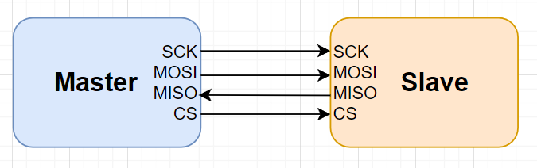
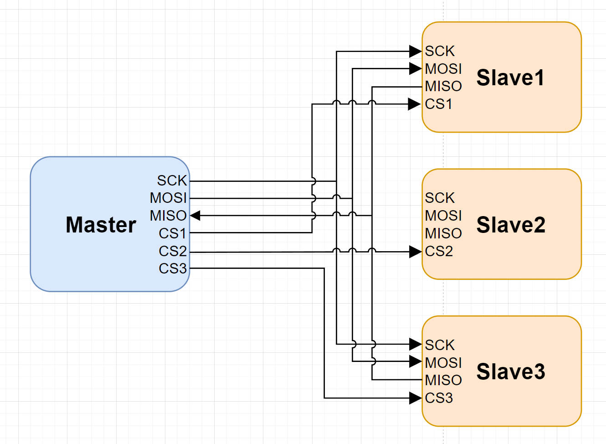
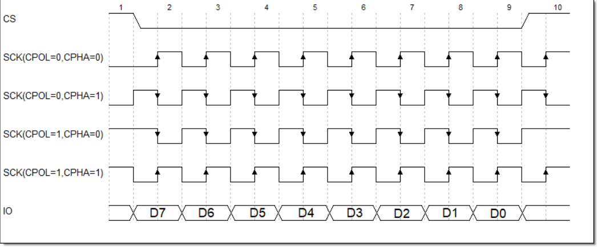
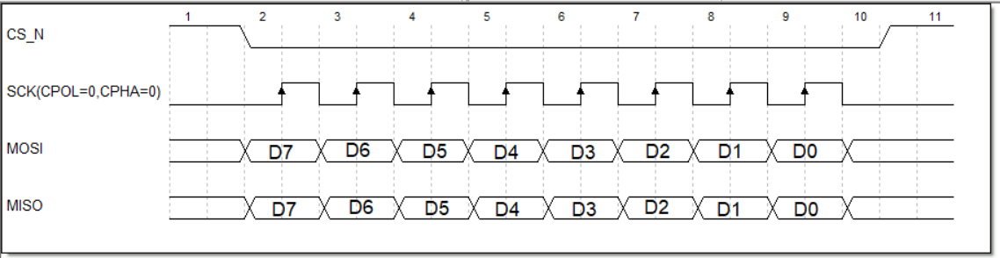
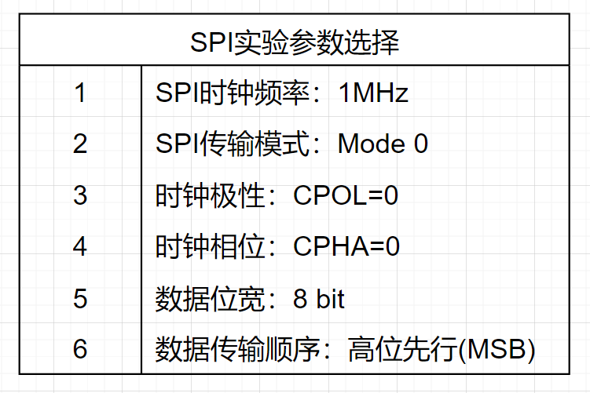
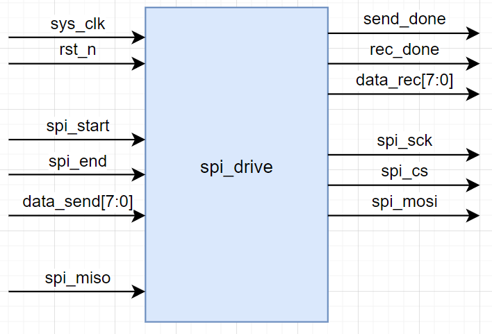
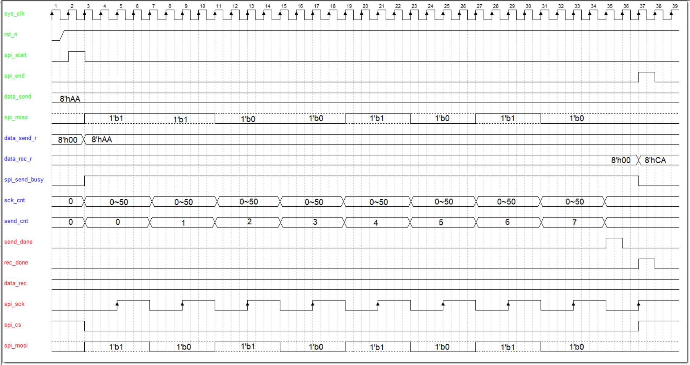
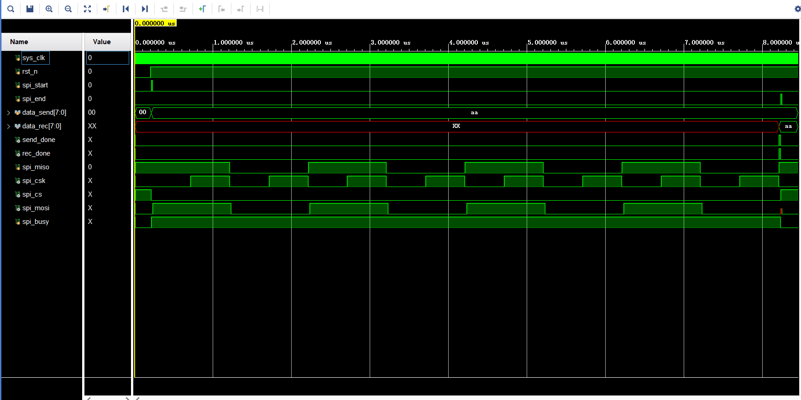

# FPGA SPI驱动OLED实验

### 1.实验目标

本实验基于EBAZ 4205开发板，在硬件设计层面上通过使用硬件描述语言实现SPI接口，在软件设计层面根据OLED的数据手册实现对OLED屏幕的简单控制。在实验过程中掌握以下要点：

- 深入理解 SPI 通信协议的原理与规范，明晰其数据传输模式、时钟极性及相位等关键特性。

- 熟练掌握使用 FPGA 实现 SPI 接口的硬件逻辑设计方法，包括状态机的搭建、数据收发模块的构建。

- 学会利用 FPGA 对 OLED 屏幕进行驱动控制，掌握向 OLED 写入指令与数据的流程，实现诸如字符显示、图形绘制等基本功能。

- 了解并能根据 OLED 屏幕的电气特性及时序要求，精准配置 FPGA 相关引脚的电气参数，确保稳定通信。

- 熟悉在 FPGA 开发环境下，针对此实验的代码编写、调试技巧，以及模块整合优化策略，保障系统高效运行。

**理解 SPI 协议与 OLED 通信要求**。

- 

### 2.实验环境

1. **ZYNQ 7010 开发板**

   作为本次实验的核心控制平台，ZYNQ 7010 集成了 ARM Cortex - A9 处理器和可编程逻辑（FPGA）资源。它为实现 SPI 通信以及后续对 OLED 的控制提供了强大的运算和逻辑处理能力。

2. **0.96 寸 OLED 屏幕**

   该 OLED 屏幕采用 SPI 接口与外部设备通信，具有低功耗、高对比度等优点，适合用于本次小型实验展示。屏幕分辨率通常为 128×64 像素，能够满足简单文本、图形显示需求。

3. **面包板**

   用于搭建 ZYNQ 7010 开发板与 OLED 屏幕之间的临时电路连接。

4. **逻辑分析仪**

   逻辑分析仪是监测 SPI 接口信号的关键设备。它能够实时捕获 SCK、MOSI、SS 等信号的时序变化以及传输的数据内容。通过与开发板的连接，逻辑分析仪可以深入分析 SPI 协议的执行情况，帮助我们在实验过程中排查数据传输错误、时序违规等问题，确保 SPI 通信的准确性与稳定性。

### 3.理论知识

##### 3.1 SPI介绍

SPI 的全称是 Serial Peripheral Interface，即串行外设接口，是摩托罗拉（Motorola）公司开发的一种用于微控制器（MCU）与各种外围设备之间进行通信的接口标准。广泛应用于嵌入式系统、电子设备等领域，用于连接如传感器、存储设备、显示设备等各种外围设备，实现数据的传输和交互。

SPI 通讯协议的优点是支持全双工通信，通讯方式较为简单，且相对数据传输速率较快；缺点是没有指定的流控制，没有应答机制，在数据可靠性上有一定缺陷。

##### **3.2 SPI物理层**

SPI 通讯设备的通讯模式是主从通讯模式，通讯双方有主从之分，根据从机设备的数量，SPI 通讯设备之间的连接方式可分为**单从机模式**和**多从机模式**。多从机模式下每个从机都有各自独立的 CS 线连接到主设备不同的 I/O 端口。





SPI总线传输中一般包含四根线：

- **SCK（Serial Clock）**：时钟信号线，由主设备产生，用于同步数据传输，决定了数据传输的速率。

- **MOSI（Master Out Slave In）**：主设备输出、从设备输入线，主设备通过此线向从设备发送数据。

- **MISO（Master In Slave Out）**：主设备输入、从设备输出线，从设备利用该线向主设备返回数据。

- **CS（Chip Select）**：从设备选择线，当主设备要与某个特定从设备通信时，拉低该从设备对应的 CS 线，以选中它，一个主设备可以连接多个从设备。

##### **3.3 SPI协议层**

1. **数据传输模式**

   SPI 协议定义了四种数据传输模式，主要区别在于**时钟极性（CPOL）**和**时钟相位（CPHA）**：

   **时钟极性（CPOL）**决定了 SPI 总线空闲时 SCK 信号的电平状态。CPOL=1表示空闲时为高电平,CPOL=0表示空闲时为低电平。

   **时钟相位（CPHA）**用于确定数据是在时钟信号的哪个边沿进行采样和输出。CPHA=0表示在时钟信号SCK的第一个跳变沿进行采样，CPHA=1表示在第二个边沿进行采样。

   四种数据传输模式的时序图如下：

   

   - **Mode 0（CPOL = 0，CPHA = 0）**：时钟空闲时为低电平，数据在时钟的上升沿被采样，主设备在第一个上升沿将数据的最高位（假设高位在前传输）送上 MOSI 线，同时从设备也在该上升沿将数据最高位送上 MISO 线，随后在每个上升沿依次传输后续数据位。
   - **Mode 1（CPOL = 0，CPHA = 1）**：同样时钟空闲为低电平，但此时数据在时钟的下降沿被采样，在上升沿进行数据更新准备。主设备在上升沿更新要发送的数据位，从设备在下降沿读取主设备发送的数据并准备返回数据，二者在时钟沿的交互配合更为精细，适用于对时序有一定要求但速率适中的通信，像部分早期的存储芯片读写。
   - **Mode 2（CPOL = 1，CPHA = 0）**：时钟空闲变为高电平，数据在时钟下降沿采样，主从设备操作与 Mode 0 类似，只是时钟极性反转。在一些特殊的工业控制领域，若设备的时钟默认高电平更利于系统同步，可能会采用此模式，它可以和其他采用低电平空闲时钟的设备区分开，避免时钟信号干扰。
   - **Mode 3（CPOL = 1，CPHA = 1）**：时钟空闲高电平，数据在时钟上升沿采样，是 Mode 2 的一种互补模式，数据传输的时机与 Mode 1 相对应，在高速、复杂的 SPI 通信系统中，根据不同设备的兼容性和系统整体的时序规划，会选择 Mode 3 来优化数据传输流程，确保数据准确无误传输。

##### **3.4 SPI协议传输过程**

以模式0为例，下面是SPI通信过程的时序图。



**CS_N（片选信号）：**在时刻 1 到时刻 2 之间，CS_N 为高电平，此时从设备未被选中，处于空闲状态。在时刻 2，CS_N 变为低电平，从设备被选中，开始准备接收或发送数据，直到时刻 10，CS_N 再次变为高电平，通信结束，从设备回到空闲状态。
**SCK（时钟信号）：**由于 CPOL = 0，时钟空闲时为低电平。在每个时钟周期内，数据在时钟的上升沿被采样。从时刻 2 开始，SCK 产生一系列脉冲，每个脉冲的上升沿对应着 MOSI 和 MISO 线上数据的采样时刻。
**MOSI（主设备输出从设备输入线）：**在时钟的控制下，主设备从高位（D7）开始，依次在每个时钟周期的上升沿将数据位发送到 MOSI 线上，直到低位（D0）发送完毕。
**MISO（主设备输入从设备输出线）：**从设备在每个时钟周期的上升沿将数据位发送到 MISO 线上，与 MOSI 的数据传输同步，也是从高位（D7）到低位（D0）。

##### **3.5 SPI 的优点**

1. 简单高效
   - SPI 接口相对简单，硬件连接上只需要四条线（不包括电源和地线），相比于其他通信接口（如 I2C 需要考虑复杂的起始信号、停止信号和应答机制等），SPI 的协议和时序更容易理解和实现。
   - 它的数据传输速度较快，能够达到较高的通信频率，一般可以达到几 MHz 甚至几十 MHz，适用于对数据传输速度要求较高的应用场景。
2. 全双工通信
   - 由于可以同时进行双向数据传输，能够提高数据交互的效率。例如，在一个需要实时反馈的传感器系统中，传感器可以将采集到的数据发送给主设备，同时主设备也可以向传感器发送配置命令等数据。

##### **3.6 SPI 的缺点**

1. 没有标准的寻址机制
   - 与 I2C 不同，SPI 没有内置的设备寻址方式。这意味着如果有多个从设备连接到 SPI 总线上，主设备需要为每个从设备单独提供一个片选（SS）信号，并且在通信时要手动控制每个 SS 信号来选择不同的从设备，当从设备数量较多时，会占用较多的引脚资源。
2. 布线要求相对较高
   - 因为 SPI 是同步通信，时钟信号（SCK）对于数据传输的同步非常关键。在高速数据传输或者长距离布线时，要特别注意信号的完整性，避免信号干扰和时钟抖动等问题，对 PCB（印刷电路板）的布线设计有一定的要求。

### 4.实验任务

1. **SPI 协议模块设计**

   - 运用硬件描述语言（如 Verilog 或 VHDL）在 FPGA 中设计并实现 SPI 协议通信模块。模块应具备可配置的数据位宽，既能适配常见的 8 位数据传输，满足 OLED 屏幕基本控制与显示数据发送要求，又能在后续拓展实验中支持 16 位等其他位宽，方便与不同设备协同工作。

2. **OLED 屏幕初始化编程**

   - 深入研究 OLED 屏幕的数据手册，依据手册规定的初始化序列，利用设计好的 SPI 协议模块向 OLED 屏幕发送一系列初始化命令。这些命令用于设置屏幕的显示模式、亮度控制、扫描方向等关键参数，是屏幕正常显示的基础。

   - 编写初始化程序时，要严格遵循数据手册中的时序要求，确保每个命令发送的时间间隔、命令字节与数据字节的真实顺序都准确无误。例如，命令之间可能需要间隔几个微秒，需通过精确的计数器或延时模块来实现。

3. **显示功能实现**

   - **成功点亮 OLED 屏幕**：能够正确初始化 OLED 显示器，通过 SPI 协议发送必要的初始化命令序列，使 OLED 屏幕能够正常启动并点亮，无明显闪烁或异常显示。初始化命令序列的发送应符合 OLED 设备手册规定的时序要求，包括每个命令字节之间的时间间隔、命令字节和数据字节的顺序等。
   - **实现简单文本显示：**向 OLED 发送文本显示相关的 SPI 命令和数据，能够在屏幕上稳定、正确地显示指定的简单文本信息，如单个字符（例如字母 “A”）或者短字符串（例如 “Hello”）。文本的显示位置、字体大小（如果可设置）等应符合预期，且字符应完整、清晰可辨。
   - **数据传输准确性验证：**通过 SPI 协议发送到 OLED 的数据（包括命令和显示数据）的准确率达到 100%。可以使用逻辑分析仪或者 FPGA 内部的调试工具（如 SignalTap II 等）来监测 SPI 接口上的数据传输情况，确保发送的数据与预期的数据完全一致。

### 5.参数选择



### 6.程序设计

##### 6.1 总体模块设计

从实验任务可知，我们需要使用FPGA实现SPI通信协议驱动OLED模块，总体模块设计分为**SPI驱动模块**和**OLED显示模块**。

##### 6.2 SPI驱动模块设计

- **模块接口框图**
  输入信号有**系统时钟信号**，**复位信号**，**发送开始信号**，**发送结束信号**，**待发送数据**，**SPI_MISO**。
  输出信号有**发送完成状态标志**，**接收完成状态标志**，**接收数据**，**SPI_SCK**，**SPI_CS**，**SPI_MOSI**。
  接口框图如下：



- **接口与功能描述**

  

  模块工作流程如下：

  拉高spi_start一个周期，同时把要发送的数据给data_send信号，等待发送完成后模块将send_done信号拉高一个周期，标志一个字节发送完毕。当接收信号rec_done信号拉高一个周期，代表已经接收到一个字节数据从data_rec输出。当主机希望结束这次传输，可以将spi_end拉高一个周期。如果模块没有收到高电平信号，那么将会一直传输，可实现多字节SPI传输。

- **波形图绘制**

  

- **代码**

  ```
  module spi_drive (
      //系统接口
      input sys_clk,
      input rst_n,
      //用户接口
      input spi_start,
      input spi_end,
      input [7:0] data_send,
      output reg [7:0] data_rec,
      output reg send_done,
      output reg rec_done,  
      //物理接口
      input spi_miso,
      output reg spi_csk,
      output reg spi_cs,
      output reg spi_mosi
    );
    parameter SYS_CLK_FREQ = 50_000_000;
    parameter SPI_CSK_FREQ = 1_000_000;//SPI时钟频率
    parameter SCK_CNT_MAX = SYS_CLK_FREQ/SPI_CSK_FREQ; //50
    parameter SCK_CNT_MAX_1_2 = SCK_CNT_MAX/2;
  
    reg [15:0] sck_cnt;   //spi时钟计数器
    reg [7:0]  send_cnt;  //发送数据计数器
    reg [7:0] data_send_r; //发送数据寄存器
    reg [7:0] data_rec_r; //接收数据寄存器
    reg spi_busy;//spi工作标志位
  
    //片选信号
    always @(posedge sys_clk ) begin
      if(!rst_n)begin
        spi_cs <=1'b1;
      end
      else if(spi_start)begin
        spi_cs <=1'b0;
      end
      else if(spi_end) begin
        spi_cs <=1'b1;
      end
      else
        spi_cs<=spi_cs;
    end
  
    //发送数据寄存
    always @(posedge sys_clk) begin
      if (!rst_n) begin
        data_send_r <= 8'h00;
      end 
      else if(spi_start) begin
        data_send_r <= data_send;
      end
      else
        data_send_r <= data_send_r;
    end
  
    //spi时钟信号
    always @(posedge sys_clk ) begin
      if(!rst_n) begin
        spi_csk <= 1'b0;
      end 
      else if(sck_cnt == (SCK_CNT_MAX_1_2-1) | sck_cnt== (SCK_CNT_MAX-1)) begin
        spi_csk <= ~spi_csk;
      end
      else
        spi_csk <= spi_csk;
    end
  
    //捕获spi开始和结束信号，更改状态标志位
    always @(posedge sys_clk ) begin
      if(!rst_n)begin
        spi_busy<=1'b0;
      end
      else if(spi_start) begin
        spi_busy<=1'b1;
      end
      else if(spi_end) begin
        spi_busy<=1'b0;
      end
      else
        spi_busy<=spi_busy;
    end
  
    //根据spi状态更新分频计数器和传输比特计数器
    always @(posedge sys_clk ) begin
      if(!rst_n) begin
        sck_cnt<=16'd0;
        send_cnt<=8'd0;
      end
      else if(spi_busy) begin
        if(sck_cnt==(SCK_CNT_MAX-1)) begin
          sck_cnt<=16'd0;
          send_cnt<=send_cnt+1'd1;
        end
        else begin
          sck_cnt<=sck_cnt+1'd1;
          send_cnt<=send_cnt;
        end
          
      end
      else begin
        sck_cnt<=16'd0;
        send_cnt<=8'd0;
      end
    end
  
    //mosi数据发送，产生发送完成标志位
    always @(posedge sys_clk ) begin
      if(!rst_n)begin
        spi_mosi<=1'd0;
        send_done<=1'd0;
      end
      else if(spi_busy) begin
        if(sck_cnt==16'd0)begin
          spi_mosi<=data_send_r[8'd7-send_cnt];
        end
        else begin
          spi_mosi<=spi_mosi;
        end 
        if(send_cnt==8'd7 && sck_cnt==(SCK_CNT_MAX-1)) begin
          send_done<=1'd1;
        end
        else begin
          send_done<=1'd0;
        end
      end
      else begin
        spi_mosi<=1'd0;
        send_done<=1'd0;
      end
        
    end
    //miso数据接收，产生接收完成标志位
    always @(posedge sys_clk ) begin
      if(!rst_n)begin
        data_rec_r<=1'd0;
        rec_done<=1'd0;
      end
      else if(spi_busy) begin
        if(sck_cnt==(SCK_CNT_MAX_1_2-1))begin
          data_rec_r[8'd7-send_cnt]<=spi_miso;
        end
        else begin
          data_rec_r[8'd7-send_cnt]<=data_rec_r[8'd7-send_cnt];
        end 
        if(send_cnt==8'd7 && sck_cnt==(SCK_CNT_MAX-1)) begin
          rec_done<=1'd1;
          data_rec<=data_rec_r;
        end
        else begin
          rec_done<=1'd0;
        end
      end
      else begin
        rec_done<=1'd0;
        data_rec<=data_rec;
      end
    end
  endmodule
  ```

- **仿真结果**

  

##### **6.3** 显示/存储模块设计


### 7.实验结果

