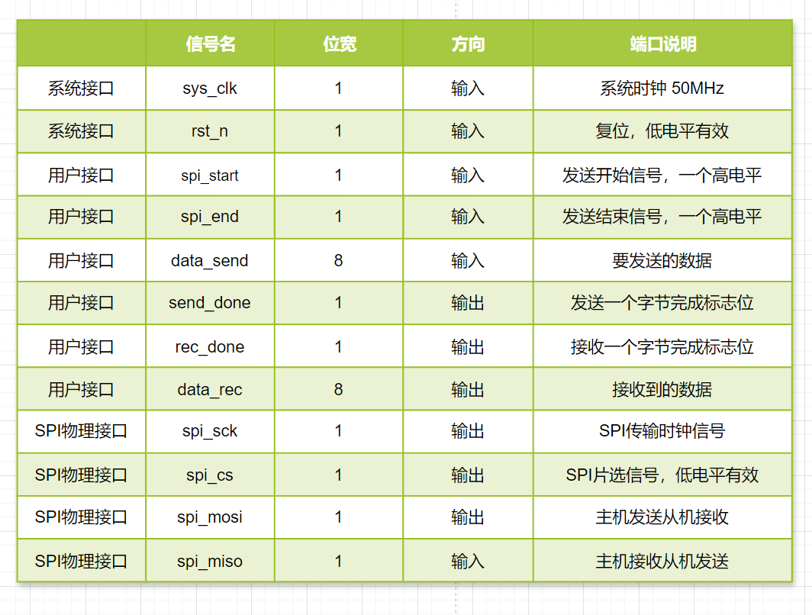

# FPGA SPI驱动OLED实验

### 1.实验目标

本实验基于EBAZ 4205开发板，在硬件设计层面上通过使用硬件描述语言实现SPI接口，在软件设计层面根据OLED的数据手册实现对OLED屏幕的简单控制。在实验过程中掌握以下要点：

- 深入理解 SPI 通信协议的原理与规范，明晰其数据传输模式、时钟极性及相位等关键特性。

- 熟练掌握使用 FPGA 实现 SPI 接口的硬件逻辑设计方法，包括状态机的搭建、数据收发模块的构建。

- 学会利用 FPGA 对 OLED 屏幕进行驱动控制，掌握向 OLED 写入指令与数据的流程，实现诸如字符显示、图形绘制等基本功能。

- 了解并能根据 OLED 屏幕的电气特性及时序要求，精准配置 FPGA 相关引脚的电气参数，确保稳定通信。

- 熟悉在 FPGA 开发环境下，针对此实验的代码编写、调试技巧，以及模块整合优化策略，保障系统高效运行。

**理解 SPI 协议与 OLED 通信要求**。

- 

### 2.实验环境

1. **ZYNQ 7010 开发板**

   作为本次实验的核心控制平台，ZYNQ 7010 集成了 ARM Cortex - A9 处理器和可编程逻辑（FPGA）资源。它为实现 SPI 通信以及后续对 OLED 的控制提供了强大的运算和逻辑处理能力。

2. **0.96 寸 OLED 屏幕**

   该 OLED 屏幕采用 SPI 接口与外部设备通信，具有低功耗、高对比度等优点，适合用于本次小型实验展示。屏幕分辨率通常为 128×64 像素，能够满足简单文本、图形显示需求。

3. **面包板**

   用于搭建 ZYNQ 7010 开发板与 OLED 屏幕之间的临时电路连接。

4. **逻辑分析仪**

   逻辑分析仪是监测 SPI 接口信号的关键设备。它能够实时捕获 SCK、MOSI、SS 等信号的时序变化以及传输的数据内容。通过与开发板的连接，逻辑分析仪可以深入分析 SPI 协议的执行情况，帮助我们在实验过程中排查数据传输错误、时序违规等问题，确保 SPI 通信的准确性与稳定性。

### 3.理论知识

##### 3.1 SPI介绍

SPI 的全称是 Serial Peripheral Interface，即串行外设接口，是摩托罗拉（Motorola）公司开发的一种用于微控制器（MCU）与各种外围设备之间进行通信的接口标准。广泛应用于嵌入式系统、电子设备等领域，用于连接如传感器、存储设备、显示设备等各种外围设备，实现数据的传输和交互。

SPI 通讯协议的优点是支持全双工通信，通讯方式较为简单，且相对数据传输速率较快；缺点是没有指定的流控制，没有应答机制，在数据可靠性上有一定缺陷。

##### **3.2 SPI物理层**

SPI 通讯设备的通讯模式是主从通讯模式，通讯双方有主从之分，根据从机设备的数量，SPI 通讯设备之间的连接方式可分为**单从机模式**和**多从机模式**。多从机模式下每个从机都有各自独立的 CS 线连接到主设备不同的 I/O 端口。


SPI总线传输中一般包含四根线：

- **SCK（Serial Clock）**：时钟信号线，由主设备产生，用于同步数据传输，决定了数据传输的速率。

- **MOSI（Master Out Slave In）**：主设备输出、从设备输入线，主设备通过此线向从设备发送数据。

- **MISO（Master In Slave Out）**：主设备输入、从设备输出线，从设备利用该线向主设备返回数据。

- **CS（Chip Select）**：从设备选择线，当主设备要与某个特定从设备通信时，拉低该从设备对应的 CS 线，以选中它，一个主设备可以连接多个从设备。

##### **3.3 SPI协议层**

1. **数据传输模式**

   SPI 协议定义了四种数据传输模式，主要区别在于**时钟极性（CPOL）**和**时钟相位（CPHA）**：

   **时钟极性（CPOL）**决定了 SPI 总线空闲时 SCK 信号的电平状态。CPOL=1表示空闲时为高电平,CPOL=0表示空闲时为低电平。

   **时钟相位（CPHA）**用于确定数据是在时钟信号的哪个边沿进行采样和输出。CPHA=0表示在时钟信号SCK的第一个跳变沿进行采样，CPHA=1表示在第二个边沿进行采样。

   四种数据传输模式的时序图如下：

   

   - **Mode 0（CPOL = 0，CPHA = 0）**：时钟空闲时为低电平，数据在时钟的上升沿被采样，主设备在第一个上升沿将数据的最高位（假设高位在前传输）送上 MOSI 线，同时从设备也在该上升沿将数据最高位送上 MISO 线，随后在每个上升沿依次传输后续数据位。
   - **Mode 1（CPOL = 0，CPHA = 1）**：同样时钟空闲为低电平，但此时数据在时钟的下降沿被采样，在上升沿进行数据更新准备。主设备在上升沿更新要发送的数据位，从设备在下降沿读取主设备发送的数据并准备返回数据，二者在时钟沿的交互配合更为精细，适用于对时序有一定要求但速率适中的通信，像部分早期的存储芯片读写。
   - **Mode 2（CPOL = 1，CPHA = 0）**：时钟空闲变为高电平，数据在时钟下降沿采样，主从设备操作与 Mode 0 类似，只是时钟极性反转。在一些特殊的工业控制领域，若设备的时钟默认高电平更利于系统同步，可能会采用此模式，它可以和其他采用低电平空闲时钟的设备区分开，避免时钟信号干扰。
   - **Mode 3（CPOL = 1，CPHA = 1）**：时钟空闲高电平，数据在时钟上升沿采样，是 Mode 2 的一种互补模式，数据传输的时机与 Mode 1 相对应，在高速、复杂的 SPI 通信系统中，根据不同设备的兼容性和系统整体的时序规划，会选择 Mode 3 来优化数据传输流程，确保数据准确无误传输。

##### **3.4 SPI协议传输过程**

以模式0为例，下面是SPI通信过程的时序图。


**CS_N（片选信号）：**在时刻 1 到时刻 2 之间，CS_N 为高电平，此时从设备未被选中，处于空闲状态。在时刻 2，CS_N 变为低电平，从设备被选中，开始准备接收或发送数据，直到时刻 10，CS_N 再次变为高电平，通信结束，从设备回到空闲状态。
**SCK（时钟信号）：**由于 CPOL = 0，时钟空闲时为低电平。在每个时钟周期内，数据在时钟的上升沿被采样。从时刻 2 开始，SCK 产生一系列脉冲，每个脉冲的上升沿对应着 MOSI 和 MISO 线上数据的采样时刻。
**MOSI（主设备输出从设备输入线）：**在时钟的控制下，主设备从高位（D7）开始，依次在每个时钟周期的上升沿将数据位发送到 MOSI 线上，直到低位（D0）发送完毕。
**MISO（主设备输入从设备输出线）：**从设备在每个时钟周期的上升沿将数据位发送到 MISO 线上，与 MOSI 的数据传输同步，也是从高位（D7）到低位（D0）。

##### **3.5 SPI 的优点**

1. 简单高效
   - SPI 接口相对简单，硬件连接上只需要四条线（不包括电源和地线），相比于其他通信接口（如 I2C 需要考虑复杂的起始信号、停止信号和应答机制等），SPI 的协议和时序更容易理解和实现。
   - 它的数据传输速度较快，能够达到较高的通信频率，一般可以达到几 MHz 甚至几十 MHz，适用于对数据传输速度要求较高的应用场景。
2. 全双工通信
   - 由于可以同时进行双向数据传输，能够提高数据交互的效率。例如，在一个需要实时反馈的传感器系统中，传感器可以将采集到的数据发送给主设备，同时主设备也可以向传感器发送配置命令等数据。

##### **3.6 SPI 的缺点**

1. 没有标准的寻址机制
   - 与 I2C 不同，SPI 没有内置的设备寻址方式。这意味着如果有多个从设备连接到 SPI 总线上，主设备需要为每个从设备单独提供一个片选（SS）信号，并且在通信时要手动控制每个 SS 信号来选择不同的从设备，当从设备数量较多时，会占用较多的引脚资源。
2. 布线要求相对较高
   - 因为 SPI 是同步通信，时钟信号（SCK）对于数据传输的同步非常关键。在高速数据传输或者长距离布线时，要特别注意信号的完整性，避免信号干扰和时钟抖动等问题，对 PCB（印刷电路板）的布线设计有一定的要求。

### 4.实验任务

1. **SPI 协议模块设计**

   - 运用硬件描述语言（如 Verilog 或 VHDL）在 FPGA 中设计并实现 SPI 协议通信模块。模块应具备可配置的数据位宽，既能适配常见的 8 位数据传输，满足 OLED 屏幕基本控制与显示数据发送要求，又能在后续拓展实验中支持 16 位等其他位宽，方便与不同设备协同工作。

2. **OLED 屏幕初始化编程**

   - 深入研究 OLED 屏幕的数据手册，依据手册规定的初始化序列，利用设计好的 SPI 协议模块向 OLED 屏幕发送一系列初始化命令。这些命令用于设置屏幕的显示模式、亮度控制、扫描方向等关键参数，是屏幕正常显示的基础。

   - 编写初始化程序时，要严格遵循数据手册中的时序要求，确保每个命令发送的时间间隔、命令字节与数据字节的真实顺序都准确无误。例如，命令之间可能需要间隔几个微秒，需通过精确的计数器或延时模块来实现。

3. **显示功能实现**

   - **成功点亮 OLED 屏幕**：能够正确初始化 OLED 显示器，通过 SPI 协议发送必要的初始化命令序列，使 OLED 屏幕能够正常启动并点亮，无明显闪烁或异常显示。初始化命令序列的发送应符合 OLED 设备手册规定的时序要求，包括每个命令字节之间的时间间隔、命令字节和数据字节的顺序等。
   - **实现简单文本显示：**向 OLED 发送文本显示相关的 SPI 命令和数据，能够在屏幕上稳定、正确地显示指定的简单文本信息，如单个字符（例如字母 “A”）或者短字符串（例如 “Hello”）。文本的显示位置、字体大小（如果可设置）等应符合预期，且字符应完整、清晰可辨。
   - **数据传输准确性验证：**通过 SPI 协议发送到 OLED 的数据（包括命令和显示数据）的准确率达到 100%。可以使用逻辑分析仪或者 FPGA 内部的调试工具（如 SignalTap II 等）来监测 SPI 接口上的数据传输情况，确保发送的数据与预期的数据完全一致。

### 5.参数选择


### 6.程序设计

##### 5.1 总体模块设计

从实验任务可知，我们需要使用FPGA实现SPI通信协议驱动OLED模块，总体模块设计分为**SPI驱动模块**和**OLED显示模块**。

##### 5.2 SPI驱动模块设计

- **模块接口框图**
  输入信号有**系统时钟信号**，**复位信号**，**发送开始信号**，**发送结束信号**，**待发送数据**，**SPI_MISO**。
  输出信号有**发送完成状态标志**，**接收完成状态标志**，**接收数据**，**SPI_SCK**，**SPI_CS**，**SPI_MOSI**。
  接口框图如下：


- **接口与功能描述**

  

  模块工作流程如下：

  拉高spi_start一个周期，同时把要发送的数据给data_send信号，等待发送完成后模块将send_done信号拉高一个周期，标志一个字节发送完毕。当接收信号rec_done信号拉高一个周期，代表已经接收到一个字节数据从data_rec输出。当主机希望结束这次传输，可以将spi_end拉高一个周期。如果模块没有收到高电平信号，那么将会一直传输，可实现多字节SPI传输。

- **波形图绘制**

  

##### 5.1 建立工程

打开vivado软件，选择创建项目，项目名为**PLL_IPCoreFreqTransform**，芯片选择**XC7Z010-1CLG400I**。

##### 5.2 添加 PLL IP 核

1. **打开 IP Catalog（IP 目录）**

   - 在 Vivado 主界面左侧的 “Flow Navigator”（流程导航器）中，点击 “IP Catalog”。
     

2. **查找 PLL IP 核**

   - 在 IP Catalog 中，通过搜索框查找 “Clocking Wizard”（时钟向导）IP 核，这是 Xilinx 提供的用于时钟管理包括 PLL 功能的 IP，如下图所示。
     

3. **配置 PLL IP 核**

   - **双击 “Clocking Wizard” IP 核来启动配置向导。弹出的界面如下，这个界面用于配置 FPGA 中的时钟管理模块，实现诸如时钟倍频、分频等功能。**
     

   - **在 “Clocking Options”（时钟选项）中，设置输入时钟频率（原频率），这个频率应该是 FPGA 开发板提供的基础时钟频率，50MHz。**
     

     第一列“Input Clock（输入时钟）”中 Primary（主要，即主时钟）是必要的，Secondary（次要，即副 时钟）是可选是否使用的，若使用了副时钟则会引入一个时钟选择信号（clk_in_sel），需要注意的是主副时 钟不是同时生效的，我们可以通过控制 clk_in_sel 的高低电平来选择使用哪一个时钟，当 clk_in_sel 为 1 时 选择主时钟，当 clk_in_sel 为 0 时选择副时钟。这里我们只需要用到一个输入时钟，所以保持默认不启用副时钟。
     第二列“Port Name（端口名称）”可以对输入时钟的端口进行命名，这里我们可以保持默认的命名。
     第三列“lnput Frequency(输入频率)”可以设置输入信号的时钟频率，单位为 MHz，主时钟可配置的输入时钟范围（19MHz~800MHz）可以在其后面的方块中进行查看；
     第四列“Jitter Options（抖动选项）”有 UI(百分比)和 PS（皮秒）两种表示单位可选。
     第五列“lnput Jitter（输入抖动）”为设置时钟上升沿和下降沿的时间，例如输入时钟为 50MHz，Jitter Options 选择 UI，lnput Jitter 输入 0.01，择上升沿和下降沿的时间不超过 0.2ns（20ns*1%），若此时将 UI 改 为 PS，则 0.01 会自动变成 200（0.2ns=200ps）。
     第六列“Source（来源）”中有四种选项：

     1、“Single ended clock capable pin（支持单端时钟引脚）”，当输入的时钟来自于单端时钟引脚时，需要选择这个。如果系统时钟就是由晶振产生并通过单端时钟引脚接入的，就选择 “Single ended clock capable pin”。

     2、“Differential clock capable pin（支持差分时钟引脚）”，当输入的时钟来自于差分时钟引脚时，需要选择这个。因为本次实验的系统时钟就是由差分晶振产生的，所以这里我们选择 “Differential clock capable pin”。差分晶振有两个输出信号，这两个信号是相位相反的,通常用于高速数据传输和对电磁干扰（EMI）要求较高的场合，此开发板上焊接的晶振虽然有四个引脚，但只有一个引脚接入芯片。

     3、“Global buffer（全局缓冲器）”，输入时钟只要在全局时钟网络上，就需要选择这个。例如前一个 PLL IP 核的输出时钟接到后一个 PLL IP 核的输入时，只要前一个 PLL 输出的时钟不是“No buffer”类型即可。

     4、“No buffer（无缓冲器）”，输入时钟必须经过全局时钟缓冲器（BUFG），才可以选择这个。例如 前一个 PLL IP 核的输出时钟接到后一个 PLL IP 核的输入时，前一个 PLL 输出的时钟必须为 BUFG 或者 BUFGCE 类型才可以。

   - **在 “Output Clocks”（输出时钟）选项卡中，配置输出时钟路数、相位和频率，如下图。**
     

   - 第一列“Output Clock”为设置输出时钟的路数，因为我们需要输出四路时钟，所以勾选前 4 个时钟。

     第二列“Port Name”为设置时钟的名字，这里我们可以保持默认的命名。

     第三列“Output Freq(MHz)”为设置输出时钟的频率，这里我们要对“Requested（即理想值）”进行设 置，我们将四路时钟的输出频率分别设为 100、100、50 和 25，设置完理想值后，我们就可以在“Actual” 下看到其对应的实际输出频率。需要注意的是 PLLIP 核的时钟输出范围为 6.25MHz~800MHz，但这个范围 是一个整体范围，根据驱动器类型的选择不同，其所支持的最大输出频率也会有所差异。

     第四列“Phase (degrees)”为设置时钟的相位偏移，同样的我们只需要设置理想值，这里我们将第二路 100MHz 的时钟输出信号的相位偏移设置为 180，其余三路信号不做相位偏移处理。

     第五列“Duty cycle”为占空比，正常情况下如果没有特殊要求的话，占空比一般都是设置为 50%，所 以这里我们保持默认的设置即可。

     第六列“Drives”为驱动器类型，有五种驱动器类型可选： BUFG 是全局缓冲器，如果时钟信号要走全局时钟网络，必须通过 BUFG 来驱动，BUFG 可以驱动所有的 CLB，RAM，IOB。本次实验我们保持默认选项 BUFG。

     BUFH 是区域水平缓冲器，BUFH 可以驱动其水平区域内的所有 CLB，RAM，IOB。 BUFGCE 是带有时钟使能端的全局缓冲器，它有一个输入端 I、一个使能端 CE 和一个输出端 O。只有当 BUFGCE 的使能端 CE 有效(高电平)时，BUFGCE 才有输出。

     BUFHCE 是带有时钟使能端的区域水平缓冲器，用法与 BUFGCE 类似。

     No buffer 即无缓冲器，当输出时钟无需挂在全局时钟网络上时，可以选择无缓冲区。

     第七列“Max Freq of buffer”为缓冲器的最大频率，例如我们选取的 BUFG 缓冲器支持的最大输出频率 为 464.037MHz。

   - **接着是Port Renaming选项卡，主要是对一些控制信号（复位信号以外的信号）的重命名。在上一个选项卡 中我们启用了锁定信号 locked，因此这里我们只看到了 locked 这一个可以重命名的信号，因为默认的名称 已经可以让我们一眼看出该信号的含义，所以无需重命名，保持默认即可。**

   -  **“PLLE2 Setting” 选项卡展示了对整个 PLL 的最终配置参数，这些参数都是由 Vivado 根据之前用户 输入的时钟需求来自动配置的，Vivado 已经对参数进行了最优的配置，在绝大多数情况下都不需要用户对它们进行更改，也不建议更改，所以这一步保持默认即可，如下图所示**。

     

   - **最后的“Summary”选项卡是对前面所有配置的一个总结，在检查没问题后我们点击“OK”按钮，如 下图所示：**

4. **接着在弹出的“Generate Output Products”窗口，直接点击“Generate”，之后我们就可以在“Design Runs”窗口的“Out-of-Context Module Runs”一栏中看到该 IP 核对应的 run“clk_wiz_0_synth_1”，其综合过程独立于顶层设计的综合，综合完成后，如下图所示：**
   

##### 5.3 **生成顶层模块并连接 PLL 输出**

1. **顶层模块设计**

   - **模块接口框图**
     本实验目的是通过PLL IP和输出四路不同频率或相位的时钟信号，顶层模块名为`pll_top`，输入信号有系统时钟`locked`，`sys_clk`，复位信号`rst_n`，输出信号为`clk_100m`，`clk_100m_180p`，`clk_50m`，`clk_25m`，接口框图如下。
   - **接口与功能描述**
     

2. **代码编写**

   在顶层模块中实例化之前配置好的 PLL IP 核，连接 PLL 的输入时钟，将 PLL 的倍频和分频后的输出时钟信号连接到顶层模块的输出端口。

   ```
   module pll_top (
       input sys_clk,
       input rst_n,
       output locked,
       output clk_100m,
       output clk_100m_180p,
       output clk_50m,
       output clk_25m
   );
       clk_wiz_0 clk_wiz_0_ins(
           .clk_in1(sys_clk),
           .resetn(rst_n),
           .locked(locked),
           .clk_out1(clk_100m),
           .clk_out2(clk_100m_180p),
           .clk_out3(clk_50m),
           .clk_out4(clk_25m)
       );
   endmodule 
   ```

   编写测试用例，在vivado中进行仿真

   ```
   `timescale 1ns/1ps
   module pll_top_tb ();
       reg sys_clk,rst_n;
       wire locked,clk_100m,clk_100m_180p,clk_50m,clk_25m;
       pll_top uut(
           .sys_clk(sys_clk),
           .rst_n(rst_n),
           .locked(locked),
           .clk_100m(clk_100m),
           .clk_100m_180p(clk_100m_180p),
           .clk_50m(clk_50m),
           .clk_25m(clk_25m)
       );
       // 产生时钟信号
       always #10 sys_clk = ~sys_clk;  // 50MHz时钟，周期为20ns
       // 测试过程
       initial begin
           // 初始化信号
           rst_n=0;
           sys_clk=0;
           #50;
           rst_n=1;
       end
   endmodule 
   ```

3. **仿真结果**	

   如图所示，在复位信号拉高后并没有立即就输出四个期望的时钟信号，因为锁相环需要时间锁定输入频率，经过一段时间才会输出我们想要的4路时钟输出。当locked信号被拉高后，才是稳定的时钟信号输出。`clk_100m`频率为100MHz，`clk_100m_180p`频率为100MHz，但相位滞后180度，`clk_50m`信号与系统时钟频率相位一致，`clk_25m`频率为25MHz。

### 6.实验结果

