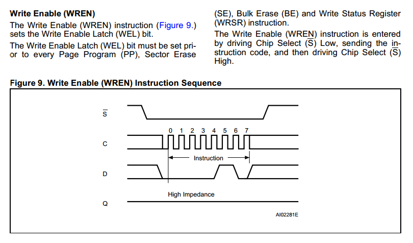
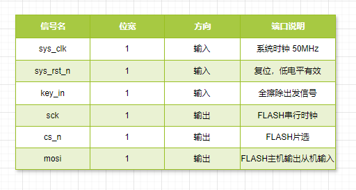
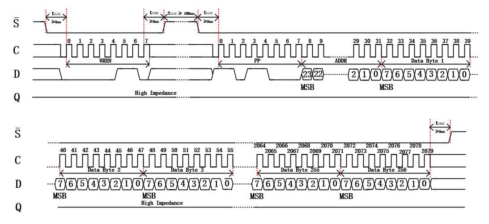
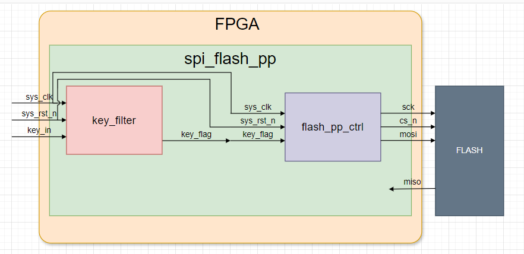

# 基于SPI协议的FLASH驱动控制

本实验旨在通过FPGA实现基于SPI协议的FLASH驱动控制，深入理解SPI通信协议的工作原理，掌握FLASH存储器的读写擦除等基本操作，并锻炼使用硬件描述语言进行数字系统设计的能力。通过本实验的学习，将为后续更复杂的FPGA项目开发奠定坚实的基础。

## 1.实验目标

本工程实验目标分为5个部分，包括全擦除be，扇区擦除se，页写入pp，连续写sw，读数据rd，涵盖了使用SPI对FLASH芯片进行操作的整个流程

**实验目标：**

1. 事先向Flash芯片中烧录流水灯程序，FPGA上电执行流水灯程序，下载Flash芯片全擦除程序到FPGA内部SRAM并执行，擦除Flash芯片中烧录的流水灯程序，FPGA重新上电后，无程序执行。

2. 编写扇区擦除工程，擦除事先烧录到Flash中的流水灯程序所占的某个扇区，使流水灯程序不能正常工作。在此次实验工程，我们选择擦除第0个扇区，擦除地址为24’h00_04_25。

3. 使用页写指令，向Flash中写入N字节数据，N为整数，且大于0小于等于256。在本本实验中我们向Flash芯片中写入0-99，共100字节数据，数据初始地址为24’h00_04_25。

4. 使用页写指令，将串口发送过来的连续不定量数据写入Flash。本实验中，我们发送数据为100字节，串口波特率位115200。

5. 使用页写或连续写操作向Flash芯片写入数据，再使用数据读操作读取之前写入数据，将读取的数据使用串口传回PC机，使用串口助手传回数据并与之前写入数据比较，判断正误。

   注意：在向Flash芯片写入数据之前，先要对芯片执行全擦除操作。

**在实验过程中要求掌握以下要点：**

1. **SPI协议的工作原理**：包括SPI的基本通信机制、信号线定义（SCLK、MOSI、MISO、CS）、时钟极性和相位（CPOL和CPHA）的配置，以及数据传输的时序要求。
2. **FLASH芯片的操作特性**：了解FLASH存储器的基本结构（如页、扇区、块），掌握其常用的操作命令（如读数据、页编程、扇区擦除、芯片擦除等），以及FLASH芯片的地址模式、状态寄存器的使用方法。

## 2.硬件资源

**EBAZ4205 开发板**：

- 核心芯片：搭载了 Xilinx Zynq - 7000 系列的 XC7Z010 - CLG400C 芯片，该芯片集成了 ARM Cortex - A9 双核处理器与 Artix - 7 FPGA 架构，为系统提供了强大的处理能力。
- 存储资源：板载有一定容量的 DDR3 内存，为系统运行提供了充足的数据存储空间，无论是存储图像数据、程序代码，还是在运行过程中的临时数据缓存，DDR3 内存都能胜任，确保实验过程中数据的快速读写，保障 VGA 图像显示的流畅性。

**逻辑分析仪**：

逻辑分析仪是监测 SPI 接口信号的关键设备。它能够实时捕获 SCK、MOSI、SS 等信号的时序变化以及传输的数据内容。通过与开发板的连接，逻辑分析仪可以深入分析 SPI 协议的执行情况，帮助我们在实验过程中排查数据传输错误、时序违规等问题，确保 SPI 通信的准确性与稳定性。

**面包板**：

用于搭建 ZYNQ 7010 开发板与 OLED 屏幕之间的临时电路连接。

**W25Q128 FLASH芯片：**

W25Q128JV（128M 位）串行闪存为空间、引脚和功率有限的系统提供了存储解决方案。25Q 系列提供的灵活性和性能远远超过普通串行闪存设备。它们非常适合对 RAM 进行代码映射，直接从双/四通道 SPI （XIP） 执行代码，以及存储语音、文本和数据。该器件采用 2.7V 至 3.6V 单电源供电，关断时电流消耗低至 1μA。所有器件均采用节省空间的封装。

W25Q128JV 阵列被组织成 65,536 个可编程页面，每个页面 256 字节。一次最多可以编程 256 字节。页面可以以 16 个组（4KB 扇区擦除）、128 个组（32KB 块擦除）、256 组（64KB 块擦除）或整个芯片（芯片擦除）进行擦除。W25Q128JV 分别有 4096 个可擦除扇区和 256 个可擦除块。4KB 的小扇区为需要数据和参数存储的应用程序提供了更大的灵活性。（参见图 2。

W25Q128JV 支持标准串行外设接口 （SPI）、双/四通道 I/O SPI：串行时钟、片选、串行数据 I/O0 （DI）、I/O1 （DO）、I/O2 和 I/O3。支持高达 133MHz 的 W25Q128JV SPI 时钟频率，当使用快速读取双/四通道 I/O 时，双 I/O 的等效时钟速率为 266MHz （133MHz x 2），四通道 I/O 的等效时钟速率为 532MHz （133MHz x 4）。这些传输速率可以胜过标准的异步 8 位和 16 位并行闪存。

此外，该器件还支持 JEDEC 标准制造商和设备 ID 和 SFDP，以及一个 64 位唯一序列号和三个 256 字节安全寄存器。

## 3.理论知识

### 3.1 SPI

#### 3.1.1 SPI介绍

SPI 的全称是 Serial Peripheral Interface，即串行外设接口，是摩托罗拉（Motorola）公司开发的一种用于微控制器（MCU）与各种外围设备之间进行通信的接口标准。广泛应用于嵌入式系统、电子设备等领域，用于连接如传感器、存储设备、显示设备等各种外围设备，实现数据的传输和交互。

SPI 通讯协议的优点是支持全双工通信，通讯方式较为简单，且相对数据传输速率较快；缺点是没有指定的流控制，没有应答机制，在数据可靠性上有一定缺陷。

#### **3.1.2 SPI物理层**

SPI 通讯设备的通讯模式是主从通讯模式，通讯双方有主从之分，根据从机设备的数量，SPI 通讯设备之间的连接方式可分为**单从机模式**和**多从机模式**。多从机模式下每个从机都有各自独立的 CS 线连接到主设备不同的 I/O 端口。


SPI总线传输中一般包含四根线：

- **SCK（Serial Clock）**：时钟信号线，由主设备产生，用于同步数据传输，决定了数据传输的速率。

- **MOSI（Master Out Slave In）**：主设备输出、从设备输入线，主设备通过此线向从设备发送数据。

- **MISO（Master In Slave Out）**：主设备输入、从设备输出线，从设备利用该线向主设备返回数据。

- **CS（Chip Select）**：从设备选择线，当主设备要与某个特定从设备通信时，拉低该从设备对应的 CS 线，以选中它，一个主设备可以连接多个从设备。

#### **3.1.3 SPI协议层**

1. **数据传输模式**

   SPI 协议定义了四种数据传输模式，主要区别在于**时钟极性（CPOL）**和**时钟相位（CPHA）**：

   **时钟极性（CPOL）**决定了 SPI 总线空闲时 SCK 信号的电平状态。CPOL=1表示空闲时为高电平,CPOL=0表示空闲时为低电平。

   **时钟相位（CPHA）**用于确定数据是在时钟信号的哪个边沿进行采样和输出。CPHA=0表示在时钟信号SCK的第一个跳变沿进行采样，CPHA=1表示在第二个边沿进行采样。

   四种数据传输模式的时序图如下：
   

   - **Mode 0（CPOL = 0，CPHA = 0）**：时钟空闲时为低电平，数据在时钟的上升沿被采样，主设备在第一个上升沿将数据的最高位（假设高位在前传输）送上 MOSI 线，同时从设备也在该上升沿将数据最高位送上 MISO 线，随后在每个上升沿依次传输后续数据位。
   - **Mode 1（CPOL = 0，CPHA = 1）**：同样时钟空闲为低电平，但此时数据在时钟的下降沿被采样，在上升沿进行数据更新准备。主设备在上升沿更新要发送的数据位，从设备在下降沿读取主设备发送的数据并准备返回数据，二者在时钟沿的交互配合更为精细，适用于对时序有一定要求但速率适中的通信，像部分早期的存储芯片读写。
   - **Mode 2（CPOL = 1，CPHA = 0）**：时钟空闲变为高电平，数据在时钟下降沿采样，主从设备操作与 Mode 0 类似，只是时钟极性反转。在一些特殊的工业控制领域，若设备的时钟默认高电平更利于系统同步，可能会采用此模式，它可以和其他采用低电平空闲时钟的设备区分开，避免时钟信号干扰。
   - **Mode 3（CPOL = 1，CPHA = 1）**：时钟空闲高电平，数据在时钟上升沿采样，是 Mode 2 的一种互补模式，数据传输的时机与 Mode 1 相对应，在高速、复杂的 SPI 通信系统中，根据不同设备的兼容性和系统整体的时序规划，会选择 Mode 3 来优化数据传输流程，确保数据准确无误传输。

#### **3.1.4 SPI协议传输过程**

   以模式0为例，下面是SPI通信过程的时序图。   

**CS_N（片选信号）：**在时刻 1 到时刻 2 之间，CS_N 为高电平，此时从设备未被选中，处于空闲状态。在时刻 2，CS_N 变为低电平，从设备被选中，开始准备接收或发送数据，直到时刻 10，CS_N 再次变为高电平，通信结束，从设备回到空闲状态。
**SCK（时钟信号）：**由于 CPOL = 0，时钟空闲时为低电平。在每个时钟周期内，数据在时钟的上升沿被采样。从时刻 2 开始，SCK 产生一系列脉冲，每个脉冲的上升沿对应着 MOSI 和 MISO 线上数据的采样时刻。
**MOSI（主设备输出从设备输入线）：**在时钟的控制下，主设备从高位（D7）开始，依次在每个时钟周期的上升沿将数据位发送到 MOSI 线上，直到低位（D0）发送完毕。
**MISO（主设备输入从设备输出线）：**从设备在每个时钟周期的上升沿将数据位发送到 MISO 线上，与 MOSI 的数据传输同步，也是从高位（D7）到低位（D0）。

#### **3.1.5 SPI 的优缺点**

- 优点
  1. 简单高效，SPI 接口相对简单，硬件连接上只需要四条线（不包括电源和地线），相比于其他通信接口（如 I2C 需要考虑复杂的起始信号、停止信号和应答机制等），SPI 的协议和时序更容易理解和实现。它的数据传输速度较快，能够达到较高的通信频率，一般可以达到几 MHz 甚至几十 MHz，适用于对数据传输速度要求较高的应用场景。
  2. 全双工通信，由于可以同时进行双向数据传输，能够提高数据交互的效率。例如，在一个需要实时反馈的传感器系统中，传感器可以将采集到的数据发送给主设备，同时主设备也可以向传感器发送配置命令等数据。
- 缺点
  1. 没有标准的寻址机制，与 I2C 不同，SPI 没有内置的设备寻址方式。这意味着如果有多个从设备连接到 SPI 总线上，主设备需要为每个从设备单独提供一个片选（SS）信号，并且在通信时要手动控制每个 SS 信号来选择不同的从设备，当从设备数量较多时，会占用较多的引脚资源。
  2. 布线要求相对较高，因为 SPI 是同步通信，时钟信号（SCK）对于数据传输的同步非常关键。在高速数据传输或者长距离布线时，要特别注意信号的完整性，避免信号干扰和时钟抖动等问题，对 PCB（印刷电路板）的布线设计有一定的要求。

### 3.2 W25Q128 FLASH 芯片


## 4.实战演练

### 4.1 SPI-Flash全擦除实验

Flash的全擦除，顾名思义就是将Flash所有的存储空间都进行擦除操作，使各存储空间内存储数据恢复到初始值。

实验目标：事先向Flash芯片中烧录流水灯程序，FPGA上电执行流水灯程序，下载Flash芯片全擦除程序到FPGA内部SRAM并执行，擦除Flash芯片中烧录的流水灯程序，FPGA重新上电后，无程序执行。

#### 4.1.1 操作时序

下面结合数据手册来详细说明一下SPI-Flash芯片全擦除操作的相关内容。

**全擦除(Bulk Erase)**操作，简称BE，**操作指令为8’b1100_0111(C7h)**，具体见下图


由数据手册中全擦除介绍部分可知，全擦除指令是将Flash芯片中的所有存储单元设置为全1，在Flash芯片写入全擦出指令之前，需要先写入写使能(WREN)指令，将芯片设置为写使能锁存(WEL)状态；随后要拉低片选信号，写入全擦除指令，在指令写入过程中，片选信号始终保持低电平，待指令被芯片锁存后，将片选 信号拉高；全擦除指令被锁存并执行后，需要等待一个完整的全擦除周期(tBE)，才能完成Flash芯片的全擦除操作。全擦除操作的详细介绍及时序图，具体见图


全擦除(BE)指令写入前必须先对Flash芯片写入写使能(WREN)指令，使芯片处于写使能锁存(WEL)状态。此状态下写入全擦除指令才会被Flash芯片响应，否则，全擦除指令无效。所以，接下来详细说明一下写使能指令的相关内容。

写使能(Write Enable)指令，简称WREN，操作指令为8’b0000_0110(06h)，具体见下图。


由数据手册中写使能介绍部分可知，写使能指令可将Flash芯片设置为写使能锁存(WEL)状态；在每一次页写操作(PP)、扇区擦除(SE)、全擦除(BE)和写状态寄存器(WRSR)操作之前，都需要先进行写使能指令写入操作。操作时序为先拉低片选信号，写入写使能指令，在指令写入过程中，片选信号始终保持低电平 ，指令写入完成后，将片选信号拉高。写使能指令的详细介绍及时序图如下



如图所示，相关操作指令在写入芯片之前需要先拉低片选信号，在片选信号保持低电平时将指令写入数据输入端口，指令写入完毕，拉高片选信号，数据输出端口在指令写入过程中始终保持高阻态。

图中定义了许多时间参数，其中有三个我们需要格外注意，分别是tSLCH、tCHSH和tSHSL。时间参数参考数值，具体见下图


由图可知，片选信号自下降沿始到第一个有效数据写入时止，这一段等待时间定义为片选信号有效建立时间 tSLCH，这一时间段必须大于等于5ns；片选信号自最后一个有效数据写入时始到片选信号上升沿止，这一段等待时间定义为片选信号有效保持时间tCHSH，这一时间段必须大于等于5ns；片选信号自上一个上升沿始到下一个下降沿止，这一段等待时间定义为片选信号高电平等待时间tSHSL，这一时间段必须大于等于100ns。

到这里已经介绍了写使能指令、全擦除指令的相关内容和操作时序，对Flash芯片的串行输入时序也做了说明。综上所述，绘制完整全擦除操作时序图如图


#### 4.1.2 程序设计

##### 4.1.2.1 总体模块设计

整个全擦除工程调用3个模块，按键消抖模块(key_filter)， Flash全擦除模块(flash_be_ctrl)和顶层模块(spi_flash_be)。模块整体框图和功能描述如下图和表


| 模块名称      | 功能描述           |
| ------------- | ------------------ |
| spi_flsah_be  | 全擦除工程顶层模块 |
| key_filter    | 按键消抖模块       |
| flash_be_ctrl | 全擦除模块         |

在整个系统工程中，外部按键负责产生全擦除触发信号，信号由外部进入FPGA，经顶层模块(spi_flash_be)进入按键消抖模块(key_filter)，触发信号经消抖处理后输出进入Flash全擦除模块(spi_flash_be)，触发信号有效，Flash全擦除模块工作， 生成并输出串行时钟信号(sck)、片选信号(cs_n)和主输出从输入信号(mosi)，3路信号输入外部挂载的Flash芯片，Flash芯片接收到全擦除指令，实现Flash芯片全擦除。

##### 4.1.2.2 全擦除模块

Flash全擦除模块是本实验工程的核心模块，其生成并输出时钟、片选和数据信号，向Flash芯片发送全擦除指令，控制Flash芯片实现全擦除。

- **模块框图**

  

- **模块端口功能描述**

  

- **波形图绘制**

  Flash全擦除波形图
  

  - **第一部分：**输入信号波形绘制

    系统上电之后，全擦除模块一直处于初始状态，只有当输入的全擦除触发信号key有效时，模块才会开始执行全擦除的相关操作，触发信号是由外部物理按键生成，经由按键消抖模块做消抖处理后传入。除此之外，输入信号还包含时钟信号sys_clk(50MHz)、复位信号sys_rst_n(低电平有效)。

  - **第二部分：**状态机相关信号的波形设计与实现

    由前文可知，一个完整的全擦除操作需要对Flash芯片执行两次指令的写入，分别为写使能指令和全擦除指令，而且在片选信号拉低后指令写入前、指令写入完成后片选信号拉高前，以及两指令写入之间都需要做规定时间的等待。

    对于这一流程操作，我们可以使用状态机来实现。在模块内部声明状态机状态变量state，定义状态机各状态分别为：初始状态(IDLE)、写使能状态(WR_EN)、两指令间等待状态(DELAY)、全擦除状态(BE)。

    状态机状态跳转流程如下：系统上电后，状态机状态变量state一直处于初始状态(IDLE)；当传入的全擦除触发信号key有效时，表示实验工程开始执行对Flash芯片的全擦除操作，状态机跳转到写使能状态(WR_EN)，同时片选信号拉低，选中要进行全擦除操作的Flash芯片；状态跳转到写使能状态且片选信号 拉低后，要进行tSLCH≥5ns的等待时间，等待时间过后对主输出从输入信号写入写使能指令，指令写入完成后需要进行tCHSH≥5ns的等待时间，等待时间过后拉高片选信号，取消对Flash芯片的选择，同时状态机跳转到两指令间等待状态(DELAY)；在此状态等待时间tSHSL≥ 100ns后，状态机跳转到全擦除状态(BE)，同时片选信号拉低，选中已写入写使能指令的Flash芯片；状态机跳转到全擦除状态且片选信号拉低后，要进行tSLCH≥5ns的等待时间，等待时间过后对主输出从输入信号写入全擦除指令，指令写入完成后需要进行tCHSH≥5ns的等待时间，等待时间过后拉高片选信号，取消对Flash芯片的选择，同时状态机跳回初始状态(IDLE)，一次完整的全擦除操作完成。

    **片选信号的等待时间tSHSL、 tCHSH、tSHSL的参数确定。**

    根据芯片手册可知，片选信号等待时间依次为5ns，5ns，100ns，这里设置为依次等待1、1、6个系统时钟周期，

    **状态机状态跳转约束条件的确定。**

    结合上面延时的条件，这里判断当前状态和时钟计数器的值进行状态跳转。

    状态转移图如下图所示
    

  - **第三部分：**输出相关信号的波形设计与实现

    本模块输出信号有3路，分别为片选信号cs_n、串行时钟信号sck和主输出从输入信号mosi。

    本实验使用的Flash芯片使用的是SPI通讯协议的模式0，即CPOL= 0，CPHA=0。空闲状态时SCK串行时钟为低电平；数据采样在SCK时钟的奇数边沿，本模式中，奇数边沿为上升沿；数据更新在SCK时钟的偶数边沿，本模式中，偶数边沿为下降沿。

    在前文中提到FLASH模块输出的串行时钟为12.5MHz，为系统时钟50MHz通过四分频得到。所以在这里需要声明一个四分频计数器，对系统时钟进行四分频，产生串行时钟信号sck。

    串行时钟信号sck生成后，根据SPI模式0通讯时序图，本实验中Flash芯片在串行时钟sck的上升沿进行数据采样，我们需要在sck的下降沿进行传输数据的更新，在sck的下降沿对mosi信号写入写使能指令和全擦除指令。

    片选信号cs_n采用组合逻辑的方法实现，当状态为写使能和全擦除状态时片选信号被拉低。

- **代码编写**

  ```
  module flash_be_ctrl (
      input   wire        sys_clk     ,
      input   wire        sys_rst_n   ,
      input   wire        key         ,
  
      output  reg         sck         ,
      output  wire        cs_n        ,
      output  reg         mosi        
  );
  //parameter define
  parameter IDLE  = 4'b0001 ; //初始状态
  parameter WREN = 4'b0010 ; //写状态
  parameter DELAY = 4'b0100 ; //等待状态
  parameter BE    = 4'b1000 ; //全擦除状态
  
  parameter WR_EN_INST = 8'b0000_0110; //写使能指令
  parameter BE_INST    = 8'b1100_0111; //全擦除指令
  
  //reg define
  
  reg     [7:0]       clk_cnt    ; //系统时钟计数器   
  reg     [3:0]       state      ; //状态机状态
  reg     [1:0]       sck_cnt    ; //串行时钟计数器
  reg     [2:0]       bit_cnt    ; //比特计数器
  //wire define
  
  
  /****************main logic****************/
  //cnt_clk:系统时钟计数器
  always @(posedge sys_clk ) begin
      if (!sys_rst_n) begin
          clk_cnt <= 8'b0;
      end
      else begin
          case(state)
              IDLE: begin
                  clk_cnt <= 8'b0;
              end
              WREN: begin
                  if (clk_cnt == 8'd34) begin
                      clk_cnt <= 8'b0;
                  end
                  else begin
                      clk_cnt <= clk_cnt + 1;
                  end
              end
              DELAY: begin
                  if (clk_cnt == 8'd5) begin
                      clk_cnt <= 8'b0;
                  end
                  else begin
                      clk_cnt <= clk_cnt + 1;
                  end
              end
              BE: begin
                  if (clk_cnt == 8'd33) begin
                      clk_cnt <= 8'b0;
                  end
                  else begin
                      clk_cnt <= clk_cnt + 1;
                  end
              end
              default: begin
                  clk_cnt <= 8'b0;
              end
          endcase
      end
  end
  
  //sck_cnt:串行时钟计数器
  always @(posedge sys_clk ) begin
      if (!sys_rst_n) begin
          sck_cnt <= 8'b0;
      end
      else begin
          case(state)
              IDLE: begin
                  sck_cnt <= 8'b0;
              end
              WREN: begin
                  if (clk_cnt >= 8'd2) begin
                      if (sck_cnt == 2'd3) begin
                          sck_cnt <= 2'd0;
                      end
                      else begin
                          sck_cnt <= sck_cnt + 1;
                      end
                  end
                  else begin
                      sck_cnt <= 2'd0;
                  end
              end
              DELAY: begin
                  sck_cnt <= 2'd0;
              end
              BE: begin
                  if (clk_cnt >= 8'd1) begin
                      if (sck_cnt == 2'd3) begin
                          sck_cnt <= 2'd0;
                      end
                      else begin
                          sck_cnt <= sck_cnt + 1;
                      end
                  end
                  else begin
                      sck_cnt <= 2'd0;
                  end
              end
              default: begin
                  sck_cnt <= 8'b0;
              end
          endcase
      end
          
  end
  
  //bit_cnt:比特计数器
  always @(posedge sys_clk ) begin
      if (!sys_rst_n) begin
          bit_cnt <= 3'd0;
      end
      else begin
          if (state == WREN || state == BE ) begin
              if (sck_cnt == 2'd1 ) begin
                  bit_cnt <= bit_cnt + 1;
              end
              else begin
                  bit_cnt <= bit_cnt;
              end
          end
          else begin
              bit_cnt <= 3'd0;
          end
      end
  end
  //cs_n:片选信号
  assign  cs_n = (state == IDLE || state == DELAY) ? 1'b1 : 1'b0;
  
  //sck:串行时钟
  always @(posedge sys_clk ) begin
      if(!sys_rst_n) begin
          sck <= 1'b0;
      end
      else if (state == WREN || state == BE) begin
          if (sck_cnt == 2'd1 || sck_cnt == 2'd3 ) begin
              sck = ~sck;
          end
          else begin
              sck = sck;
          end
      end
      else begin
          sck <= 1'b0;
      end
  end
  
  //state machine
  //state:两段式状态机第一段，状态跳转
  always@(posedge sys_clk) begin
      if(!sys_rst_n)
          state <= IDLE;
      else begin
          case(state)
              IDLE: if(key == 1'b1)
              state <= WREN;
              WREN: if(clk_cnt == 8'd34)
              state <= DELAY;
              DELAY: if(clk_cnt == 8'd5) begin
                  state <= BE;
              end
              BE: if(clk_cnt == 8'd33) begin
                  state <= IDLE; 
              end
  
              default: state <= IDLE;
          endcase
      end
  end
  
  //mosi:两段式状态机第二段，逻辑输出
  always@(posedge sys_clk or negedge sys_rst_n) begin
      if(sys_rst_n == 1'b0)
          mosi <= 1'b0;
      else if((state == WREN) && (clk_cnt == 8'd1))
          mosi <= 1'b0;
      else if((state == BE) && (clk_cnt == 8'd0))
          mosi <= 1'b0;
      else if((state == WREN)&&(clk_cnt >= 8'd1)&&(sck_cnt == 2'd0))
          mosi <= WR_EN_INST[7 - bit_cnt]; //写使能指令
      else if((state == BE) && (clk_cnt >= 8'd0) && (sck_cnt == 2'd0))
          mosi <= BE_INST[7 - bit_cnt]; //全擦除指令
  end
  endmodule
  ```

- **仿真结果**
  

  

  

##### 4.1.2.3 顶层模块

Flash全擦除模块是本实验工程的核心模块，其生成并输出时钟、片选和数据信号，向Flash芯片发送全擦除指令，控制Flash芯片实现全擦除。

- **模块框图**

  

- **端口功能描述**

  

- **代码编写**

  ```
  module spi_flash_be (
      input   wire        sys_clk     ,
      input   wire        sys_rst_n   ,
      input   wire        key_in      ,
      
      output  wire        cs_n        ,
      output  wire        sck         ,
      output  wire        mosi
  );
  //parameter define
  
  //wire define
  wire key_flag ;
  //reg define
  
  //instance define
  key_filter  key_filter_inst (
      .sys_clk(sys_clk),
      .sys_rst_n(sys_rst_n),
      .key_in(key_in),
      .key_flag(key_flag)
    );
  
  flash_be_ctrl  flash_be_ctrl_inst (
      .sys_clk(sys_clk),
      .sys_rst_n(sys_rst_n),
      .key(key_flag),
      .sck(sck),
      .cs_n(cs_n),
      .mosi(mosi)
  );
  
  endmodule
  ```

#### 4.1.2.4 RTL视图


RTL视图展示信息与顶层模块框图一致，各信号连接正确。

#### 4.1.3 实验结果

##### 4.1.3.1 引脚约束


##### 4.1.3.2 结果验证

将开发板连接到电源、下载器并将逻辑分析仪的一头连接到开发板，另一头连接到PC，连接正确后打开开发板，将程序下载到开发板上。


在分析器中选择SPI模式，按下开发板上的按键，可以发现逻辑分析仪中正确的捕捉到了期望波形，分别为0x06数据和0xC7数据。


### 4.2 SPI-Flash扇区擦除实验

Flash芯片的擦除方式分为全擦除和扇区擦除两种，全擦除的方法已经在上文实现，下面通过实验实现SPI-Flash擦除中的另外一种方式：扇区擦除。

这两种方式擦除方式均可实现Flash芯片的擦除，但两种擦除方式的作用范围不同。

举个例子来说明一下。假设一个Flash芯片有N个扇区，我们在扇区0-扇区n烧录了程序A，在扇区n+1-扇区m烧录了B，因为某些原因我们需要擦除程序A保留程序B，这时我们可以利用扇区擦除指令，擦除扇区0-扇区n中的所有扇区或其中任意扇区，程序A被擦除或不完整，程序均不能执行，Flash中只剩下可执行的程序B。

实验目标：编写扇区擦除工程，擦除事先烧录到Flash中的流水灯程序所占的某个扇区，使流水灯程序不能正常工作。在此次实验工程，我们选择擦除第0个扇区，擦除地址为24’h00_04_25。

#### 4.2.1 操作时序

扇区擦除(Sector Erase)操作，简称SE，操作指令为8’b1101_0000(D8h)，如下图


由数据手册中扇区擦除介绍部分可知，扇区擦除指令是将Flash芯片中的被选中扇区的所有存储单元设置为全1，在Flash芯片写入扇区擦出指令之前，需要先写入写使能(WREN)指令，将芯片设置为写使能锁存(WEL)状态；随后要拉低片选信号，写入扇区擦除指令、扇区地址、页地址和字节地址，在指令、地址写入过程 中，片选信号始终保持低电平，待指令、地址被芯片锁存后，将片选信号拉高；扇区擦除指令、地址被锁存并执行后，需要等待一个完整的扇区擦除周期(tSE)，才能完成Flash芯片的扇区擦除操作。扇区擦除操作的详细介绍及时序图如下


上文全擦除操作中我们提到，扇区擦除(SE)指令写入前必须先对Flash芯片写入写使能(WREN)指令。对于写使能指令和串行输入时序的相关内容，在全擦除实验的操作时序小节已经做了详细介绍，在此不再赘述。结合写使能指令、扇区擦除指令的相关内容和操作时序，绘制完整扇区擦除操作时序图如图


#### 4.2.2 程序设计

##### 4.2.2.1 总体模块设计

整个全擦除工程调用3个模块，按键消抖模块(key_filter)， Flash扇区擦除模块(flash_se_ctrl)和顶层模块(spi_flash_se)。模块整体框图和功能描述如下图和表


| 模块名称      | 功能描述             |
| ------------- | -------------------- |
| spi_flsah_se  | 扇区擦除工程顶层模块 |
| key_filter    | 按键消抖模块         |
| flash_se_ctrl | 扇区擦除模块         |

在整个系统工程中，外部按键负责产生擦除信号，信号由外部进入FPGA，经顶层模块(spi_flash_se)进入按键消抖模块(key_filter)，触发信号经消抖处理后输出进入工程核心模块扇区擦除模块(flash_se_ctrl)，此信号作为触发条件触发Flash扇区擦除模块工作后， 扇区擦除模块输出串行时钟信号(sck)、片选信号(cs_n)和主输出从输入信号(mosi)，3路信号通过顶层模块输入外部挂载的Flash芯片，实现扇区擦除功能。

系统整体包含3个模块，按键消抖模块不再介绍；下面对Flash扇区擦除模块(flash_se_ctrl)和顶层模块(spi_flash_se)进行一下说明。

##### 4.1.2.2 扇区擦除模块

Flash扇区擦除模块是本实验工程的核心模块，其生成并输出时钟、片选和数据信号，向Flash芯片发送扇区擦除指令，控制Flash芯片实现扇区擦除。

- **模块框图**

  

- **模块端口功能描述**

  

- **波形图绘制**

  

  

- **代码编写**

  ```
  module flash_se_ctrl (
      input   wire        sys_clk     ,
      input   wire        sys_rst_n   ,
      input   wire        key         ,
  
      output  reg         sck         ,
      output  wire        cs_n        ,
      output  reg         mosi        
  );
  //parameter define
  parameter IDLE  = 4'b0001 ; //初始状态
  parameter WREN = 4'b0010 ; //写状态
  parameter DELAY = 4'b0100 ; //等待状态
  parameter SE    = 4'b1000 ; //扇区擦除状态
  
  parameter WR_EN_INST = 8'b0000_0110; //写使能指令
  parameter SE_INST    = 8'b1101_1000; //扇区擦除指令
  parameter S_ADDR    = 8'b0000_0000; //扇区地址
  parameter P_ADDR    = 8'b0000_0100; //页地址
  parameter B_ADDR    = 8'b0010_0101; //字节地址
  
  //reg define
  
  reg     [7:0]       clk_cnt    ; //系统时钟计数器   
  reg     [3:0]       state      ; //状态机状态
  reg     [1:0]       sck_cnt    ; //串行时钟计数器
  reg     [2:0]       bit_cnt    ; //比特计数器
  //wire define
  
  
  /****************main logic****************/
  //cnt_clk:系统时钟计数器
  always @(posedge sys_clk ) begin
      if (!sys_rst_n) begin
          clk_cnt <= 8'b0;
      end
      else begin
          case(state)
              IDLE: begin
                  clk_cnt <= 8'b0;
              end
              WREN: begin
                  if (clk_cnt == 8'd34) begin
                      clk_cnt <= 8'b0;
                  end
                  else begin
                      clk_cnt <= clk_cnt + 1;
                  end
              end
              DELAY: begin
                  if (clk_cnt == 8'd5) begin
                      clk_cnt <= 8'd0;
                  end
                  else begin
                      clk_cnt <= clk_cnt + 1;
                  end
              end
              SE: begin
                  if (clk_cnt == 8'd129) begin
                      clk_cnt <= 8'd0;
                  end
                  else begin
                      clk_cnt <= clk_cnt + 1;
                  end
              end
              default: begin
                  clk_cnt <= 8'd0;
              end
          endcase
      end
  end
  
  //sck_cnt:串行时钟计数器
  always @(posedge sys_clk ) begin
      if (!sys_rst_n) begin
          sck_cnt <= 8'd0;
      end
      else begin
          case(state)
              IDLE: begin
                  sck_cnt <= 8'd0;
              end
              WREN: begin
                  if (clk_cnt >= 8'd2) begin
                      if (sck_cnt == 2'd3) begin
                          sck_cnt <= 2'd0;
                      end
                      else begin
                          sck_cnt <= sck_cnt + 1;
                      end
                  end
                  else begin
                      sck_cnt <= 2'd0;
                  end
              end
              DELAY: begin
                  sck_cnt <= 2'd0;
              end
              SE: begin
                  if (clk_cnt >= 8'd1) begin
                      if (sck_cnt == 2'd3) begin
                          sck_cnt <= 2'd0;
                      end
                      else begin
                          sck_cnt <= sck_cnt + 1;
                      end
                  end
                  else begin
                      sck_cnt <= 2'd0;
                  end
              end
              default: begin
                  sck_cnt <= 8'b0;
              end
          endcase
      end
          
  end
  
  //bit_cnt:比特计数器
  always @(posedge sys_clk ) begin
      if (!sys_rst_n) begin
          bit_cnt <= 3'd0;
      end
      else begin
          if (state == WREN || state == SE ) begin
              if (sck_cnt == 2'd1 ) begin
                  bit_cnt <= bit_cnt + 1;
              end
              else begin
                  bit_cnt <= bit_cnt;
              end
          end
          else begin
              bit_cnt <= 3'd0;
          end
      end
  end
  //cs_n:片选信号
  assign  cs_n = (state == IDLE || state == DELAY) ? 1'b1 : 1'b0;
  
  //sck:串行时钟
  always @(posedge sys_clk ) begin
      if(!sys_rst_n) begin
          sck <= 1'b0;
      end
      else if (state == WREN || state == SE) begin
          if (sck_cnt == 2'd1 || sck_cnt == 2'd3 ) begin
              sck = ~sck;
          end
          else begin
              sck = sck;
          end
      end
      else begin
          sck <= 1'b0;
      end
  end
  
  //state machine
  //state:两段式状态机第一段，状态跳转
  always@(posedge sys_clk) begin
      if(!sys_rst_n)
          state <= IDLE;
      else begin
          case(state)
              IDLE: if(key == 1'b1)
              state <= WREN;
              WREN: if(clk_cnt == 8'd34)
              state <= DELAY;
              DELAY: if(clk_cnt == 8'd5) begin
                  state <= SE;
              end
              SE: if(clk_cnt == 8'd129) begin
                  state <= IDLE; 
              end
  
              default: state <= IDLE;
          endcase
      end
  end
  
  
  //mosi:两段式状态机第二段，逻辑输出
  always@(posedge sys_clk or negedge sys_rst_n) begin
      if(sys_rst_n == 1'b0)
          mosi <= 1'b0;
      else if((state == WREN) && (clk_cnt == 8'd1))
          mosi <= 1'b0;
      else if((state == SE) && (clk_cnt == 8'd0))
          mosi <= 1'b0;
      else if((state == WREN)&&(clk_cnt >= 8'd1)&&(sck_cnt == 2'd0))
          mosi <= WR_EN_INST[7 - bit_cnt]; //写使能指令
      else if((state == SE) && (clk_cnt <= 8'd32) &&(clk_cnt >= 8'd0) && (sck_cnt == 2'd0 ||sck_cnt == 2'd3 ))
          mosi <= SE_INST[7 - bit_cnt]; //扇区擦除指令
      else if((state == SE) && (clk_cnt <= 8'd64) &&(clk_cnt >= 8'd32) && (sck_cnt == 2'd0||sck_cnt == 2'd3))
          mosi <= S_ADDR[7 - bit_cnt]; //扇区地址
      else if((state == SE) && (clk_cnt <= 8'd96) &&(clk_cnt >= 8'd64) && (sck_cnt == 2'd0||sck_cnt == 2'd3))
          mosi <= P_ADDR[7 - bit_cnt]; //页地址
      else if((state == SE) && (clk_cnt <= 8'd128) &&(clk_cnt >= 8'd96) && (sck_cnt == 2'd0||sck_cnt == 2'd3))
          mosi <= B_ADDR[7 - bit_cnt]; //字节地址  
  end 
  
  endmodule
  ```

- **仿真测试**

  

  

### 4.3 SPI-Flash页写实验

实验目标：使用页写指令，向Flash中写入N字节数据，N为整数，且大于0小于等于256。在本本实验中我们向Flash芯片中写入0-99，共100字节数据，数据初始地址为24’h00_04_25。

4.3.1 操作时序

页写(Page Program)操作，简称PP，操作指令为8’b0000_0010(02h)


由数据手册中页写操作介绍部分可知，页写指令是根据写入数据将存储单元中的“1”置为“0”，实现数据的写入。在写入页写指令之前，需要先写入写使能(WREN)指令，将芯片设置为写使能锁存(WEL)状态；随后要拉低片选信号，写入页写指令、扇区地址、页地址、字节地址，紧跟地址写入要存储在Flash的字节数据， 在指令、地址以及数据写入过程中，片选信号始终保持低电平，待指令、地址、数据被芯片锁存后，将片选信号拉高；片选信号拉高后，等待一个完整的页写周期(tPP)，才能完成Flash芯片的页写操作。

还要注意的是，Flash芯片中一页最多可以存储256字节数据，这也表示页写操作一次最多向Flash芯片写入256字节数据。页写指令写入后，随即写入3字节数据写入首地址，首地址为扇区地址、页地址、字节地址组成，扇区地址与页地址是确定数据写入Flash的特定扇区的特定页，字节地址位再该页数据写入的字节首地址。

当数据写入的字节首地址为该页的首地址，即字节首地址为8’b0000_0000，数据写入个数为0-256字节，数据可以被正确写入Flash芯片；

当数据写入的字节首地址不是该页的首地址，即字节首地址不是8’b0000_0000，数据写入个数为0-256字节，若数据写入个数少于字节首地址地址到末地址之间的存储单元个数，数据可以被正确写入Flash芯片；若数据写入个数多于字节首地址地址到末地址之间的存储单元个数，等于字节首地址地址到末地址之间的存 储单元个数的数据可以被正确写入Flash芯片，超出的那部分数据，会以8’b0000_0000为字节首地址顺序写入本页，覆盖改地址之前存储的数据。

例如字节首地址为8’0000_1111，字节首地址地址到末地址之间的存储单元个数为241个，即本页最多可写入241字节数据，若写入数据为200个字节，数据可以被正确写入；若写入数据为256个字节，前241个字节的数据可以正确写入Flash芯片，而超出的15个字节就以本页的首地址8’b0000_000 0为数据写入首地址顺序写入，覆盖本页原有的前15个字节的数据。

当数据写入的字节首地址为该页的首地址，及字节首地址为8’b0000_0000，数据写入个数超出256个字节，前256个字节会按照时序顺序写入256个存储单元，超出部分以本页的首地址8’b0000_0000为数据写入首地址顺序写入，覆盖本页已写入的新数据。

例如写入字节首地址为8’b0000_0000，写入字节数为300个，前256个字节数据按照时序写入存储单元，超出的44个数据会覆盖刚刚写入的前44个数据。

页写操作的详细介绍及时序图如下


结合写使能指令、页写指令的相关内容和操作时序，绘制完整页写操作时序图如图



#### 4.3.2 程序设计

##### 4.3.2.1 总体模块设计

与全擦除工程类似，整个页写工程也分为3个模块，按键消抖模块(key_filter)、页写模块(flash_pp_ctrl)和包含各模块实例化的顶层模块(spi_flash_pp)



| 模块名称      | 功能描述         |
| ------------- | ---------------- |
| spi_flsah_pp  | 页写工程顶层模块 |
| key_filter    | 按键消抖模块     |
| flash_pp_ctrl | 页写模块         |

##### 4.3.2.2 页写模块

- 模块框图

  当有效页写触发信号输入页写模块时，页写模块执行页写操作，输出串行时钟、片选信号和主输出从输入信号。主输出从输入信号输出的数据包括指令、数据地址和待写入数据。

  

- 模块端口功能描述

  

- 时序图

  

- 代码编写

  

- 仿真测试

##### 4.3.2.3 顶层模块


### 4.4 SPI_Flash连续写实验

Flash芯片在使用的时候，常常要连续写入不定量的数据，这时使用页写并不是特别方便， 但我们可以在页写指令的基础上，实现连续写入数据的操作。

通过页写指令实现数据的连续写操作，方法有二。其一，每次页写入只写入单字节数据，若想连续写入N字节数据，需要连续执行N次页写操作，；其二，先通过页写指令一次性写满第一页数据，计算剩余数据所占整数页，通过页写指令写满整数页，每次页写指令一次写满一页，剩余不足一页的数据，再通过一次页写指令一次性写入。

第一种方法实现起来较为简单，但数据写入所需时间较长；第二种方法与第一种相比，数据写入时间大大缩短，但实现起来比第一种困难。

实验目标：使用页写指令，将串口发送过来的连续不定量数据写入Flash。本实验中，我们发送数据为100字节，串口波特率位9600。

注意：在向Flash芯片写入数据之前，先要对芯片执行全擦除操作。

#### 4.4.1操作时序

本实验实现的连续写操作是采用刚刚提到的方式一来实现，每次使用页写操作只向Flash芯片写入单字节数据，连续执行多次单字节写入来实现连续写操作。其操作时序与页写时序相同，读者可回顾参阅，此处不再赘述。

#### 4.4.2 程序设计


### 4.5 SPI_Flash读数据实验

#### 4.5.1操作时序

#### 4.5.2 程序设计