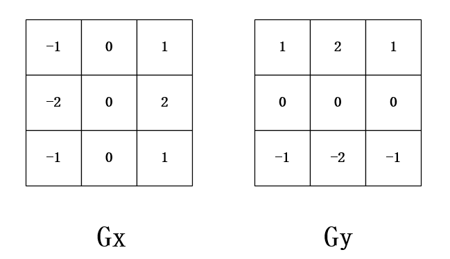
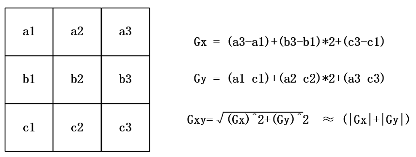
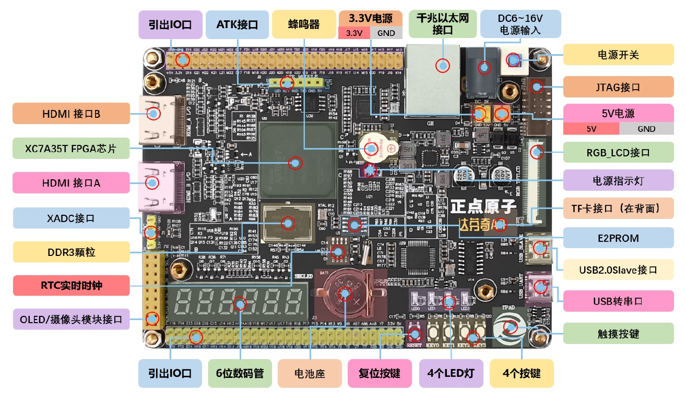

# 基于sobel算法的边缘检测设计与实现

在数字图像处理领域，边缘检测是提取图像关键特征的核心技术之一。Sobel算子因其计算高效、边缘定位准确的特点，被广泛应用于实时图像处理系统中。然而，算法的硬件实现（尤其是基于FPGA的并行化设计）不仅需要对理论有深刻理解，还需掌握硬件描述语言（HDL）与数据流控制技术。本学习笔记以**基于FPGA的Sobel边缘检测系统**为实践目标，通过**理论学习、算法拆解、硬件设计**三部分展开，探索从数学原理到硬件逻辑的完整实现路径。

FPGA凭借其并行计算能力和可重构特性，成为实时图像处理的理想平台。然而，Sobel算法的核心——**3×3卷积运算**——要求对图像数据进行逐行缓存与窗口化处理。这一过程需要高效的数据流管理机制。本项目中，**FIFO（先进先出存储器）**成为关键组件：通过设计三级FIFO缓存三行像素数据，实现卷积窗口的动态更新，为后续的梯度计算提供稳定的数据流支撑。这一实践不仅深化了对Sobel算法的理解，更揭示了硬件设计中数据调度与资源优化的核心逻辑。

## 1.实验目标

实验目标：使用Python软件将图片转换为灰度图像，并且将灰度图像的高 3 位取出存放为txt 文本 ，PC机通过串口uart传输图片数据给FPGA，FPGA通过Sobel算法检测出图片的边缘轮廓，将处理后的图片在HDMI显示器上显示出来。

实验要求：VGA显示模式：640x480@60；传入图片分辨率大小100x100。

## 2.理论知识

### 2.1 边沿检测

边缘是图像的基本特征，包含了用于图像识别的有用信息，在计算机视觉、图像分析和图像处理等应用中起着重要作用。

边缘检测，针对的是灰度图像，顾名思义，检测图像的边缘，是针对图像像素点的一种计算，目的是标识数字图像中灰度变化明显的点，图像的边缘检测，在保留了图像的重要结构信息的同时，剔除了可以认为不相关的信息，大幅度减少了数据量，便于图像的传输和处理。

边缘检查的方法大致可以分为两类：基于查找的一类，通过寻找图像一阶导数中最大值和最小值来检测边界，包括Sobel算法、Roberts Cross算法等；基于零穿越的一类，通过寻找图像二阶导数零穿越来寻找边界，包括Canny算法，Laplacian算法等。读者读到此处，如不理解无需深究，若感兴趣可自行查阅相关资料。

### 2.2 Sobel算法简介

在本实验中，我们用到的是第一类方法中的Sobel算法， Sobel边缘检测算法比较简单，虽然准确度较低，但在实际应用中效率较高，在很多实际应用场合，Sobel算法却是首选，尤其是对效率要求较高，对纹理不太关心的时候。

Soble算法的核心就是Sobel算子，该算子包含两组3x3的矩阵，具体见下图。



对于图像而言，取3行3列的图像数据，将图像数据与对应位置的算子的值相乘再相加，得到x方向的Gx，和y方向的Gy，将得到的Gx和Gy，平方后相加，再取算术平方根，得到Gxy，近似值为Gx和Gy绝对值之和，将计算得到的Gxy与我们设定的阈值相比较，Gxy如果大于阈值，表示该点为边界点，此点显示黑点，否则显示白点。具体见下图。



### 2.3 Sobel算法实现

将Sobel算法在图像边缘检查中的实现分为4步

第1步，通过Gx、Gy的计算公式结合FIFO求和算法求取Gx、Gy的值；
第2步，求得Gx、Gy的绝对值；
第3步，将Gx、Gy带入Gxy计算公式，求得Gxy的值；
第4步，将求得的Gxy与设定的阈值相比较，当Gxy大于等于阈值，赋值rgb为黑色，否则， rgb赋值为白色。

需要注意的是，图片正在经过Sobel算法之后，输出的图片相比于输入时的图片会少2行2列数据，这是因为在求取Gx、Gy时，要使用FIFO求和算法，该算法只有在第2行或第2列数据输入时才开始执行，第0、1行或第0、1列不会进行求和运算，更无数据输出，所以会缺失的2行2列。

## 3.硬件资源

本实验采用正点原子达芬奇A735T开发板，主控芯片为Xilinx Artix7系列XC7A35T，封装FGG484，速率等级：-2。晶振为50MHz有源晶振。

达芬奇 FPGA 开发板的资源图如下



显示屏采用一块7寸大小的显示屏，带有HDMI显示接口，使用Type-c接口供电，分辨率最高支持1024*600，刷新率为60Hz。

## 4.实战演练

### 4.1 图片预处理

在进行Sobel算法之前，先要将图片进行一下预处理，将彩色图片转换成灰度图像，并且将灰度图像的高 3 位取出存放为txt 文本，图解和代码如下。

```
from PIL import Image
import numpy as np
import os

def image_preprocessing(input_path, output_txt_path):
    # 1. 读取图像并调整大小为100x100
    img = Image.open(input_path).convert('RGB')
    img = img.resize((100, 100))
    
    # 2. 转换为灰度图像
    gray_img = img.convert('L')
    
    # 3. 提取灰度值的最高3位 (0-7范围)
    gray_array = np.array(gray_img, dtype=np.uint8)
    high_3bit_array = (gray_array >> 5).astype(np.uint8)  # 右移5位取高3位
    
    # 4. 保存为十六进制文本文件，每行100个数值，两位十六进制空格分隔
    with open(output_txt_path, 'w') as f:
        for row in high_3bit_array:
            # 将每个像素转为两位十六进制（如7 -> "07"）
            hex_line = ' '.join([f"{pixel:02x}" for pixel in row])
            f.write(hex_line + '\n')

if __name__ == "__main__":
    # 自动获取脚本所在目录路径
    script_dir = os.path.dirname(os.path.abspath(__file__))
    input_image = os.path.join(script_dir, "img_100_100.png")  # 输入图像路径
    output_txt = os.path.join(script_dir, "gray_high3bit.txt")      # 输出文本路径
    
    image_preprocessing(input_image, output_txt)

```
### 4.2 程序设计

#### 4.2.1 整体说明

#### 4.2.2 数据求和模块

- **模块框图**
- **模块端口功能描述**

