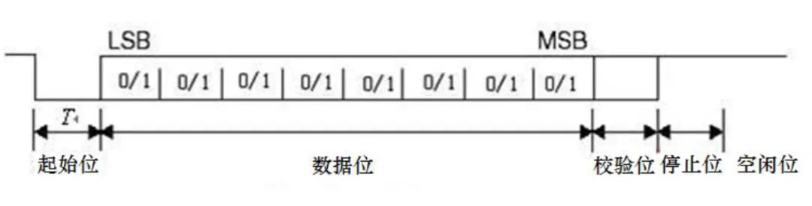
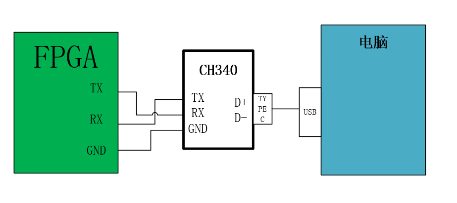
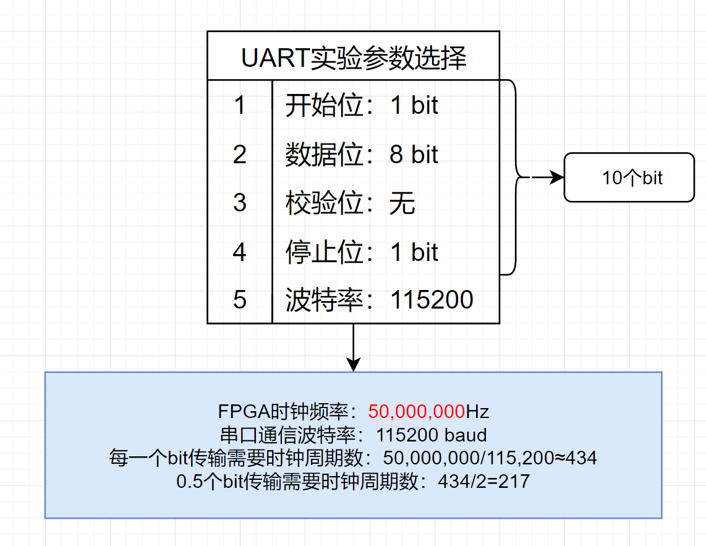
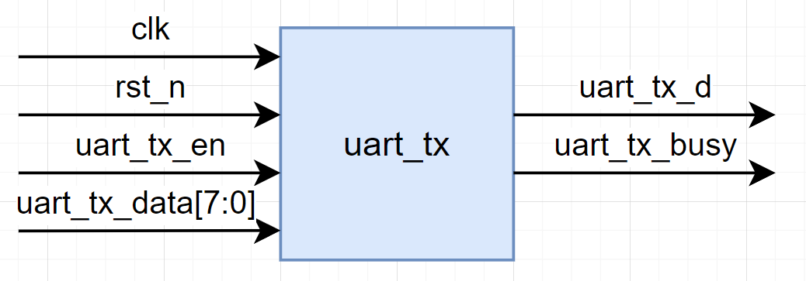
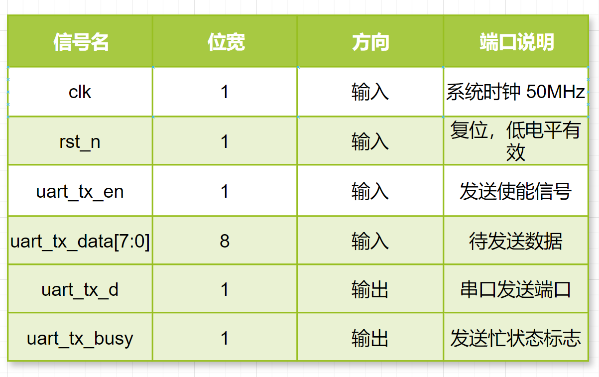
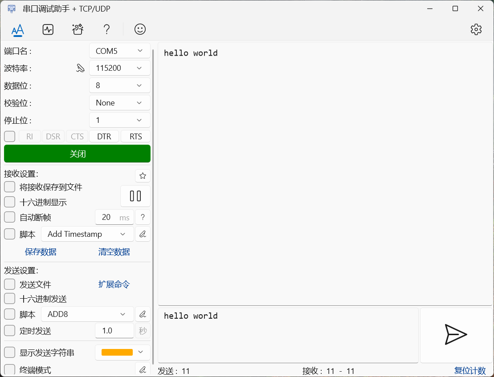
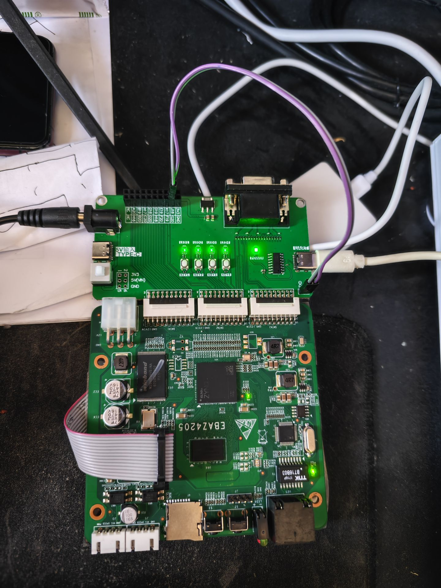

# FPGA实现串口通信

### 1.实验目标

实现上位机与 ZYNQ 7010 开发板 PL 端通过 USB_UART 串口进行数据交互，完成串口数据的环回功能，即上位机发送的数据经开发板接收后再原封不动返回给上位机，**通信参数为波特率 115200，起始位1，停止位 1，数据位 8 位，无校验位，总共10个bit。**

### 2.硬件准备

1. ZYNQ 7010 开发板：确保开发板各功能模块正常，PL 端与 PS 端连接正确，USB_UART 串口硬件无损坏，且已正确连接到电脑。
2. 电脑：安装好串口调试助手软件，具备可用的 USB 接口用于连接开发板。

### 3.理论知识

##### UART介绍

**UART（**Universal Asynchronous Receiver/Transmitter）即**通用异步收发传输器**，是一种广泛应用于电子设备间进行异步串行通信的硬件模块或协议。可以实现全双工接收发送，是异步串行通信的总称，不表示具体的协议。RS232、RS422、RS485等都属于UART，只是它们的接口协议、电气特性、传输速率和机械结构不同而已。

##### 3.1 通信原理

它采用异步通信方式，意味着发送端和接收端不需要共享同一个时钟信号来同步数据传输。数据传输以字符为单位，每个字符由起始位、数据位、奇偶校验位（可选）和停止位组成。

- **起始位**：发送端在发送数据前，先拉低数据线一个比特时间，作为起始标志，通知接收端数据即将到来。
- **数据位**：紧跟起始位之后，是实际要传输的数据内容，数据位长度通常可设置为 5 - 8 位，常见的是 8 位，按低位在前、高位在后的顺序依次传输。
- **奇偶校验位**（可选）：用于简单的错误检测，发送端根据数据位中 1 的个数设置校验位，使包括校验位在内的整个字符中 1 的个数为偶数（偶校验）或奇数（奇校验），接收端依此校验接收数据是否有误。若不启用校验功能，则无此位。
- **停止位**：数据传输完毕后，发送端拉高数据线，持续 1 - 2 个比特时间，作为本次字符传输的结束标志，让接收端知晓一个字符已完整接收，可以准备接收下一个字符。

UART通信的一帧一般由11到12位数据组成。1bit的起始位，检测为低电平表示数据开始传输；紧接着8bits的数据；然后是1bit的奇偶校验位，可以是奇校验或者偶校验；最后是1bit或2bits的停止位，必须为高电平，表示一个字符数据的传输结束。

##### 3.2 波特率

波特率是 UART 通信中的关键参数，它**表示单位时间内传输的码元个数**，单位为波特（Baud）。在实际应用中，常等同于每秒传输的二进制位数（bps），例如波特率 9600，表示每秒传输 9600 个二进制位。发送端和接收端必须事先设置相同的波特率，才能保证数据准确无误地传输，否则接收端采样到的数据将是错误的，无法还原出发送的信息。常用的波特率有 9600、 19200、 38400、57600 以及 115200 等。

在信息传输通道中，携带数据信息的信号单元叫作**码元**（因为串口是 1bit 进行传输的，所以其码元就代表一个二进制数），每秒通过信号传输的码元数称为码元的传输速率，简称“波特率”，常用符号“Baud”表示，其单位为“波特每秒”（Bps）。

通信信道每秒传输的信息量称为**位传输速率**，简称 **“比特率”** ，其单位为 “每秒比特数”（bps）。比特率可由波特率计算得出，公式为**比特率=波特率×单个调制状态对应的二进制位数**。

##### 3.3 电平标准与接口规范

在设置好数据格式及传输速率之后， UART 负责完成数据的串并转换， 而信号的传输则由外部驱动电路实现。 电信号的传输过程有着不同的电平标准和接口规范， 针对异步串行通信的接口标准有 RS232、 RS422、RS485 等， 它们定义了接口不同的电气特性，如 RS-232 是单端输入输出，而 RS-422/485 为差分输入输出等。
开发板上的 UART 串口需要经过 CH340 连接到 USB 再连接到电脑上，在开发板上采用的是USB-Type-c接口，有以下原因。

- **电脑串口的缺失**：现在的电脑普遍不再配备传统的串口，而 UART 串口是开发板与外部设备通信的常用方式之一。CH340 作为 USB 转串口芯片，可以将电脑的 USB 口映射为串口，从而实现开发板与电脑之间的串口通信，满足开发过程中数据传输、程序下载及调试等需求
- **电平转换功能**：开发板上的 UART 串口通常采用 TTL 电平，而电脑 USB 接口的电平标准与之不同。CH340 能够自动完成电平转换，将开发板输出的 TTL 电平信号转换为电脑 USB 接口可识别的电平信号，反之亦然，确保数据的正确传输
- **兼容性和易用性**：CH340 芯片在多种操作系统如 Windows、Linux 和 macOS 上都有对应的驱动程序支持，安装驱动后，电脑能够方便地识别并与开发板进行通信，且其外围元器件只需晶体和电容，硬件设计简单，成本较低，广泛应用于各类开发板中，具有良好的兼容性和经济性

### 4.参数选择

### 5.程序设计

##### 5.1 总体模块设计

从实验目标可知，我们需要通过串口来接收上位机发出的数据，所以我们需要一个**串口接收模块（uart_rx）** ，该模块用于将串口接收端口（**uart_rxd**）上的**串行数据解析成并行数据**， 并将解析完成的并行数据（**uart_rx_data**）作为模块的输出信号来供其它模块使用。
有了串口接收模块模块后，我们还需要一个能将数据发给上位机的**串口发送模块（uart_tx）**，该模块用于将 **uart_rx** 模块解析完成的并行数据数据（uart_rx_data） 转成串行数据，并通过串口发送端口（**uart_txd**）发回上位机， 所以我们需要将 **uart_rx_data** 数据传递给 **uart_tx** 模块， 即 **uart_tx** 模块需要一个用于接收 **uart_rx_data** 数据的输入端口，这里我们将该端口命名为 **uart_tx_data**，且位宽与 **uart_rx_data** 相等。

综上需要实现下面3个模块,分别是

- ##### UART接收模块

- ##### UART发送模块

- ##### 顶层模块

整体系统框图如图

##### 5.2 发送模块设计

- 模块接口框图
  输入信号有系统**时钟信号**，**复位信号**，**发送使能信号**，和**待发送数据**。
  输出信号有**发送忙状态标志**和**串口发送端口**
  接口框图如下：
  
- 接口与功能描述
  
- 波形图绘制
  串口发送模块实际上实现的是一个并转串的功能，需要一个16位的系统时钟计数器(**baud_cnt**)和4位发送数据计数器(**tx_cnt**)，当串口发送模块接收到串口接收模块发送过来的高电平发送使能（**uart_tx_en**）时，拉高发送忙状态标志（**uart_tx_busy**）同时寄存待发送的数据（**tx_data_t**）。 在整个发送过程中发送忙状态标志保持高电平，**tx_cnt** 对串口数据进行计数，同时 **tx_data_t** 的各个数据位依次通过串口发送端 **uart_txd** 发送出去。当 **tx_cnt** 计数到 9 时，串口数据发送完成，开始发送停止位。在一个波特率周期的停止位发送完成后，串口发送过程结束， **uart_tx_busy** 信号拉低，表明串口发送模块进入空闲状态。
  

##### 5.3 接收模块设计

### 6.实验结果

