# FPGA实现VGA驱动协议

### 1.实验目标


### 2.硬件准备


### 3.理论知识

##### **3.1 VGA（Video Graphics Array）简介**

VGA 是一种视频显示标准，用于计算机和显示器之间的通信，传输视频信号。它由IBM在1987年随IBM PS/2系列计算机推出，在很长一段时间内是计算机显示接口的主流标准。VGA是大多数PC制造商所遵循的最后一个IBM图形标准，几乎1990年后的所有PC图形硬件都最低支持VGA。

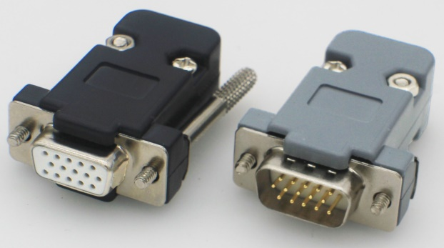

##### **3.2 VGA 通信协议的物理层方面**

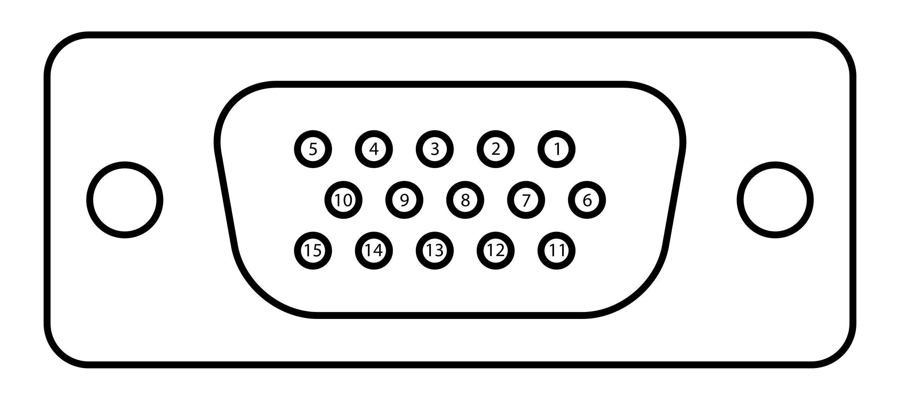

- 引脚定义（以上图母头为例）

  | 引脚       | 名称      | 作用                                                         |
  | ---------- | --------- | ------------------------------------------------------------ |
  | **引脚1**  | RED       | 传输红色视频模拟信号                                         |
  | **引脚2**  | GREEN     | 传输绿色视频模拟信号                                         |
  | **引脚3**  | BLUE      | 传输蓝色视频模拟信号                                         |
  | **引脚4**  | ID2/RES   | 过去为屏幕ID比特2；自DDC2起保留                              |
  | **引脚5**  | GND       | 接地（水平同步）                                             |
  | **引脚6**  | RED_RTN   | 红色接地                                                     |
  | **引脚7**  | GREEN_RTN | 绿色接地                                                     |
  | **引脚8**  | BLUE_RTN  | 蓝色接地                                                     |
  | **引脚9**  | KEY/PWR   | 过去为key；现为 +5V DC                                       |
  | **引脚10** | GND       | 接地（垂直同步，DDC）                                        |
  | **引脚11** | ID0/RES   | 过去为屏幕ID比特0；自E-DDC起保留                             |
  | **引脚12** | ID1/SDA   | 过去为屏幕ID比特1；自DDC2起为[I²C](https://zh.wikipedia.org/wiki/I²C)数据 |
  | **引脚13** | HSync     | 水平(行)同步信号                                             |
  | **引脚14** | VSync     | 垂直(场)同步信号                                             |
  | **引脚15** | ID3/SCL   | 过去为屏幕ID比特3；自DDC2起为[I²C](https://zh.wikipedia.org/wiki/I²C)时钟 |

  由图可知，VGA接口共有15个引脚，分为3排，每排各5个， 按照自上而下、从右向左(母头)的顺序排列。其中第一排的引脚1、2、3和第三排的引脚13、14最为重要。

  引脚13行同步信号(HSYNC)、引脚14场同步信号(VSYNC)，这两个信号，是在VGA显示图像时，负责同步图像色彩信息的同步信号。

  引脚5、9：这两个引脚分别是VGA接口的自测试和预留接口，不过不同生产厂家对这两个接口定义不同，在接线时，两引脚可悬空不接。

  引脚4、11、12、15：这四个是VGA接口的地址码，可以悬空不接。

  引脚6、7、8、10：这四个引脚接地，无需解释。

- **信号传输特性**：VGA 采用**模拟信号**传输，这与后来的数字显示接口如 DVI、HDMI 等不同。由于是模拟信号，信号在传输过程中容易受到干扰，比如外界的电磁干扰可能会导致图像出现雪花、波纹等现象。而且，模拟信号的传输距离相对有限，长距离传输时信号衰减会比较明显，一般建议 VGA 线缆长度不超过 15 米，超过这个长度就可能需要使用信号放大器来保证信号质量。

##### 3.3 **VGA显示原理**

1. **阴极射线管(CRT)显示屏的原理**

   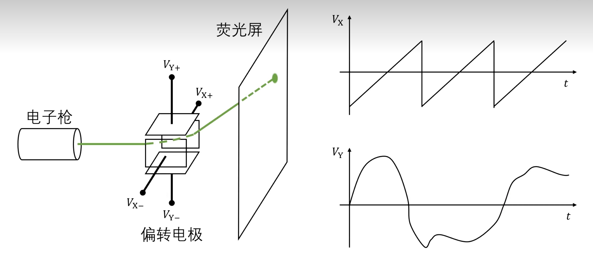

   - CRT显示屏主要包括电子枪、偏转电极和荧光屏三部分。电子枪内部通过加热阴极，使阴极表面的电子获得足够的能量而逸出，形成电子流。这些电子在电场的加速下形成高速电子束。偏转电极用于控制电子束的运动方向，通过在这些电极上施加不同的电压，会产生相应的电场，从而使电子束在水平（X 轴）和垂直（Y 轴）方向上发生偏转。使其能够在荧光屏上扫描出图像。荧光屏表面涂有荧光物质。当高速电子束轰击荧光屏上的荧光物质时，荧光物质会吸收电子的能量而发光，从而在屏幕上形成亮点。不同的荧光物质可以发出不同颜色的光，通过组合不同颜色的荧光点，就可以显示出各种颜色和图像。
   - CRT 显示屏通常采用光栅扫描方式来显示图像。在这种方式下，电子束从屏幕的左上角开始，按照从左到右、从上到下的顺序依次扫描屏幕上的每个像素点。
   - 图中右侧的Vx和Vy随时间变化的波形图展示了这种扫描过程。Vx的波形是一个锯齿波，它控制电子束在水平方向上的扫描，使得电子束从左到右匀速扫描，到达屏幕右端后迅速回到左端，开始下一行的扫描。Vy的波形则控制电子束在垂直方向上的扫描，使得电子束从上到下逐行扫描整个屏幕。

2. **VGA 显示原理**

   VGA显示器显示图像，并不是直接让图像在显示器上显示出来，而是采用扫描的方式，将构成图像的像素点，在行同步信号和场同步信号的同步下，按照从上到下、由左到右的顺序扫描到显示屏上，如下图。

   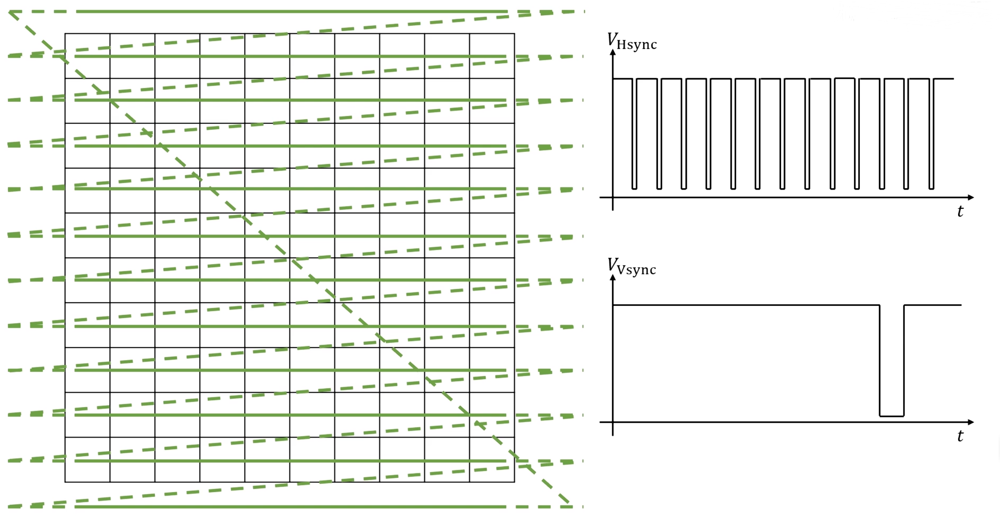

   扫描步骤：

   - 在行、场同步信号的同步作用下，扫描坐标定位到左上角第一个像素点坐标；
   - 自左上角(第一行)第一个像素点坐标，逐个像素点向右扫描(图中水平线)；
   - 扫描到第一行最后一个数据，一行图像扫描完成，进行图像消隐，扫描坐标自第一行行尾转移到第二行行首(图中虚线)；
   - 重复若干次扫描至最后一行行尾，一帧图像扫描完成，进行图像消隐，扫描坐标跳转回到左上角第一行行首(图中对角线)，开始下一帧图像的扫描。

##### **3.4 VGA 时序标准**

VGA接口的详细时序与各个参数的定义如下图。

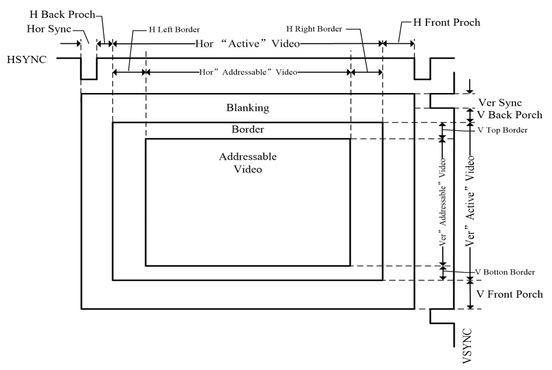

VGA时序由两部分构成，行同步时序与场同步时序

1. 行同步时序

   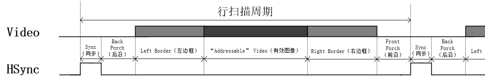

   图中Video代表传输的图像信息，HSync表示行同步信号。HSync自上升沿起到下一个上升沿止为一个完整周期，我们称之为行扫描周期。

   一个完整的行扫描周期，包含6部分：Sync（同步）、Back Porch（后沿）、Left Border（左边框）、“Addressable” Video（有效图像）、Right Border（右边框）、Front Porch（前沿），这6部分的基本单位是pixel（像素），即一个像素时钟周期。

   在一个完整的行扫描周期中，Video图像信息在HSync行同步信号的同步下完成一行图像的扫描显示，Video图像信息只有在“Addressable” Video（有效图像）阶段，图像信息有效，其他阶段图像信息无效。

   HSync行同步信号在Sync（同步）阶段，维持高电平，其他阶段均保持低电平，在下一个行扫描周期的Sync（同步）阶段，HSync行扫描信号会再次拉高，其他阶段拉低，周而复始。

2. 场同步时序

   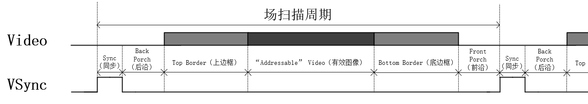

   场同步时序与行同步类似，图中Video代表传输的图像信息，VSync表示场同步信号，VSync自上升沿起到下一个上升沿止为一个完整周期，我们称之为场扫描周期。

   一个完整的场扫描周期，也包含6部分：Sync（同步）、Back Porch（后沿）、Top Border（上边框）、“Addressable” Video（有效图像）、Bottom Border（底边框）、Front Porch（前沿），与行同步信号不同的是，这6部分的基本单位是line（行），即一个完整的行扫描周期。

   VSync行同步信号在Sync（同步）阶段，维持高电平，其他阶段均保持低电平，完成一个场扫描周期后，进入下一帧图像的扫描。

   综上所述，将行同步时序图与场同步时序图结合起来就构成了VGA时序图。

   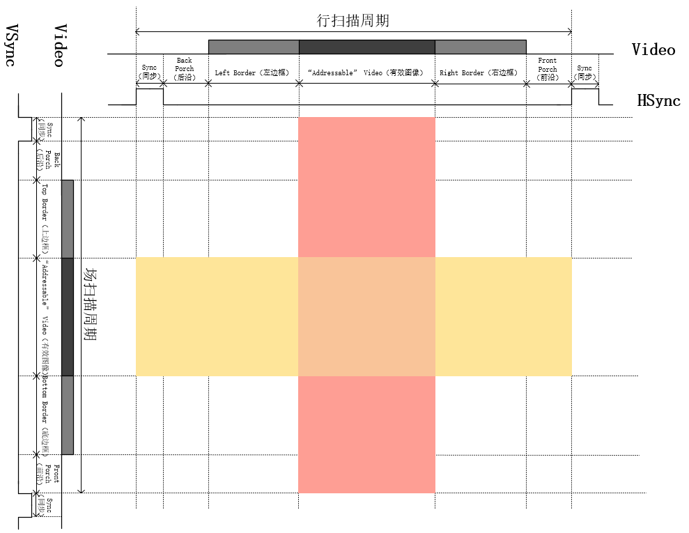

   图中的红色区域表示在一个完整的行扫描周期中，Video图像信息只在此区域有效，黄色区域表示在一个完整的场扫描周期中，Video图像信息只在此区域有效，两者相交的橙色区域，就是VGA图像的最终显示区域。
   需要注意：

   - 行时序以"像素"为单位，场时序以"行"为单位。
   - VGA时序对对行同步时间、 消隐时间、 行视频有效时间和行前肩时间有特定的规范， 场时序也是如此。具体的参数标准如下一节。

##### 3.5 VGA显示模式及相关参数

行同步时序可分为6个阶段，对于这6个阶段的参数是有严格定义的，参数配置不正确，VGA不能正常显示。VGA显示器可支持多种分辨率，不同分辨率对应个阶段的参数是不同的，常用VGA分辨率时序参数如图，更多参数可以参考网站[VGA Signal Timing](http://www.tinyvga.com/vga-timing)。

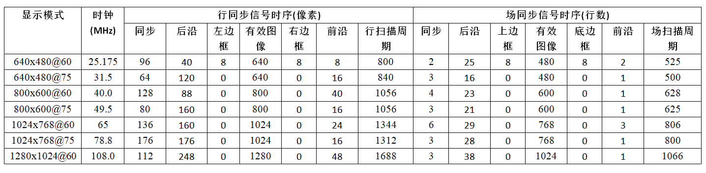

下面以经典VGA显示模式640x480@60为例，解释一下VGA显示的相关参数。

1. 显示模式：640x480@60

   640x480是指VGA的分辨率，640是指有效显示图像每一行有640个像素点，480是指每一帧图像有480行，640 * 480 = 307200 ≈ 300000，每一帧图片包含约30万个像素点，之前某品牌手机广告上所说的30万像素指的就是这个；@60是指VGA显示图像的刷新频率，60就是指VGA显示器每秒刷新图像60次，即每秒钟需要显示60帧图像。

2. 时钟(MHz)：25.175MHz

   这是VGA显示的工作时钟，像素点扫描频率。

3. 行同步信号时序(像素)、场同步信号时序(行数)

   行同步信号时序分为6段，Sync（同步）、Back Porch（后沿）、Left Border（左边框）、“Addressable” Video（有效图像）、Right Border（右边框）、Front Porch（前沿），这6段构成一个行扫描周期，单位为像素时钟周期。

   同步阶段，参数为96，指在行时序的同步阶段，行同步信号需要保持96个像素时钟周期的高电平， 其他几个阶段与此相似。

   场同步信号时序与其类似，只是单位不再是像素时钟周期，而是一个完整的行扫描周期，在此不再赘述。

   在这里，我们看回上图，由图可知，即使VGA显示分辨率相同，但刷新频率不同的话，相关参数也存在差异，如640x480@60、640x480@75，这两个显示模式虽然具有相同的分辨率，但是640x480@75的刷新频率更快，所以像素时钟更快，时序参数也有区别。

   下面以显示模式640x480@60、640x480@75为例，学习一下时钟频率的计算方法。
   $$
   行扫描周期 × 场扫描周期 × 刷新频率 = 时钟频率
   $$

   ****

   640x480@60：

   行扫描周期：800(像素)，场扫描周期：525(行扫描周期) 刷新频率：60Hz

   800 * 525 * 60 = 25,200,000 ≈ 25.175MHz （误差忽略不计）

   640x480@75：

   行扫描周期：840(像素) 场扫描周期：500(行扫描周期) 刷新频率：75Hz

   840 * 500 * 75 = 31,500,000 = 31.5MHz

### 4.实验任务

1. 编写VGA驱动代码，并用ModelSim对时序进行仿真，然后下载到开发板中使屏幕产生彩色条纹，VGA显示模式为640x480@60。
2. 在上个任务的基础上，把一张存在ROM里面的图片数据显示到显示器上。

### 5.参数选择

### 6.设计思路与Verilog代码编写

##### 5.1 总体模块设计

不同VGA模式需要的时钟频率不同，为了提高工程可读性，复用性，模块化的思想，首先需要包括一个时钟生成模块，调用PLL IP核输出指定的时钟频率作为VGA驱动的时钟频率。然后需要一个VGA时序控制模块，驱动VGA图像显示。其次是需要一个VGA图像生成模块，生成VGA待显示图像。最后是一个VGA顶层模块，例化子模块。

总的模块框图与简述如下图所示

vga_clk_gen，vga_timing_ctrl，vga_image_gen，vga_drive


整体工作流程如下：

1. 系统上电后，板卡传入系统时钟(sys_clk)和复位信号(sys_rst_n)到顶层模块；
2. 系统时钟由顶层模块传入时钟生成模块(clk_gen)，分频产生VGA工作时钟(vga_clk)，作为图像数据生成模块(vga_pic)和VGA时序控制模块(vga_ctrl)的工作时钟；
3. 图像数据生成模块以VGA时序控制模块传入的像素点坐标(pix_x,pix_y)为约束条件，生成待显示彩条图像的色彩信息(pix_data)；
4. 图像数据生成模块生成的彩条图像色彩信息传入VGA时序控制模块，在模块内部使用使能信号滤除掉非图像显示有效区域的图像数据，产生RGB色彩信息(rgb)，在行、场同步信号(hsync、vsync)的同步作用下，将RGB色彩信息扫描显示到VGA显示器，显示出彩条图像。

##### **5.2 VGA时钟模块设计**

由实验任务和参数选择可知，本次实验工程中，VGA显示模式为640*480@60，理论时钟频率为25.175MHz，为了便于时钟生成，使用25MHz频率的时钟，而开发板上的晶振频率为50MHz，本模块的作用是将开发板的50MHz晶振的频率经过分频得到25MHz频率的VGA工作时钟信号。

实现时钟分频有两种方法；一是使用IP核，可通过配置相关参数分频或倍频产生多种频率的时钟信号；二是编写逻辑代码 实现时钟分频。在这里，本模块采用第一种方法，调用PLL IP核实现时钟分频。

- **模块接口框图**

  输入信号有**系统时钟信号**和**复位信号**。
  输出信号为25MHz的时钟信号和PLL时钟已锁定信号。
  接口框图如下：

  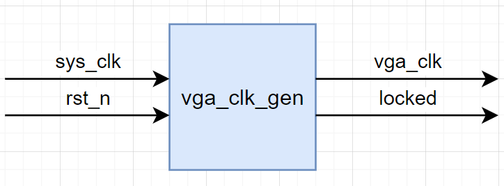

- **接口与功能描述**

  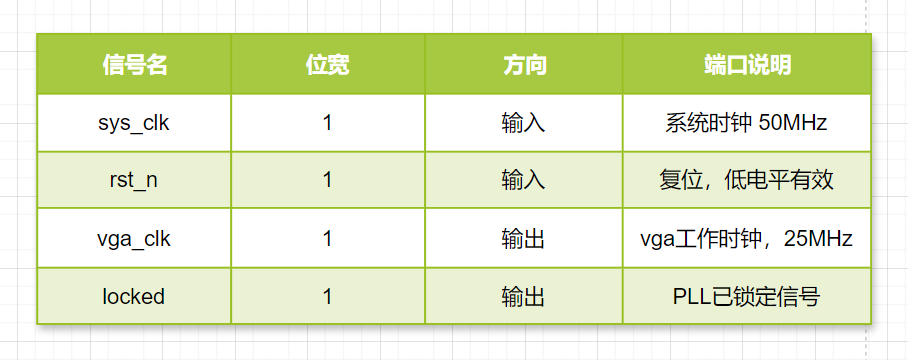

- **代码编写**

  ```
  module vga_clk_gen (
      input  clk,
      input  rst_n,
      output vga_clk,
      output locked 
  );
      clk_wiz_0  clk_wiz_0_inst (
      .vga_clk(vga_clk),
      .resetn(rst_n),
      .locked(locked),
      .sys_clk(clk)
    );
  endmodule
  
  ```

##### **5.3 VGA时序控制模块**

VGA时序控制模块，作用是驱动VGA显示器，将输入模块的彩条图形像素点信息，按照VGA时序扫描显示到VGA显示器上。

- **模块接口框图**

  输入信号有**VGA时钟信号**、**复位信号**和**像素数据信号**。
  输出信号为像素x坐标信号、像素y坐标信号、行同步信号、场同步信号和RBG信号。
  接口框图如下：

  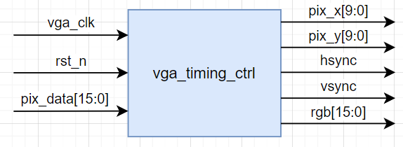

- **接口与功能描述**

  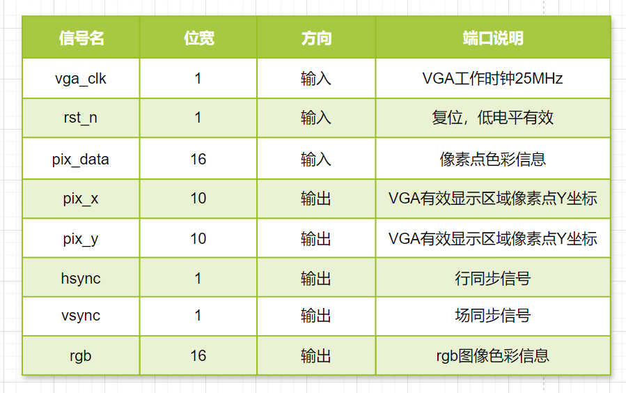

- **波形图绘制**

  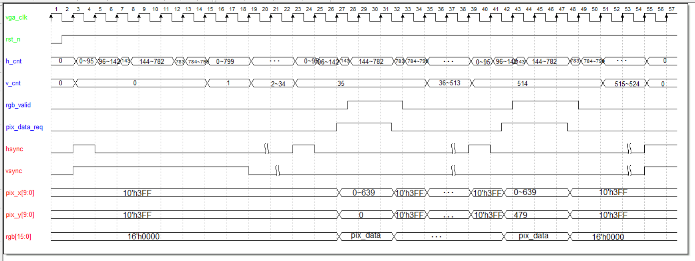

- **代码**

  ```
  module vga_timing_ctrl (
      input  vga_clk,
      input  rst_n,
      input [15:0] pix_data,
      output hsync,
      output vsync,
      output [9:0] pix_x,
      output [9:0] pix_y,
      output [15:0] rgb
  );
      reg [9:0] h_cnt;
      reg [9:0] v_cnt;
      wire rgb_valid;//rgb有效信号
      wire pix_data_req;//像素数据请求信号
  
      //行计数器
      always @(posedge vga_clk ) begin
          if (!rst_n) begin
              h_cnt <= 10'h3FF;
          end
          else begin
              if(h_cnt >= 10'd799) begin
                  h_cnt <= 10'd0;
              end
              else begin
                  h_cnt <= h_cnt + 10'd1;
              end
          end
      end
  
      //场计数器
      always @(posedge vga_clk ) begin
          if (!rst_n) begin
              v_cnt <= 1'b0;
          end
          else if(v_cnt == 10'd524) begin
              v_cnt <= 1'b0;
          end
          else if(h_cnt == 10'd799) begin
              v_cnt <= v_cnt + 1'b1;
          end
          else begin
              v_cnt <= v_cnt;
          end
      end
  
      //行同步信号
      assign hsync = (h_cnt <= 10'd95);
      //场同步信号
      assign vsync = (v_cnt <= 10'd1);
  
      //rgb有效信号
      assign rgb_valid = (h_cnt >= 10'd144) && (h_cnt <= 10'd783) && (v_cnt >= 10'd35) && (v_cnt <= 10'd514);
      //pix_data_req像素数据请求信号
      assign pix_data_req = (h_cnt >= 10'd144 -1'b1) && (h_cnt <= 10'd783 - 1'b1) && (v_cnt >= 10'd35) && (v_cnt <= 10'd514);
  
      //像素x坐标输出
      assign pix_x = pix_data_req ? h_cnt - 10'd143 : 10'h3FF;
      //像素y坐标输出
      assign pix_y = pix_data_req ? v_cnt - 10'd35 : 10'h3FF;
  
      //rgb:输出像素点色彩信息
      assign rgb = (rgb_valid == 1'b1) ? pix_data : 16'b0 ;
  endmodule
  
  ```

##### 5.4 VGA图像数据生成模块

VGA图像生成模块，以VGA时序控制模块传入的图像有效显示区域像素点坐标(pix_x,pix_y)为约束条件，产生VGA彩条图像像素点色彩信息并回传给VGA时序控制模块。

- **模块接口框图**

  输入信号有**VGA时钟信号**、**复位信号**和**像素坐标信号**。
  输出信号为像素色彩信息。
  接口框图如下：

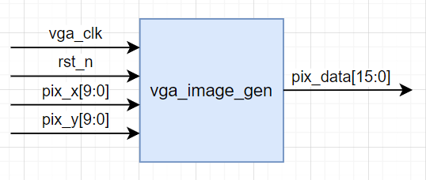

- **接口与功能描述**
  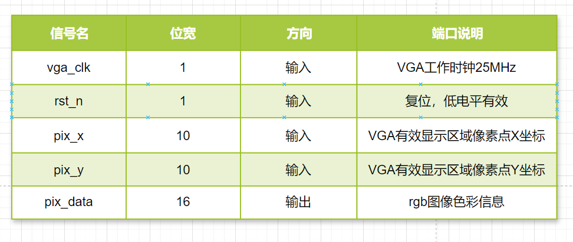

- **波形图绘制**

  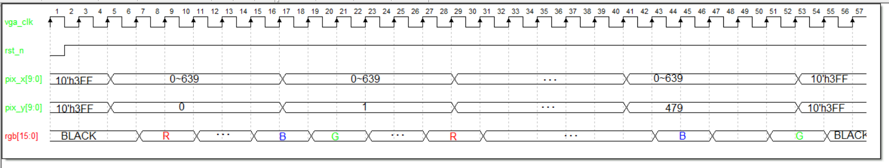

- 代码

  ```
  
  ```

  

### 5.程序设计

##### 5.1 总体模块设计

从实验目标可知，我们需要通过串口来接收上位机发出的数据，所以我们需要一个**串口接收模块（uart_rx）** ，该模块用于将串口接收端口（**uart_rxd**）上的**串行数据解析成并行数据**， 并将解析完成的并行数据（**uart_rx_data**）作为模块的输出信号来供其它模块使用。
有了串口接收模块模块后，我们还需要一个能将数据发给上位机的**串口发送模块（uart_tx）**，该模块用于将 **uart_rx** 模块解析完成的并行数据数据（uart_rx_data） 转成串行数据，并通过串口发送端口（**uart_txd**）发回上位机， 所以我们需要将 **uart_rx_data** 数据传递给 **uart_tx** 模块， 即 **uart_tx** 模块需要一个用于接收 **uart_rx_data** 数据的输入端口，这里我们将该端口命名为 **uart_tx_data**，且位宽与 **uart_rx_data** 相等。

综上需要实现下面3个模块,分别是

- ##### UART接收模块

- ##### UART发送模块

- ##### 顶层模块

整体系统框图如图


##### 5.2 发送模块设计

- **模块接口框图**
  输入信号有系统**时钟信号**，**复位信号**，**发送使能信号**，和**待发送数据**。
  输出信号有**发送忙状态标志**和**串口发送端口**
  接口框图如下：
  

- **接口与功能描述**
  

- **波形图绘制**
  串口发送模块实际上实现的是一个并转串的功能，需要一个16位的系统时钟计数器(**baud_cnt**)和4位发送数据计数器(**tx_cnt**)，当串口发送模块接收到串口接收模块发送过来的高电平发送使能（**uart_tx_en**）时，拉高发送忙状态标志（**uart_tx_busy**）同时寄存待发送的数据（**tx_data_t**）。 在整个发送过程中发送忙状态标志保持高电平，**tx_cnt** 对串口数据进行计数，同时 **tx_data_t** 的各个数据位依次通过串口发送端 **uart_txd** 发送出去。当 **tx_cnt** 计数到 9 时，串口数据发送完成，开始发送停止位。在一个波特率周期的停止位发送完成后，串口发送过程结束， **uart_tx_busy** 信号拉低，表明串口发送模块进入空闲状态。

  

- **代码**

  ```
  module uart_tx(
      input clk,  //50MHz
      input rst_n,
      input uart_tx_en,
      input [7:0] uart_tx_data,
      output reg uart_tx_busy,
      output reg uart_tx_d
  );
  //参数定义
  parameter CLK_FREQ = 50_000_000;    
  parameter UART_BAUD =115200;
  localparam BAUD_CNT_MAX=CLK_FREQ/UART_BAUD;
  
  //寄存器定义
  reg [7:0] tx_data_t;//发送数据寄存器
  reg [3:0] tx_cnt;//发送数据计数器
  reg [15:0] baud_cnt;//波特率计数器
  
  always @(posedge clk)begin
      //如果复位信号有效，那么清除发送数据寄存器，拉低标志位
      if(rst_n==0)begin
          tx_data_t<=8'd10;
          uart_tx_busy<=1'b0;
      end
      //发送使能
      else if(uart_tx_en)begin
          tx_data_t<=uart_tx_data;
          uart_tx_busy<=1'b1;
      end
      //如果计数到停止位，那么拉低标志位，清空数据寄存器
      else if(tx_cnt==4'd9&&baud_cnt==BAUD_CNT_MAX-BAUD_CNT_MAX/16)begin
          tx_data_t<=8'd10;
          uart_tx_busy<=1'b0;
      end
      else begin
          tx_data_t<=tx_data_t;
          uart_tx_busy<=uart_tx_busy;
      end
  end
  
  //波特率计数器
  always @(posedge clk)begin
      if(rst_n==0)begin
          baud_cnt<=16'd0;
      end
      //当处于发送状态时，波特率计数器进行计数
      else if(uart_tx_busy)begin
          if(baud_cnt < BAUD_CNT_MAX - 1'b1)
              baud_cnt <= baud_cnt + 16'b1;
          else
              baud_cnt <=16'd0;
      end
      else
          baud_cnt <=16'd0;
  end
  
  //发送数据计数
  always @(posedge clk)begin
      if(rst_n==0)
          tx_cnt<=4'd0;
      else if(uart_tx_busy)begin
          if (baud_cnt==BAUD_CNT_MAX - 1'b1)
              tx_cnt<=tx_cnt+1'b1;
          else
              tx_cnt<=tx_cnt;
      end
      else
          tx_cnt<=4'd0;
  end
  
  //根据发送计数器对发送端口赋值
  always @(posedge clk)begin
      if(rst_n==0)
          uart_tx_d=1'b1;
      else if(uart_tx_busy)begin 
          case(tx_cnt)
              4'd0 : uart_tx_d <= 1'b0        ; //起始位
              4'd1 : uart_tx_d <= tx_data_t[0]; //数据位最低位
              4'd2 : uart_tx_d <= tx_data_t[1];
              4'd3 : uart_tx_d <= tx_data_t[2];
              4'd4 : uart_tx_d <= tx_data_t[3];
              4'd5 : uart_tx_d <= tx_data_t[4];
              4'd6 : uart_tx_d <= tx_data_t[5];
              4'd7 : uart_tx_d <= tx_data_t[6];
              4'd8 : uart_tx_d <= tx_data_t[7]; //数据位最高位
              4'd9 : uart_tx_d <= 1'b1        ; //停止位
              default : uart_tx_d <= 1'b1;
          endcase
      end
      else
          uart_tx_d=1'b1;
  end
  
  endmodule
  
  ```

- **仿真结果**

  

  

##### 5.3 接收模块设计

- **模块接口框图**

  输入信号有系统**时钟信号**，**复位信号**，和**待接收数据**。
  输出信号有**接收状态标志位**和**接收数据**
  接口框图如下：
  

- **接口与功能描述**
  

- **波形图绘制**
  串口接收模块实质上是实现一个串行数据转并行输出的功能，115200波特率下每个数据位的持续时间是434个系统时钟周期，我们需要一个至少9位的波特率计数器（**baud_cnt**）来计数，这里为了提高模块通用性，使用16位的波特率计数器，串口接收数据还需要一个4位接收数据计数器（**rx_cnt**）来对接收数据进行计数，需要一个8位的接收数据寄存器（**rx_data_t**）存储接收数据

- **代码**

  ```
  module uart_rx(
      input clk,  //50MHz
      input rst_n,
      input uart_rx_d,
      output reg uart_rx_done,
      output reg [7:0] uart_rx_data
  );
  //参数定义
  parameter CLK_FREQ = 50_000_000;    
  parameter UART_BAUD =115200;
  localparam BAUD_CNT_MAX=CLK_FREQ/UART_BAUD;
  
  //寄存器定义
  reg  uart_rx_d0;
  reg  uart_rx_d1;
  reg  uart_rx_d2;
  reg  rx_flag;   //接收数据标志位
  reg [7:0] rx_data_t;//接收数据寄存器
  reg [3:0] rx_cnt;//接收数据计数器
  reg [15:0] baud_cnt;//波特率计数器
  
  //线网定义
  wire start_en;
  
  //捕获接收端口下降沿(起始位)，得到一个时钟周期的脉冲信号
  assign start_en=uart_rx_d2&(~uart_rx_d1)&(~rx_flag);
  
  //针对异步信号的同步处理
  always @(posedge clk) begin
      if(rst_n==0)begin
          uart_rx_d0<=0;
          uart_rx_d1<=0;
          uart_rx_d2<=0;
      end
      else begin
          uart_rx_d0<=uart_rx_d;
          uart_rx_d1<=uart_rx_d0;
          uart_rx_d2<=uart_rx_d1;
      end
  end
  
  //接收标志位赋值
  always @(posedge clk) begin
      if(rst_n==0)
          rx_flag<=1'b0;
      else if(start_en)
          rx_flag<=1'b1;  //检测到起始信号，标志位置1
      else if (rx_cnt==4'd9 && baud_cnt==BAUD_CNT_MAX/2-1'b1)begin//接收结束，标志位置0 
          rx_flag<=1'b0;
      end
      else
          rx_flag<=rx_flag;
  end
  
  
  
  //波特率计数器
  always @(posedge clk)begin
      if(rst_n==0)begin
          baud_cnt<=16'd0;
      end
      //当处于接收状态时，波特率计数器进行计数
      else if(rx_flag)begin
          if(baud_cnt < BAUD_CNT_MAX - 1'b1)
              baud_cnt <= baud_cnt + 16'b1;
          else
              baud_cnt <=16'd0;
      end
      else
          baud_cnt <=16'd0;
  end
  
  //接收数据计数
  always @(posedge clk)begin
      if(rst_n==0)
          rx_cnt<=4'd0;
      else if(rx_flag)begin
          if (baud_cnt==BAUD_CNT_MAX - 1'b1)
              rx_cnt<=rx_cnt+1'b1;
          else
              rx_cnt<=rx_cnt;
      end
      else
          rx_cnt<=4'd0;
  end
  
  //根据发送计数器对接收数据寄存器进行赋值
  always @(posedge clk)begin
      if(rst_n==0)
          rx_data_t=8'd0;
      else if(rx_flag)begin //判断是否处于接收状态
          if(baud_cnt==BAUD_CNT_MAX/2 - 1'b1)begin//判断是否计数到中间
              case(rx_cnt)
                  4'd1 : rx_data_t[0] <= uart_rx_d2;   //寄存数据的最低位
                  4'd2 : rx_data_t[1] <= uart_rx_d2;
                  4'd3 : rx_data_t[2] <= uart_rx_d2;
                  4'd4 : rx_data_t[3] <= uart_rx_d2;
                  4'd5 : rx_data_t[4] <= uart_rx_d2;
                  4'd6 : rx_data_t[5] <= uart_rx_d2;
                  4'd7 : rx_data_t[6] <= uart_rx_d2;
                  4'd8 : rx_data_t[7] <= uart_rx_d2;   //寄存数据的高低位
                 default : ;
              endcase
          end
          else
              rx_data_t<=rx_data_t;
      end
      else
          rx_data_t=8'd0;
  end
  
  //给接收完成信号和接收到的数据赋值
  always @(posedge clk) begin
      if(rst_n==0) begin
          uart_rx_done <= 1'b0;
          uart_rx_data <= 8'b0;
      end
      //当接收数据计数器计数到停止位，且baud_cnt计数到停止位的中间时
      else if(rx_cnt == 4'd9 && baud_cnt == BAUD_CNT_MAX/2 - 1'b1) begin
          uart_rx_done <= 1'b1     ;  //拉高接收完成信号
          uart_rx_data <= rx_data_t;  //并对UART接收到的数据进行赋值
      end    
      else begin
          uart_rx_done <= 1'b0;
          uart_rx_data <= uart_rx_data;
      end
  end
  
  endmodule
  
  ```

- **仿真结果**
  

##### **5.3 顶层模块设计**

在顶层模块中对发送模块和接收模块进行例化。

- 代码编写

  ```
  module uart_loopback(
      input            sys_clk  ,   //外部50MHz时钟
      input            sys_rst_n,   //系外部复位信号，低有效
      
      //UART端口    
      input            uart_rx_d ,   //UART接收端口
      output           uart_tx_d     //UART发送端口
      );
  //参数定义
  parameter CLK_FREQ = 50000000;    //定义系统时钟频率
  parameter UART_BPS = 115200  ;    //定义串口波特率
  
  //线网定义
  wire         uart_rx_done;    //UART接收完成信号
  wire  [7:0]  uart_rx_data;    //UART接收数据
  
  //串口接收模块
  uart_rx #(
      .CLK_FREQ  (CLK_FREQ),
      .UART_BPS  (UART_BPS)
      )    
      u_uart_rx(
      .clk           (sys_clk     ),
      .rst_n         (sys_rst_n   ),
      .uart_rx_d     (uart_rx_d    ),
      .uart_rx_done  (uart_rx_done),
      .uart_rx_data  (uart_rx_data)
      );
  
  //串口发送模块
  uart_tx #(
      .CLK_FREQ  (CLK_FREQ),
      .UART_BPS  (UART_BPS)
      )    
      u_uart_tx(
      .clk          (sys_clk     ),
      .rst_n        (sys_rst_n   ),
      .uart_tx_en   (uart_rx_done),
      .uart_tx_data (uart_rx_data),
      .uart_tx_d    (uart_tx_d    ),
      .uart_tx_busy (            )
      );
  
  endmodule
  ```

- **仿真结果**
  


### 6.实验结果


