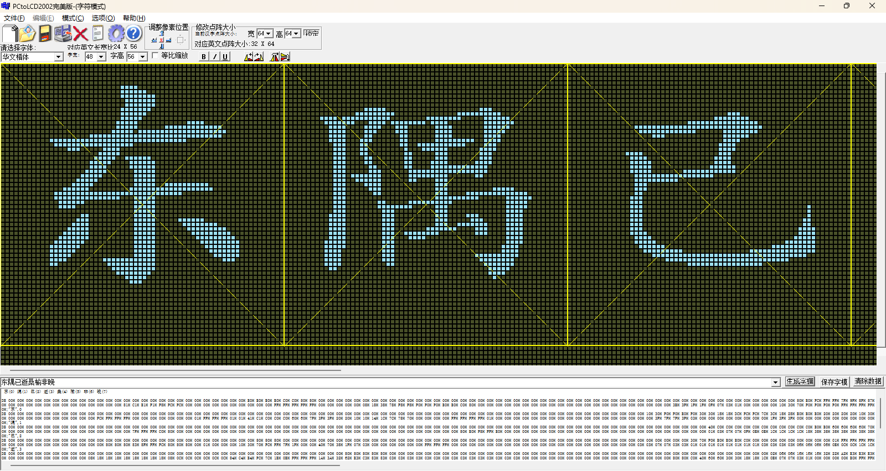

# VGA显示器字符显示

在上一个工程(**VGA显示器显示驱动设计**)中，我成功利用 FPGA 实现了 VGA 显示器驱动设计，并目睹彩色条纹在屏幕上绚丽呈现之后。接下来我将踏入一个更具挑战性与实用性的新工程 ——**VGA 显示器字符显示工程**。此前通过驱动设计让彩色条纹得以展现，如同搭建起了一座通往可视化世界的桥梁基石，使我初步掌握了与 VGA 显示器沟通的方式。而如今，字符显示工程则像是在这座桥梁上铺设更为精致的砖石，赋予其传递信息、表达意义的强大功能。它将不仅仅是视觉上的色彩组合，更是能够精准表意的字符集合，让显示器成为人机交互、信息输出的关键窗口，为后续更为复杂的图形界面乃至系统交互设计开辟道路，开启一场从基础色彩呈现迈向精准信息传递的探索之旅。

## 1.实验目标

**实验目标**：在VGA显示器中心位置显示金色“**东隅已逝 桑榆非晚**”四个汉字，字体为**华文楷体**，字符外的背景颜色为黑色。每个汉字大小为48×56，字模点阵为64×64，VGA显示模式为640*480@60。

实验效果图如下：


在实验过程中要求掌握以下要点：

- 深入理解如何利用 FPGA 精确控制 VGA 显示器，实现 “东隅已逝，桑榆非晚” 这八个汉字的清晰、稳定、美观显示。不仅要掌握基本的字符点阵生成原理，还要学会调整字符大小、字体样式（如仿宋、楷体风格的模拟），确保文字在屏幕中心位置的精准定位，误差控制在极小范围内，提升整体视觉效果。
- 精通汉字在 FPGA 系统中的编码方式，如 GB2312、UTF - 8 等常见编码与 FPGA 内部处理逻辑的转换机制。能够准确地将这八个汉字的编码信息转换为驱动显示器所需的数字信号，保障字符传输与显示的准确性，避免出现乱码、错码等问题。

## 2.理论知识

在上一章节中，已经对VGA显示的基本原理做了详细的阐述，这里不再赘述。

## 3.硬件资源

- **EBAZ4205 开发板**：
  - 核心芯片：搭载了 Xilinx Zynq - 7000 系列的 XC7Z010 - CLG400C 芯片，该芯片集成了 ARM Cortex - A9 双核处理器与 Artix - 7 FPGA 架构，为系统提供了强大的处理能力。
  - 存储资源：板载有一定容量的 DDR3 内存，为系统运行提供了充足的数据存储空间，无论是存储图像数据、程序代码，还是在运行过程中的临时数据缓存，DDR3 内存都能胜任，确保实验过程中数据的快速读写，保障 VGA 图像显示的流畅性。
- **VGA 转接板**：
  - 接口转换功能：转接板的核心作用是实现从开发板引脚到标准 VGA 接口的转换。它将开发板上 FPGA 输出的符合 VGA 时序要求的数字信号，转换为能够被显示器识别的模拟信号，包括红（R）、绿（G）、蓝（B）三基色信号以及行同步（HSync）、列同步（VSync）信号。通过精心设计的电路布局与信号调理，确保信号传输的稳定性与准确性，使得显示器能够清晰、稳定地呈现图像。
  - VGA只能识别模拟信号，而FPGA输出的图像信息为数字信号，在VGA的图像显示中，想要将数字图像信号转换为VGA能够识别的模拟信号有两种方法。其一，使用专业的转换芯片，如常用的转换芯片AD7123，这种方式更为稳定，但成本稍高；其二，使用权电阻网络实现数模转换。在本工程中使用第二种方法。
  - 转接板使用的RGB565图像模式，位宽为16bit，高5位表示红色，低5位表示蓝色，中间6位表示绿色。根据位宽不同，RGB图形格式还包括RGB232、RGB888等，数据位宽越大，表示颜色种类越多，显示图像越细腻。
  - VGA[15:0]表示FPGA传入权电阻网络的数字图像信号，经过权电阻网络的数模转换，生成能够被VGA识别的模拟图像信号VGA_R、VGA_G、VGA_B。
  - 这三路模拟信号的电压范围为0V ~ 0.714V，0V代表无色，0.714V代表满色，电压高低由输入的数字信号决定。输入的R、G、B数字信号不同，输出的三原色红、绿、蓝电压不同，颜色深浅不同，三原色相结合可以产生多种颜色。
  - 转接板部分原理图如下
    

## 4.实战演练

### 4.1 字符取模

在学习模块设计前，首先需要理解一下什么是字符取模。
平时在显示屏或 LED 广告牌上看到的字符，本质上就是点阵。可将点阵类比为书写纸张，点阵中显示的字符如同书写在纸张上的笔顺。通过在显示器或 LED 广告牌上，使类比于纸张的点阵和类比于笔顺的字符显示不同颜色，实现字符的显示。同时，点阵大小决定了显示区域大小、字符大小和清晰度。
一般使用 0、1 的组合来描述点阵，点阵中的每一个数据项表示单个像素点，用单比特表示。其中，字符显示部分的数据项赋值为 1，非字符显示部分的数据项赋值为 0 。这种赋值方式仅区分点阵背景和字符信息，不包含颜色信息。

接下来使用开始对字符进行取模。使用**PCtoLCD2002**软件如图设置对字体进行取模。


保存为BMP文件，再次打开，生成字模，这样就生成了图片整体的字模，如图。


### 4.2程序设计

整体程序设计参考上节（VGA显示器驱动设计），在其工程基础上改进而来.

#### 4.2.1 实验整体框图

整体实验框图如下


图中共包含4个模块，各模块功能如下

| 模块名称        | 功能描述                          |
| --------------- | --------------------------------- |
| vga_char        | 顶层模块                          |
| vga_clk_gen     | 时钟生成模块，生成VGA驱动时钟     |
| vga_timing_ctrl | VGA时序控制模块，控制VGA图像显示  |
| vga_image_gen   | 图像数据生成模块，生成VGA显示图像 |

结合上面图标，整个工程的工作流程如下：

1. 系统上电后，板卡传入系统时钟(sys_clk)和复位信号(sys_rst_n)到顶层模块；
2. 系统时钟直接传入时钟生成模块(vga_clk_gen)，分频产生VGA工作时钟(vga_clk)，作为图像数据生成模块(vga_image_gen)和VGA时序控制模块(vga_timing_ctrl)的工作时钟；
3. 图像数据生成模块以VGA时序控制模块传入的像素点坐标(pix_x,pix_y)为约束条件，生成包含字符信息和背景信息的待显示图像色彩信息(pix_data)；
4. 图像数据生成模块生成的图像色彩信息传入VGA时序控制模块，在模块内部使用使能信号滤除掉非图像显示有效区域的图像数据，产生RGB色彩信息(rgb)，在行、场同步信号(hsync、vsync)的同步作用下，将RGB色彩信息扫描显示到VGA显示器，实现字符显示。

#### 4.2.2 图像生成模块

本模块的目的是，以VGA时序控制模块传入的图像有效显示区域像素点坐标(pix_x,pix_y)为约束条件，产生VGA图像像素点色彩信息pix_data并回传给VGA时序控制模块。在字符显示区域pi_data赋值为金色，其他区域均为黑色。

- **模块接口框图**
  

- **模块端口功能描述**
  

  输入信号中，时钟信号vga_clk，频率为25MHz，为VGA显示器工作时钟，由分频模块产生并输入；复位信号sys_rst_n为顶层模块的rst_n信号输入，低电平有效；(pix_x,pix_y)为VGA有效显示区域像素点坐标，由VGA时序控制模块生并输入。

  输出信号pix_data为图像像素点色彩信息，在VGA有效显示区域像素点坐标(pix_x,pix_y)约束下生成，传输到VGA时序控制模块。

- **波形图绘制**
  

  1. 输入输出信号
     本模块的输入信号包括四路，时钟信号、复位信号和VGA驱动控制模块传入的有效显示区域的坐标信号pix_x、pix_y。时钟信号和复位信号无需多说，对于坐标信号pix_x、pix_y，在上个工程中有详细资料，在此不再赘述

  2. 字符点阵显示区域坐标信号的设计与实现
     首先确定字符有效显示区域，区域大小与字符点阵大小相同，显示区域的像素点与字模点阵中数据项一一对应，当字模点阵中的数据项数值为“1”时，赋值字符颜色给对应像素点；当字模点阵中的数据项数值为“0”时，赋值点阵背景颜色给对应像素点。

     所以为了确定字符点阵显示区域，声明两个变量char_x、char_y，两变量组成字符点阵显示区域坐标，在字符点阵有效显示区域内，char_x信号0-255循环计数，char_y信号0-63循环计数 ，根据坐标(char_x,char_y)寻找字符点阵对应的数据项，根据数据项的数值，赋予对应坐标像素点颜色信息。

- **代码编写**

  ```
  module vga_image_gen (
      input  vga_clk,
      input  rst_n,
      input [9:0] pix_x,
      input [9:0] pix_y,  
      output reg [15:0] pix_data
  );
  
  //parameter definition
  parameter CHAR_B_H= 10'd63 ; //字符开始X轴坐标
  parameter CHAR_B_V= 10'd208 ; //字符开始Y轴坐标
  parameter CHAR_W = 10'd512 ; //字符宽度
  parameter CHAR_H = 10'd64 ; //字符高度
  parameter BLACK = 16'h0000; //黑色
  parameter WHITE = 16'hFFFF; //白色
  parameter GOLDEN = 16'hFEC0; //金色
  
  //wire definition
  wire [9:0] char_x;   //字符X轴坐标
  wire [9:0] char_y;   //字符Y轴坐标
  
  //reg define
  reg [0:511] char [63:0] ; //字符数据
  
  
  /****** main logic ******/
  
  //字符显示坐标
  assign char_x = ((pix_x >= CHAR_B_H) && (pix_y>= CHAR_B_V) && (pix_x <= (CHAR_B_H + CHAR_W)) && (pix_y <= (CHAR_B_V + CHAR_H) )) ? (pix_x - CHAR_B_H - 1'b1):10'h3FF;
  assign char_y = ((pix_x >= CHAR_B_H) && (pix_y>= CHAR_B_V) && (pix_x <= (CHAR_B_H + CHAR_W)) && (pix_y <= (CHAR_B_V + CHAR_H) )) ? (pix_y - CHAR_B_V - 1'b1):10'h3FF;
  
  //pix_data:输出像素点色彩信息,根据当前像素点坐标指定当前像素点颜色数据
  always @(posedge vga_clk ,negedge rst_n) begin
      if (rst_n == 1'b0) begin
          pix_data <= 16'h0000;
      end 
      else begin
          if ((char_x == 10'h3FF) || (char_y == 10'h3FF)) begin
              pix_data <= BLACK;
          end 
          else begin
              pix_data <= char[char_y][char_x] ? GOLDEN : BLACK;
          end
      end
  end
  
  //char:字符数据初始化
  always @(posedge vga_clk ) begin
      char[0]  <= 512'h00000000000000000000000000000000000000000000000000000000000000000000000000000000000000000000000000000000000000000000000000000000;
      char[1]  <= 512'h00000000000000000000000000000000000000000000000000000000000000000000000000000000000000000000000000000000000000000000000000000000;
     /********/
     //....
     /********/
      char[62] <= 512'h00000000000000000000000000000000000000000000000000000000000000000000000000000000000000000000000000000000000000000000000000000000;
      char[63] <= 512'h00000000000000000000000000000000000000000000000000000000000000000000000000000000000000000000000000000000000000000000000000000000;
  end
  endmodule
  ```

- **仿真波形分析**
  
  

  #### 

 #### 4.2.3 RTL视图

  
RTL视图展示信息与顶层模块框图一致，各信号连接正确。

## 5 实验结果

### 5.1 引脚约束

根据原理图，管脚的分配如下图所示。


### 5.2 结果验证

将开发板连接到电源、下载器并将VGA接口的一头连接到开发板，另一头连接到显示器，连接正确后打开开发板，将程序下载到开发板上。

程序下载完成后，显示器显示图像如下图所示，在屏幕中央显示8个金色"东隅已逝桑榆非晚"汉字，和预期结果一致。


