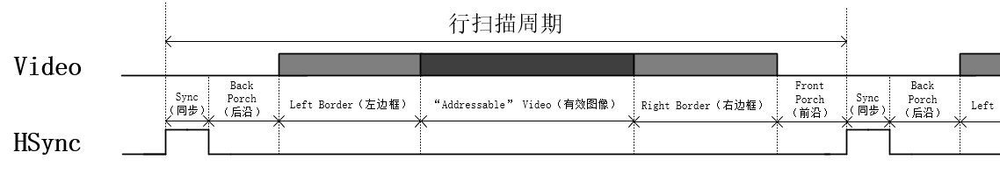

# FPGA实现VGA驱动协议

### 1.实验目标

- 使用 FPGA 实现 VGA 驱动协议，成功编写 VGA 驱动代码。
- 完成对 VGA 驱动代码的时序仿真，确保时序满足 640x480@60 的显示模式要求，即水平方向显示 640 像素，垂直方向显示 480 像素，刷新频率为 60Hz。
- 将编写好的 VGA 驱动代码下载到开发板中，通过 VGA 接口使连接的显示器屏幕产生彩色条纹，以此验证 VGA 驱动的正确性和稳定性。

### 2.硬件资源

- **EBAZ4205 开发板**：
  - 核心芯片：搭载了 Xilinx Zynq - 7000 系列的 XC7Z010 - CLG400C 芯片，该芯片集成了 ARM Cortex - A9 双核处理器与 Artix - 7 FPGA 架构，为系统提供了强大的处理能力。
  - 存储资源：板载有一定容量的 DDR3 内存，为系统运行提供了充足的数据存储空间，无论是存储图像数据、程序代码，还是在运行过程中的临时数据缓存，DDR3 内存都能胜任，确保实验过程中数据的快速读写，保障 VGA 图像显示的流畅性。
- **VGA 转接板**：
  - 接口转换功能：转接板的核心作用是实现从开发板引脚到标准 VGA 接口的转换。它将开发板上 FPGA 输出的符合 VGA 时序要求的数字信号，转换为能够被显示器识别的模拟信号，包括红（R）、绿（G）、蓝（B）三基色信号以及行同步（HSync）、列同步（VSync）信号。通过精心设计的电路布局与信号调理，确保信号传输的稳定性与准确性，使得显示器能够清晰、稳定地呈现图像。
  - VGA只能识别模拟信号，而FPGA输出的图像信息为数字信号，在VGA的图像显示中，想要将数字图像信号转换为VGA能够识别的模拟信号有两种方法。其一，使用专业的转换芯片，如常用的转换芯片AD7123，这种方式更为稳定，但成本稍高；其二，使用权电阻网络实现数模转换。在本工程中使用第二种方法。
  - 转接板使用的RGB565图像模式，位宽为16bit，高5位表示红色，低5位表示蓝色，中间6位表示绿色。根据位宽不同，RGB图形格式还包括RGB232、RGB888等，数据位宽越大，表示颜色种类越多，显示图像越细腻。
  - VGA[15:0]表示FPGA传入权电阻网络的数字图像信号，经过权电阻网络的数模转换，生成能够被VGA识别的模拟图像信号VGA_R、VGA_G、VGA_B。
  - 这三路模拟信号的电压范围为0V ~ 0.714V，0V代表无色，0.714V代表满色，电压高低由输入的数字信号决定。输入的R、G、B数字信号不同，输出的三原色红、绿、蓝电压不同，颜色深浅不同，三原色相结合可以产生多种颜色。
  - 转接板部分原理图如下
    


### 3.理论知识

##### **3.1 VGA（Video Graphics Array）简介**

VGA 是一种视频显示标准，用于计算机和显示器之间的通信，传输视频信号。它由IBM在1987年随IBM PS/2系列计算机推出，在很长一段时间内是计算机显示接口的主流标准。VGA是大多数PC制造商所遵循的最后一个IBM图形标准，几乎1990年后的所有PC图形硬件都最低支持VGA。


##### **3.2 VGA 通信协议的物理层方面**


- 引脚定义（以上图母头为例）

  | 引脚       | 名称      | 作用                                                         |
  | ---------- | --------- | ------------------------------------------------------------ |
  | **引脚1**  | RED       | 传输红色视频模拟信号                                         |
  | **引脚2**  | GREEN     | 传输绿色视频模拟信号                                         |
  | **引脚3**  | BLUE      | 传输蓝色视频模拟信号                                         |
  | **引脚4**  | ID2/RES   | 过去为屏幕ID比特2；自DDC2起保留                              |
  | **引脚5**  | GND       | 接地（水平同步）                                             |
  | **引脚6**  | RED_RTN   | 红色接地                                                     |
  | **引脚7**  | GREEN_RTN | 绿色接地                                                     |
  | **引脚8**  | BLUE_RTN  | 蓝色接地                                                     |
  | **引脚9**  | KEY/PWR   | 过去为key；现为 +5V DC                                       |
  | **引脚10** | GND       | 接地（垂直同步，DDC）                                        |
  | **引脚11** | ID0/RES   | 过去为屏幕ID比特0；自E-DDC起保留                             |
  | **引脚12** | ID1/SDA   | 过去为屏幕ID比特1；自DDC2起为[I²C](https://zh.wikipedia.org/wiki/I²C)数据 |
  | **引脚13** | HSync     | 水平(行)同步信号                                             |
  | **引脚14** | VSync     | 垂直(场)同步信号                                             |
  | **引脚15** | ID3/SCL   | 过去为屏幕ID比特3；自DDC2起为[I²C](https://zh.wikipedia.org/wiki/I²C)时钟 |

  由图可知，VGA接口共有15个引脚，分为3排，每排各5个， 按照自上而下、从右向左(母头)的顺序排列。其中第一排的引脚1、2、3和第三排的引脚13、14最为重要。

  引脚13行同步信号(HSYNC)、引脚14场同步信号(VSYNC)，这两个信号，是在VGA显示图像时，负责同步图像色彩信息的同步信号。

  引脚5、9：这两个引脚分别是VGA接口的自测试和预留接口，不过不同生产厂家对这两个接口定义不同，在接线时，两引脚可悬空不接。

  引脚4、11、12、15：这四个是VGA接口的地址码，可以悬空不接。

  引脚6、7、8、10：这四个引脚接地，无需解释。

- **信号传输特性**：VGA 采用**模拟信号**传输，这与后来的数字显示接口如 DVI、HDMI 等不同。由于是模拟信号，信号在传输过程中容易受到干扰，比如外界的电磁干扰可能会导致图像出现雪花、波纹等现象。而且，模拟信号的传输距离相对有限，长距离传输时信号衰减会比较明显，一般建议 VGA 线缆长度不超过 15 米，超过这个长度就可能需要使用信号放大器来保证信号质量。

##### 3.3 **VGA显示原理**

1. **阴极射线管(CRT)显示屏的原理**

   

   - CRT显示屏主要包括电子枪、偏转电极和荧光屏三部分。电子枪内部通过加热阴极，使阴极表面的电子获得足够的能量而逸出，形成电子流。这些电子在电场的加速下形成高速电子束。偏转电极用于控制电子束的运动方向，通过在这些电极上施加不同的电压，会产生相应的电场，从而使电子束在水平（X 轴）和垂直（Y 轴）方向上发生偏转。使其能够在荧光屏上扫描出图像。荧光屏表面涂有荧光物质。当高速电子束轰击荧光屏上的荧光物质时，荧光物质会吸收电子的能量而发光，从而在屏幕上形成亮点。不同的荧光物质可以发出不同颜色的光，通过组合不同颜色的荧光点，就可以显示出各种颜色和图像。
   - CRT 显示屏通常采用光栅扫描方式来显示图像。在这种方式下，电子束从屏幕的左上角开始，按照从左到右、从上到下的顺序依次扫描屏幕上的每个像素点。
   - 图中右侧的Vx和Vy随时间变化的波形图展示了这种扫描过程。Vx的波形是一个锯齿波，它控制电子束在水平方向上的扫描，使得电子束从左到右匀速扫描，到达屏幕右端后迅速回到左端，开始下一行的扫描。Vy的波形则控制电子束在垂直方向上的扫描，使得电子束从上到下逐行扫描整个屏幕。

2. **VGA 显示原理**

   VGA显示器显示图像，并不是直接让图像在显示器上显示出来，而是采用扫描的方式，将构成图像的像素点，在行同步信号和场同步信号的同步下，按照从上到下、由左到右的顺序扫描到显示屏上，如下图。

   

   扫描步骤：

   - 在行、场同步信号的同步作用下，扫描坐标定位到左上角第一个像素点坐标；
   - 自左上角(第一行)第一个像素点坐标，逐个像素点向右扫描(图中水平线)；
   - 扫描到第一行最后一个数据，一行图像扫描完成，进行图像消隐，扫描坐标自第一行行尾转移到第二行行首(图中虚线)；
   - 重复若干次扫描至最后一行行尾，一帧图像扫描完成，进行图像消隐，扫描坐标跳转回到左上角第一行行首(图中对角线)，开始下一帧图像的扫描。

##### **3.4 VGA 时序标准**

VGA接口的详细时序与各个参数的定义如下图。


VGA时序由两部分构成，行同步时序与场同步时序

1. 行同步时序

   

   图中Video代表传输的图像信息，HSync表示行同步信号。HSync自上升沿起到下一个上升沿止为一个完整周期，我们称之为行扫描周期。

   一个完整的行扫描周期，包含6部分：Sync（同步）、Back Porch（后沿）、Left Border（左边框）、“Addressable” Video（有效图像）、Right Border（右边框）、Front Porch（前沿），这6部分的基本单位是pixel（像素），即一个像素时钟周期。

   在一个完整的行扫描周期中，Video图像信息在HSync行同步信号的同步下完成一行图像的扫描显示，Video图像信息只有在“Addressable” Video（有效图像）阶段，图像信息有效，其他阶段图像信息无效。

   HSync行同步信号在Sync（同步）阶段，维持高电平，其他阶段均保持低电平，在下一个行扫描周期的Sync（同步）阶段，HSync行扫描信号会再次拉高，其他阶段拉低，周而复始。

2. 场同步时序

   

   场同步时序与行同步类似，图中Video代表传输的图像信息，VSync表示场同步信号，VSync自上升沿起到下一个上升沿止为一个完整周期，我们称之为场扫描周期。

   一个完整的场扫描周期，也包含6部分：Sync（同步）、Back Porch（后沿）、Top Border（上边框）、“Addressable” Video（有效图像）、Bottom Border（底边框）、Front Porch（前沿），与行同步信号不同的是，这6部分的基本单位是line（行），即一个完整的行扫描周期。

   VSync行同步信号在Sync（同步）阶段，维持高电平，其他阶段均保持低电平，完成一个场扫描周期后，进入下一帧图像的扫描。

   综上所述，将行同步时序图与场同步时序图结合起来就构成了VGA时序图。

   

   图中的红色区域表示在一个完整的行扫描周期中，Video图像信息只在此区域有效，黄色区域表示在一个完整的场扫描周期中，Video图像信息只在此区域有效，两者相交的橙色区域，就是VGA图像的最终显示区域。
   需要注意：

   - 行时序以"像素"为单位，场时序以"行"为单位。
   - VGA时序对对行同步时间、 消隐时间、 行视频有效时间和行前肩时间有特定的规范， 场时序也是如此。具体的参数标准如下一节。

##### 3.5 VGA显示模式及相关参数

行同步时序可分为6个阶段，对于这6个阶段的参数是有严格定义的，参数配置不正确，VGA不能正常显示。VGA显示器可支持多种分辨率，不同分辨率对应个阶段的参数是不同的，常用VGA分辨率时序参数如图，更多参数可以参考网站[VGA Signal Timing](http://www.tinyvga.com/vga-timing)。


下面以经典VGA显示模式640x480@60为例，解释一下VGA显示的相关参数。

1. 显示模式：640x480@60

   640x480是指VGA的分辨率，640是指有效显示图像每一行有640个像素点，480是指每一帧图像有480行，640 * 480 = 307200 ≈ 300000，每一帧图片包含约30万个像素点，之前某品牌手机广告上所说的30万像素指的就是这个；@60是指VGA显示图像的刷新频率，60就是指VGA显示器每秒刷新图像60次，即每秒钟需要显示60帧图像。

2. 时钟(MHz)：25.175MHz

   这是VGA显示的工作时钟，像素点扫描频率。

3. 行同步信号时序(像素)、场同步信号时序(行数)

   行同步信号时序分为6段，Sync（同步）、Back Porch（后沿）、Left Border（左边框）、“Addressable” Video（有效图像）、Right Border（右边框）、Front Porch（前沿），这6段构成一个行扫描周期，单位为像素时钟周期。

   同步阶段，参数为96，指在行时序的同步阶段，行同步信号需要保持96个像素时钟周期的高电平， 其他几个阶段与此相似。

   场同步信号时序与其类似，只是单位不再是像素时钟周期，而是一个完整的行扫描周期，在此不再赘述。

   在这里，我们看回上图，由图可知，即使VGA显示分辨率相同，但刷新频率不同的话，相关参数也存在差异，如640x480@60、640x480@75，这两个显示模式虽然具有相同的分辨率，但是640x480@75的刷新频率更快，所以像素时钟更快，时序参数也有区别。

   下面以显示模式640x480@60、640x480@75为例，学习一下时钟频率的计算方法。
   $$
   行扫描周期 × 场扫描周期 × 刷新频率 = 时钟频率
   $$

   ****

   640x480@60：

   行扫描周期：800(像素)，场扫描周期：525(行扫描周期) 刷新频率：60Hz

   800 * 525 * 60 = 25,200,000 ≈ 25.175MHz （误差忽略不计）

   640x480@75：

   行扫描周期：840(像素) 场扫描周期：500(行扫描周期) 刷新频率：75Hz

   840 * 500 * 75 = 31,500,000 = 31.5MHz


### 4.设计思路与Verilog代码编写

##### 4.1 总体模块设计

不同VGA模式需要的时钟频率不同，为了提高工程可读性，复用性，模块化的思想，首先需要包括一个时钟生成模块，调用PLL IP核输出指定的时钟频率作为VGA驱动的时钟频率。然后需要一个VGA时序控制模块，驱动VGA图像显示。其次是需要一个VGA图像生成模块，生成VGA待显示图像。最后是一个VGA顶层模块，例化子模块。

总的模块框图与简述如下图所示


整体工作流程如下：

1. 系统上电后，板卡传入系统时钟(sys_clk)和复位信号(sys_rst_n)到顶层模块；
2. 系统时钟由顶层模块传入时钟生成模块(clk_gen)，分频产生VGA工作时钟(vga_clk)，作为图像数据生成模块(vga_pic)和VGA时序控制模块(vga_ctrl)的工作时钟；
3. 图像数据生成模块以VGA时序控制模块传入的像素点坐标(pix_x,pix_y)为约束条件，生成待显示彩条图像的色彩信息(pix_data)；
4. 图像数据生成模块生成的彩条图像色彩信息传入VGA时序控制模块，在模块内部使用使能信号滤除掉非图像显示有效区域的图像数据，产生RGB色彩信息(rgb)，在行、场同步信号(hsync、vsync)的同步作用下，将RGB色彩信息扫描显示到VGA显示器，显示出彩条图像。

##### **4.2 VGA时钟模块设计**

由实验任务和参数选择可知，本次实验工程中，VGA显示模式为640*480@60，理论时钟频率为25.175MHz，为了便于时钟生成，使用25MHz频率的时钟，而开发板上的晶振频率为50MHz，本模块的作用是将开发板的50MHz晶振的频率经过分频得到25MHz频率的VGA工作时钟信号。

实现时钟分频有两种方法；一是使用IP核，可通过配置相关参数分频或倍频产生多种频率的时钟信号；二是编写逻辑代码 实现时钟分频。在这里，本模块采用第一种方法，调用PLL IP核实现时钟分频。

- **模块接口框图**

  输入信号有**系统时钟信号**和**复位信号**。
  输出信号为25MHz的时钟信号和PLL时钟已锁定信号。
  接口框图如下：

  

- **接口与功能描述**

  

- **代码编写**

  ```
  module vga_clk_gen (
      input  clk,
      input  rst_n,
      output vga_clk,
      output locked 
  );
      clk_wiz_0  clk_wiz_0_inst (
      .vga_clk(vga_clk),
      .resetn(rst_n),
      .locked(locked),
      .sys_clk(clk)
    );
  endmodule
  
  ```

##### **4.3 VGA时序控制模块**

VGA时序控制模块，作用是驱动VGA显示器，将输入模块的彩条图形像素点信息，按照VGA时序扫描显示到VGA显示器上。

- **模块接口框图**

  输入信号有**VGA时钟信号**、**复位信号**和**像素数据信号**。
  输出信号为像素x坐标信号、像素y坐标信号、行同步信号、场同步信号和RBG信号。
  接口框图如下：

  

- **接口与功能描述**

  

- **波形图绘制**

  

- **代码**

  ```
  module vga_timing_ctrl (
      input  vga_clk,
      input  rst_n,
      input [15:0] pix_data,
      output hsync,
      output vsync,
      output [9:0] pix_x,
      output [9:0] pix_y,
      output [15:0] rgb
  );
      reg [9:0] h_cnt;
      reg [9:0] v_cnt;
      wire rgb_valid;//rgb有效信号
      wire pix_data_req;//像素数据请求信号
  
      //行计数器
      always @(posedge vga_clk ) begin
          if (!rst_n) begin
              h_cnt <= 10'h3FF;
          end
          else begin
              if(h_cnt >= 10'd799) begin
                  h_cnt <= 10'd0;
              end
              else begin
                  h_cnt <= h_cnt + 10'd1;
              end
          end
      end
  
      //场计数器
      always @(posedge vga_clk ) begin
          if (!rst_n) begin
              v_cnt <= 1'b0;
          end
          else if(v_cnt == 10'd524) begin
              v_cnt <= 1'b0;
          end
          else if(h_cnt == 10'd799) begin
              v_cnt <= v_cnt + 1'b1;
          end
          else begin
              v_cnt <= v_cnt;
          end
      end
  
      //行同步信号
      assign hsync = (h_cnt <= 10'd95);
      //场同步信号
      assign vsync = (v_cnt <= 10'd1);
  
      //rgb有效信号
      assign rgb_valid = (h_cnt >= 10'd144) && (h_cnt <= 10'd783) && (v_cnt >= 10'd35) && (v_cnt <= 10'd514);
      //pix_data_req像素数据请求信号
      assign pix_data_req = (h_cnt >= 10'd144 -1'b1) && (h_cnt <= 10'd783 - 1'b1) && (v_cnt >= 10'd35) && (v_cnt <= 10'd514);
  
      //像素x坐标输出
      assign pix_x = pix_data_req ? h_cnt - 10'd143 : 10'h3FF;
      //像素y坐标输出
      assign pix_y = pix_data_req ? v_cnt - 10'd35 : 10'h3FF;
  
      //rgb:输出像素点色彩信息
      assign rgb = (rgb_valid == 1'b1) ? pix_data : 16'b0 ;
  endmodule
  
  ```

##### 4.4 VGA图像数据生成模块

VGA图像生成模块，以VGA时序控制模块传入的图像有效显示区域像素点坐标(pix_x,pix_y)为约束条件，产生VGA彩条图像像素点色彩信息并回传给VGA时序控制模块。

- **模块接口框图**

  输入信号有**VGA时钟信号**、**复位信号**和**像素坐标信号**。
  输出信号为像素色彩信息。
  接口框图如下：


- **接口与功能描述**
  

- **波形图绘制**

  

- 代码

  ```
  module vga_image_gen (
      input  vga_clk,
      input  rst_n,
      input [9:0] pix_x,
      input [9:0] pix_y,  
      output reg [15:0] pix_data
  );
      //颜色参数
      parameter RED = 16'hF800; //红色
      parameter ORANGE = 16'hFD20; //橙色
      parameter YELLOW = 16'hFFE0; //黄色
      parameter GREEN = 16'h07E0; //绿色 
      parameter CYAN = 16'h07FF; //青色
      parameter BLUE = 16'h001F; //蓝色
      parameter PURPLE = 16'hF81F; //紫色
      parameter BLACK = 16'h0000; //黑色
      parameter WHITE = 16'hFFFF; //白色
      parameter GRAY = 16'hD69A; //灰色
   
      always @(posedge vga_clk ) begin
          if (!rst_n) begin
              pix_data <= BLACK;
          end
          else begin
              case (pix_x/10'd64)
                  10'd0: pix_data <= RED;
                  10'd1: pix_data <= ORANGE;
                  10'd2: pix_data <= YELLOW;
                  10'd3: pix_data <= GREEN;
                  10'd4: pix_data <= CYAN;
                  10'd5: pix_data <= BLUE;
                  10'd6: pix_data <= PURPLE;
                  10'd7: pix_data <= BLACK;
                  10'd8: pix_data <= WHITE;
                  10'd9: pix_data <= GRAY;
                  default: pix_data <= BLACK;
              endcase
          end
              
      end
  endmodule
  ```
  
### 5 实验结果

##### 5.1 引脚约束

  根据原理图，管脚的分配如下图所示。
  

将开发板连接到电源、下载器并将VGA接口的一头连接到开发板，另一头连接到显示器，连接正确后打开开发板，将程序下载到开发板上。

程序下载完成后，显示器显示图像如下图所示，在屏幕上显示了若干彩色条纹，和预期结果一致。


