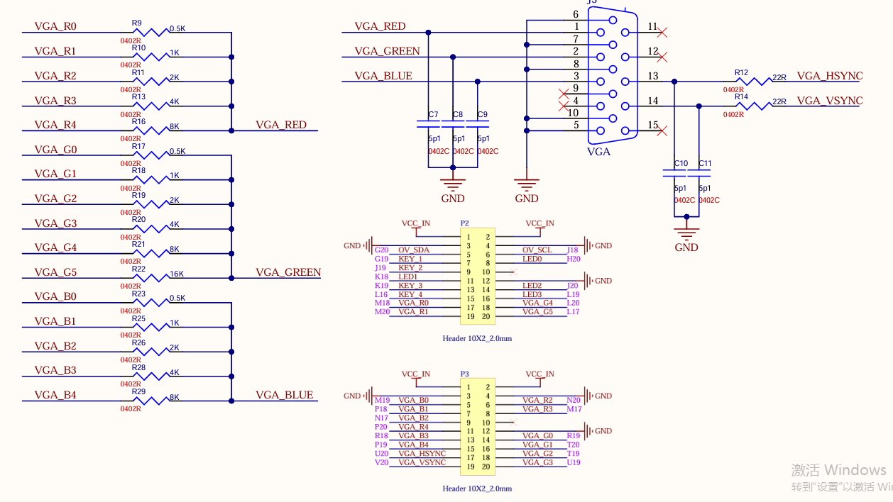
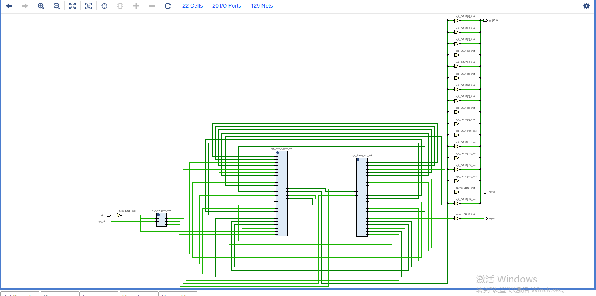

# 基于ROM的VGA图像显示弹跳特效

此前，我们已成功完成 VGA 驱动的设计以及基于 ROM 的 VGA 图像显示，让静态图像得以在屏幕上精准呈现。现在，我将探索基于 ROM 的 VGA 图像显示弹跳特效实验，类似于早些年的电脑屏保，以前的计算机屏保图片的显示往往可以设置一些特效，其中比较经典的特效就是弹跳特效。

在基于上一个工程的基础上，稍作修改，赋予显示图片弹跳特效，使其在显示区域内触框反弹。

## 1.实验目标

实验目标：以十色等宽彩条做背景，将存储于ROM中的图片显示在VGA显示器上，图片显示初始位置为有效显示区域左上角，图片沿着与水平方向45度夹角的方向，向右下角运动，运动过程中，当图片边沿触及显示区域边沿，图片向反方向运动，实现图片弹跳特效。图片分辨率为100*100，VGA显示模式为640x480@ 60。图片如下图所示


在实验过程中要求掌握以下要点：

- **VGA 显示原理及时序**：：深入掌握 VGA 的行同步信号（HSYNC）和场同步信号（VSYNC）的时序关系。了解行扫描周期、场扫描周期以及其中各个阶段，如前沿、后沿、有效显示区域等的时间参数和作用。
- **显示位置控制**：设计合理的弹跳算法，通常可以通过改变图像在水平和垂直方向上的坐标来实现弹跳效果。考虑使用简单的线性运动或更复杂的物理模拟，如加速度、弹性碰撞等，使弹跳看起来更加自然。设置边界检测机制，当图像到达屏幕边界时，要正确处理反弹或其他边界行为，如改变运动方向、暂停等，避免图像超出屏幕范围或出现异常显示。

## 2.理论知识

在VGA驱动实现工程中，已经对VGA显示的基本原理做了详细的阐述，这里不再赘述。

## 3.硬件资源

- **EBAZ4205 开发板**：
  - 核心芯片：搭载了 Xilinx Zynq - 7000 系列的 XC7Z010 - CLG400C 芯片，该芯片集成了 ARM Cortex - A9 双核处理器与 Artix - 7 FPGA 架构，为系统提供了强大的处理能力。
  - 存储资源：板载有一定容量的 DDR3 内存，为系统运行提供了充足的数据存储空间，无论是存储图像数据、程序代码，还是在运行过程中的临时数据缓存，DDR3 内存都能胜任，确保实验过程中数据的快速读写，保障 VGA 图像显示的流畅性。
- **VGA 转接板**：
  - 接口转换功能：转接板的核心作用是实现从开发板引脚到标准 VGA 接口的转换。它将开发板上 FPGA 输出的符合 VGA 时序要求的数字信号，转换为能够被显示器识别的模拟信号，包括红（R）、绿（G）、蓝（B）三基色信号以及行同步（HSync）、列同步（VSync）信号。通过精心设计的电路布局与信号调理，确保信号传输的稳定性与准确性，使得显示器能够清晰、稳定地呈现图像。
  - VGA只能识别模拟信号，而FPGA输出的图像信息为数字信号，在VGA的图像显示中，想要将数字图像信号转换为VGA能够识别的模拟信号有两种方法。其一，使用专业的转换芯片，如常用的转换芯片AD7123，这种方式更为稳定，但成本稍高；其二，使用权电阻网络实现数模转换。在本工程中使用第二种方法。
  - 转接板使用的RGB565图像模式，位宽为16bit，高5位表示红色，低5位表示蓝色，中间6位表示绿色。根据位宽不同，RGB图形格式还包括RGB232、RGB888等，数据位宽越大，表示颜色种类越多，显示图像越细腻。
  - VGA[15:0]表示FPGA传入权电阻网络的数字图像信号，经过权电阻网络的数模转换，生成能够被VGA识别的模拟图像信号VGA_R、VGA_G、VGA_B。
  - 这三路模拟信号的电压范围为0V ~ 0.714V，0V代表无色，0.714V代表满色，电压高低由输入的数字信号决定。输入的R、G、B数字信号不同，输出的三原色红、绿、蓝电压不同，颜色深浅不同，三原色相结合可以产生多种颜色。
  - 转接板部分原理图如下
    

## 4.实战演练

### 4.1 弹跳特效的实现方法

由实验目标小节可知，本实验工程要将存储于ROM中的图片显示在VGA显示器上，图片显示初始位置为有效显示区域左上角，图片沿着与水平方向45度夹角的方向，向右下角运动，运动过程中，当图片边沿触及显示区域边沿，图片向反方向运动，实现图片弹跳特效。
那么就存在几个问题，图片是如何运动起来的？运动方向如何实现与水平方向45度夹角？怎样实现图片触框反弹？

1. **图片是如何运动起来的？**

   在“基于ROM的VGA显示章节”中，我们将图片固定显示在VGA显示器中间位置，只会在VGA显示器中间的图片显示位置读取ROM中的图片数据。

   ROM的读使能信号rd_en和图像数据有效信号pic_valid的约束条件都是固定参数，这使它们只能在固定显示区域有效。假如我们每次在一帧图像显示完成后对图像的显示区域重新定义，是否就可以实现显示图片显示位置的变化。

   假如我们在每一帧图像显示完成后只改变水平方向的rd_en信号的显示范围，这就可以实现图片在水平方向显示位置的改变。若每次显示位置只向左或向右移动若干个相同的像素点个数，加之人眼的视觉暂留效果，就可以实现显示图片在水平方向上的左右移动。

   同理，若每次显示位置只向上或向下移动若干个像素点个数，加之人眼的视觉暂留效果，就可以实现显示图片在竖直方向上的竖直上下移动。

   需要注意的是，左右或者上下移动的像素点个数的多少表示图片移动的快慢，数值越大移动也快，这个数值不固定，可自行设置，但不建议设置太大，数值设置太大图片移动会显的不太流畅，本实验工程设置移动数值为1个像素点。

2. 运动方向如何实现与水平方向45度夹角？

   在上一问题中我们实现了显示图片的水平和竖直方向的移动，假使水平方向和竖直方向的移动像素点个数相同，根据勾股定理，图片移动的方向就实现了与水平方向45度夹角。当然也可以通过更改水平方向和竖直方向的移动像素点个数使图片按照其他方向移动。

3. 怎样实现图片触框反弹？

   在图片的第一帧图像显示中，图片的最左边一列像素点与显示区域左边框重合，每刷新一帧图像，图片向右移动若干个像素点；当图片的最右边的一列像素点与显示区域右边框重合，在下一帧图像刷新时，图片开始向反方向移动，这就实现了显示图片水平方向的触框反弹特效。同理，竖直方向也是如此。

### 4.2 程序设计

本实验工程是在“基于ROM的VGA图像显示”的实验工程基础上修改得到，功能模块中只修改了图像数据生成模块**vga_image_gen**。将事先缓存在ROM中的图片显示在VGA显示器上，并在每次显示中不断改变图片位置使其达到图片移动弹跳的效果，显示图片大小为100*100，VGA显示模式为640x480@60。

#### 4.2.1  图像数据生成模块

图像数据生成模块，设计本模块的目的是产生VGA彩条背景像素点色彩信息和读出ROM存储的图片数据并实现弹跳效果。

- **模块框图**

  

- **模块端口功能描述**
  
  模块内部实例化ROM IP核，有三路输入，一路输出，输入信号为时钟、数据读使能和数据地址信号，输出为数据地址对应图片数据。

  输入信号中，时钟信号vga_clk，频率为25MHz，为VGA显示器工作时钟，由分频模块产生并输入；复位信号sys_rst_n为顶层模块的rst_n信号输入，低电平有效；(pix_x,pix_y)为VGA有效显示区域像素点坐标，由VGA时序控制模块生并输入。

  输出信号pix_data为图像像素点色彩信息，在VGA有效显示区域像素点坐标(pix_x,pix_y)约束下生成，传输到VGA时序控制模块。

  模块内部实例化ROM IP核，有三路输入，一路输出，输入信号为时钟、数据读使能和数据地址信号，输出为数据地址对应数据。

- **波形图绘制**

  1. 彩条背景色彩信息(pix_data_bar)波形图绘制

     根据输入像素点坐标(pix_x,pix_y)，在有效显示区域，将pix_x计数范围十等分，在不同的计数部分给pix_data赋值对应的色彩信息，因为采用时序逻辑的赋值方式，pix_data_bar滞后pix_x、pix_y信号一个时钟周期。

     

  2. ROM读使能(rd_en)、ROM地址(rom_addr)波形图绘制思路

     将要显示的的图片数据是事先写入ROM，ROM为调用IP核生成，写入照片分辨率为100*100。要想将写入ROM的图片读取出来，使能信号和地址信号必不可少，所以模块内部要声明ROM读使能信号(rd_en)和ROM地址(rom_addr)信号。

     可以在图片显示区域拉高使能信号，将要读取数据地址写入ROM地址端口，读取地址对应图像数据，但有一点要注意，**自ROM读取的数据是滞后使能信号和地址信号一个时钟周期的**，比如，当使能信号为高电平，地址写入为999，但与地址999同步输出的数据为地址998的数据，所以ROM读使能信号(rd_en)和ROM地址(rom_addr)信号均要超前图片显示区域一个时钟周期，信号波形图绘制如下：
     

  3. 图片显示有效信号(image_valid)、待显示图像数据(image_data)波形图绘制思路

     想要在彩条图像背景上显示要显示的图片，我们需要在图片显示区域，使用图片数据覆盖彩条背景，那么如何确定图像显示区域呢？我们需要声明一个内部信号，那就是图片显示有效信号(pic_valid)，在有效信号为高电平时，将自ROM读出的图片数据赋值给待显示图像数据(pic_data_out)，覆盖彩条背景。

     上文中我们提到ROM读使能信号(rd_en)超前图片显示区域一个时钟周期，可以利用此信号 延迟一个时钟周期生成图片显示有效信号(pic_valid)；在有效信号为高电平时，将自ROM读出的图片数据赋值给待显示图像数据(image_data)，覆盖彩条背景。信号波形图如下：

     

  4. 水平移动变量(x_move)、竖直移动变量(y_move)、水平移动标志(x_flag)、竖直移动标志(y_flag)波形图绘制思路

     在前文中我们说过，要想实现图片的移动就要不断移动图片显示区域，加之人眼的视觉暂留的原因就会感觉图片在移动。

     以图片显示水平移动为例，要想实现显示图片的水平移动，就要改变图片有效信号pic_valid的水平有效区域，图片有效信号pic_valid是由ROM读使能信号rd_en打一拍得到，所以归根到底就是改变ROM读使能信号rd_en的水平有效区域。

     这样的话我们需要声明一个变量x_move作为ROM读使能信号rd_en的水平方向约束条件，x_move初值为0，表示图片初始显示位置在显示器最左边；每完成一帧图像的显示，x_move信号自加1，表示移动速度为1个像素点；设图片每行像素点个数为H_PIC = 100，当pix_x信号在计数范围(x_move ≤ pix_x <x_move + H_PIC)，约束条件pix_y信号不变时，ROM读使能信号rd_en信号有效，这样就实现了显示图片的水平向右移动。

     同理，可声明竖直移动变量y_move，移动速度与水平移动变量x_move相同，实现显示图片竖直向右移动。将两者结合，可实现显示图片与水平方向45度夹角右下移动。当然，读者也可自定义移动速度，改变移动速度和移动方向。

     介绍到这里，我们只是实现了显示图片的移动效果，如何实现显示图片的触框反弹呢？

     我们就需要声明两个标志信号水平移动标志(x_flag)、竖直移动标志(y_flag)。水平移动标志信号x_flag，作用是控制水平方向上显示图片的左移右移，当x_flag信号为低电平时，每完成一帧图像的显示，x_move信号自加1，实现图片的向右移动；当图片的最右边与显示屏右边框重合时， x_flag信号赋值高电平，每完成一帧图像的显示，x_move信号自减1，实现图片的向左移动；当图片最左边与显示器最左边重合，x_flag信号变为低电平，每完成一帧图像的显示，x_move信号自加1，实现图片的向右移动。周而复始，实现了显示图片水平方向触框回弹的效果。

     
     

- **代码编写**

  ```
  module vga_image_gen (
      input  vga_clk,
      input  rst_n,
      input [9:0] pix_x,
      input [9:0] pix_y,  
      output [15:0] pix_data 
  );
  //parameter definition
  parameter H_VALID = 10'd640 ; //行有效数据
  parameter V_VALID = 10'd480 ; //场有效数据
  
  parameter H_PIC = 10'd100 ; //图片长度
  parameter W_PIC = 10'd100 ; //图片宽度
  parameter PIC_SIZE= 14'd10000 ; //图片像素个数
  
  //颜色参数
      parameter RED = 16'hF800; //红色
      parameter ORANGE = 16'hFD20; //橙色
      parameter YELLOW = 16'hFFE0; //黄色
      parameter GREEN = 16'h07E0; //绿色 
      parameter CYAN = 16'h07FF; //青色
      parameter BLUE = 16'h001F; //蓝色
      parameter PURPLE = 16'hF81F; //紫色
      parameter BLACK = 16'h0000; //黑色
      parameter WHITE = 16'hFFFF; //白色
      parameter GRAY = 16'hD69A; //灰色
   
  //wire definition
  wire rd_en ; //ROM读使能
  wire [15:0] image_data ; //自ROM读出的图片数据
  
  //reg definition
  reg [13:0] rom_addr ; //读ROM地址
  reg pic_valid ; //图片数据有效信号
  reg [15:0] pix_data_bar ; //背景色彩信息
  reg x_flag ; //x方向移动标志位
  reg y_flag ; //y方向移动标志位
  reg [9:0] x_move ; //x方向移动距离
  reg [9:0] y_move ; //y方向移动距离
  
  /*********main logic************/
  
  //x_flag:判断x方向移动标志位
  always@(posedge vga_clk) begin
    if (!rst_n) begin
      x_flag <= 1'b0;
    end
    else if(x_move == 10'd0) begin
      x_flag <= 1'b0;
    end
    else if(x_move == 10'd539) begin
      x_flag <= 1'b1;
    end
    else begin
      x_flag <= x_flag;
    end
  end
  
  //y_flag:判断y方向移动标志位
  always@(posedge vga_clk) begin
    if (!rst_n) begin
      y_flag <= 1'b0;
    end
    else if(y_move == 10'd0) begin
      y_flag <= 1'b0;
    end
    else if(y_move == 10'd379) begin
      y_flag <= 1'b1;
    end
    else begin
      y_flag <= y_flag;
    end
  end
  
  //x_move,y_move:控制x,y方向移动距离
  always @(posedge vga_clk ) begin
    if (!rst_n) begin
      x_move <= 10'd0;
      y_move <= 10'd0;
    end
    else begin
      if(pix_x == 10'd639 && pix_y == 10'd479) begin
        if (x_flag == 1'b0) begin
          x_move <= x_move + 10'd1;
        end
        else if(x_flag == 1'b1) begin
          x_move <= x_move - 10'd1;
        end
        else begin
          x_move <= x_move;
        end
        if (y_flag == 1'b0) begin
          y_move <= y_move + 10'd1;
        end
        else if(y_flag == 1'b1) begin
          y_move <= y_move - 10'd1;
        end 
        else begin
          y_move <= y_move;
        end
      end
    end
  end
  
  
  //rd_en:ROM读使能
  assign rd_en = ((pix_x >= x_move) 
  && (pix_x < (x_move + H_PIC))
  && (pix_y >= y_move)
  && (pix_y < (y_move+W_PIC)));
  
  //pic_valid:图片数据有效信号
  always@(posedge vga_clk or negedge rst_n)
  if(rst_n == 1'b0) begin
    pic_valid <= 1'b0;
  end
  else begin
    pic_valid <= rd_en;
  end
  
  
  //pix_data:输出VGA显示图像数据
  assign pix_data = (pic_valid == 1'b1) ? image_data : pix_data_bar;
  
  //根据当前像素点坐标指定当前像素点颜色数据，在屏幕上显示彩条
      always @(posedge vga_clk ) begin
          if (!rst_n) begin
              pix_data_bar <= BLACK;
          end
          else begin
              case (pix_x/10'd64)
                  10'd0: pix_data_bar <= RED;
                  10'd1: pix_data_bar <= ORANGE;
                  10'd2: pix_data_bar <= YELLOW;
                  10'd3: pix_data_bar <= GREEN;
                  10'd4: pix_data_bar <= CYAN;
                  10'd5: pix_data_bar <= BLUE;
                  10'd6: pix_data_bar <= PURPLE;
                  10'd7: pix_data_bar <= BLACK;
                  10'd8: pix_data_bar <= WHITE;
                  10'd9: pix_data_bar <= GRAY;
                  default: pix_data_bar <= BLACK;
              endcase
          end
      end
  //rom_addr:读ROM地址
  always@(posedge vga_clk or negedge rst_n)
  if(rst_n == 1'b0) begin
    rom_addr <= 14'h3FFF;
  end
  else if(rom_addr >= (PIC_SIZE - 1'b1)) begin
    rom_addr <= 14'd0;
  end
  else if(rd_en == 1'b1) begin
    rom_addr <= rom_addr + 1'b1;
  end
  
  
  //ROM IP核实例化
  blk_mem_gen_0 blk_mem_gen_0_ins (
    .clka(vga_clk),    // input wire clka
    .ena(rd_en),      // input wire ena
    .wea( ),      // input wire [0 : 0] wea
    .addra(rom_addr),  // input wire [13 : 0] addra
    .dina( ),    // input wire [15 : 0] dina
    .douta(image_data )  // output wire [15 : 0] douta
  );
  
  endmodule
  ```

- **仿真结果**
  
  

#### 4.2.2RTL视图




RTL视图展示信息与顶层模块框图一致，各信号连接正确。

## 5 实验结果

### 5.1 引脚约束

根据原理图，管脚的分配如下图所示。


### 5.2 结果验证

将开发板连接到电源、下载器并将VGA接口的一头连接到开发板，另一头连接到显示器，连接正确后打开开发板，将程序下载到开发板上。

程序下载完成后，显示器显示图像如下图所示，首先在屏幕中央显示横向彩色条纹图片，然后随着时间往右下角移动，直到碰到下边界后反弹向上移动，和预期结果一致。


