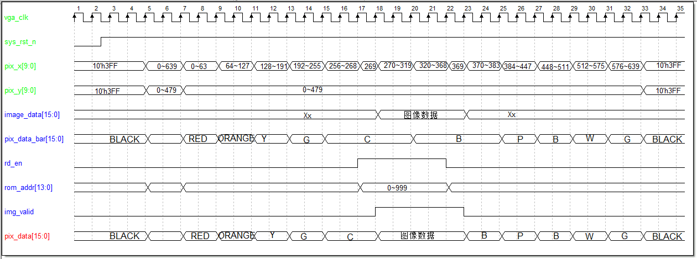

# 基于ROM的VGA图像显示

此前，我们已经成功迈出了坚实的两步。第一步，通过精心设计 VGA 驱动模块，让显示器屏幕上呈现出了绚丽多彩的条纹，这不仅是对 VGA 基本时序控制的精准把握，更是深入理解显示器逐行扫描原理的生动实践。每一条条纹的完美绘制，都如同在数字世界里编织出的细密锦缎，为后续探索奠定了扎实的基础。第二步，我们更进一步，实现了在屏幕上优雅地显示字符。从简单的字母到复杂的符号组合，这一过程见证了数据与图形转化的奇妙瞬间，仿佛赋予了冰冷的屏幕以沟通交流的灵魂。

接下来我即将开启一项更具挑战性与趣味性的任务 —— 基于 ROM 的 VGA 图像显示实验。本次实验以十色等宽彩条精心装点屏幕背景，营造出活泼而富有层次的视觉氛围。将存储于 ROM 中分辨率为 100 * 100 的特定图片，精准且稳定地呈现在 VGA 显示器的中心位置，同时适配 640x480@60 的显示模式。这不仅需要我们对 VGA 时序的驾驭更加娴熟，还需深入理解图像数据的存储、读取与传输机制。

## 1.实验目标

**实验目标**：以十色等宽彩条做背景，将存储于ROM中的图片显示在VGA显示器的中心位置。图片分辨率为100*100，VGA显示模式为640x480@60。图片如下图所示


在实验过程中要求掌握以下要点：

- **图像数据处理**：理解图像分辨率的概念，以及如何根据 VGA 显示模式和图像分辨率，计算图像在屏幕上的显示位置和坐标。能够对图像数据进行必要的预处理，如格式转换、缩放等，以确保图像能够正确地显示在指定位置。
- **显示位置控制**：掌握如何根据 VGA 显示器的分辨率和图像的大小，计算出图像在屏幕中心显示时的起始坐标和结束坐标。通过控制 VGA 驱动模块，在正确的时序下将图像数据输出到显示器上，实现图像在屏幕中心的精准显示。

## 2.理论知识

在VGA驱动实现工程中，已经对VGA显示的基本原理做了详细的阐述，这里不再赘述。

## 3.硬件资源

- **EBAZ4205 开发板**：
  - 核心芯片：搭载了 Xilinx Zynq - 7000 系列的 XC7Z010 - CLG400C 芯片，该芯片集成了 ARM Cortex - A9 双核处理器与 Artix - 7 FPGA 架构，为系统提供了强大的处理能力。
  - 存储资源：板载有一定容量的 DDR3 内存，为系统运行提供了充足的数据存储空间，无论是存储图像数据、程序代码，还是在运行过程中的临时数据缓存，DDR3 内存都能胜任，确保实验过程中数据的快速读写，保障 VGA 图像显示的流畅性。
- **VGA 转接板**：
  - 接口转换功能：转接板的核心作用是实现从开发板引脚到标准 VGA 接口的转换。它将开发板上 FPGA 输出的符合 VGA 时序要求的数字信号，转换为能够被显示器识别的模拟信号，包括红（R）、绿（G）、蓝（B）三基色信号以及行同步（HSync）、列同步（VSync）信号。通过精心设计的电路布局与信号调理，确保信号传输的稳定性与准确性，使得显示器能够清晰、稳定地呈现图像。
  - VGA只能识别模拟信号，而FPGA输出的图像信息为数字信号，在VGA的图像显示中，想要将数字图像信号转换为VGA能够识别的模拟信号有两种方法。其一，使用专业的转换芯片，如常用的转换芯片AD7123，这种方式更为稳定，但成本稍高；其二，使用权电阻网络实现数模转换。在本工程中使用第二种方法。
  - 转接板使用的RGB565图像模式，位宽为16bit，高5位表示红色，低5位表示蓝色，中间6位表示绿色。根据位宽不同，RGB图形格式还包括RGB232、RGB888等，数据位宽越大，表示颜色种类越多，显示图像越细腻。
  - VGA[15:0]表示FPGA传入权电阻网络的数字图像信号，经过权电阻网络的数模转换，生成能够被VGA识别的模拟图像信号VGA_R、VGA_G、VGA_B。
  - 这三路模拟信号的电压范围为0V ~ 0.714V，0V代表无色，0.714V代表满色，电压高低由输入的数字信号决定。输入的R、G、B数字信号不同，输出的三原色红、绿、蓝电压不同，颜色深浅不同，三原色相结合可以产生多种颜色。
  - 转接板部分原理图如下
    

## 4.实战演练

#### 4.1 图片预处理

在本次实验中，用来存储图片的ROM是通过调用IP核，利用FPGA片上资源生成的只读存储器，但FPGA片上资源有限，生成ROM的存储空间也会受限，存储于ROM的图片大小也受到限制。

EBAZ 4205开发板上使用的FPGA芯片为赛灵思公司的ZYNQ 7010芯片，拥有256KB 的片上存储空间，本次实验显示图片分辨率为100×100，色彩格式为RGB565，存储于ROM所占空间为100×100×16=160000bit=156.25Kbit。通过比较发现，芯片可生成满足要求的ROM 用来存储图片。

ROM作为只读存储器， 即写入存储器中的图片数据，图片要以规定的格式才能正确写入ROM。ROM是只读存储器，是不能在里面写入数据的，所以在进行IP核设置时需要指定初始化文件**（.coe）**，在初始化的时候将数据放置进去，再通过读操作读取出来。

当**coe**文件中的数值少时可以手动编写，当需要的数据量大时，手动输入不太现实。本次实验中要写入100*100个数据，不可能使用手动输入，可以借助**Matlab**或**Python**生成。下面介绍利用**Python**产生**.coe**文件格式和在**vivado**环境中建立ROM的IP核的步骤。

##### 4.1.1 调整图片大小

考虑到ROM存储空间大小的问题，本次实验显示图片大小为100*100，但并不一定我们想要显示的图片恰好满足这一要求。若图片大小不满足要求，我们可以使用系统自带的画图软件进行调整。

首先查看图片属性


可知图片分辨率为1280×1280像素，不满足要求，需要进行大小调整；图片位深度为24，表示图片像素点数据位宽。

然后右键图片选择系统画图软件打开图片，重新设置图片大小。


##### 4.1.2 使用Python将图片转化为**.coe**格式

- coe文件格式介绍

  - 头部信息

    - **文件类型声明**：通常以`memory_initialization_radix=X;`开头，其中`X`表示数据的基数，常见的取值有 2（二进制）、10（十进制）、16（十六进制）。例如`memory_initialization_radix=16;`表示后续的数据是以十六进制的形式表示的。
    - **数据宽度声明**：紧跟文件类型声明之后，一般为`memory_initialization_vector=`，表明这是一个存储初始化向量，后面跟着具体的初始化数据。

  - 数据内容

    - **数据排列**：数据以逗号分隔，每个数据代表 ROM 中一个存储单元的内容。例如，如果是一个存储图像数据的 ROM，每个数据可能代表一个像素的颜色值等信息。数据的顺序与 ROM 中存储单元的地址顺序相对应，从地址 0 开始依次排列。例如`0001,0002,0003,...`表示 ROM 中地址 0 存储的数据是`0001`，地址 1 存储的数据是`0002`等。
    - **数据补齐**：如果数据的位数不足声明的宽度，需要在前面补 0。比如声明的是 16 位宽度，而数据是`0F`，则应该写成`000F`。
    - **结束标志**：数据的最后通常以分号`;`结尾，表示数据结束。例如`0001,0002,0003;`，最后的分号表示这是整个数据序列的结束。

  - 示例

    ```
    memory_initialization_radix=16;
    memory_initialization_vector=
    0000,0001,0002,0003,0004,0005,0006,0007,
    0008,0009,000A,000B,000C,000D,000E,000F;
    ```

- python脚本

  ```
  from PIL import Image
  
  def rgb24_to_rgb565(r, g, b):
      # 将24位RGB转换为RGB565格式  
      r5 = (r >> 3) 
      # 提取绿色的高6位
      g6 = (g >> 2) 
      # 提取蓝色的高5位
      b5 = (b >> 3) 
      # 合并成16位的RGB565值
      rgb565 = (r5 << 11) | (g6 << 5) | b5
      return rgb565
  
  def image_to_coe(image_path, coe_path):
      # 打开图片
      image = Image.open(image_path)
      # 检查图片尺寸是否为100x100
      if image.size != (100, 100):
          raise ValueError("图片尺寸必须是100x100像素。")
      # 初始化一个空列表来存储转换后的RGB565值
      rgb565_values = []
      # 遍历图片的每个像素
      for y in range(100):
          for x in range(100):
              # 获取当前像素的RGB值
              r, g, b = image.getpixel((x, y))
              print("x={}, y={}, r,g,b={}, {}, {}".format(x, y, r, g, b))
  
              # 将24位RGB转换为RGB565
              rgb565 = rgb24_to_rgb565(r, g, b)
              print("rgb565={}".format(rgb565))
              # 将RGB565值转换为4位十六进制字符串
              hex_str = "{:04X}".format(rgb565)
              print("hex_str={}".format(hex_str))
              rgb565_values.append(hex_str)
      # 写入COE文件
      with open(coe_path, 'w') as f:
          # 写入COE文件的头部信息，指定基数为16
          f.write("memory_initialization_radix=16;\n")
          f.write("memory_initialization_vector=\n")
          # 写入RGB565值，每行一个值，最后一个值后面加分号
          for i, value in enumerate(rgb565_values):
              if i < len(rgb565_values) - 1:
                  f.write(value + ",\n")
              else:
                  f.write(value + ";\n")
  
  # 示例调用
  image_path = "image.bmp"  # 替换为你的图片路径
  coe_path = "image.coe"  # 输出的COE文件路径
  image_to_coe(image_path, coe_path)
  print("转换完成。")
  print("COE文件已保存为:", coe_path)
  
  ```
  
  py脚本运行完后会在当前目录下生成一个**.coe**文件，查看文件，图片数据已按格式要求写入。
  
  在调用ip核生成ROM时，指定初始文件即可。

### 4.2 程序设计

本实验工程是在“VGA显示器驱动设计”章节的实验工程基础上修改得到，功能模块中只修改了图像数据生成模块**vga_image_gen**。将事先缓存在ROM中的图片显示在VGA显示器的中心位置，显示图片大小为100*100，VGA显示模式为640x480@60。

#### 4.2.1 ROM IP核

1. ROM IP核的配置

   在IP Catalog 送搜索ROM，双击模块进行设置
   

   设置位宽与位深，并指定初始化文件。

2. ROM IP核的调用

   可以在IP Sources中找到**veo**文件，可以复制ROM IP例化模板，点击复制到刚刚建立的设计文件，可以发现有三个端口需要声明，分别为输入的时钟和地址，以及输出的数据，并定义好地址和数据的位宽为16。
   

#### 4.2.2 实验整体框图

整体实验框图如下


图中各模块功能简介如下

| 模块名称        | 功能描述                          |
| --------------- | --------------------------------- |
| vga_rom_image   | 顶层模块                          |
| vga_clk_gen     | 时钟生成模块，生成VGA驱动时钟     |
| vga_timing_ctrl | VGA时序控制模块，控制VGA图像显示  |
| vga_image_gen   | 图像数据生成模块，生成VGA显示图像 |

整个工程的工作流程如下：

1. 系统上电后，板卡传入系统时钟(sys_clk)和复位信号(sys_rst_n)到顶层模块；
2. 系统时钟直接传入时钟生成模块(vga_clk_gen)，分频产生VGA工作时钟(vga_clk)，作为图像数据生成模块(vga_image_gen)和VGA时序控制模块(vga_timing_ctrl)的工作时钟；
3. 图像数据生成模块以VGA时序控制模块传入的像素点坐标(pix_x,pix_y)为约束条件，生成背景信息的待显示图像的色彩信息(pix_data)；在图片显示区域读取存储于ROM的图片数据；两者数据结合生成VGA显示图像数据pix_data传入VGA时序控制模块。
4. 图像数据生成模块生成的图像色彩信息pix_data传入VGA时序控制模块，在模块内部使用使能信号滤除掉非图像显示有效区域的图像数据，产生RGB色彩信息(rgb)，在行、场同步信号(hsync、vsync)的同步作用下，将RGB色彩信息扫描显示到VGA显示器，实现图片显示。

#### 4.2.3 图像数据生成模块

图像数据生成模块，设计本模块的目的是产生VGA彩条背景像素点色彩信息和读出ROM存储的图片数据。

- **模块框图**
  

- **模块端口功能描述**
  
  模块内部实例化ROM IP核，有三路输入，一路输出，输入信号为时钟、数据读使能和数据地址信号，输出为数据地址对应图片数据。

- **波形图绘制**

  

  1. **第一部分：**彩条背景色彩信息(pix_data_bar)波形图绘制思路
     根据输入像素点坐标(pix_x,pix_y)，在有效显示区域，将pix_x计数范围十等分，在不同的计数部分给pix_data赋值对应的色彩信息，因为采用组合逻辑的赋值方式。

  2. **第二部分：**ROM读使能(rd_en)、ROM地址(rom_addr)波形图绘制思路
     将要显示的的图片数据是事先写入ROM，ROM为调用IP核生成，写入照片分辨率为100*100。要想将写入ROM的图片读取出来，使能信号和地址信号必不可少，所以模块内部要声明ROM读使能信号(rd_en)和ROM地址(rom_addr)信号。

     可以在图片显示区域拉高使能信号，将要读取数据地址写入ROM地址端口，读取地址对应图像数据。但有一点要注意，**自ROM读取的数据是滞后使能信号和地址信号一个时钟周期的**，比如，当使能信号为高电平，地址写入为999，但与地址999同步输出的数据为地址998的数据，所以ROM读使能信号(rd_en)和ROM地址(rom_addr)信号均要超前图片显示区域一个时钟周期，

  3. **第三部分：**图片显示有效信号(pic_valid)、待显示图像数据(pic_data)波形图绘制思路

     想要在彩条图像背景上显示要显示的图片，我们需要在图片显示区域，使用图片数据覆盖彩条背景，那么如何确定图像显示区域呢？我们需要声明一个内部信号，那就是图片显示有效信号(pic_valid)，在有效信号为高电平时，将自ROM读出的图片数据赋值给待显示图像数据(pic_data)，覆盖彩条背景。

     ROM读使能信号(rd_en)超前图片显示区域一个时钟周期，可以利用此信号 延迟一个时钟周期生成图片显示有效信号(pic_valid)；在有效信号为高电平时，将自ROM读出的图片数据赋值给待显示图像数据(pic_data)，覆盖彩条背景。

- 代码编写

  ```
  module vga_image_gen (
      input  vga_clk,
      input  rst_n,
      input [9:0] pix_x,
      input [9:0] pix_y,  
      output [15:0] pix_data 
  );
  //parameter definition
  parameter H_VALID = 10'd640 ; //行有效数据
  parameter V_VALID = 10'd480 ; //场有效数据
  
  parameter H_PIC = 10'd100 ; //图片长度
  parameter W_PIC = 10'd100 ; //图片宽度
  parameter PIC_SIZE= 14'd10000 ; //图片像素个数
  
  //颜色参数
      parameter RED = 16'hF800; //红色
      parameter ORANGE = 16'hFD20; //橙色
      parameter YELLOW = 16'hFFE0; //黄色
      parameter GREEN = 16'h07E0; //绿色 
      parameter CYAN = 16'h07FF; //青色
      parameter BLUE = 16'h001F; //蓝色
      parameter PURPLE = 16'hF81F; //紫色
      parameter BLACK = 16'h0000; //黑色
      parameter WHITE = 16'hFFFF; //白色
      parameter GRAY = 16'hD69A; //灰色
   
  //wire definition
  wire rd_en ; //ROM读使能
  wire [15:0] pic_data ; //自ROM读出的图片数据
  
  //reg definition
  reg [13:0] rom_addr ; //读ROM地址
  reg pic_valid ; //图片数据有效信号
  reg [15:0] pix_data_bar ; //背景色彩信息
  
  
  
  /*********main logic************/
  
  //rd_en:ROM读使能
  assign rd_en = (((pix_x >= (((H_VALID - H_PIC)/2) - 1'b1))
  && (pix_x < (((H_VALID - H_PIC)/2) + H_PIC - 1'b1)))
  &&((pix_y >= ((V_VALID - W_PIC)/2))
  && ((pix_y < (((V_VALID - W_PIC)/2) + W_PIC)))));
  
  //pic_valid:图片数据有效信号
  always@(posedge vga_clk or negedge rst_n)
  if(rst_n == 1'b0) begin
    pic_valid <= 1'b0;
  end
  else begin
    pic_valid <= rd_en;
  end
  
  
  //pix_data_out:输出VGA显示图像数据
  assign pix_data = (pic_valid == 1'b1) ? pic_data : pix_data_bar;
  
  //根据当前像素点坐标指定当前像素点颜色数据，在屏幕上显示彩条
      always @(posedge vga_clk ) begin
          if (!rst_n) begin
              pix_data_bar <= BLACK;
          end
          else begin
              case (pix_x/10'd64)
                  10'd0: pix_data_bar <= RED;
                  10'd1: pix_data_bar <= ORANGE;
                  10'd2: pix_data_bar <= YELLOW;
                  10'd3: pix_data_bar <= GREEN;
                  10'd4: pix_data_bar <= CYAN;
                  10'd5: pix_data_bar <= BLUE;
                  10'd6: pix_data_bar <= PURPLE;
                  10'd7: pix_data_bar <= BLACK;
                  10'd8: pix_data_bar <= WHITE;
                  10'd9: pix_data_bar <= GRAY;
                  default: pix_data_bar <= BLACK;
              endcase
          end
      end
  //rom_addr:读ROM地址
  always@(posedge vga_clk or negedge rst_n)
  if(rst_n == 1'b0) begin
    rom_addr <= 14'h3FFF;
  end
  else if(rom_addr >= (PIC_SIZE - 1'b1)) begin
    rom_addr <= 14'd0;
  end
  else if(rd_en == 1'b1) begin
    rom_addr <= rom_addr + 1'b1;
  end
  
  
  //ROM IP核实例化
  blk_mem_gen_0 blk_mem_gen_0_ins (
    .clka(vga_clk),    // input wire clka
    .ena(rd_en),      // input wire ena
    .wea( ),      // input wire [0 : 0] wea
    .addra(rom_addr),  // input wire [13 : 0] addra
    .dina( ),    // input wire [15 : 0] dina
    .douta(pic_data )  // output wire [15 : 0] douta
  );
  
  endmodule
  ```

- 仿真结果

  
  

#### 4.2.4 RTL视图


RTL视图展示信息与顶层模块框图一致，各信号连接正确。

## 5 实验结果

### 5.1 引脚约束

根据原理图，管脚的分配如下图所示。


### 5.2 结果验证

将开发板连接到电源、下载器并将VGA接口的一头连接到开发板，另一头连接到显示器，连接正确后打开开发板，将程序下载到开发板上。

程序下载完成后，显示器显示图像如下图所示，在屏幕中央显示横向彩色条纹图片，和预期结果一致。


