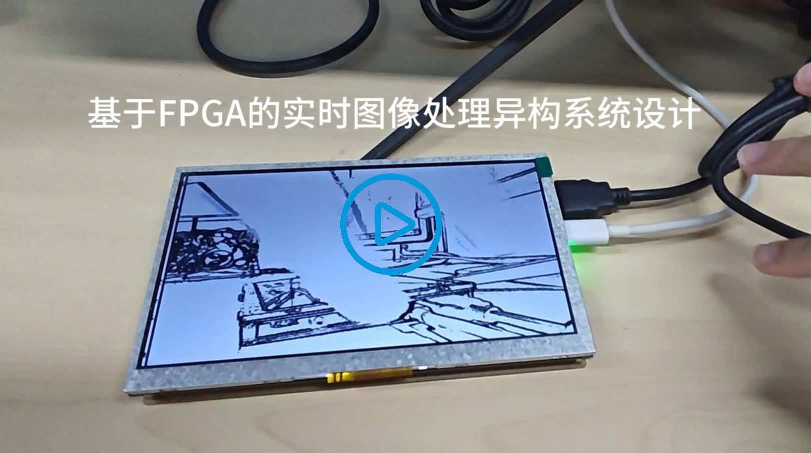
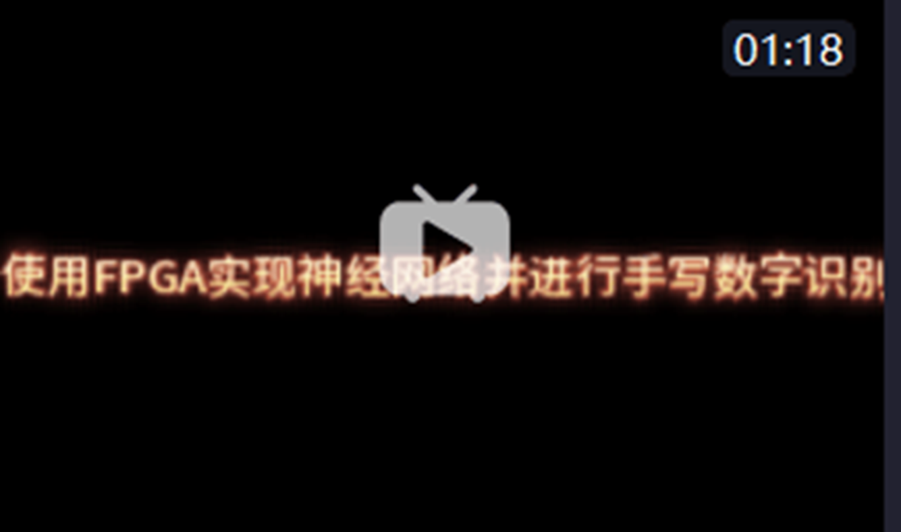
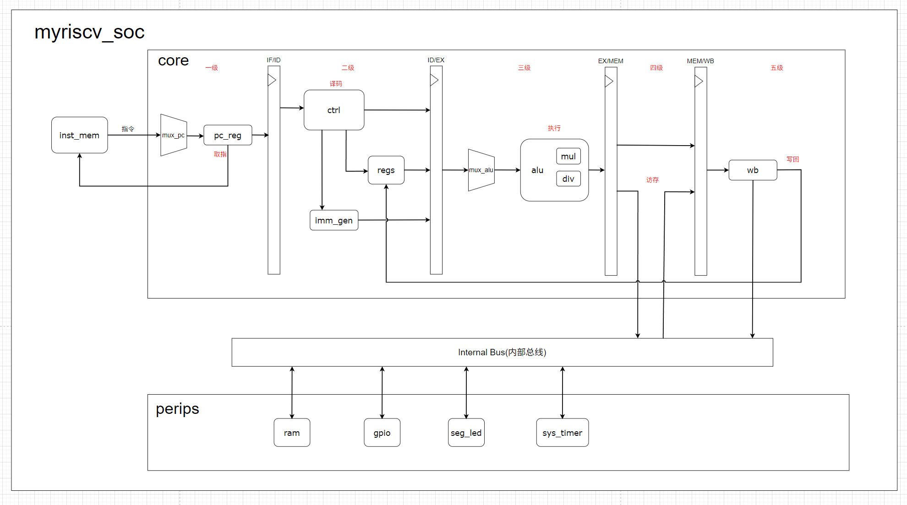

# FPGA_Learning_Journey

## **1. 🎯仓库概述**

本仓库系统化记录我的FPGA开发学习历程，包含以下核心内容：  

- **📚 开发板文档库** - 原理图、引脚分配表、外设芯片手册  
- **💻 完整工程项目** - 带源码/约束文件的FPGA实现方案  
- **🔍 Verilog学习资源** - 语法范例、实践练习与验证技巧  

> "从流水灯实验到复杂外设驱动——这里记录着数字逻辑设计的每一步成长！"

## 2.🌟 核心目标

1. 构建结构化的FPGA开发实验档案库  
2. 创建可复用的数字设计模式参考模板  
3. 记录硬件实现中的典型问题解决方案  
4. 建立标准化工程结构规范  

## 3.📂 仓库目录结构

#### 仓库根目录

```
FPGA_Learning_Journey/
├── FPGA_DevBoard_Docs/ # 开发板文档库
├── Pro/ 				# FPGA工程项目集
├── Verilog_Practice/ 	# Verilog学习资源
├── exp/				# 学习记录
└── myriscv_pro/		# RISCV工程
```

#### Pro（工程项目集）子目录 -- 以HDMI工程为例

- 统一所有工程采用`assets/project/src`三核心目录
- `.md` 文件记录工程文档，`.drawio` 文件绘制模块框图和信号图

```
FPGA_Learning_Journey/Pro/HDMI
├─ 📁asset			# 资源文件
├─ 📁doc			# 参考资料
├─ 📁project		# Vivado工程文件
├─ 📁src			# RTL源码
├─ 📄img.drawio		# 模块框图和信号流程图
└─ 📄HDMI.md		# 工程文档（含以下内容）
   ├── ## 实验目标
   ├── ## 理论基础
   ├── ## 硬件资源
   ├── ## 实战演练
   ├── ## 程序设计
   └── ## 实验结果
```

## 4.🚀快速导航

#### 🌟 [项目1：基于FPGA的实时图像处理系统设计与实现](./Pro/OV5640_DDR3_HDMI_UDP_sobel___v3)

[](https://www.bilibili.com/video/BV1REgXzjESP/?vd_source=e8f3da2949bc8fe3a5314746bc8d1f2d)

点击上面图片即可跳转播放视频（视频链接：https://www.bilibili.com/video/BV1REgXzjESP/?vd_source=e8f3da2949bc8fe3a5314746bc8d1f2d ）

**🔥 技术亮点：**

> - 🚀 **全链路异构处理系统**：OV5640采集 + DDR3缓存 + FPGA处理 + 双路输出
> - ⚡ **640*480@30fps**： 实时Sobel边缘检测
> - 🌐 **HDMI-以太网双路传输**：本地显示+以太网传输同步进行
> - 💡 **开发千兆以太网视频流传输协议**：基于UDP封装RGB565数据
> - 📦 **上位机开发**：基于OpenCV构建跨平台视频处理终端，实时性能监控(带宽，帧率)

#### 🌟 [项目2：基于FPGA的MNIST手写数字识别硬件加速器设计与实现——卷积神经网络硬件并行化架构](./Pro/CNN___)

[](https://www.bilibili.com/video/BV1zS3szLEP7/?vd_source=e8f3da2949bc8fe3a5314746bc8d1f2d)

点击上面图片即可跳转播放视频（视频链接：https://www.bilibili.com/video/BV1zS3szLEP7/?vd_source=e8f3da2949bc8fe3a5314746bc8d1f2d ）

**🔥 技术亮点：**

> - 🌐 **端到端实时推理系统**：OV5640/以太网数据流 → FPGA推理加速 → HDMI/网络结果输出
> - 🧮 **Q6.10精准量化**：自主实现浮点转定点模型部署，平衡精度与资源
> - ⚡ **5PE并行计算核**：定制5并行单元神经网络加速架构 + 深度流水线，最大化硬件吞吐
> - 🚀 **50MHz时钟实现10,000+ FPS推理**：MNIST实时推理性能远超传统CPU方案
> - 💡 **AI全栈开发**：Python训练/量化工具链 + FPGA RTL设计 + 上位机验证终端

🌟 [项目3：基于RISC-V指令集的嵌入式SoC设计与FPGA实现——含单周期/五级流水线处理器核心及多外设系统集成](https://github.com/TheSmurfs233/My-RISCV-Processor)

仓库地址：[TheSmurfs233/My-RISCV-Processor](https://github.com/TheSmurfs233/My-RISCV-Processor)

**整体架构**


