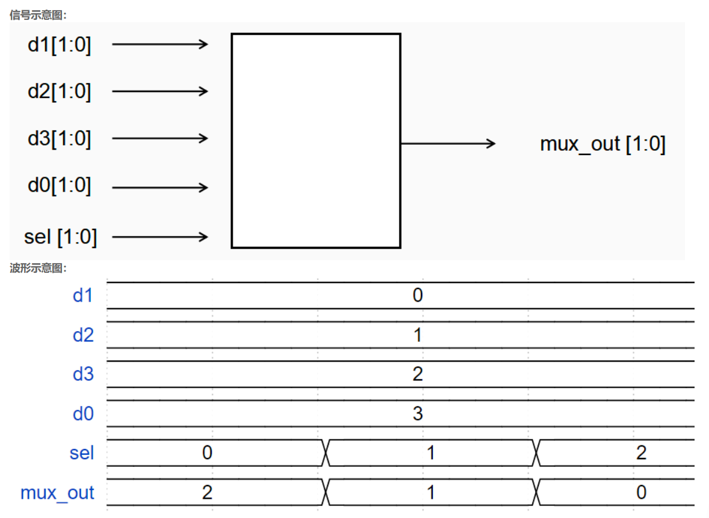

# **VL1** **四选一多路器**

### **link**：[四选一多路器_牛客题霸_牛客网](https://www.nowcoder.com/practice/cba4617e1ef64e9ea52cbb400a0725a3?tpId=301&tqId=5000604&ru=/exam/oj&qru=/ta/verilog-start/question-ranking&sourceUrl=%2Fexam%2Foj%3Fpage%3D1%26tab%3DVerilog%E7%AF%87%26topicId%3D301)

### **intro**：

制作一个四选一的多路选择器，要求输出定义上为线网类型。



### **code**：

```
`timescale 1ns/1ns
module mux4_1(
input [1:0]d1,d2,d3,d0,
input [1:0]sel,
output[1:0]mux_out
);
//*************code***********//
reg [1:0] mux;
always@(*)begin
    case(sel)
        2'd0:mux=d3;
        2'd1:mux=d2;
        2'd2:mux=d1;
        2'd3:mux=d0;
        default:mux = 2'b00;
    endcase
end

assign mux_out=mux;

//*************code***********//
endmodule

```

### notes:

输入输出要求为线网类型，使用 `always` 块内的 `case` 语句对 `wire` 类型的输出 `mux_out` 进行赋值操作是不符合语法规则的。正确的做法，如果坚持使用 `wire` 类型输出，应该用 `assign` 语句结合逻辑操作来实现功能

### reference：


