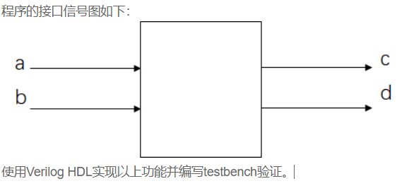

# **VL10** **使用函数实现数据大小端转换**

### **link**：[使用函数实现数据大小端转换_牛客题霸_牛客网](https://www.nowcoder.com/practice/74c0c19ad0c444959c436a049647a93c?tpId=301&tags=&title=&difficulty=0&judgeStatus=0&rp=0&sourceUrl=%2Fexam%2Foj%3FquestionJobId%3D10%26subTabName%3Donline_coding_page)

### **intro**：

在数字芯片设计中，经常把实现特定功能的模块编写成函数，在需要的时候再在主模块中调用，以提高代码的复用性和提高设计的层次，分别后续的修改。

请用函数实现一个4bit数据大小端转换的功能。实现对两个不同的输入分别转换并输出。



输入描述：
clk：系统时钟
rst_n：异步复位信号，低电平有效
a,b：4bit位宽的无符号数

输出描述：
c,d：8bit位宽的无符号数

### **code**：

```
`timescale 1ns/1ns
module function_mod(
	input [3:0]a,
	input [3:0]b,
	
	output [3:0]c,
	output [3:0]d
);
assign c={a[0],a[1],a[2],a[3]};
assign d={b[0],b[1],b[2],b[3]};
endmodule
```

### notes:


### reference：


