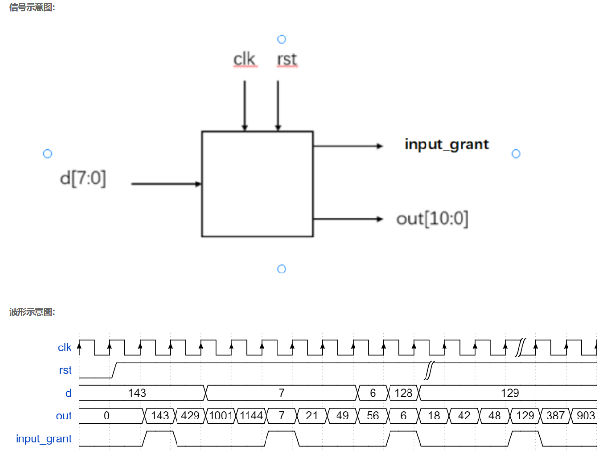

# **VL4** **移位运算与乘法**

### **link**：[移位运算与乘法_牛客题霸_牛客网](https://www.nowcoder.com/practice/1dd22852bcac42ce8f781737f84a3272?tpId=301&tags=&title=&difficulty=0&judgeStatus=0&rp=0&sourceUrl=%2Fexam%2Foj%3Fpage%3D1%26tab%3DVerilog%E7%AF%87%26topicId%3D301)

### **intro**：

已知d为一个8位数，请在每个时钟周期分别输出该数乘1/3/7/8,并输出一个信号通知此时刻输入的d有效（d给出的信号的上升沿表示写入有效）



输入描述：
输入信号  d, clk, rst
类型 wire
在testbench中，clk为周期5ns的时钟，rst为低电平复位

输出描述：
输出信号 input_grant  out
类型 reg 

### **code**：

```
`timescale 1ns/1ns
module multi_sel(
input [7:0]d ,
input clk,
input rst,
output reg input_grant,
output reg [10:0]out
);
//*************code***********//
reg [1:0] t;
reg [7:0] d_t;

//计数器t
always@(posedge clk,negedge rst)begin
    if(!rst)begin
        input_grant<=1'd0;
        t<=2'd0;
    end
    else if(t==2'd3)begin
        t<=2'd0;
    end
    else begin
        t<=t+1'd1;
    end
end

//数据寄存器d_t
always@(posedge clk,negedge rst)begin
    if(!rst)begin
        d_t<=8'd0;
    end
    else if(t==2'd0)begin
        d_t<=d;
        input_grant<=1'b1;
    end
    else   begin
        d_t<=d_t;
        input_grant<=1'b0;
    end
end

//乘法
always@(posedge clk,negedge rst)begin
    if(!rst)begin
        out<=12'd0;
    end
    else case (t)
        2'd0 : out <= d;
        2'd1 : out <= (d_t<<2)-d_t;
        2'd2 : out <= (d_t<<3)-d_t;
        2'd3 : out <= (d_t<<3);
        default : out <= 11'd0;
    endcase
end
//*************code***********//
endmodule
```

### notes:


### reference：


