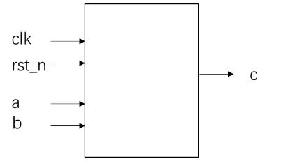

# **VL7** **求两个数的差值**

### **link**：[多功能数据处理器_牛客题霸_牛客网](https://www.nowcoder.com/practice/e009ab1a7a4c46fb9042c09c77ee27b8?tpId=301&tags=&title=&difficulty=0&judgeStatus=0&rp=0&sourceUrl=%2Fexam%2Foj%3FquestionJobId%3D10%26subTabName%3Donline_coding_page)

### **intro**：

根据输入信号a,b的大小关系，求解两个数的差值：输入信号a,b为8bit位宽的无符号数。如果a>b，则输出a-b，如果a≤b，则输出b-a。
接口信号图如下：



输入描述：

clk：系统时钟
rst_n：复位信号，低电平有效
a,b：8bit位宽的无符号数

输出描述：
c：8bit位宽的无符号数

### **code**：

```
`timescale 1ns/1ns
module data_minus(
	input clk,
	input rst_n,
	input [7:0]a,
	input [7:0]b,

	output  reg [8:0]c
);
always@(posedge clk,negedge rst_n)begin
	if(!rst_n)
		c<=8'd0;
	else begin
		c<=(a>b)?a-b:b-a;
	end
end
endmodule
```

### notes:


### reference：


