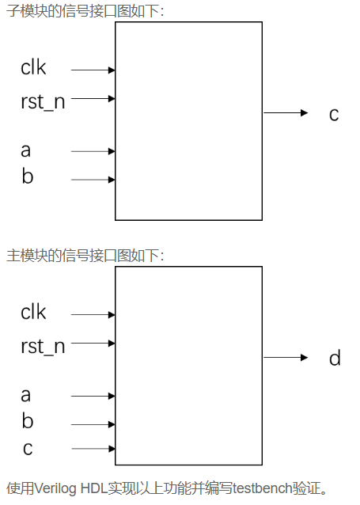

# VL9 使用子模块实现三输入数的大小比较

### **link**：[使用子模块实现三输入数的大小比较_牛客题霸_牛客网](https://www.nowcoder.com/practice/bfc9e2f37fe84c678f6fd04dbce0ad27?tpId=301&tags=&title=&difficulty=0&judgeStatus=0&rp=0&sourceUrl=%2Fexam%2Foj%3FquestionJobId%3D10%26subTabName%3Donline_coding_page)

### **intro**：

在数字芯片设计中，通常把完成特定功能且相对独立的代码编写成子模块，在需要的时候再在主模块中例化使用，以提高代码的可复用性和设计的层次性，方便后续的修改。

请编写一个子模块，将输入两个8bit位宽的变量data_a,data_b，并输出data_a,data_b之中较小的数。并在主模块中例化，实现输出三个8bit输入信号的最小值的功能。



输入描述：
clk：系统时钟
rst_n：异步复位信号，低电平有效
a,b,c：8bit位宽的无符号数

输出描述：
d：8bit位宽的无符号数，表示a,b,c中的最小值

### **code**：

```
`timescale 1ns/1ns
module main_mod(
	input clk,
	input rst_n,
	input [7:0]a,
	input [7:0]b,
	input [7:0]c,
	
	output [7:0]d
);
	wire [7:0] t1,t2;
	reg [7:0] d_reg0,d_reg1;
	min min_ins1(a,b,t1);
	min min_ins2(a,c,t2);
	always@(posedge clk,negedge rst_n)begin
		if(!rst_n)
			d_reg0<=8'd0;
		else
			d_reg0<=t1>t2?t2:t1;
	end

	always@(posedge clk,negedge rst_n)begin
		if(!rst_n)
			d_reg1<=8'd0;
		else
			d_reg1<=d_reg0;
	end
	assign d=d_reg1;
endmodule

module min(
	input [7:0] data_a,
	input [7:0] data_b,

	output [7:0] data
);
	
	assign data=data_a>data_b?data_b:data_a;

endmodule
```

### notes:


### reference：


