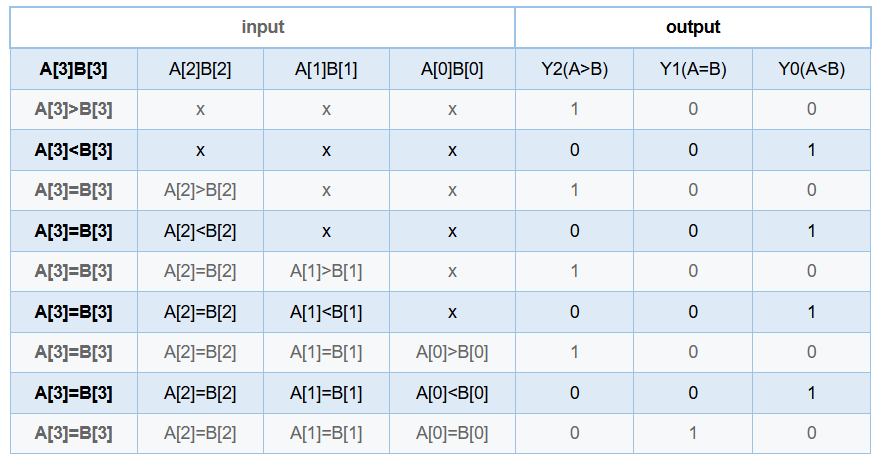

# **VL11** **4位数值比较器电路**

### **link**：[4位数值比较器电路_牛客题霸_牛客网](https://www.nowcoder.com/practice/e02fde10f1914527b6b6871b97aef86d?tpId=301&tags=&title=&difficulty=0&judgeStatus=0&rp=0&sourceUrl=%2Fexam%2Foj%3FquestionJobId%3D10%26subTabName%3Donline_coding_page)

### **intro**：

某4位数值比较器的功能表如下。

请用Verilog语言采用门级描述方式，实现此4位数值比较器



输入描述：
  input    [3:0]    A    ,
  input    [3:0]      B    

输出描述：
 output  wire      Y2  , //A>B
 output  wire    Y1  , //A=B
 output  wire    Y0   //A<B

### **code**：

```
`timescale 1ns/1ns

module comparator_4(
	input		[3:0]       A   	,
	input	   [3:0]		B   	,
 
 	output	 wire		Y2    , //A>B
	output   wire        Y1    , //A=B
    output   wire        Y0      //A<B
);
assign {Y2,Y1,Y0}={A>B,A==B,A<B};

endmodule
```

### notes:


### reference：


