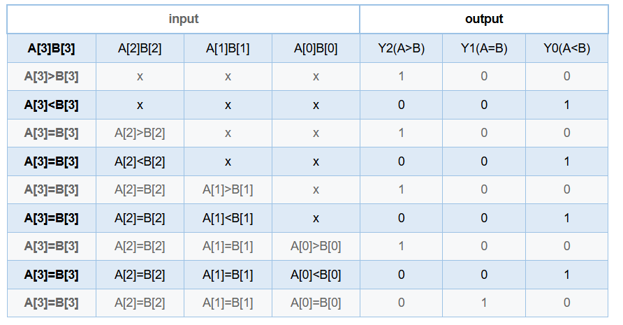

# VL12 4bit超前进位加法器电路

### **link**：[4bit超前进位加法器电路_牛客题霸_牛客网](https://www.nowcoder.com/practice/4d5b6dc4bb2848039da2ee40f9738363?tpId=301&tags=&title=&difficulty=0&judgeStatus=0&rp=0&sourceUrl=%2Fexam%2Foj%3FquestionJobId%3D10%26subTabName%3Donline_coding_page)

### **intro**：

4bit超前进位加法器的逻辑表达式如下：

中间变量Gi=AiBi，Pi=Ai⊕Bi

和：Si=Pi⊕Ci−1，进位：Ci=Gi+PiCi−1

请用Verilog语言采用门级描述方式，实现此4bit超前进位加法器，接口电路如下：



输入描述：
  input    [3:0]    A    ,
  input    [3:0]      B    

输出描述：
 output  wire      Y2  , //A>B
 output  wire    Y1  , //A=B
 output  wire    Y0   //A<B

### **code**：

```
`timescale 1ns/1ns

module lca_4(
	input		[3:0]       A_in  ,
	input	    [3:0]		B_in  ,
    input                   C_1   ,
 
 	output	 wire			CO    ,
	output   wire [3:0]	    S
);
    wire [3:0]G,P;
	wire [2:0]C;
	assign G=A_in&B_in;
	assign P=A_in^B_in;
	assign S=P^{C,C_1};
	assign {CO,C}=G|(P&{C,C_1});

endmodule
```

### notes:


### reference：


