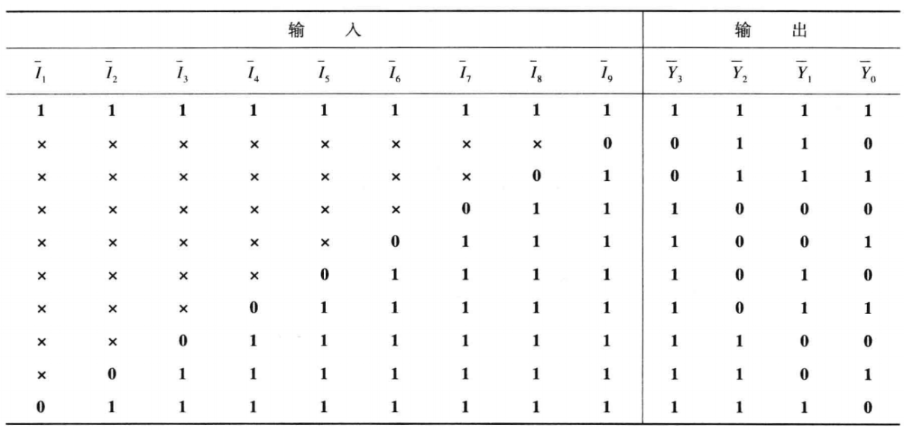

# **VL14** **用优先编码器①实现键盘编码电路**

### **link**：[用优先编码器①实现键盘编码电路_牛客题霸_牛客网](https://www.nowcoder.com/practice/03b8c5837d7f406797b4a57358057ef7?tpId=301&tags=&title=&difficulty=0&judgeStatus=0&rp=0&sourceUrl=%2Fexam%2Foj%3FquestionJobId%3D10%26subTabName%3Donline_coding_page)

### **intro**：

请使用优先编码器①实现键盘编码电路，可添加并例化题目中已给出的优先编码器代码。

10个按键分别对应十进制数0-9，按键9的优先级别最高；按键悬空时，按键输出高电平，按键按下时，按键输出低电平；键盘编码电路的输出是8421BCD码。

要求：键盘编码电路要有工作状态标志，以区分没有按键按下和按键0按下两种情况。

优先编码器真值表如下图：



输入描述：
input   [9:0]     S_n  

输出描述：
output wire[3:0]     L   ,
output wire       GS

### **code**：

```
`timescale 1ns/1ns
module encoder_0(
   input      [8:0]         I_n   ,
   
   output reg [3:0]         Y_n   
);

always @(*)begin
   casex(I_n)
      9'b111111111 : Y_n = 4'b1111;
      9'b0xxxxxxxx : Y_n = 4'b0110;
      9'b10xxxxxxx : Y_n = 4'b0111;
      9'b110xxxxxx : Y_n = 4'b1000;
      9'b1110xxxxx : Y_n = 4'b1001;
      9'b11110xxxx : Y_n = 4'b1010;
      9'b111110xxx : Y_n = 4'b1011;
      9'b1111110xx : Y_n = 4'b1100;
      9'b11111110x : Y_n = 4'b1101;
      9'b111111110 : Y_n = 4'b1110;
      default      : Y_n = 4'b1111;
   endcase    
end 
     
endmodule

module key_encoder(
      input      [9:0]         S_n   ,         
 
      output wire[3:0]         L     ,
      output wire              GS
);
wire [3:0]Y_n;
encoder_0 encoder_0_ins(
    .I_n(S_n[9:1]),
    .Y_n(Y_n)
);
assign L=~Y_n;
assign GS=~&S_n;


endmodule
```

### notes:


### reference：


