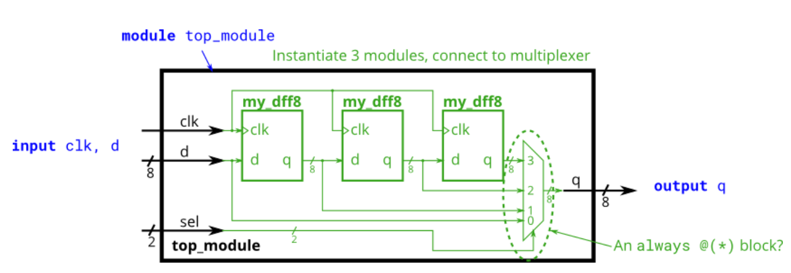

# Module shift8

### **link**：[Module shift8 - HDLBits](https://hdlbits.01xz.net/wiki/Module_shift8)

### **intro**：

您将获得一个具有两个 inputs 和一个 output 的模块（实现一组 8 个 D flip-flops）。实例化其中的三个，然后将它们链接在一起，形成一个长度为 3 的 8 位宽移位寄存器。此外，创建一个 4 对 1 多路复用器（未提供），该多路复用器选择要输出的内容取决于：输入 d 处的值、第一个 d 触发器之后、第二个 d 触发器之后或第三个 D 触发器之后的值。

                                                                                                                                                                                                                                                                                                                                                                           

### **code**：

```
module top_module ( 
    input clk, 
    input [7:0] d, 
    input [1:0] sel, 
    output [7:0] q 
);
    wire [7:0]q1,q2,q3;
    //module my_dff8 ( input clk, input [7:0] d, output [7:0] q );
    my_dff8 my_dff8_ins1(clk,d,q1);
    my_dff8 my_dff8_ins2(clk,q1,q2);
    my_dff8 my_dff8_ins3(clk,q2,q3);
    always@(*)
        case(sel)
            2'd0:q=d;
            2'd1:q=q1;
            2'd2:q=q2;
            2'd3:q=q3;
        endcase
endmodule

```

### notes:

`always`块中的`case`语句属于**行为级描述方式**，它能够清晰地表达出在不同的`sel`取值情况下，输出`q`应该如何赋值，相比于纯结构级描述（例如只使用连线和模块实例等方式）更加直观地体现了设计意图，让代码的逻辑功能一目了然，易于理解和维护，也方便后续的功能验证与调试等工作。

1. **行为级描述方式**

   - **定义**：行为级描述是一种在硬件描述语言（如 Verilog 或 VHDL）中，用于描述数字电路功能行为的方式。它着重于电路应该做什么，而不是具体的电路结构和实现细节。在行为级描述中，使用高级的编程语言结构，如顺序执行的语句、条件判断（如`if - else`、`case`语句）和循环（如`for`、`while`）等来描述电路的功能。

   - **示例**：以一个简单的计数器为例，行为级描述可能如下（用 Verilog 语言）：

     ```
     module counter (
         input clk,
         input reset,
         output reg [3:0] count
     );
         always @(posedge clk or posedge reset) begin
             if (reset)
                 count <= 0;
             else
                 count <= count + 1;
         end
     end module
     ```

   - **解释**：在这个计数器模块中，`always`块里的代码就是行为级描述。它说明了在时钟`clk`的上升沿或者复位信号`reset`的上升沿到来时，电路应该执行的行为。如果`reset`为高电平，计数器`count`被清零；否则，计数器`count`的值加 1。这种描述方式关注的是计数器的计数行为，而没有具体说明计数器是用什么电路结构实现的（比如是用触发器组成的同步计数器还是其他结构）。

2. **结构级描述**

   - **定义**：结构级描述侧重于描述数字电路的具体结构，即电路是由哪些基本的逻辑门（如与门、或门、非门等）和功能模块（如触发器、加法器等）组成的，以及这些组件之间是如何连接的。

   - **示例**：还是以刚才的计数器为例，假设我们用 4 个 D 触发器（`dff`）和一个 4 位全加器（`adder`）来实现一个简单的同步计数器，结构级描述可能如下（假设已经有`dff`和`adder`模块）：

     ```
     module counter_structural (
         input clk,
         input reset,
         output [3:0] count
     );
         wire [3:0] q;
         wire [3:0] sum;
         dff dff0(clk, reset, sum[0], q[0]);
         dff dff1(clk, reset, sum[1], q[1]);
         dff dff2(clk, reset, sum[2], q[2]);
         dff dff3(clk, reset, sum[3], q[3]);
         adder add4bit(q, 4'b0001, sum);
         assign count = q;
     end module
     ```

   - **解释**：在这个结构级描述的模块中，我们可以清楚地看到计数器是由 4 个 D 触发器和一个 4 位全加器组成的。通过模块实例化（如`dff0`、`dff1`等）和连线（如`sum`、`q`）的方式，明确了各个组件之间的连接关系，从而构建出整个计数器电路。


### reference：

