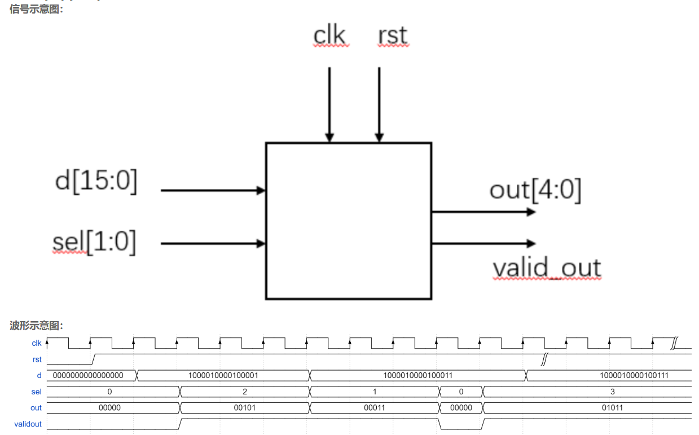

# **VL5** **位拆分与运算**

### **link**：[位拆分与运算_牛客题霸_牛客网](https://www.nowcoder.com/practice/1649582a755a4fabb9763d07e62a9752?tpId=301&tqId=5000608&ru=/exam/oj&qru=/ta/verilog-start/question-ranking&sourceUrl=%2Fexam%2Foj%3FquestionJobId%3D10%26subTabName%3Donline_coding_page)

### **intro**：

现在输入了一个压缩的16位数据，其实际上包含了四个数据[3:0][7:4][11:8][15:12],

现在请按照sel选择输出四个数据的相加结果,并输出valid_out信号（在不输出时候拉低）



输入描述：
输入信号  d, clk, rst
类型 wire
在testbench中，clk为周期5ns的时钟，rst为低电平复位

输出描述：
输出信号 validout  out
类型 reg 

### **code**：

```
`timescale 1ns/1ns

module data_cal(
input clk,
input rst,
input [15:0]d,
input [1:0]sel,

output reg [4:0]out,
output reg validout
);
//*************code***********//
reg [15:0] d_temp;
always@(posedge clk,negedge rst)begin
    if(!rst)begin
        out<=5'd0;
        validout<=1'd0;
        d_temp<=0;
    end
    else if(sel==2'd0) begin
        d_temp<=d;
        validout<=1'd0;
    end
    else
        validout<=1'd1;
end
always@(posedge clk,negedge rst)begin
        case(sel)
            2'd0:out<=5'd0;
            2'd1:out<=d_temp[3:0]+d_temp[7:4];
            2'd2:out<=d_temp[3:0]+d_temp[11:8];
            2'd3:out<=d_temp[3:0]+d_temp[15:12];
        endcase

end
//*************code***********//
endmodule
```

### notes:


### reference：


