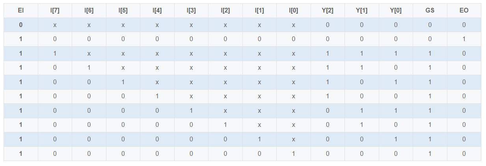

# **VL15** **优先编码器Ⅰ**

### **link**：[优先编码器Ⅰ_牛客题霸_牛客网](https://www.nowcoder.com/practice/a7068b8f4c824d6a9592f691990b21de?tpId=301&tags=&title=&difficulty=0&judgeStatus=0&rp=0&sourceUrl=%2Fexam%2Foj%3FquestionJobId%3D10%26subTabName%3Donline_coding_page)

### **intro**：

下表是8线-3线优先编码器Ⅰ的功能表。

①请根据该功能表，用Verilog实现该优先编码器Ⅰ。

输入描述：
 input   [7:0]    I  ,
 input         EI 

输出描述：
 output wire [2:0]   Y  ,
 output wire      GS ,
 output wire      EO  

### **code**：

```
`timescale 1ns/1ns

module encoder_83(
   input      [7:0]       I   ,
   input                  EI  ,
   
   output wire [2:0]      Y   ,
   output wire            GS  ,
   output wire            EO    
);

reg [4:0] Y_GS_EO;
always@(*)begin
    if(!EI)
        Y_GS_EO=5'd0;
    else begin
        casex(I)
            8'b0000_0000:Y_GS_EO={3'b000,1'b0,1'b1};
            8'b1xxx_xxxx:Y_GS_EO={3'b111,1'b1,1'b0};
            8'b01xx_xxxx:Y_GS_EO={3'b110,1'b1,1'b0};
            8'b001x_xxxx:Y_GS_EO={3'b101,1'b1,1'b0};
            8'b0001_xxxx:Y_GS_EO={3'b100,1'b1,1'b0};
            8'b0000_1xxx:Y_GS_EO={3'b011,1'b1,1'b0};
            8'b0000_01xx:Y_GS_EO={3'b010,1'b1,1'b0};
            8'b0000_001x:Y_GS_EO={3'b001,1'b1,1'b0};
            8'b0000_0001:Y_GS_EO={3'b000,1'b1,1'b0};
        endcase
    end
end
assign {Y,GS,EO}=Y_GS_EO;
endmodule
```

### notes:


### reference：


