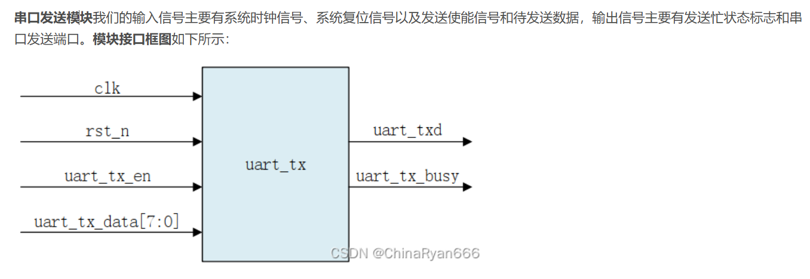
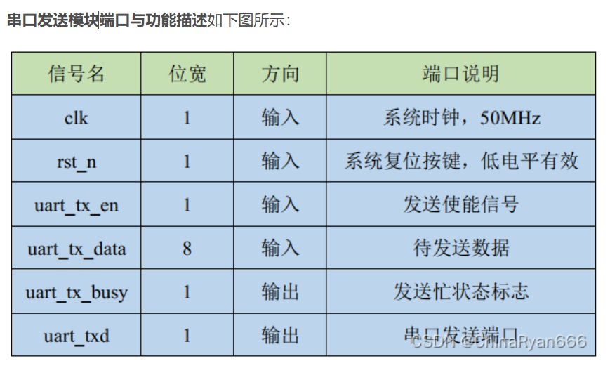
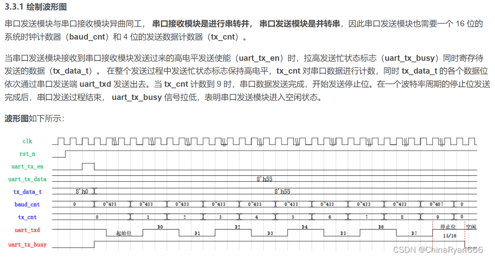

## 1.verilog中一定要有top_module么

在 Verilog 中不一定要有一个名为 “top_module” 的模块，但一定要有一个顶层模块（top - level module）。

1. **顶层模块的概念**
   - 顶层模块是整个设计的入口点，它就像是一个包含了所有其他子模块的容器。在一个 Verilog 设计中，顶层模块实例化了所有的子模块，并将它们连接在一起，形成一个完整的电路功能描述。例如，在一个简单的数字电路系统中，可能有一个加法器模块、一个寄存器模块和一个控制模块，顶层模块会将这些模块按照设计要求进行实例化和连接。
2. **模块名的灵活性**
   - 顶层模块的名字可以是任意合法的 Verilog 标识符，不一定是 “top_module”。开发人员可以根据自己的设计习惯和项目要求来命名。例如，在一个处理器设计中，顶层模块可以命名为 “processor_top”，它内部实例化了指令译码器、算术逻辑单元、寄存器堆等子模块。
3. **综合和仿真的要求**
   - 对于综合工具和仿真工具来说，它们需要从一个顶层模块开始来处理整个设计。这个顶层模块定义了整个设计的输入输出端口以及内部子模块的组织结构。在将 Verilog 代码转换为实际的硬件电路（综合过程）或者进行功能验证（仿真过程）时，工具会首先找到顶层模块，然后逐步展开对内部子模块的处理。

总之，虽然名字不一定是 “top_module”，但必须有一个顶层模块来作为整个 Verilog 设计的入口和组织结构的核心。

1. **在仿真工具中的指定方法**

   - ModelSim 等工具

     - 对于像 ModelSim 这样的仿真工具，通常在创建工程（Project）时可以指定顶层模块。在新建工程后，将所有的`.v`文件（包括包含顶层模块的文件）添加到工程中。然后，在工程设置或者启动仿真的相关选项中，有一个专门用于指定顶层模块的字段。例如，在 ModelSim 图形界面中，通过 “Simulate” 菜单下的选项打开仿真设置对话框，在其中可以找到 “Design” 选项卡，在这里就可以从下拉列表中选择想要作为顶层模块的模块名。这个模块名是从添加到工程中的所有`.v`文件中的模块中选取的。

     - 另一种方式是通过编写脚本（如 TCL 脚本）来指定顶层模块。例如，在 ModelSim 的 TCL 脚本中，可以使用`vlog`命令编译所有的`.v`文件，然后使用`vsim`命令并指定顶层模块来启动仿真。假设顶层模块名为`top_module`，代码可能如下：

       ```tcl
       vlog *.v
       vsim top_module
       ```

   - VCS 等工具

     - 在 VCS 仿真工具中，也可以通过命令行参数来指定顶层模块。首先，使用`vcs`命令编译所有的`.v`文件，格式一般为`vcs -full64 file1.v file2.v...`。然后，在启动仿真的命令中指定顶层模块。例如，对于顶层模块`top`，可以使用`./simv +vcs+lic+wait +top=top`命令来指定顶层模块并启动仿真。其中`simv`是 VCS 编译后生成的可执行文件，`+top=top`参数用于指定顶层模块。

2. **在综合工具中的指定方法**

   - Synplify 等工具
     - 在 Synplify 综合工具中，通常是在工程设置（Project Setup）阶段指定顶层模块。在图形界面中，打开工程设置对话框，一般会有一个专门的区域用于选择顶层模块。这个区域会列出所有已经添加到工程中的`.v`文件中的模块，用户可以从中选择想要作为顶层模块的模块。选择好之后，综合工具在进行综合操作时就会以这个选定的模块作为顶层模块，构建整个电路的综合模型。
     - 类似地，也可以通过命令行方式指定顶层模块。例如，在 Synplify 的命令行工具中，通过特定的命令参数来指定顶层模块。不过具体的命令参数可能因版本和工具的不同而有所变化。

## 2.模块设计步骤

1. **明确模块具有哪些输入输出信号，并绘制模块接口框图**

   

2. **定义信号属性，绘制模块端口与功能描述表**

   

3. **根据模块功能与信号的逻辑关系，绘制波形图**
   

4. **根据波形图编写模块代码**

5. **编写测试用例（testbench），进行仿真**

# Verilog 开发经验总结

## 1. 代码规范

- 就算只有一句话，也必须使用begin 和 end  
- 每个begin 和 end下的内容统一向右一个tab（四个空格）  
- Case语句下的各情况对齐  
- 在设计中不使用initial 语句来初始化，初始化统一放到rst下  
- 有限状态机采用二段式或者三段式的标准描述方法  
- 不依赖于运算符优先级，统一用括号来说明运算顺序  
- 变量名要表达实际含义，但不要使用汉语拼音 
- always模块的敏感变量有且最多两个，一个是时钟边沿，一个是复位边沿， 不许有额外的敏感变量
- 在时序always中，统一使用非阻塞赋值<=