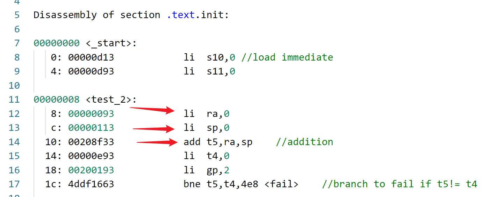
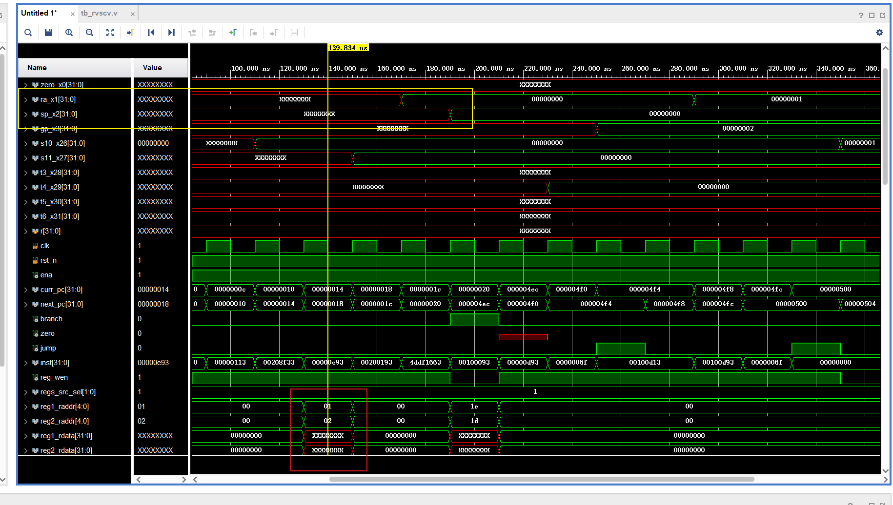
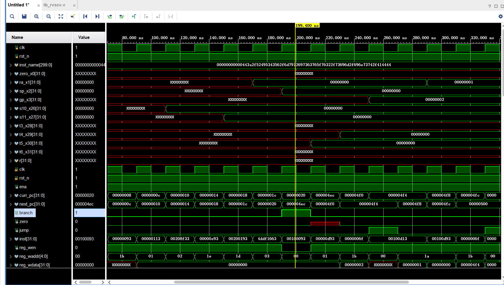

### 将单周期处理器修改为五级流水线架构后遇到的问题

### 问题一：数据冒险

运行ADD指令测试时，一个指令需要经过5个时钟周期才能完成，当执行li指令时需要在第五个周期才将alu运算结果写回到寄存器堆，但是如果紧接着下一个指令需要访问寄存器堆读数据时因为还没有进行写回而读出错误的数据，这是一种数据冒险。此外还有别的导致数据冒险的问题。

1.RAW写后读，前序指令写入某个寄存器x，后续指令需要读取x的值。

2.WAR读后写，前序指令读取寄存器x，后续指令需要写入x。（此情况为非强依赖，只要保证指令的顺序执行）

3.WAW写后写，前序指令写入了寄存器x，后续指令也需要写入x。

解决方法：

1.数据旁路 (以完成)
在源寄存器读取时判断读取地址是否为待写回的寄存器，如果是则将数据赋值到源寄存器。

2.流水线暂停 （未完成）

如果数据旁路无法解决，则可以通过暂停流水线来解决。例如，数据需要从内存中读出，写回到寄存器堆，源寄存器再读取，比如load指令，这时需要暂停流水线等待指令完成。

### 问题二：控制冒险

当执行到分支指令时，跳转的判断需要依赖之前的指令执行的结果，那么就会出现控制冒险问题。如图，1c指令判断t5，t4寄存器是否相等才知道是否跳转，但是此时t4，t5的结果并没有写回到寄存器。

解决办法：

1.分支时阻塞

当遇到分支指令时，等到分支结果确定后再取下一条指令

2.分支预测

当遇到分支指令时，预测下一条指令，预测错误进行补救，重新取指。

- 静态分支预测：遵循某一规则进行预测，例如预测向前的分支不发生，向后的分支发送
- 动态分支预测：记录每个分支的近期历史，将来的行为会延续这一趋势

分支命令进行到译码阶段后发出控制冒险信号，mux_pc接收到控制冒险信号后预测分支
下一周期分支命令运行到执行阶段，确定是否跳转，mux_pc继续取下一条指令(已经取了两条指令，分支命令之后)，若预测正确继续执行
预测失败后冲刷流水线，将取指令设为跳转后的指令