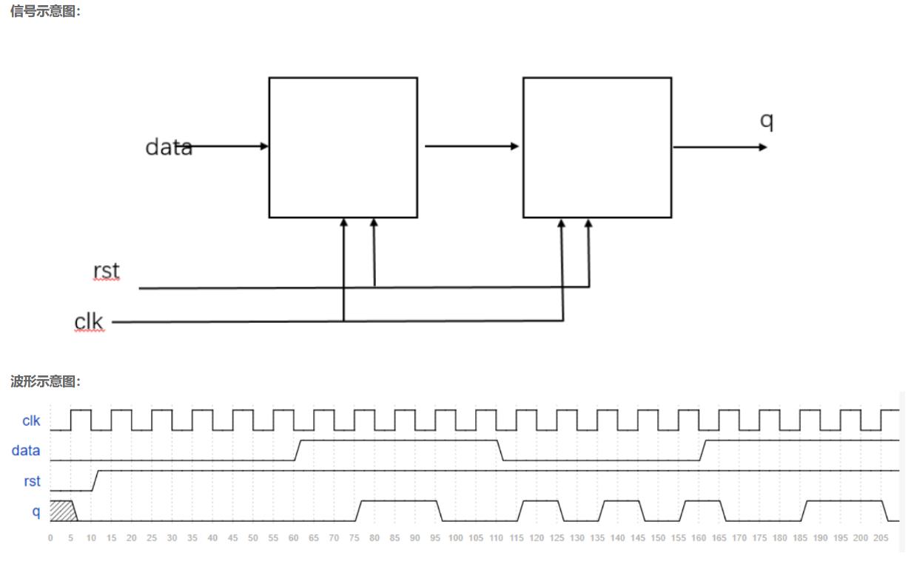

# **VL2** **异步复位的串联T触发器**

### **link**：[异步复位的串联T触发器_牛客题霸_牛客网](https://www.nowcoder.com/practice/9c8cb743919d405b9dac28eadecddfb5?tpId=301&tqId=5000605&ru=/exam/oj&qru=/ta/verilog-start/question-ranking&sourceUrl=%2Fexam%2Foj%3Fpage%3D1%26tab%3DVerilog%E7%AF%87%26topicId%3D301)

### **intro**：

用verilog实现两个串联的异步复位的T触发器的逻辑，结构如图：



输入描述：
输入信号  data, clk, rst
类型 wire
在testbench中，clk为周期5ns的时钟，rst为低电平复位

输出描述：
输出信号 q 
类型 reg 

### **code**：

```
`timescale 1ns/1ns
module Tff_2 (
input wire data, clk, rst,
output reg q  
);
//*************code***********//
reg t;
always@(posedge clk,negedge rst)begin
    if(!rst)
        t<=0;
    else 
        t<=data?(~t):t;
end
always@(posedge clk,negedge rst)begin
    if(!rst)
        q<=0;
    else
        q<=t?(~q):q;
end
//*************code***********//
endmodule
```

### notes:

**T触发器**

T 触发器是一种在时钟信号的触发下，根据输入信号 T 的状态来改变输出状态的触发器。其主要功能特点为：

- 当 T = 0 时，在时钟脉冲的作用下，触发器保持原状态不变。
- 当 T = 1 时，每来一个时钟脉冲，触发器的输出状态就翻转一次，即从 0 变为 1 或从 1 变为 0。

### reference：


