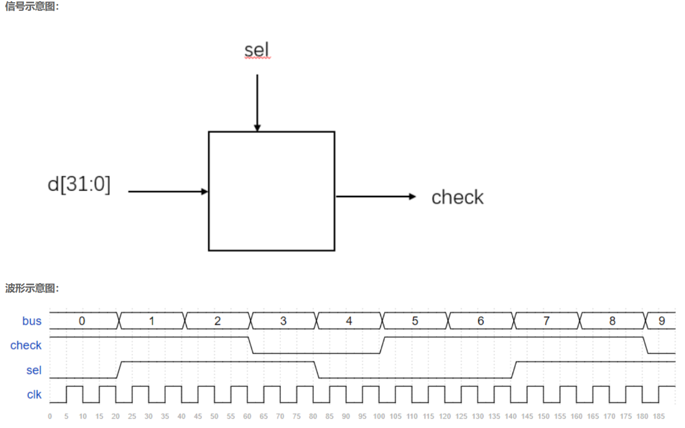

# **VL3** **奇偶校验**

### **link**：[奇偶校验_牛客题霸_牛客网](https://www.nowcoder.com/practice/67d4dd382bb44c559a1d0a023857a7a6?tpId=301&tags=&title=&difficulty=0&judgeStatus=0&rp=0&sourceUrl=%2Fexam%2Foj%3Fpage%3D1%26tab%3DVerilog%E7%AF%87%26topicId%3D301)

### **intro**：

现在需要对输入的32位数据进行奇偶校验,根据sel输出校验结果（1输出奇校验，0输出偶校验）



输入描述：
输入信号  bus sel
类型 wire

输出描述：
输出信号  check
类型 wire

### **code**：

```
`timescale 1ns/1ns
module odd_sel(
input [31:0] bus,
input sel,
output check
);
//*************code***********//
assign check=sel?(^bus):(~^bus);
//*************code***********//
endmodule
```

### notes:

- **奇偶校验的定义和基本原理**

  - **定义**：奇偶校验是一种简单的错误检测方法，用于检测数据在传输或存储过程中是否发生了单个位（bit）的错误。
  - **基本原理**：它通过在数据位（通常是一组二进制位）后添加一个奇偶校验位来实现。这个奇偶校验位的值根据数据位中 “1” 的个数来确定。如果是奇校验，那么包括校验位在内的整个数据单元（数据位 + 校验位）中 “1” 的个数为奇数；如果是偶校验，整个数据单元中 “1” 的个数为偶数。

- **奇校验和偶校验的详细说明**

  - 奇校验：
    - 例如，有一组数据位是`1010`，这组数据中 “1” 的个数为 2，是偶数。为了进行奇校验，需要添加一个校验位 “1”，这样整个数据单元（包括校验位）变为`10101`，其中 “1” 的个数为 3，是奇数。
    - 在接收端，重新计算接收到的数据单元中 “1” 的个数。如果是奇数，那么初步认为数据没有发生单个位错误；如果是偶数，则认为数据可能出现了错误。
  - 偶校验：
    - 对于同样的数据位`1010`，进行偶校验时，校验位应该是 “0”，整个数据单元变为`10100`，其中 “1” 的个数为 2，是偶数。
    - 在接收端，当接收到的数据单元中 “1” 的个数为偶数时，认为数据可能是正确的；当 “1” 的个数为奇数时，认为数据可能出现了错误。

- **奇偶校验的实现方式**

  - **奇校验的位运算实现**

    - 异或运算（`^`）：

      - 原理：在二进制数据中，异或运算具有一个特性，即对多个位进行异或操作时，若结果为 1，则表示这些位中 “1” 的个数为奇数；若结果为 0，则表示 “1” 的个数为偶数。
      - 示例：对于一个 4 位的数据`data = 4'b1010`，可以通过`parity_bit = ^data;`来计算奇校验位。在这个例子中，`data[0] ^ data[1] ^ data[2] ^ data[3]`即`0 ^ 1 ^ 0 ^ 1`，结果为 0，表示数据位中 “1” 的个数为偶数，所以奇校验位`parity_bit`应该为 1，这样加上校验位后整个数据单元中 “1” 的个数为奇数。

    - **按位与（`&`）和移位操作组合（实现循环冗余校验的变体方法）**：

      - 原理：可以通过不断地将数据位进行移位和按位与操作，结合一个累加器来计算 “1” 的个数。例如，将数据位每次左移一位，与 1 进行按位与操作，如果结果为 1，则累加器加 1。最后根据累加器的值判断 “1” 的个数是奇数还是偶数来确定奇校验位。

      - 示例：

        ```verilog
        module odd_parity_shift(input [7:0] data_in, output parity_bit);
          reg [3:0] count_ones = 0;
          integer i;
          always @(*) begin
            count_ones = 0;
            for (i = 0; i < 8; i = i + 1) begin
              if (data_in[i] & 1)
                count_ones = count_ones + 1;
              data_in = data_in >> 1;
            }
          end
          assign parity_bit = (count_ones % 2 == 0)? 1 : 0;
        endmodule
        ```

  - **偶校验的位运算实现**

    - 先异或后取反（基于异或运算）：

      - 原理：先使用异或运算得到奇校验结果，然后取反得到偶校验结果。因为奇校验和偶校验是互补的，即如果奇校验结果为 1（表示 “1” 的个数为奇数），那么偶校验结果为 0（表示 “1” 的个数为偶数），反之亦然。
      - 示例：对于一个 4 位的数据`data = 4'b1010`，可以通过`parity_bit = ~^data;`来计算偶校验位。先进行异或运算`^data`得到 0（因为数据位中 “1” 的个数为偶数），然后取反得到 1，即偶校验位为 1，这样加上校验位后整个数据单元中 “1” 的个数为偶数。

    - 利用位运算和逻辑非（`~`）组合实现：

      - 原理：类似于奇校验的按位与和移位操作组合，在统计 “1” 的个数后，通过逻辑非操作来确定偶校验位。如果统计得到 “1” 的个数为奇数，偶校验位为 0；如果为偶数，偶校验位为 1。

      - 示例：

        ```
        module even_parity_shift(input [7:0] data_in, output parity_bit);
          reg [3:0] count_ones = 0;
          integer i;
          always @(*) begin
            count_ones = 0;
            for (i = 0; i < 8; i = i + 1) begin
              if (data_in[i] & 1)
                count_ones = count_ones + 1;
              data_in = data_in >> 1;
            }
          end
          assign parity_bit = (count_ones % 2 == 0)? 0 : 1;
        endmodule
        ```

        


### reference：


