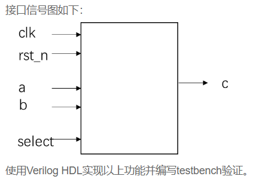

# **VL6** **多功能数据处理器**

### **link**：[多功能数据处理器_牛客题霸_牛客网](https://www.nowcoder.com/practice/e009ab1a7a4c46fb9042c09c77ee27b8?tpId=301&tags=&title=&difficulty=0&judgeStatus=0&rp=0&sourceUrl=%2Fexam%2Foj%3FquestionJobId%3D10%26subTabName%3Donline_coding_page)

### **intro**：

根据指示信号select的不同，对输入信号a,b实现不同的运算。输入信号a,b为8bit有符号数，当select信号为0，输出a；当select信号为1，输出b；当select信号为2，输出a+b；当select信号为3，输出a-b.



输入描述：

clk：系统时钟
rst_n：复位信号，低电平有效
a,b：8bit位宽的有符号数
select：2bit位宽的无符号数

输出描述：
c：9bit位宽的有符号数

### **code**：

```
`timescale 1ns/1ns
module data_select(
	input clk,
	input rst_n,
	input signed[7:0]a,
	input signed[7:0]b,
	input [1:0]select,
	output reg signed [8:0]c
);

always@(posedge clk,negedge rst_n)begin
	if(!rst_n)
		c<=9'd0;
	else begin
		case(select) 
			2'd0:c<=a;
			2'd1:c<=b;
			2'd2:c<=a+b;
			2'd3:c<=a-b;
		endcase
	end
end


endmodule
```

### notes:

1. 有符号数的表示

   - 在 Verilog 中，有符号数可以用多种方式表示。最常见的是使用 `signed` 关键字。例如，定义一个有符号的 8 位寄存器可以写成 `reg signed [7:0] my_signed_reg;`。这里的位宽是 8 位，最高位（第 7 位）是符号位，0 表示正数，1 表示负数。
   - 有符号数的编码通常采用二进制补码形式。对于一个 位的有符号数，其表示范围是 `-2^(n-1)` 到 `2^n-1)` 。例如，对于 8 位有符号数，范围是 - 128 到 127。

2. **加法运算**

   - 当进行有符号数加法时，Verilog 会自动根据操作数的符号位进行正确的运算。例如：

     ```
     module signed_addition;
         reg signed [7:0] a = 8'sb01000000;  // +64 in decimal
         reg signed [7:0] b = 8'sb00000100;  // +4 in decimal
         wire signed [7:0] sum;
         assign sum = a + b;
     endmodule
     ```

   - 在这个例子中，`a` 和 `b` 是有符号数，`sum` 是它们相加的结果。`8'sb01000000` 表示这是一个 8 位的二进制数，并且是有符号数（由 `signed` 关键字指定），其十进制值为 + 64，`8'sb00000100` 的十进制值为 + 4。相加后的结果 `sum` 为 68，二进制表示为 `8'sb01000100`。

3. **减法运算**

   - 有符号数减法和加法类似，只是使用减法运算符 `-`。例如：

     ```
     module signed_subtraction;
         reg signed [7:0] a = 8'sb01000000;  // +64 in decimal
         reg signed [7:0] b = 8'sb00000100;  // +4 in decimal
         wire signed [7:0] diff;
         assign diff = a - b;
     endmodule
     ```

   - 这里 `diff` 的结果是 60，二进制表示为 `8'sb00111100`。

4. **乘法运算**

   - 对于有符号数乘法，需要注意结果的位宽。当两个`n`位的有符号数相乘时，结果位宽通常是 `2n`位。例如：

     ```
     module signed_multiplication;
         reg signed [7:0] a = 8'sb00001000;  // +8 in decimal
         reg signed [7:0] b = 8'sb00001000;  // +8 in decimal
         wire signed [15:0] product;
         assign product = a * b;
     endmodule
     ```

   - 这个例子中，`a` 和 `b` 是 8 位有符号数，相乘后的结果 `product` 是 16 位有符号数，结果为 64，二进制表示为 `16'sb0000000001000000`。

5. **除法运算**

   - 有符号数除法也需要注意一些细节。例如：

     ```
     module signed_division;
         reg signed [7:0] a = 8'sb00001000;  // +8 in decimal
         reg signed [7:0] b = 8'sb00000010;  // +2 in decimal
         wire signed [7:0] quotient;
         assign quotient = a / b;
     endmodule
     ```

   - 这里 `quotient` 的结果是 4，二进制表示为 `8'sb00000100`。但是需要注意，在 Verilog 中，如果除数为 0，会产生运行时错误。同时，除法运算的结果会向 0 取整。例如，`-5/2` 的结果是 - 2，而不是 - 3。

6. **比较运算（大于、小于、等于）**

   - 有符号数的比较运算和无符号数比较运算在操作符上相同，但语义不同。例如，对于大于运算（`>`）：

     ```
     module signed_comparison;
         reg signed [7:0] a = 8'sb00001000;  // +8 in decimal
         reg signed [7:0] b = 8'sb10001000;  // -120 in decimal
         wire greater;
         assign greater = a > b;
     endmodule
     ```

   - 在这个例子中，`greater` 的结果为 1（表示真），因为 + 8 大于 - 120。同样，还有小于（`<`）和等于（`==`）等比较运算符用于有符号数的比较。在进行等于比较时，要注意符号位也要相同。例如，`-0` 和 `+0` 在有符号数比较中是相等的。


### reference：


