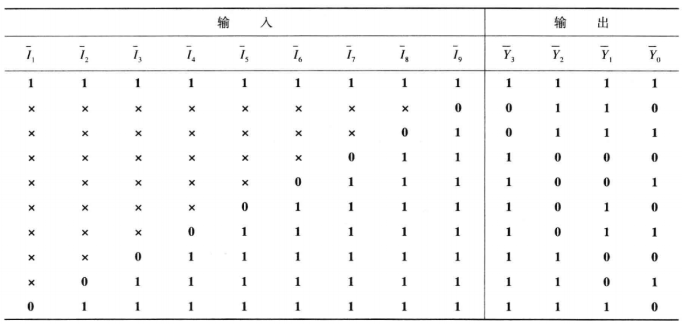

# **VL13** **优先编码器电路①**

### **link**：[优先编码器电路①_牛客题霸_牛客网](https://www.nowcoder.com/practice/0594ed5303ad48a19aed90bc48839d00?tpId=301&tags=&title=&difficulty=0&judgeStatus=0&rp=0&sourceUrl=%2Fexam%2Foj%3FquestionJobId%3D10%26subTabName%3Donline_coding_page)

### **intro**：

下表是某优先编码器的真值表。
①请用Verilog实现此优先编码器



输入描述：
input   [8:0]     I_n

输出描述：
output reg [3:0]     Y_n

### **code**：

```
`timescale 1ns/1ns

module encoder_0(
   input      [8:0]         I_n   ,
   
   output reg [3:0]         Y_n   
);

//组合逻辑
// always@(*)begin
//     if(!I_n[8])
//         Y_n=4'b0110;
//     else if(!I_n[7])
//         Y_n=4'b0111;
//     else if(!I_n[6])
//         Y_n=4'b1000;
//     else if(!I_n[5])
//         Y_n=4'b1001;
//     else if(!I_n[4])
//         Y_n=4'b1010;
//     else if(!I_n[3])
//         Y_n=4'b1011;
//     else if(!I_n[2])
//         Y_n=4'b1100;
//     else if(!I_n[1])
//         Y_n=4'b1101;
//     else if(!I_n[0])
//         Y_n=4'b1110;
//     else
//         Y_n=4'b1111;
// end

//行为级描述
always@(*)begin
    case(1'b0)
        I_n[8]:Y_n=4'b0110;
        I_n[7]:Y_n=4'b0111;
        I_n[6]:Y_n=4'b1000;
        I_n[5]:Y_n=4'b1001;
        I_n[4]:Y_n=4'b1010;
        I_n[3]:Y_n=4'b1011;
        I_n[2]:Y_n=4'b1100;
        I_n[1]:Y_n=4'b1101;
        I_n[0]:Y_n=4'b1110;
        default:Y_n=4'b1111;
    endcase
end

endmodule
```

### notes:


### reference：


