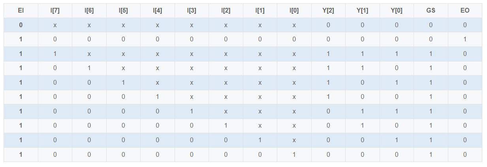
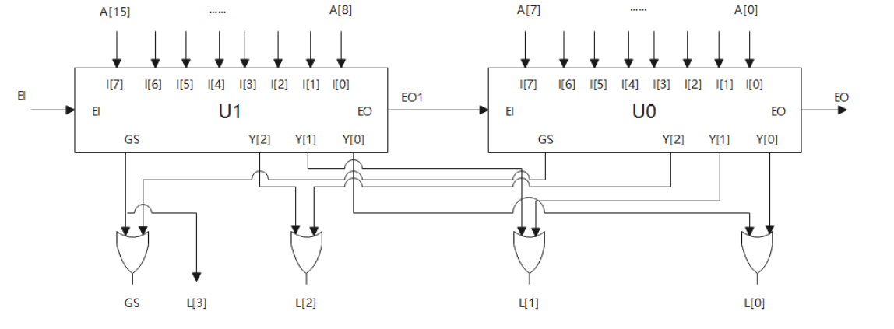

# **VL16** **使用8线-3线优先编码器Ⅰ实现16线-4线优先编码器**

### **link**：[使用8线-3线优先编码器Ⅰ实现16线-4线优先编码器_牛客题霸_牛客网](https://www.nowcoder.com/practice/dcfa838e43de4744bc976abee96dc566?tpId=301&tags=&title=&difficulty=0&judgeStatus=0&rp=0&sourceUrl=%2Fexam%2Foj%3FquestionJobId%3D10%26subTabName%3Donline_coding_page)

### **intro**：

②请使用2片该优先编码器Ⅰ及必要的逻辑电路实现16线-4线优先编码器。优先编码器Ⅰ的真值表和代码已给出。

可将优先编码器Ⅰ的代码添加到本题答案中，并例化。

优先编码器Ⅰ的代码如下：

```
module encoder_83(
   input      [7:0]       I   ,
   input                  EI  ,
   
   output wire [2:0]      Y   ,
   output wire            GS  ,
   output wire            EO    
);
assign Y[2] = EI & (I[7] | I[6] | I[5] | I[4]);
assign Y[1] = EI & (I[7] | I[6] | ~I[5]&~I[4]&I[3] | ~I[5]&~I[4]&I[2]);
assign Y[0] = EI & (I[7] | ~I[6]&I[5] | ~I[6]&~I[4]&I[3] | ~I[6]&~I[4]&~I[2]&I[1]);

assign EO = EI&~I[7]&~I[6]&~I[5]&~I[4]&~I[3]&~I[2]&~I[1]&~I[0];

assign GS = EI&(I[7] | I[6] | I[5] | I[4] | I[3] | I[2] | I[1] | I[0]);
//assign GS = EI&(| I);
         
endmodule
```

下表是8线-3线优先编码器Ⅰ的功能表

输入描述：
input   [15:0]   A  ,
input         EI 

输出描述：
output wire [3:0]   L  ,
output wire      GS ,
output wire      EO 

### **code**：

```
`timescale 1ns/1ns
module encoder_83(
   input      [7:0]       I   ,
   input                  EI  ,
   
   output wire [2:0]      Y   ,
   output wire            GS  ,
   output wire            EO    
);
assign Y[2] = EI & (I[7] | I[6] | I[5] | I[4]);
assign Y[1] = EI & (I[7] | I[6] | ~I[5]&~I[4]&I[3] | ~I[5]&~I[4]&I[2]);
assign Y[0] = EI & (I[7] | ~I[6]&I[5] | ~I[6]&~I[4]&I[3] | ~I[6]&~I[4]&~I[2]&I[1]);

assign EO = EI&~I[7]&~I[6]&~I[5]&~I[4]&~I[3]&~I[2]&~I[1]&~I[0];

assign GS = EI&(I[7] | I[6] | I[5] | I[4] | I[3] | I[2] | I[1] | I[0]);
//assign GS = EI&(| I);
         
endmodule

module encoder_164(
   input      [15:0]      A   ,
   input                  EI  ,
   
   output wire [3:0]      L   ,
   output wire            GS  ,
   output wire            EO    
);
wire EO1,GS_H,GS_L;
wire [2:0] Y_H,Y_L;

encoder_83 encoder_83_H(A[15:8],EI,Y_H,GS_H,EO1);
encoder_83 encoder_83_L(A[7:0],EO1,Y_L,GS_L,EO);
assign GS=GS_H|GS_L;
assign L={GS_H,Y_H|Y_L};


endmodule
```

### notes:

使用两片83优先编码器Ⅰ实现164优先编码器的电路连接图如下：

当EI1=0时、U1禁止编码，其输出端Y为000，GS1、EO1均为0。同时EO1使EI0=0，U0也禁止编码，其输出端及GS0、EO0均为0。由电路图可知GS=GS1+GS0=0，表示此时电路输出端的代码L=0000是非编码输出。

当E=1时，U1允许编码，若A[15:8]均无有效电平输人，则EO1=1，使EI0=1，从而允许U0编码，因此U1的优先级高于U0。

此时A[15:8]没有有效电平输入，U1的输出均为0。使4个或门都打开，L[2:0]取决于U0的输出，而L[3]=GS1总是等于0，所以输出代码在0000-0111之间变化。若只有A[0]有高电平输入，输出为0000，若A[7]及其他输入同时有高电平输人，则输出为0111。A[0]的优先级别最低。

当EI1=1且A[15:8]中至少有一个为高电平输人时，EO1=0，使EI0=0，U0禁止编码，此时L[3]=GS1=1，L[2:0]取决于U1的输出，输出代码在1000~1111之间变化，并且A的优先级别最高。


### reference：


